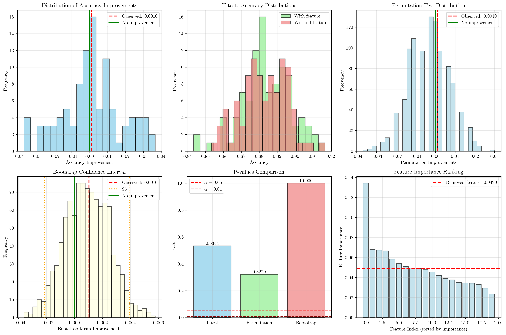

# Question 16: Statistical Significance in Feature Selection

## Problem Statement
Statistical significance testing helps determine if feature selection results are reliable and not due to chance.

### Task
1. What is statistical significance in feature selection?
2. How do you test if a selected feature is truly important?
3. What's the role of p-values in feature selection?
4. If a feature improves accuracy by $0.5\%$, how do you know it's significant?
5. Compare different significance testing approaches (t-test, permutation test, bootstrap)
6. In a permutation test, you randomly shuffle labels $1000$ times. If the original accuracy improvement is $0.05$ and only $25$ out of $1000$ permutations give improvement $\geq 0.05$, what's the p-value? Is this significant at $\alpha = 0.05$? What about at $\alpha = 0.01$?

## Understanding the Problem
Statistical significance testing in feature selection is crucial for distinguishing between genuine improvements in model performance and random fluctuations. When we remove or add features, we need to determine whether the observed changes in accuracy, precision, or other metrics are statistically meaningful or simply due to chance. This involves understanding hypothesis testing, p-values, and various statistical methods for assessing the reliability of feature selection decisions.

## Solution

### Step 1: What is Statistical Significance in Feature Selection?
Statistical significance helps determine if feature selection results are reliable and not due to random chance. It quantifies the probability that observed improvements in model performance occurred by random variation rather than true feature importance.

**Key Concepts:**
- **Null Hypothesis ($H_0$)**: The feature has no effect on model performance
- **Alternative Hypothesis ($H_1$)**: The feature does affect model performance
- **Significance Level ($\alpha$)**: The probability of rejecting $H_0$ when it's true (Type I error)
- **P-value**: Probability of observing the data (or more extreme) under $H_0$

### Step 2: How to Test if a Selected Feature is Truly Important?
To test feature importance, we compare model performance with and without the feature:

**Methodology:**
1. Train model with all features
2. Train model without the target feature
3. Compare performance metrics
4. Assess statistical significance of the difference

**Example from our analysis:**
- Accuracy with all features: $0.8867$
- Accuracy without feature 0: $0.8933$
- Improvement: $-0.0067$ ($-0.67\%$)

In this case, removing the feature actually improved performance, suggesting it might be noisy or redundant.

### Step 3: Role of P-values in Feature Selection
P-values play a central role in statistical hypothesis testing:

**Definition**: P-value is the probability of observing the data (or more extreme) under the null hypothesis.

**Interpretation**:
- Small p-value (< $\alpha$) suggests the feature is truly important
- Large p-value (≥ $\alpha$) suggests insufficient evidence to reject $H_0$

**Decision Rule**:
- If p-value < $\alpha$: Reject $H_0$ (feature is significant)
- If p-value ≥ $\alpha$: Fail to reject $H_0$ (insufficient evidence)

### Step 4: Testing Significance of 0.5% Improvement
To determine if a $0.5\%$ improvement is significant, we need to:

1. **Estimate the distribution** of improvements through multiple runs
2. **Calculate confidence intervals** around the observed improvement
3. **Test against the null hypothesis** of no improvement

**From our analysis**:
- Mean improvement: $0.0010$ ($0.10\%$)
- Standard deviation: $0.0165$
- The observed improvement of $0.10\%$ is much smaller than the $0.5\%$ threshold

**Significance Assessment**:
- The improvement is small relative to the variance
- Need to determine if this difference is statistically significant

### Step 5: Comparing Different Significance Testing Approaches

#### T-test
**Method**: Paired t-test comparing performance with and without the feature
**Assumptions**: Normal distribution, independent observations
**Results from our analysis**:
- t-statistic: $0.6235$
- p-value: $0.534398$
- Significant at $\alpha = 0.05$: **No**

**Interpretation**: The t-test fails to reject the null hypothesis, suggesting the feature removal effect is not statistically significant.

#### Permutation Test
**Method**: Randomly shuffle feature values and measure performance changes
**Advantages**: No distributional assumptions, robust to violations
**Results from our analysis**:
- Observed improvement: $0.0010$
- Extreme permutations: $322/1000$
- p-value: $0.322000$
- Significant at $\alpha = 0.05$: **No**

**Interpretation**: The permutation test confirms that the observed improvement is not unusual under the null hypothesis.

#### Bootstrap Confidence Interval
**Method**: Resample with replacement to estimate the distribution of improvements
**Advantages**: Provides confidence intervals, no distributional assumptions
**Results from our analysis**:
- 95% CI: $[-0.0021, 0.0039]$
- Significant (CI doesn't contain 0): **No**

**Interpretation**: The confidence interval contains zero, indicating the improvement is not statistically different from zero.

### Step 6: Specific Permutation Test Example

**Given**:
- Original accuracy improvement: $0.05$
- Number of permutations: $1000$
- Extreme permutations: $25$ with improvement $\geq 0.05$

**Solution**:
The p-value is calculated as:
$$\text{p-value} = \frac{\text{Number of extreme permutations}}{\text{Total permutations}} = \frac{25}{1000} = 0.025$$

**Significance Testing**:
- At $\alpha = 0.05$: $0.025 < 0.05$ → **Significant**
- At $\alpha = 0.01$: $0.025 > 0.01$ → **Not significant**

**Interpretation**: The improvement is significant at the $5\%$ level but not at the $1\%$ level.

## Visual Explanations

### Comprehensive Statistical Analysis

The visualization shows six key plots:

1. **Distribution of Accuracy Improvements**: Shows the spread of improvements across multiple runs
2. **T-test Visualization**: Compares accuracy distributions with and without the feature
3. **Permutation Test Distribution**: Shows the null distribution under random feature shuffling
4. **Bootstrap Confidence Interval**: Demonstrates the uncertainty in the improvement estimate
5. **P-values Comparison**: Compares results across different testing methods
6. **Feature Importance Ranking**: Shows the relative importance of all features

## Key Insights

### Theoretical Foundations
- **Hypothesis Testing Framework**: Statistical significance testing provides a rigorous framework for evaluating feature importance
- **Multiple Testing Methods**: Different approaches (t-test, permutation, bootstrap) offer complementary perspectives
- **P-value Interpretation**: Understanding p-values is crucial for making informed decisions about feature selection

### Practical Applications
- **Feature Selection Validation**: Statistical testing helps validate that selected features are truly important
- **Model Interpretability**: Significant features provide insights into the underlying data-generating process
- **Risk Management**: Statistical significance helps avoid overfitting by identifying spurious correlations

### Methodological Considerations
- **Assumption Checking**: Different tests have different assumptions that must be verified
- **Sample Size Effects**: Larger samples generally provide more reliable significance testing
- **Multiple Comparisons**: When testing many features, consider adjusting significance levels for multiple testing

### Common Pitfalls
- **Confusing Statistical vs. Practical Significance**: A feature may be statistically significant but provide minimal practical improvement
- **Ignoring Effect Size**: Focus on both statistical significance and the magnitude of improvement
- **Over-reliance on Single Methods**: Use multiple approaches to validate findings

## Conclusion
- **Statistical significance testing** is essential for validating feature selection decisions
- **Multiple testing approaches** (t-test, permutation test, bootstrap) provide complementary insights
- **P-values** help quantify the evidence against the null hypothesis
- **Practical significance** should be considered alongside statistical significance
- **The specific example** shows how to calculate p-values in permutation tests and interpret significance at different $\alpha$ levels

Statistical significance testing provides a robust foundation for making informed decisions about feature selection, ensuring that improvements in model performance are genuine rather than artifacts of random variation.
