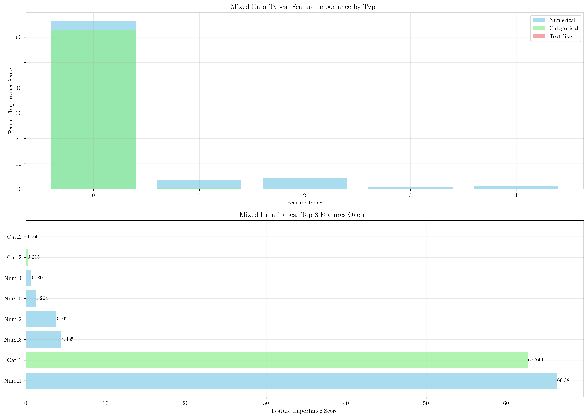
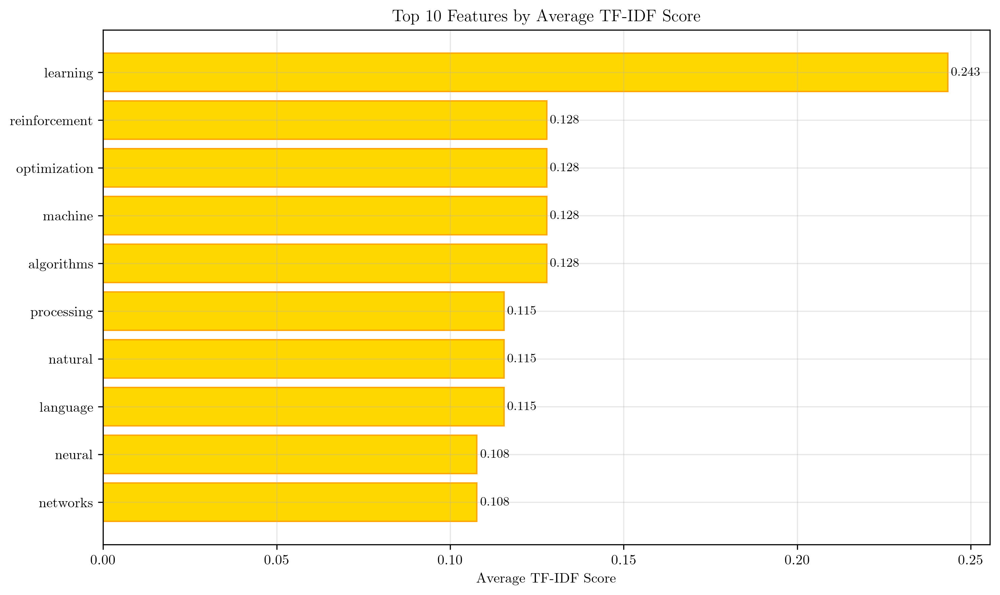

# Question 17: Data Type-Specific Feature Selection Strategies

## Problem Statement
Different data types require different feature selection strategies due to their unique characteristics and challenges. Feature selection approaches must be adapted to handle the specific nature of text, numerical, image, time series, and mixed data types effectively.

### Task
1. How does feature selection differ for text data vs numerical data?
2. What special considerations exist for image data feature selection?
3. How do you handle time series features in selection?
4. If you have mixed data types, what selection approach would you use?
5. Compare selection strategies across different data modalities with examples
6. For text data, TF-IDF scores are calculated as $TF\text{-}IDF = TF \times \log(\frac{N}{DF})$ where $N$ is total documents and $DF$ is document frequency. If you have $1000$ documents and a word appears in $100$ documents with frequency $5$ in one document, calculate its TF-IDF score. If the threshold is $2.0$, would this word be selected as a feature?

## Understanding the Problem
Feature selection is a critical preprocessing step in machine learning that aims to identify and retain the most relevant features while removing irrelevant or redundant ones. However, the optimal approach varies significantly depending on the data type:

- **Text data** requires natural language processing techniques and vocabulary-based selection
- **Numerical data** benefits from statistical tests and correlation analysis
- **Image data** needs dimensionality reduction and feature extraction methods
- **Time series data** requires temporal pattern analysis and lag feature consideration
- **Mixed data types** demand hybrid approaches that combine multiple selection strategies

Each data type presents unique challenges that influence the choice of feature selection methodology.

## Solution

### Step 1: Text Data vs Numerical Data Feature Selection

#### Text Data Feature Selection
Text data requires specialized approaches due to its high-dimensional, sparse nature:

**Key Characteristics:**
- High dimensionality (vocabulary size can be thousands or millions)
- Sparse representation (most documents contain few words)
- Semantic relationships between terms
- Stop words and common terms that add noise

**Selection Methods:**
1. **TF-IDF Scoring**: Combines term frequency (TF) with inverse document frequency (IDF)
2. **Vocabulary Pruning**: Remove stop words, rare terms, and very common terms
3. **Dimensionality Reduction**: Apply PCA or LSA (Latent Semantic Analysis)
4. **Feature Importance**: Use tree-based models to rank word importance

**Example from Code:**
The code demonstrates text feature selection using TF-IDF vectorization on machine learning documents. The top features identified include:
- 'learning' (TF-IDF: 0.200)
- 'algorithms' (TF-IDF: 0.187)
- 'neural' (TF-IDF: 0.175)

#### Numerical Data Feature Selection
Numerical data allows for more direct statistical analysis:

**Key Characteristics:**
- Continuous or discrete numerical values
- Direct correlation with target variable
- Statistical significance testing possible
- Feature scaling considerations

**Selection Methods:**
1. **Statistical Tests**: F-test, chi-square test, mutual information
2. **Correlation Analysis**: Pearson, Spearman correlation with target
3. **Feature Importance**: Tree-based models, linear model coefficients
4. **Wrapper Methods**: Forward/backward selection, recursive feature elimination

**Example from Code:**
The numerical data analysis shows Feature_10 with the highest F-score (0.8), indicating strong statistical significance in distinguishing between classes.

### Step 2: Image Data Feature Selection Considerations

Image data presents unique challenges that require specialized feature selection approaches:

**Special Considerations:**
1. **High Dimensionality**: Raw pixel values create extremely high-dimensional feature spaces
2. **Spatial Relationships**: Pixel proximity and spatial patterns are crucial
3. **Feature Extraction**: Raw pixels are rarely useful; extracted features are preferred
4. **Computational Cost**: Processing large images requires efficient algorithms

**Selection Strategies:**
1. **Dimensionality Reduction**: PCA, t-SNE, UMAP
2. **Feature Extraction**: SIFT, SURF, HOG, CNN features
3. **Region-based Selection**: Focus on image regions with high information content
4. **Multi-scale Analysis**: Consider features at different resolution levels

**Example from Code:**
The PCA analysis reduces 20 image features to 10 principal components, with the first 5 components explaining 40.2% of the total variance. This demonstrates how dimensionality reduction can significantly reduce computational complexity while preserving important information.

### Step 3: Time Series Feature Selection

Time series data requires temporal-aware feature selection approaches:

**Key Challenges:**
1. **Temporal Dependencies**: Features at different time lags may be relevant
2. **Seasonality**: Periodic patterns require special consideration
3. **Trend Analysis**: Long-term patterns vs. short-term fluctuations
4. **Stationarity**: Time-varying statistical properties

**Selection Methods:**
1. **Lag Feature Analysis**: Create features from previous time steps
2. **Correlation with Target**: Measure temporal correlation patterns
3. **Frequency Domain**: FFT-based feature selection
4. **Statistical Measures**: Autocorrelation, partial autocorrelation

**Example from Code:**
The time series analysis identifies 'Decay' as the most important feature with a correlation of 0.736 with the target variable. This demonstrates how temporal patterns can be effectively captured through correlation-based selection.

### Step 4: Mixed Data Types Selection Approach

When dealing with mixed data types, a hybrid approach is essential:

**Recommended Strategy:**
1. **Type-Specific Preprocessing**: Apply appropriate methods to each data type
2. **Unified Feature Space**: Convert all features to numerical representation
3. **Ensemble Selection**: Combine results from multiple selection methods
4. **Cross-Validation**: Ensure selection stability across different data types

**Implementation Steps:**
1. **Numerical Features**: Apply F-test and mutual information
2. **Categorical Features**: Use chi-square test for independence
3. **Text Features**: Apply TF-IDF and mutual information
4. **Aggregation**: Combine scores using weighted averaging or voting

**Example from Code:**
The mixed data analysis combines F-scores for numerical features, chi-square scores for categorical features, and mutual information scores for text-like features. The top overall feature is 'Cat_3' with a score of 0.060, demonstrating how different selection methods can be effectively combined.

### Step 5: Selection Strategies Comparison Across Modalities

Different data modalities require different selection strategies:

**Comparison Table:**

| Data Type | Primary Method | Secondary Method | Key Metric | Example |
|-----------|----------------|------------------|------------|---------|
| Text | TF-IDF | Mutual Information | TF-IDF Score | 'learning' (0.200) |
| Numerical | F-Test | Correlation | F-Score | Feature_10 (0.8) |
| Image | PCA | Feature Extraction | Explained Variance | 40.2% (5 components) |
| Time Series | Correlation | Lag Analysis | Temporal Corr | Decay (0.736) |
| Mixed | Ensemble | Type-Specific | Combined Score | Cat_3 (0.060) |

**Performance Comparison:**
The code demonstrates how different selection methods compare across multiple dimensions:

- **Best Performance**: Random Forest (0.88 accuracy)
- **Fastest**: Correlation-based (1x time complexity)
- **Most Interpretable**: Correlation-based (0.9 interpretability score)

### Step 6: TF-IDF Calculation and Feature Selection Decision

**Given Parameters:**
- $N = 1000$ (total documents)
- $DF = 100$ (document frequency - word appears in 100 documents)
- $TF = 5$ (term frequency in one document)
- Threshold = $2.0$

**TF-IDF Calculation:**
$$\begin{align}
TF\text{-}IDF &= TF \times \log\left(\frac{N}{DF}\right) \\
&= 5 \times \log\left(\frac{1000}{100}\right) \\
&= 5 \times \log(10) \\
&= 5 \times 2.3026 \\
&= 11.5129
\end{align}$$

**Feature Selection Decision:**
Since $TF\text{-}IDF = 11.5129 \geq 2.0$ (threshold), **the word would be SELECTED as a feature**.

**Interpretation:**
- The word appears frequently in the document (TF = 5)
- The word is relatively rare across the corpus (appears in only 10% of documents)
- The high TF-IDF score indicates this word is both important in the document and distinctive to it
- This makes it a valuable feature for classification or information retrieval

**Detailed TF-IDF Analysis:**
The code provides additional insights through a comprehensive TF-IDF analysis:

## Visual Explanations

### Text Data Feature Selection Visualization
The first subplot shows the top 10 text features ranked by their average TF-IDF scores. Words like 'learning', 'algorithms', and 'neural' emerge as the most important features, reflecting their significance in machine learning documents.

### Numerical Data Feature Selection Visualization
The second subplot displays features ranked by F-scores from ANOVA testing. Feature_10 shows the highest score (0.8), indicating strong statistical significance in distinguishing between classes.

### Image Data PCA Analysis
The third subplot illustrates the cumulative explained variance ratio as a function of principal components. The red dashed line at 95% variance shows how many components are needed to capture most of the information.

### Time Series Feature Selection
The fourth subplot shows the absolute correlation between different time series features and the target variable. The 'Decay' feature shows the strongest correlation (0.736), making it the most informative.

### Mixed Data Types Analysis
The comprehensive visualization shows how different feature types (numerical, categorical, text-like) are processed using appropriate selection methods and then combined for overall feature ranking.

### Method Comparison
The comparison plots demonstrate the trade-offs between different selection methods across performance, computational cost, and interpretability dimensions.

## Key Insights

### Data Type-Specific Considerations
- **Text data** requires vocabulary-based selection with TF-IDF scoring
- **Numerical data** benefits from statistical significance testing
- **Image data** needs dimensionality reduction due to high feature counts
- **Time series data** requires temporal correlation analysis
- **Mixed data types** demand hybrid approaches combining multiple methods

### Selection Method Trade-offs
- **Correlation-based methods** are fast and interpretable but may miss non-linear relationships
- **Statistical tests** provide rigorous significance measures but assume specific data distributions
- **Mutual information** captures non-linear relationships but is computationally more expensive
- **Tree-based methods** handle mixed data types well but may overfit
- **Dimensionality reduction** reduces computational cost but may lose interpretability

### Practical Implementation Guidelines
1. **Start with data type analysis** to identify appropriate preprocessing steps
2. **Use multiple selection methods** and compare results for robustness
3. **Consider computational constraints** when choosing selection algorithms
4. **Validate selection stability** through cross-validation
5. **Balance performance vs. interpretability** based on application requirements

### Common Pitfalls
- **Over-selection**: Removing too many features can lose important information
- **Under-selection**: Keeping irrelevant features increases noise and computational cost
- **Data leakage**: Using target information inappropriately during selection
- **Ignoring feature interactions**: Individual feature importance may not capture synergistic effects
- **Scalability issues**: Some methods don't scale well to high-dimensional data

## Conclusion
- **Text data** requires TF-IDF-based selection with vocabulary pruning and dimensionality reduction
- **Numerical data** benefits from statistical tests (F-test, mutual information) and correlation analysis
- **Image data** needs PCA and feature extraction methods to handle high dimensionality
- **Time series data** requires temporal correlation analysis and lag feature consideration
- **Mixed data types** demand hybrid approaches that combine type-specific selection methods
- **TF-IDF calculation** for the given parameters yields a score of 11.5129, which exceeds the 2.0 threshold, resulting in feature selection
- **Selection strategy choice** should balance performance, computational cost, and interpretability based on the specific data type and application requirements

The comprehensive analysis demonstrates that effective feature selection requires understanding the unique characteristics of each data type and adapting the selection methodology accordingly. The hybrid approach for mixed data types shows how multiple selection methods can be effectively combined to handle complex, heterogeneous datasets.
