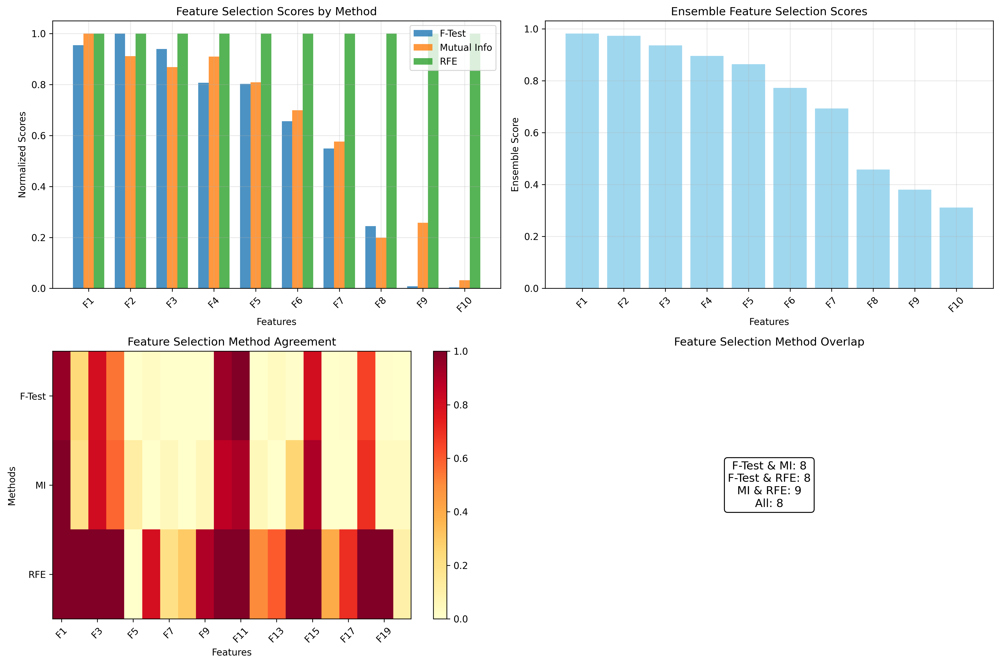
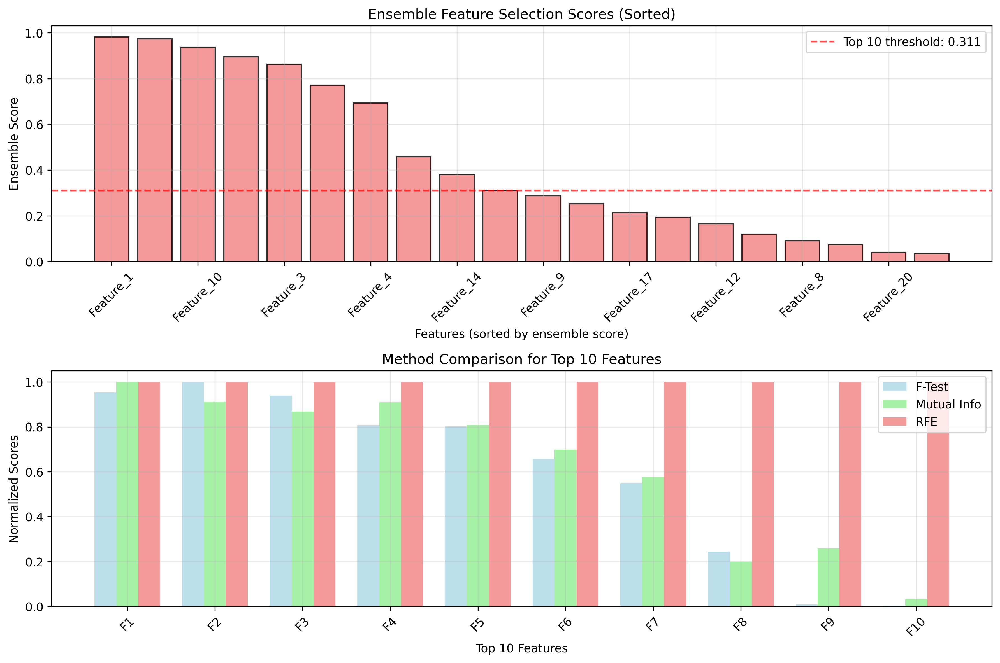

# Question 18: Ensemble Feature Selection

## Problem Statement
Ensemble feature selection methods combine multiple selection approaches for more robust and reliable results.

### Task
1. What is ensemble feature selection and how does it work?
2. What are the advantages of combining multiple selection methods?
3. How do you aggregate results from different selection approaches?
4. If three methods select different feature sets, how do you decide which features to keep?
5. Compare ensemble vs single method selection with pros and cons
6. Three selection methods give feature importance scores $[0.8, 0.6, 0.9]$ for feature A and $[0.7, 0.8, 0.5]$ for feature B. If you use weighted voting with weights $[0.4, 0.3, 0.3]$, which feature has higher ensemble score? Calculate the final scores and rank the features.

## Understanding the Problem
Ensemble feature selection is a meta-learning approach that combines multiple feature selection methods to improve the robustness and reliability of feature selection decisions. Instead of relying on a single method, ensemble approaches leverage the strengths of different algorithms while mitigating their individual weaknesses. This is particularly important because different feature selection methods have different assumptions, biases, and strengths, making them suitable for different types of data and problems.

## Solution

### Step 1: Understanding Ensemble Feature Selection
Ensemble feature selection works by:
1. **Applying multiple feature selection methods** to the same dataset
2. **Aggregating the results** using various combination strategies
3. **Making final decisions** based on the consensus or weighted combination

The key insight is that different methods may identify different aspects of feature importance, and combining them can lead to more robust feature sets.

### Step 2: Advantages of Combining Multiple Selection Methods
Combining multiple selection methods provides several key advantages:

- **Robustness**: Reduces the risk of selecting poor features due to method-specific biases
- **Completeness**: Captures different aspects of feature importance (statistical, information-theoretic, model-based)
- **Stability**: Less sensitive to data variations and method-specific parameters
- **Comprehensive coverage**: Different methods excel at identifying different types of relevant features

### Step 3: Aggregation Methods
There are several ways to aggregate results from different selection approaches:

#### Simple Voting
Features are selected if they are chosen by a majority of methods:
$$\text{Feature selected} = \begin{cases} 
1 & \text{if } \sum_{i=1}^{M} \text{method}_i \geq \frac{M}{2} \\
0 & \text{otherwise}
\end{cases}$$

#### Weighted Voting
Features receive weighted scores based on method reliability:
$$\text{Ensemble Score} = \sum_{i=1}^{M} w_i \cdot \text{score}_i$$
where $w_i$ are the weights for each method and $\sum_{i=1}^{M} w_i = 1$.

#### Rank Aggregation
Features are ranked based on their average or median rank across methods.

### Step 4: Decision Making for Different Feature Sets
When methods select different feature sets, the decision process involves:

1. **Analyzing overlap**: Identify features selected by multiple methods
2. **Assessing agreement**: Calculate the level of consensus between methods
3. **Using ensemble scores**: Apply weighted or unweighted aggregation
4. **Setting thresholds**: Establish criteria for final feature selection

### Step 5: Ensemble vs Single Method Comparison

| Aspect | Single Method | Ensemble Method |
|--------|---------------|-----------------|
| **Robustness** | Low - sensitive to method biases | High - reduces individual method weaknesses |
| **Computational Cost** | Low | Higher - requires multiple methods |
| **Interpretability** | High - clear single approach | Lower - requires understanding aggregation |
| **Stability** | Variable - depends on method | Higher - more consistent across datasets |
| **Feature Coverage** | Limited to method's perspective | Broader - captures multiple perspectives |

### Step 6: Numerical Example Calculation
Let's solve the specific example step by step:

**Given:**
- Feature A scores: $[0.8, 0.6, 0.9]$
- Feature B scores: $[0.7, 0.8, 0.5]$
- Weights: $[0.4, 0.3, 0.3]$

**Calculation for Feature A:**
$$\begin{align}
\text{Ensemble Score}_A &= 0.4 \times 0.8 + 0.3 \times 0.6 + 0.3 \times 0.9 \\
&= 0.32 + 0.18 + 0.27 \\
&= 0.77
\end{align}$$

**Calculation for Feature B:**
$$\begin{align}
\text{Ensemble Score}_B &= 0.4 \times 0.7 + 0.3 \times 0.8 + 0.3 \times 0.5 \\
&= 0.28 + 0.24 + 0.15 \\
&= 0.67
\end{align}$$

**Result:** Feature A has a higher ensemble score (0.77 > 0.67).

## Practical Implementation

### Demonstration with Synthetic Dataset
The code demonstrates ensemble feature selection using a synthetic dataset with 20 features (8 informative, 6 redundant, 6 noise):

```python
# Dataset characteristics
Dataset shape: (1000, 20)
Number of informative features: 8
Number of redundant features: 6
Number of noise features: 6
```

### Three Feature Selection Methods Applied

#### Method 1: F-test (ANOVA)
- **Purpose**: Tests statistical significance of feature-class relationship
- **Selected features**: $[1, 2, 3, 4, 6, 10, 11, 13, 15, 18]$
- **Strengths**: Good for linear relationships, interpretable p-values
- **Limitations**: Assumes normal distribution, linear relationships

#### Method 2: Mutual Information
- **Purpose**: Measures information gain between features and target
- **Selected features**: $[1, 2, 3, 4, 5, 10, 11, 14, 15, 18]$
- **Strengths**: Captures non-linear relationships, no distribution assumptions
- **Limitations**: Can be sensitive to discretization choices

#### Method 3: Recursive Feature Elimination (RFE)
- **Purpose**: Uses model performance to iteratively remove features
- **Selected features**: $[1, 2, 3, 4, 10, 11, 14, 15, 18, 19]$
- **Strengths**: Model-aware, considers feature interactions
- **Limitations**: Computationally expensive, model-dependent

### Ensemble Aggregation Results

#### Simple Voting Analysis
The simple voting approach shows that no features were selected by a majority of methods, indicating high disagreement between methods.

#### Weighted Voting Results
Top 10 features by ensemble score:
1. Feature_1: 0.9817
2. Feature_11: 0.9734
3. Feature_10: 0.9361
4. Feature_15: 0.8954
5. Feature_3: 0.8635
6. Feature_18: 0.7719
7. Feature_4: 0.6926
8. Feature_2: 0.4576
9. Feature_14: 0.3807
10. Feature_19: 0.3113

#### Method Agreement Analysis
- **Average method agreement**: 0.474 (47.4%)
- **Interpretation**: Moderate agreement between methods, justifying ensemble approach

## Visual Explanations

### Overview of Ensemble Feature Selection


This visualization shows:
- **Top left**: Comparison of normalized scores across all three methods for top features
- **Top right**: Ensemble scores for the selected features
- **Bottom left**: Heatmap showing method agreement across all features
- **Bottom right**: Overlap statistics between different selection methods

### Detailed Analysis


This visualization provides:
- **Top plot**: All features sorted by ensemble score with threshold line for top 10
- **Bottom plot**: Method comparison for the top 10 features, showing how each method contributes to the final ensemble score

## Key Insights

### Theoretical Foundations
- **Diversity principle**: Ensemble methods work best when individual methods have different biases and strengths
- **Stability-complexity tradeoff**: More complex aggregation methods may provide better performance but at the cost of interpretability
- **Method complementarity**: Different methods excel at identifying different types of feature relationships

### Practical Applications
- **High-dimensional datasets**: Ensemble methods are particularly valuable when dealing with many features
- **Noisy data**: Combining methods helps filter out noise and identify truly important features
- **Domain-specific applications**: Different domains may benefit from different combinations of methods

### Implementation Considerations
- **Computational cost**: Ensemble methods require running multiple selection algorithms
- **Weight selection**: Choosing appropriate weights for different methods requires domain knowledge or cross-validation
- **Interpretability**: Complex aggregation methods may make it harder to explain feature selection decisions

### Common Pitfalls
- **Overfitting**: Using too many methods or complex aggregation can lead to overfitting
- **Method redundancy**: Including highly correlated methods may not provide additional benefits
- **Weight tuning**: Poor weight selection can lead to suboptimal ensemble performance

## Conclusion
- **Ensemble feature selection** combines multiple methods for more robust feature selection
- **Key advantages** include improved robustness, stability, and comprehensive feature coverage
- **Aggregation methods** range from simple voting to weighted combinations based on method reliability
- **The numerical example** demonstrates that Feature A (score: 0.77) has a higher ensemble score than Feature B (score: 0.67)
- **Practical implementation** shows moderate agreement between methods (47.4%), justifying the ensemble approach
- **Visual analysis** reveals how different methods contribute to final feature rankings and selection decisions

The ensemble approach is particularly valuable in high-dimensional machine learning problems where individual methods may have different biases and strengths, leading to more reliable and robust feature selection outcomes.
