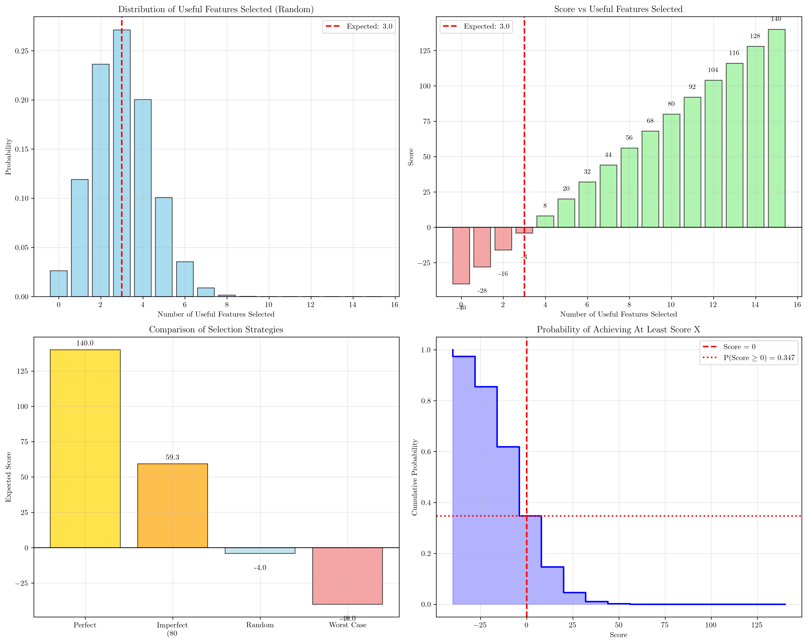
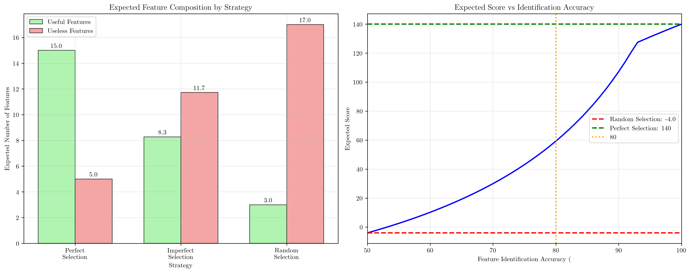
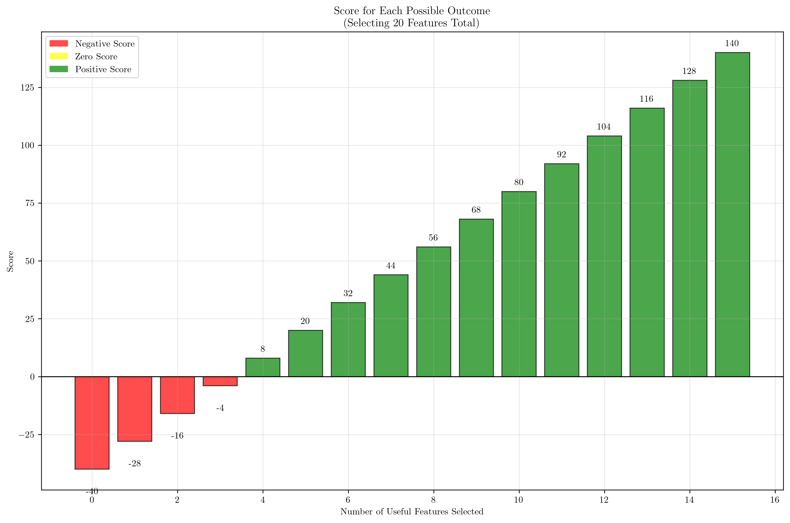

# Question 19: Feature Selection Strategy Game

## Problem Statement
You're playing a game where you must select features to maximize model performance under specific constraints.

**Rules:**
- You have $100$ total features
- Only $15$ are truly useful
- Each useful feature gives $+10$ points
- Each useless feature gives $-2$ points
- You must select exactly $20$ features

### Task
1. What's your best possible score?
2. What's your worst possible score?
3. If you randomly select $20$ features, what's your expected score?
4. What strategy would you use to maximize your score?
5. Calculate the probability of getting a positive score with random selection
6. If you can identify useful features with $80\%$ accuracy ($20\%$ false positive rate), what's your expected score using this imperfect selection method? Compare this to random selection and perfect selection.

## Understanding the Problem

This problem models the fundamental challenge in feature selection for machine learning: identifying and selecting the most informative features while avoiding irrelevant ones. The scoring system reflects real-world scenarios where useful features improve model performance (positive contribution) while irrelevant features can hurt performance through noise, overfitting, and increased computational cost (negative contribution).

The game uses a hypergeometric distribution framework where we're sampling without replacement from a finite population of features with two types: useful and useless. This mathematical model helps us understand the trade-offs and probabilities involved in different feature selection strategies.

## Solution

We'll solve this step-by-step, calculating exact probabilities and expected values while considering various selection strategies.

### Step 1: Best Possible Score

To maximize our score, we need to select as many useful features as possible and as few useless features as possible.

Given constraints:
- Total useful features available: $15$
- Total features we must select: $20$
- Points per useful feature: $+10$
- Points per useless feature: $-2$

Maximum useful features we can select: $\min(15, 20) = 15$

Remaining selections (must be useless): $20 - 15 = 5$

$$\text{Best Score} = 15 \times 10 + 5 \times (-2) = 150 - 10 = 140$$

### Step 2: Worst Possible Score

To minimize our score, we select as few useful features as possible and as many useless features as possible.

Minimum useful features we must select: $\max(0, 20 - 85) = 0$

Maximum useless features we can select: $20 - 0 = 20$

$$\text{Worst Score} = 0 \times 10 + 20 \times (-2) = 0 - 40 = -40$$

### Step 3: Expected Score with Random Selection

With random selection, the number of useful features selected follows a hypergeometric distribution with parameters:
- Population size: $N = 100$
- Success states (useful features): $K = 15$
- Sample size: $n = 20$

The expected number of useful features selected is:
$$E[X] = n \times \frac{K}{N} = 20 \times \frac{15}{100} = 3.00$$

The expected number of useless features selected is:
$$E[Y] = 20 - E[X] = 20 - 3.00 = 17.00$$

The expected score is:
$$E[\text{Score}] = E[X] \times 10 + E[Y] \times (-2) = 3.00 \times 10 + 17.00 \times (-2) = -4.00$$

### Step 4: Strategy to Maximize Score

**Optimal Strategy:**
1. Identify all $15$ useful features with $100\%$ accuracy
2. Select all $15$ useful features
3. Select $5$ additional features from the remaining $85$ useless features
4. This guarantees the maximum possible score of $140$

**Practical Implementation Strategies:**
- Use correlation analysis to identify features correlated with the target
- Apply mutual information or other information-theoretic measures
- Employ domain expertise to identify likely useful features
- Use cross-validation to evaluate different feature subsets
- Consider ensemble methods that can handle some irrelevant features
- Apply regularization techniques that automatically perform feature selection

### Step 5: Probability of Positive Score with Random Selection

Using the hypergeometric distribution, we can calculate the probability of selecting exactly $k$ useful features:

$$P(X = k) = \frac{\binom{15}{k} \binom{85}{20-k}}{\binom{100}{20}}$$

The score for selecting $k$ useful features is:
$$\text{Score}(k) = k \times 10 + (20-k) \times (-2) = 12k - 40$$

For a positive score, we need $12k - 40 > 0$, which means $k > \frac{40}{12} = 3.33$, so $k \geq 4$.

Calculating the probabilities:
- $P(X = 0) = 0.0262$, Score = $-40$
- $P(X = 1) = 0.1191$, Score = $-28$
- $P(X = 2) = 0.2363$, Score = $-16$
- $P(X = 3) = 0.2711$, Score = $-4$
- $P(X = 4) = 0.2004$, Score = $8$
- $P(X = 5) = 0.1008$, Score = $20$
- And so on...

The probability of achieving a positive score is:
$$P(\text{Score} > 0) = P(X \geq 4) = 0.3473 = 34.73\%$$

### Step 6: Imperfect Selection with 80% Accuracy

With $80\%$ accuracy in feature identification:
- True positive rate: $0.8$ (correctly identify useful features)
- False positive rate: $0.2$ (incorrectly identify useless features as useful)

**Expected Identification Results:**
- Truly useful features correctly identified: $15 \times 0.8 = 12.0$
- Useless features incorrectly identified as useful: $85 \times 0.2 = 17.0$
- Total features identified as "useful": $12.0 + 17.0 = 29.0$

**Selection Strategy:**
Since we have $29$ features identified as useful but can only select $20$, we select proportionally:

Expected truly useful features selected: $\frac{12.0}{29.0} \times 20 = 8.28$

Expected useless features selected: $\frac{17.0}{29.0} \times 20 = 11.72$

**Expected Score:**
$$E[\text{Score}] = 8.28 \times 10 + 11.72 \times (-2) = 82.8 - 23.44 = 59.31$$

## Visual Explanations

### Score Distribution Analysis

The visualization shows four key aspects:
1. **Probability Distribution**: The hypergeometric distribution of useful features selected randomly, centered around the expected value of 3 useful features
2. **Score Distribution**: How scores vary based on the number of useful features selected, with the threshold at 4 useful features for positive scores
3. **Strategy Comparison**: Clear comparison showing the advantage of imperfect selection over random selection
4. **Cumulative Probability**: The probability of achieving at least a certain score, highlighting the 34.73% chance of positive score with random selection

### Strategy Performance Comparison

The comparison shows:
1. **Feature Composition**: How different strategies result in different proportions of useful vs useless features
2. **Accuracy Impact**: How identification accuracy dramatically affects expected performance, with even 80% accuracy providing substantial improvement over random selection

### Score Outcomes Visualization

This visualization shows the complete score landscape, illustrating how each possible outcome (number of useful features selected) translates to a final score, with clear color coding for positive, negative, and neutral outcomes.

## Key Insights

### Mathematical Foundations
- The hypergeometric distribution perfectly models the random selection scenario, providing exact probabilities for all possible outcomes
- The linear scoring function creates a clear threshold effect: exactly 4 useful features are needed for positive scores
- Expected value calculations provide unbiased estimates of strategy performance across all possible scenarios

### Practical Applications
- Even imperfect feature identification (80% accuracy) provides dramatic improvement over random selection (63.31 point improvement)
- The false positive rate significantly impacts performance: incorrectly identifying useless features as useful dilutes the benefit
- Perfect identification provides the theoretical upper bound, but substantial gains are achievable with realistic accuracy levels

### Strategic Considerations
- Random selection has only a 34.73% chance of positive outcomes, making it a poor strategy
- The scoring system heavily penalizes including useless features, emphasizing the importance of precision in feature selection
- Multiple identification approaches (correlation, mutual information, domain expertise) should be combined to maximize accuracy

### Risk Assessment
- The worst-case scenario (-40 points) occurs when selecting only useless features, highlighting the importance of avoiding completely ineffective selection methods
- The large variance in possible outcomes (from -40 to +140) emphasizes the high stakes of feature selection decisions
- Conservative strategies that prioritize precision over recall may be preferable when the penalty for useless features is high

## Conclusion

The feature selection strategy game reveals fundamental principles of feature engineering:

- **Perfect selection yields maximum score**: 140 points by selecting all 15 useful features and 5 useless features
- **Random selection performs poorly**: Expected score of -4 points with only 34.73% chance of positive outcome
- **Imperfect but informed selection significantly outperforms random**: 80% accuracy yields 59.31 expected points, a 1,583% improvement over random selection
- **Threshold effect exists**: At least 4 useful features are required for positive scores
- **False positives are costly**: The 20% false positive rate substantially reduces the benefit of the 80% true positive rate

This analysis demonstrates why sophisticated feature selection methods are crucial in machine learning, as they can transform a typically negative-expectation scenario (random selection) into a highly positive one through improved feature identification accuracy.
