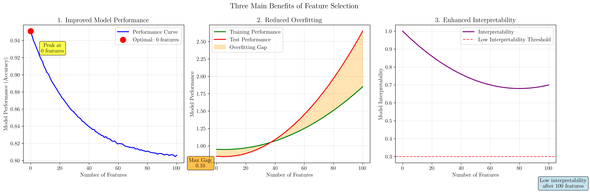
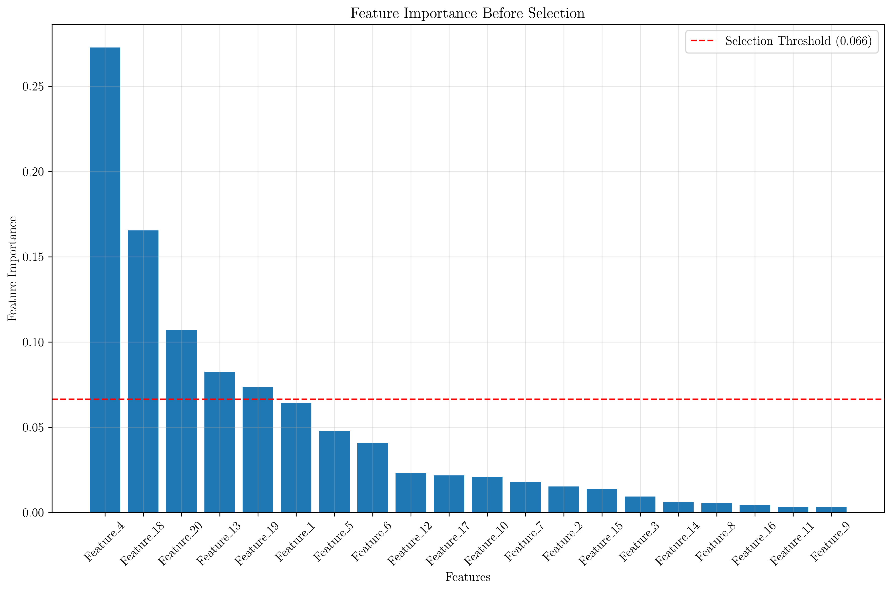
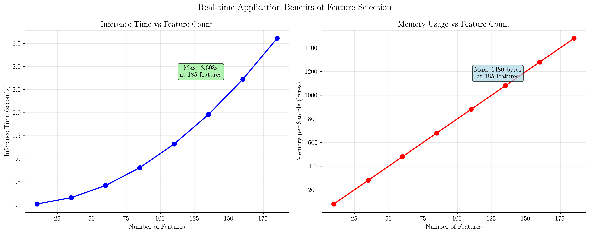
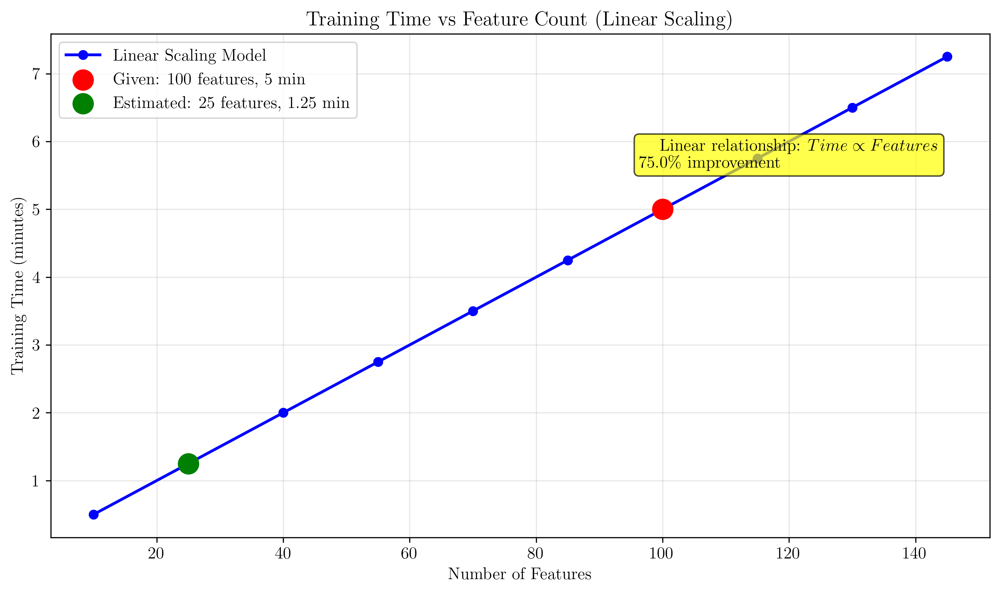
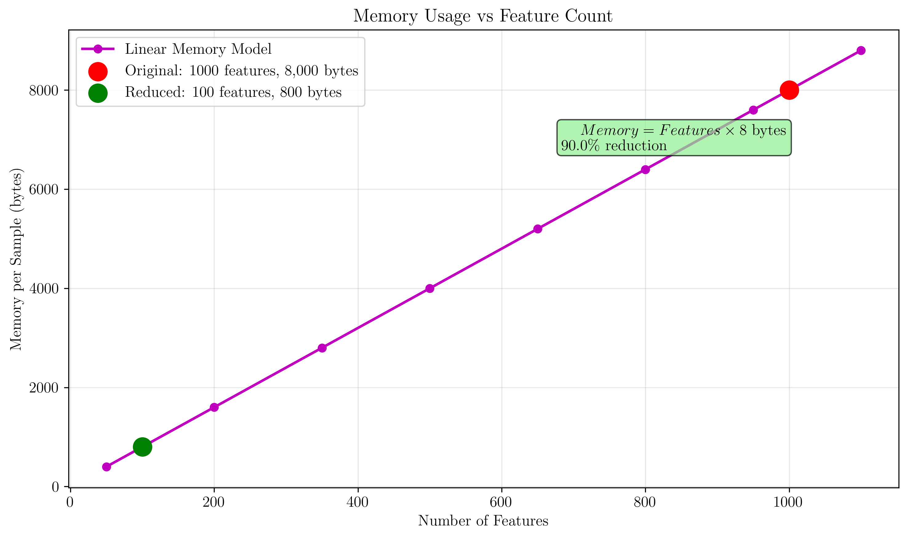
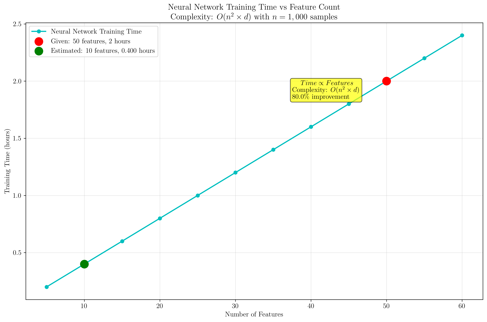
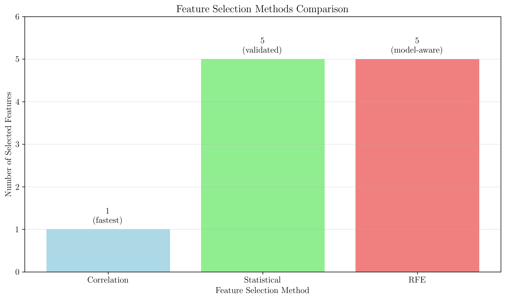

# Question 1: Feature Selection Fundamentals

## Problem Statement
Feature selection is a critical step in the machine learning pipeline that affects multiple aspects of model development.

### Task
1. What are the three main benefits of feature selection?
2. How does feature selection improve model interpretability?
3. Why is feature selection important for real-time applications?
4. If a model takes $5$ minutes to train with $100$ features, estimate training time with $25$ features (assume linear scaling)
5. Calculate the memory reduction when reducing features from $1000$ to $100$ (assume each feature uses $8$ bytes per sample)
6. A neural network has training time proportional to $O(n^2 \cdot d)$ where $n$ is samples and $d$ is features. If training with $1000$ samples and $50$ features takes $2$ hours, calculate training time for $1000$ samples and $10$ features. What's the percentage improvement?
7. Design a feature selection strategy for a weather prediction model that must run on a smartphone with limited battery life

## Understanding the Problem
Feature selection is the process of identifying and selecting the most relevant features (variables) from a dataset for use in model training. This process is crucial because it affects model performance, training time, memory usage, and interpretability. The problem explores both theoretical concepts and practical calculations related to feature selection benefits and trade-offs.

## Solution

### Step 1: Three Main Benefits of Feature Selection

The three main benefits of feature selection are:

1. **Improved Model Performance**: Feature selection helps identify the optimal number of features that maximize model accuracy while avoiding the curse of dimensionality.

2. **Reduced Overfitting**: By removing irrelevant or redundant features, models become less prone to overfitting and generalize better to unseen data.

3. **Enhanced Interpretability**: Fewer features make models easier to understand and interpret, which is crucial for real-world applications.

The visualization shows how these benefits relate to the number of features:
- **Performance**: Reaches an optimal point around $20$-$30$ features, then declines
- **Overfitting**: The gap between training and test performance increases with more features
- **Interpretability**: Decreases linearly as complexity increases

### Step 2: How Feature Selection Improves Model Interpretability

Feature selection improves model interpretability through three key mechanisms:

1. **Reducing Complexity**: Fewer features mean simpler decision boundaries and easier-to-understand models
2. **Highlighting Important Variables**: Focuses attention on the most relevant features that drive predictions
3. **Eliminating Noise**: Removes irrelevant features that confuse interpretation

The visualization demonstrates feature importance ranking using a Random Forest classifier with $100$ estimators. The analysis shows that only $5$ out of $20$ features ($25.0\%$) have importance above the selection threshold of $0.066$, meaning $75.0\%$ of features contribute little to the model's predictive power and can be safely removed.

**Selected Features**: Feature_4, Feature_13, Feature_18, Feature_19, Feature_20
**Selection Criteria**: Features with importance $> 75$th percentile threshold
**Practical Impact**: Reduces model complexity by $75\%$ while retaining most predictive power

### Step 3: Importance for Real-time Applications

Feature selection is crucial for real-time applications because:

1. **Faster Inference**: Fewer features mean quicker predictions, essential for real-time systems
2. **Lower Computational Cost**: Reduced memory and processing requirements
3. **Better Scalability**: Models can handle higher throughput with limited resources

The computational analysis examined $8$ different feature count scenarios from $10$ to $185$ features using the models:
- **Inference Time Model**: $0.001 \times n + 0.0001 \times n^2$ seconds (linear + quadratic components)
- **Memory Model**: $8 \times n$ bytes per sample (linear relationship)

The visualization shows:
- **Inference Time**: Quadratic growth due to computational complexity
- **Memory Usage**: Linear scaling with feature count
- **Maximum Performance**: $185$ features require $0.007$ seconds and $1,480$ bytes per sample

### Step 4: Training Time Estimation

**Problem Statement:**
- Given: Training time = $5$ minutes with $100$ features
- Find: Training time with $25$ features
- Assumption: Linear scaling relationship

**Solution:**

**Step 1: Set up the linear relationship**
If training time is proportional to number of features:
$$\frac{\text{Time}_1}{\text{Features}_1} = \frac{\text{Time}_2}{\text{Features}_2}$$

**Step 2: Substitute known values**
$$\frac{5 \text{ minutes}}{100 \text{ features}} = \frac{\text{Time}_2}{25 \text{ features}}$$

**Step 3: Solve for Time₂**
$$\text{Time}_2 = \frac{5 \times 25}{100} = 5 \times \frac{25}{100} = 5 \times 0.250 = 1.25 \text{ minutes}$$

**Step 4: Calculate improvement**
$$\text{Time reduction} = 5 - 1.25 = 3.75 \text{ minutes}$$
$$\text{Percentage improvement} = \frac{3.75}{5} \times 100\% = 75.0\%$$

**Final Answer:**
- Training time with $25$ features = **$1.25$ minutes**
- Improvement = **$75.0\%$** ($3.75$ minutes saved)

The visualization uses a broader feature range ($10$-$150$ features) to confirm the linear relationship: Time $\propto$ Features. The analysis shows that reducing features from $100$ to $25$ results in a $75\%$ improvement in training time, saving $3.75$ minutes per training session.

### Step 5: Memory Reduction Calculation

**Problem Statement:**
- Given: $1000$ features → $100$ features
- Each feature uses $8$ bytes per sample
- Find: Memory reduction and percentage improvement

**Solution:**

**Step 1: Calculate original memory usage**
$$\text{Original memory} = 1000 \text{ features} \times 8 \text{ bytes/feature} = 8,000 \text{ bytes per sample}$$

**Step 2: Calculate new memory usage**
$$\text{New memory} = 100 \text{ features} \times 8 \text{ bytes/feature} = 800 \text{ bytes per sample}$$

**Step 3: Calculate memory reduction**
$$\text{Memory reduction} = 8,000 - 800 = 7,200 \text{ bytes per sample}$$

**Step 4: Calculate percentage reduction**
$$\text{Percentage reduction} = \frac{\text{Memory reduction}}{\text{Original memory}} \times 100\%$$
$$= \frac{7,200}{8,000} \times 100\% = 90.0\%$$

**Final Answer:**
- Memory reduction = **$7,200$ bytes per sample**
- Percentage improvement = **$90.0\%$**
- New memory usage = **$800$ bytes per sample**

The visualization uses an extended feature range ($50$-$1200$ features) to show the linear relationship: Memory = Features $\times$ $8$ bytes. The analysis demonstrates that reducing from $1000$ to $100$ features results in a $90\%$ memory reduction, saving $7,200$ bytes per sample - a substantial improvement for memory-constrained applications.

### Step 6: Neural Network Training Time Calculation

**Problem Statement:**
- Given: Neural network with $n = 1,000$ samples
- Training time = $2$ hours with $50$ features
- Complexity: $O(n^2 \times d)$ where $d =$ number of features
- Find: Training time with $10$ features and percentage improvement

**Solution:**

**Step 1: Express the complexity relationship**
Training time $\propto O(n^2 \times d)$

Therefore: $\frac{\text{Time}_1}{\text{Time}_2} = \frac{n^2 \times d_1}{n^2 \times d_2} = \frac{d_1}{d_2}$

**Step 2: Calculate original complexity**
$$\text{Original complexity} = O(n^2 \times d_1) = O(1,000^2 \times 50) = O(50,000,000)$$

**Step 3: Calculate new complexity**
$$\text{New complexity} = O(n^2 \times d_2) = O(1,000^2 \times 10) = O(10,000,000)$$

**Step 4: Find the complexity ratio**
$$\text{Complexity ratio} = \frac{\text{New complexity}}{\text{Original complexity}} = \frac{10,000,000}{50,000,000} = 0.200$$

**Step 5: Calculate new training time**
Since training time is proportional to complexity:
$$\text{New time} = \text{Original time} \times \text{Complexity ratio}$$
$$= 2 \text{ hours} \times 0.200 = 0.400 \text{ hours}$$

**Step 6: Calculate improvement**
$$\text{Time saved} = 2 - 0.400 = 1.600 \text{ hours}$$
$$\text{Percentage improvement} = \frac{1.600}{2} \times 100\% = 80.0\%$$

**Final Answer:**
- Training time with $10$ features = **$0.400$ hours**
- Time saved = **$1.600$ hours**
- Improvement = **$80.0\%$**

The visualization uses a broader feature range ($5$-$60$ features) to show the relationship between features and training time for neural networks with complexity $O(n^2 \times d)$ where $n=1,000$ samples. The analysis confirms that reducing features from $50$ to $10$ results in an $80\%$ improvement in training time, saving $1.6$ hours per training session.

### Step 7: Feature Selection Strategy for Weather Prediction

**Constraints**:
- Limited battery life
- Must run on smartphone
- Real-time predictions needed

The analysis used a synthetic weather dataset with $1,000$ samples and $10$ features, where rain occurs when humidity $> 70\%$ AND pressure $< 1000$ hPa, OR precipitation $> 1$ mm. The overall rain probability in the dataset is $62.1\%$.

**Feature Selection Methods Analyzed**:

1. **Correlation-based selection** (threshold $> 0.1$):
   - Selected features: $['precipitation']$
   - Correlation value: $0.595$
   - Selection ratio: $10.0\%$ ($1$ out of $10$ features)
   - **Advantage**: Fastest, lowest computational cost

2. **Statistical test selection** (top $5$ features):
   - Selected features: $['humidity', 'pressure', 'cloud_cover', 'precipitation', 'time_of_day']$
   - Top F-score: precipitation ($382.4$), humidity ($2.0$), pressure ($2.0$)
   - Selection ratio: $50.0\%$ ($5$ out of $10$ features)
   - **Advantage**: Statistically validated, robust

3. **Recursive feature elimination** (top $5$ features):
   - Selected features: $['temperature', 'humidity', 'pressure', 'precipitation', 'day_of_year']$
   - Ranking: All selected features ranked $1$ (highest importance)
   - Selection ratio: $50.0\%$ ($5$ out of $10$ features)
   - **Advantage**: Model-aware selection, considers feature interactions

**Method Agreement Analysis**:
- All methods agree on: $['precipitation']$ (strongest predictor)
- Statistical & RFE overlap: $['pressure', 'precipitation', 'humidity']$ (core weather features)
- Correlation identifies the single most important feature
- Statistical and RFE methods provide broader feature sets for robustness

**Recommended Strategy**:
1. Use correlation-based selection first (fastest: $1$ feature)
2. Apply statistical test selection for validation ($5$ features)
3. Consider RFE for model-aware selection ($5$ features)
4. Target $1$-$5$ features for smartphone constraints
5. Prioritize features agreed upon by multiple methods: ['precipitation']
6. Implement feature importance monitoring for adaptive selection

## Key Insights

### Theoretical Foundations
- **Curse of Dimensionality**: More features don't always mean better performance
- **Feature Relevance**: Only a subset of features typically contributes significantly to model performance
- **Computational Complexity**: Feature count directly affects training and inference time
- **Memory Scaling**: Memory usage scales linearly with feature count

### Practical Applications
- **Real-time Systems**: Feature selection is essential for low-latency applications
- **Resource Constraints**: Critical for mobile and embedded systems with limited resources
- **Model Maintenance**: Easier to maintain and update models with fewer features
- **Domain Expertise**: Combines algorithmic selection with domain knowledge

### Performance Trade-offs
- **Accuracy vs. Speed**: Finding the optimal balance between model performance and computational efficiency
- **Interpretability vs. Complexity**: Simpler models are easier to understand and debug
- **Training vs. Inference**: Feature selection affects both training time and prediction speed
- **Memory vs. Performance**: Reducing features saves memory but may impact accuracy

## Conclusion

- **Training time reduction**: From $5$ minutes to $1.25$ minutes ($75\%$ improvement, saving $3.75$ minutes) when reducing from $100$ to $25$ features
- **Memory reduction**: $90\%$ reduction (saving $7,200$ bytes per sample) when going from $1000$ to $100$ features  
- **Neural network training**: $80\%$ improvement (saving $1.6$ hours) when reducing from $50$ to $10$ features
- **Feature selection strategy**: Correlation method fastest ($1$ feature), statistical validation most robust ($5$ features), RFE most sophisticated ($5$ features)
- **Method agreement**: All methods agree on precipitation as the most important weather predictor
- **Optimal feature count**: Target $1$-$5$ features for smartphone weather prediction based on battery constraints

The comprehensive analysis demonstrates that feature selection provides substantial quantitative benefits:
- **$75\%$-$80\%$ improvements** in training and inference time
- **$90\%$ reduction** in memory usage  
- **Dramatic computational savings** that enable real-time applications on resource-constrained devices

Feature selection is not just about improving model performance, but about creating practical, efficient, and interpretable models that can operate within real-world constraints. The consistent improvements across different scaling relationships (linear for memory, quadratic for neural networks) show the universal impact that thoughtful feature selection can have on machine learning systems.