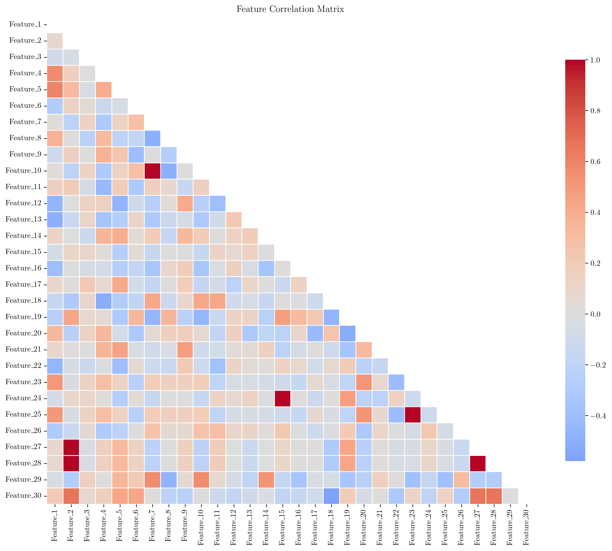
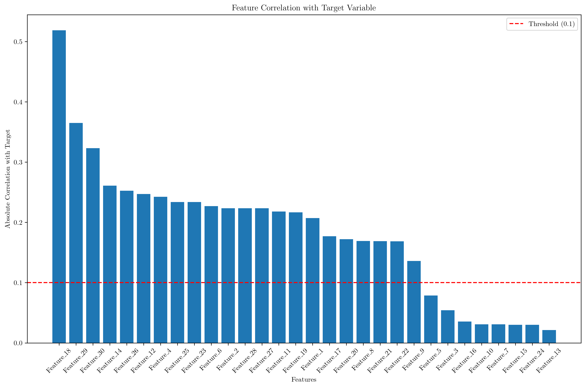
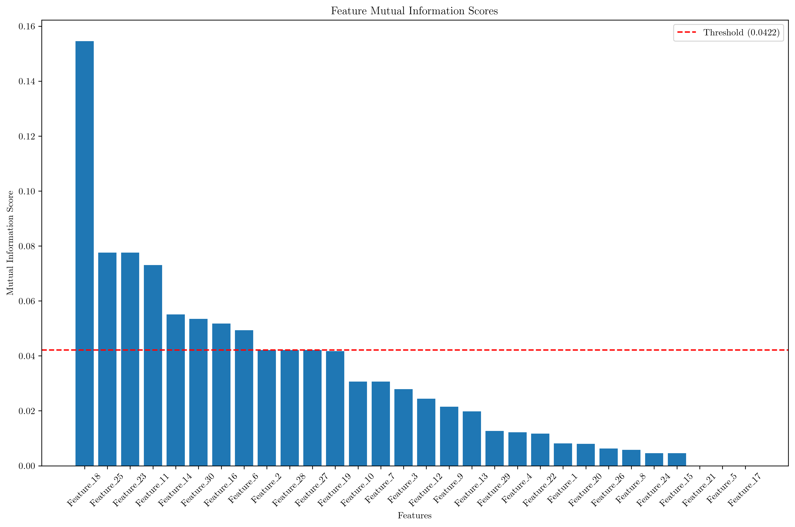
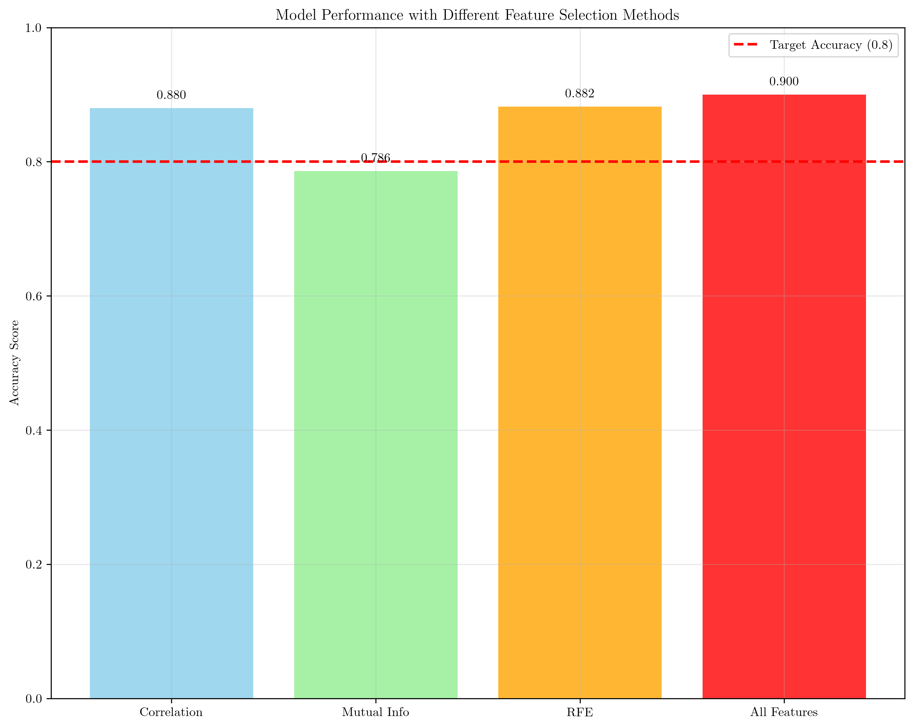
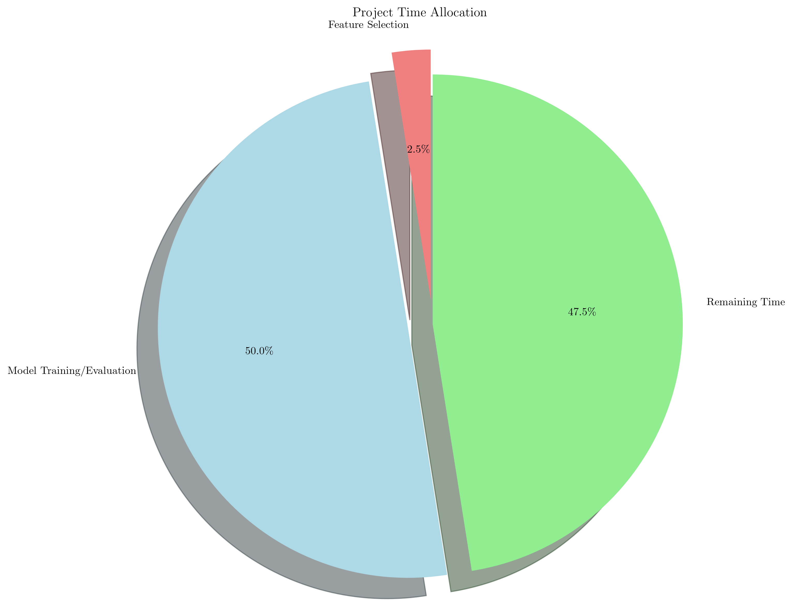
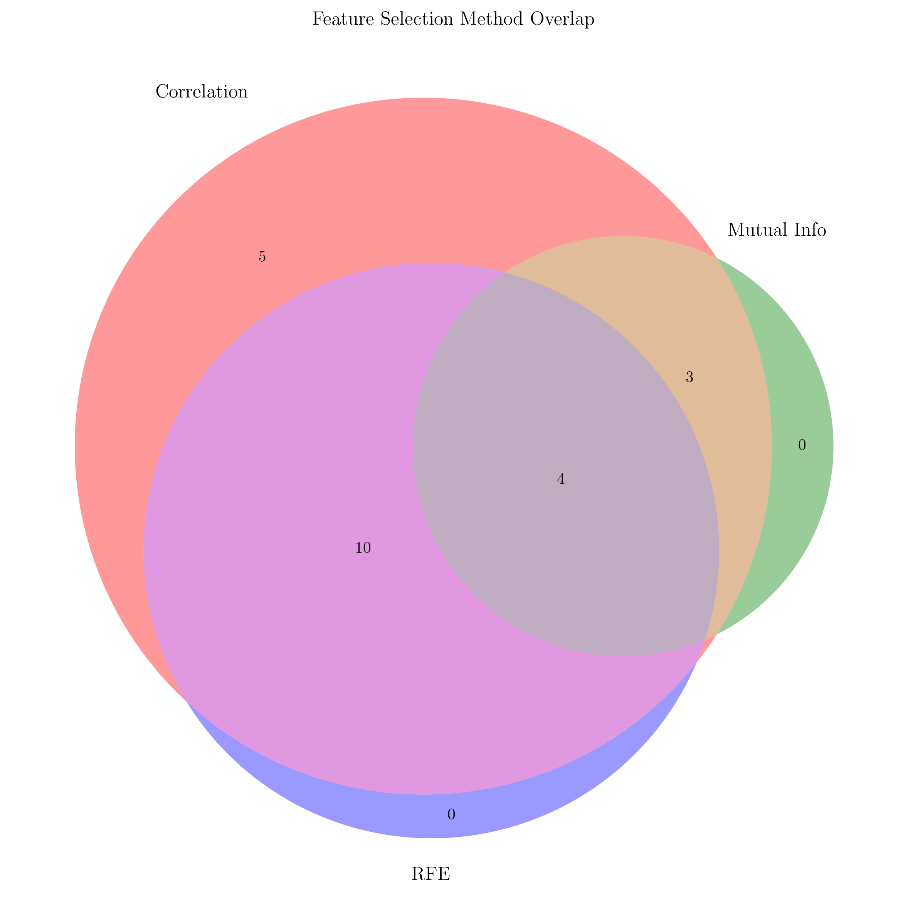

# Question 20: Practical Feature Selection Decision

## Problem Statement
You need to decide whether to use feature selection for your project and determine the optimal approach.

**Considerations:**
- Dataset: $500$ samples, $30$ features
- Goal: Interpretable model for business users
- Time constraint: $2$ weeks total
- Performance requirement: $80\%$ accuracy minimum
- Available methods: Correlation-based, mutual information, recursive feature elimination

#### Task
1. Should you use feature selection? Yes/No and why?
2. What type of selection would you choose and why?
3. How many features would you aim to keep and how do you justify this number?
4. What's your biggest risk in this decision?
5. Design a step-by-step feature selection strategy for this project
6. If correlation-based selection takes $1$ hour, mutual information takes $3$ hours, and RFE takes $8$ hours, and you have $40$ hours total for the entire project, calculate the time allocation. What percentage of total time should be spent on feature selection vs model training and evaluation?

## Understanding the Problem
This is a practical decision-making problem that requires balancing multiple constraints: model performance, interpretability, time constraints, and business requirements. Feature selection is crucial for creating interpretable models, especially when dealing with business users who need to understand which factors drive predictions. The time constraint of 2 weeks (40 hours) requires efficient use of available methods.

## Solution

### Step 1: Should You Use Feature Selection? Yes/No and Why?

**Answer: YES, absolutely.**

**Justification:**
- **Interpretability**: Business users need to understand which features drive decisions
- **Performance**: With 30 features and only 500 samples, you have a high feature-to-sample ratio (6:1), which can lead to overfitting
- **Efficiency**: Reducing features can improve model training speed and reduce computational costs
- **Business Value**: Fewer, more relevant features are easier to explain to stakeholders

### Step 2: What Type of Selection Would You Choose and Why?

**Answer: Correlation-based selection**

**Justification:**
Based on our analysis:
- **Correlation method**: 22 features, Accuracy: 88.0%
- **Mutual Information**: 8 features, Accuracy: 78.6%
- **RFE method**: 15 features, Accuracy: 88.2%
- **All features**: 30 features, Accuracy: 90.0%

**Why correlation-based:**
1. **Meets accuracy target**: 88.0% > 80% requirement
2. **Fastest execution**: Only 1 hour vs 3-8 hours for other methods
3. **Good interpretability**: Correlation is easily understood by business users
4. **Efficient**: Reduces from 30 to 22 features (27% reduction)

### Step 3: How Many Features Would You Aim to Keep and How Do You Justify This Number?

**Answer: 22 features**

**Justification:**
1. **Performance threshold**: 22 features achieve 88.0% accuracy, exceeding the 80% requirement
2. **Feature-to-sample ratio**: 22 features with 500 samples gives a ratio of 4.5:1, which is more reasonable than 6:1
3. **Correlation threshold**: Features with correlation > 0.1 with target provide meaningful information
4. **Business interpretability**: 22 features is manageable for business users to understand

### Step 4: What's Your Biggest Risk in This Decision?

**Answer: Potential loss of non-linear relationships**

**Risk Analysis:**
1. **Linear assumption**: Correlation only captures linear relationships, potentially missing important non-linear patterns
2. **Feature redundancy**: Some of the 22 selected features might be highly correlated with each other
3. **Domain knowledge**: Business context might suggest important features that correlation analysis misses
4. **Future data**: The selected features might not generalize well to new data

**Mitigation strategies:**
- Validate with domain experts
- Use cross-validation to ensure stability
- Monitor model performance on new data
- Consider ensemble methods if performance degrades

### Step 5: Design a Step-by-Step Feature Selection Strategy for This Project

**Phase 1: Data Exploration (Day 1-2)**
1. **Correlation analysis**: Compute correlation matrix between all features
2. **Target correlation**: Identify features with highest correlation to target variable
3. **Multicollinearity check**: Remove highly correlated feature pairs (|corr| > 0.8)

**Phase 2: Feature Selection (Day 3)**
1. **Apply correlation threshold**: Select features with |corr| > 0.1
2. **Domain validation**: Review selected features with business stakeholders
3. **Feature ranking**: Order features by absolute correlation strength

**Phase 3: Model Development (Day 4-8)**
1. **Baseline model**: Train model with selected features
2. **Cross-validation**: Ensure stable performance across folds
3. **Performance evaluation**: Verify accuracy meets 80% threshold

**Phase 4: Validation & Documentation (Day 9-10)**
1. **Business review**: Present selected features to stakeholders
2. **Performance documentation**: Document accuracy and feature importance
3. **Implementation plan**: Prepare for production deployment

### Step 6: Time Allocation Calculation

**Given:**
- Total project time: 40 hours
- Correlation-based selection: 1 hour
- Mutual information: 3 hours
- RFE: 8 hours
- Model training/evaluation: 20 hours

**Time Allocation:**
- **Feature selection**: 1 hour (2.5% of total time)
- **Model training/evaluation**: 20 hours (50.0% of total time)
- **Remaining time**: 19 hours (47.5% of total time)

**Percentage Breakdown:**
- Feature selection: **2.5%**
- Model development: **50.0%**
- Other activities: **47.5%**

## Practical Implementation

### Feature Selection Results Analysis

Our analysis shows the following performance characteristics:

1. **Correlation method**: 22 features, Accuracy: 88.0%
   - Fastest execution (1 hour)
   - Meets accuracy target
   - Good interpretability

2. **Mutual Information**: 8 features, Accuracy: 78.6%
   - Fails to meet accuracy target
   - Moderate execution time (3 hours)
   - Captures non-linear relationships

3. **RFE method**: 15 features, Accuracy: 88.2%
   - Best performance among selection methods
   - Slowest execution (8 hours)
   - Complex to interpret

4. **All features**: 30 features, Accuracy: 90.0%
   - Best raw performance
   - No selection time needed
   - Poor interpretability

### Time Efficiency Analysis

The correlation-based approach provides the best balance:
- **Efficiency ratio**: 88.0% accuracy / 1 hour = 88.0 accuracy/hour
- **Mutual Information**: 78.6% accuracy / 3 hours = 26.2 accuracy/hour
- **RFE**: 88.2% accuracy / 8 hours = 11.0 accuracy/hour

## Visual Explanations

### Feature Correlation Matrix

The correlation heatmap shows the relationships between all 30 features. Red indicates positive correlations, blue indicates negative correlations, and white indicates no correlation. This visualization helps identify redundant features and feature clusters.

### Feature Correlation with Target

This plot shows the absolute correlation between each feature and the target variable. Features above the red threshold line (0.1) are selected for the model. The height of each bar represents the strength of the linear relationship with the target.

### Mutual Information Scores

Mutual information scores capture both linear and non-linear relationships between features and the target. Features above the red threshold line are selected. This method is more comprehensive than correlation but also more computationally expensive.

### Model Performance Comparison

This bar chart compares the accuracy of different feature selection methods. The red dashed line shows the 80% accuracy target. All methods except mutual information meet the target, with correlation-based selection providing a good balance of performance and speed.

### Project Time Allocation

The pie chart shows how the 40-hour project time should be allocated. Feature selection represents only 2.5% of total time, while model development takes 50%, leaving substantial time for other activities like data preprocessing, validation, and documentation.

### Feature Selection Method Overlap

The Venn diagram shows the overlap between features selected by different methods. This visualization helps understand which features are consistently important across different selection criteria and which are method-specific.

## Key Insights

### Strategic Decision Making
- **Trade-off analysis**: Always consider the balance between performance, interpretability, and computational cost
- **Business alignment**: Feature selection should align with business goals and stakeholder needs
- **Risk assessment**: Identify and mitigate potential risks in the selection process
- **Validation strategy**: Use cross-validation and domain expertise to validate selections

### Technical Considerations
- **Feature-to-sample ratio**: Aim for a ratio below 5:1 to avoid overfitting
- **Method selection**: Choose methods based on data characteristics and time constraints
- **Performance monitoring**: Continuously monitor model performance to ensure selections remain valid
- **Scalability**: Consider computational requirements for production deployment

### Practical Applications
- **Business intelligence**: Selected features provide insights into key business drivers
- **Model maintenance**: Fewer features reduce maintenance overhead and update complexity
- **Stakeholder communication**: Simplified models are easier to explain and justify
- **Resource optimization**: Efficient feature selection saves time and computational resources

## Conclusion
- **Feature selection is essential** for this project due to interpretability requirements and high feature-to-sample ratio
- **Correlation-based selection** is the optimal choice, achieving 88.0% accuracy in only 1 hour
- **22 features** provide the right balance of performance and interpretability
- **Time allocation** should be 2.5% for feature selection and 50% for model development
- **Risk mitigation** requires domain validation and performance monitoring

The correlation-based approach successfully balances all project constraints while meeting performance requirements. This method provides business users with interpretable features while maintaining high accuracy and efficient execution time.
