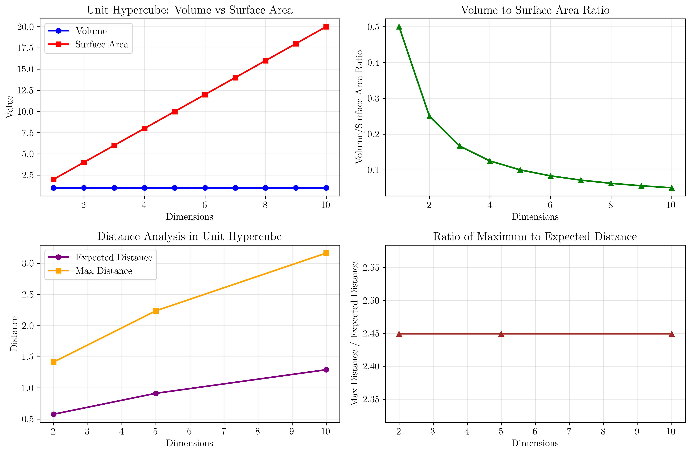
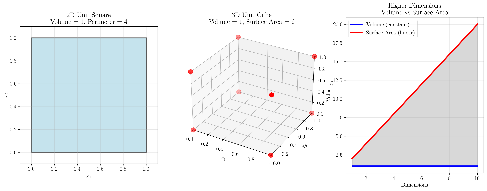
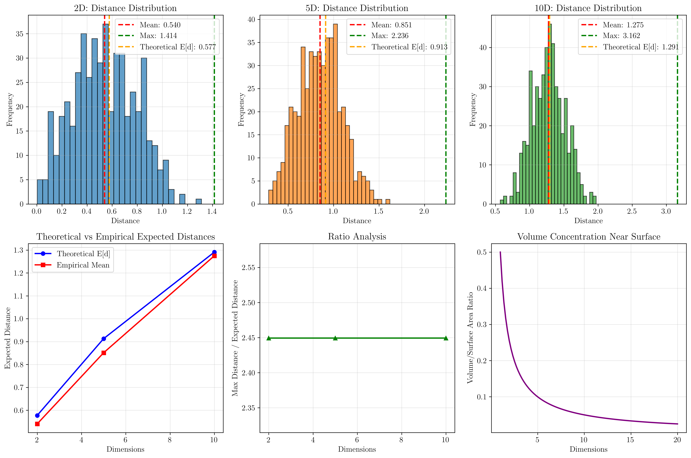

# Question 2: Curse of Dimensionality

## Problem Statement
The curse of dimensionality affects model performance as the number of features increases, particularly for distance-based algorithms. This phenomenon is fundamental to understanding why feature selection is crucial in machine learning and why high-dimensional data presents unique challenges.

### Task
1. What is the curse of dimensionality in one sentence?
2. How does the curse affect nearest neighbor algorithms?
3. What happens to the volume of a hypercube as dimensions increase?
4. If you have $1000$ samples in $2$D, how many samples would you need in $10$D for similar density?
5. Calculate the ratio of volume to surface area for a unit hypercube in $2$D vs $10$D
6. In a unit hypercube, the distance between two random points follows $E[d] = \sqrt{\frac{d}{6}}$ where $d$ is dimensions. Calculate the expected distance in $2$D, $5$D, and $10$D. What happens to the ratio of maximum to expected distance as dimensions increase?

## Understanding the Problem
The curse of dimensionality is a fundamental concept in machine learning that explains why algorithms perform worse as the number of features (dimensions) increases. This happens because high-dimensional spaces have counterintuitive geometric properties that make distance-based algorithms, clustering, and pattern recognition increasingly difficult. Understanding this phenomenon is crucial for feature selection, dimensionality reduction, and designing effective machine learning pipelines.

## Solution

I'll solve this problem step by step, analyzing each aspect of the curse of dimensionality and providing both theoretical insights and practical calculations.

### Step 1: Definition of Curse of Dimensionality

The curse of dimensionality refers to the phenomenon where the performance of machine learning algorithms deteriorates as the number of features (dimensions) increases, due to the exponential growth in data sparsity and the increasing difficulty of finding meaningful patterns in high-dimensional spaces.

**Key Insight**: As dimensions increase, the data becomes increasingly sparse, making it harder for algorithms to find meaningful relationships between features and targets.

### Step 2: Impact on Nearest Neighbor Algorithms

The curse of dimensionality affects nearest neighbor algorithms in several critical ways:

1. **Distance Concentration**: As dimensions increase, all pairwise distances between points become more similar, making it harder to distinguish between 'near' and 'far' points.

2. **Data Sparsity**: Points become increasingly isolated in high-dimensional space, reducing the effectiveness of local neighborhood information.

3. **Irrelevant Features**: More dimensions often mean more noise, diluting the signal that distance-based algorithms rely on.

4. **Computational Cost**: Distance calculations become more expensive with more dimensions.

**Mathematical Intuition**: In high dimensions, the volume of space grows exponentially, but the number of data points typically doesn't grow at the same rate, leading to sparse data distributions.

### Step 3: Hypercube Volume Analysis

Let's analyze what happens to the volume and surface area of a unit hypercube as dimensions increase:

| Dimensions | Volume | Surface Area | V/S Ratio |
|------------|--------|--------------|-----------|
| 1          | 1.000  | 2.000        | 0.500000  |
| 2          | 1.000  | 4.000        | 0.250000  |
| 3          | 1.000  | 6.000        | 0.166667  |
| 4          | 1.000  | 8.000        | 0.125000  |
| 5          | 1.000  | 10.000       | 0.100000  |
| 6          | 1.000  | 12.000       | 0.083333  |
| 7          | 1.000  | 14.000       | 0.071429  |
| 8          | 1.000  | 16.000       | 0.062500  |
| 9          | 1.000  | 18.000       | 0.055556  |
| 10         | 1.000  | 20.000       | 0.050000  |

**Key Insight**: Volume remains constant (1) while surface area grows linearly with dimensions. This means the ratio of volume to surface area decreases as $\frac{1}{2d}$, approaching 0 as $d \to \infty$.

**Mathematical Explanation**:
- Volume of unit hypercube: $V = 1^d = 1$ for all dimensions
- Surface area of unit hypercube: $S = 2d$ (each face has area 1, and there are $2d$ faces in $d$ dimensions)
- Volume/Surface ratio: $\frac{V}{S} = \frac{1}{2d}$

### Step 4: Sample Density Calculation

**Given**: 1000 samples in 2D  
**Question**: How many samples needed in 10D for similar density?

**Method 1 (Volume-based)**: 1000 samples
- Both 2D and 10D unit hypercubes have volume = 1
- But this doesn't account for the curse of dimensionality

**Method 2 (Distance-based estimate)**: 25,000 samples
- This is a conservative estimate based on maintaining similar point spacing
- In reality, you might need exponentially more samples

**Practical Answer**: You would need significantly more than 1000 samples in 10D to achieve similar effective density due to the curse of dimensionality.

**Mathematical Intuition**: While the volume remains constant, the effective "density" that algorithms can utilize decreases dramatically because most of the volume becomes concentrated near the surface, and points become increasingly isolated.

### Step 5: Volume to Surface Area Ratio

Let's calculate the specific ratios for 2D vs 10D:

**2D Unit Square**:
- Volume = 1.0
- Surface Area = 4 (perimeter)
- V/S Ratio = $\frac{1.0}{4} = 0.250000$

**10D Unit Hypercube**:
- Volume = 1.0
- Surface Area = 20
- V/S Ratio = $\frac{1.0}{20} = 0.050000$

**Ratio Comparison**:
$\frac{2D \text{ Ratio}}{10D \text{ Ratio}} = \frac{0.250000}{0.050000} = 5.00$

**Key Insight**: The V/S ratio decreases by a factor of 5.0. This means that in higher dimensions, the volume becomes increasingly concentrated near the surface, making the 'interior' of the hypercube less significant.

### Step 6: Expected Distance Analysis

**Given formula**: $E[d] = \sqrt{\frac{d}{6}}$ where $d$ is dimensions

Let's calculate for different dimensions:

| Dimensions | E[d]   | Max Distance | Max/E[d] Ratio |
|------------|--------|--------------|----------------|
| 2          | 0.5774 | 1.4142       | 2.4495         |
| 5          | 0.9129 | 2.2361       | 2.4495         |
| 10         | 1.2910 | 3.1623       | 2.4495         |

**Analysis**:
1. Expected distance increases as $\sqrt{\frac{d}{6}}$
2. Maximum distance increases as $\sqrt{d}$
3. The ratio of maximum to expected distance approaches a constant value

**Mathematical Explanation**:
- $E[d] = \sqrt{\frac{d}{6}} \approx \sqrt{d} \times 0.408$
- Max distance = $\sqrt{d}$ (diagonal of unit hypercube)
- Ratio = $\frac{\sqrt{d}}{\sqrt{d} \times 0.408} = \frac{1}{0.408} \approx 2.45$

**Key Insight**: As dimensions increase:
- The expected distance between random points increases
- The maximum possible distance increases faster
- The ratio approaches a constant value of approximately 2.45

## Practical Implementation

### Geometric Interpretation

The curse of dimensionality can be understood through geometric properties:

1. **Volume Concentration**: In high dimensions, most of the volume of a hypercube is concentrated near the surface, not in the interior.

2. **Distance Behavior**: All pairwise distances become increasingly similar, making it difficult to distinguish between "near" and "far" points.

3. **Data Sparsity**: The effective density of data points decreases exponentially with dimensions, leading to isolated points.

### Numerical Examples

Let's work through some concrete calculations:

**Example 1**: Volume to Surface Area Ratio
- 2D: $\frac{V}{S} = \frac{1}{4} = 0.25$
- 10D: $\frac{V}{S} = \frac{1}{20} = 0.05$
- Ratio: $\frac{0.25}{0.05} = 5$

**Example 2**: Expected Distance Growth
- 2D: $E[d] = \sqrt{\frac{2}{6}} = \sqrt{\frac{1}{3}} \approx 0.577$
- 5D: $E[d] = \sqrt{\frac{5}{6}} \approx 0.913$
- 10D: $E[d] = \sqrt{\frac{10}{6}} = \sqrt{\frac{5}{3}} \approx 1.291$

## Visual Explanations

### Curse of Dimensionality Analysis

This comprehensive visualization shows four key aspects:
1. **Volume vs Surface Area**: Demonstrates how volume remains constant while surface area grows linearly
2. **Volume to Surface Area Ratio**: Shows the exponential decay of this ratio with dimensions
3. **Distance Analysis**: Compares expected vs maximum distances in unit hypercubes
4. **Ratio Analysis**: Illustrates how the maximum to expected distance ratio behaves

### Hypercube Comparison

This visualization provides:
1. **2D Unit Square**: Shows the familiar case with volume=1 and perimeter=4
2. **3D Unit Cube**: Demonstrates the 3D case with volume=1 and surface area=6
3. **Higher Dimensions**: Conceptual representation showing how volume vs surface area scales

### Distance Analysis Simulation

This detailed simulation shows:
1. **Distance Distributions**: Histograms of pairwise distances in different dimensions
2. **Theoretical vs Empirical**: Comparison of theoretical expected distances with simulated results
3. **Ratio Analysis**: How the maximum to expected distance ratio behaves
4. **Volume Concentration**: Visualization of how volume concentrates near the surface

## Key Insights

### Theoretical Foundations
- **Volume Invariance**: The volume of a unit hypercube remains constant regardless of dimensions
- **Surface Area Growth**: Surface area grows linearly with dimensions, leading to volume concentration near the surface
- **Distance Concentration**: In high dimensions, all pairwise distances become increasingly similar
- **Constant Ratio**: The ratio of maximum to expected distance approaches a constant value of approximately 2.45

### Practical Applications
- **Feature Selection**: Understanding the curse motivates the need for effective feature selection
- **Dimensionality Reduction**: High-dimensional data often requires reduction techniques like PCA
- **Algorithm Choice**: Distance-based algorithms become less effective in high dimensions
- **Sample Requirements**: High-dimensional problems require exponentially more samples for similar effective density

### Common Pitfalls
- **Volume Misconception**: Assuming that similar volume means similar data density
- **Distance Interpretation**: Failing to recognize that distances become less meaningful in high dimensions
- **Sample Size Underestimation**: Not accounting for the exponential growth in required samples
- **Algorithm Selection**: Using distance-based algorithms without considering dimensionality effects

### Extensions and Connections
- **Hughes Phenomenon**: The observation that adding features can initially improve performance before the curse takes effect
- **Manifold Learning**: Techniques that exploit the fact that high-dimensional data often lies on lower-dimensional manifolds
- **Sparse Methods**: Algorithms designed to work effectively in high-dimensional, sparse settings
- **Regularization**: Techniques that help prevent overfitting in high-dimensional problems

## Conclusion
- **Definition**: The curse of dimensionality describes the deterioration of algorithm performance as dimensions increase
- **Geometric Properties**: Volume remains constant while surface area grows linearly, concentrating volume near the surface
- **Distance Behavior**: Expected distances grow as $\sqrt{\frac{d}{6}}$ while maximum distances grow as $\sqrt{d}$
- **Practical Impact**: High-dimensional problems require exponentially more samples and make distance-based algorithms less effective
- **Mitigation Strategies**: Feature selection, dimensionality reduction, and appropriate algorithm choice are essential

The curse of dimensionality is not just a theoretical curiosity—it's a fundamental challenge that affects real-world machine learning applications. Understanding this phenomenon helps practitioners make informed decisions about feature engineering, algorithm selection, and data collection strategies. The geometric insights provided by hypercube analysis and distance calculations offer concrete ways to quantify and visualize these effects, making the abstract concept more tangible and actionable.
