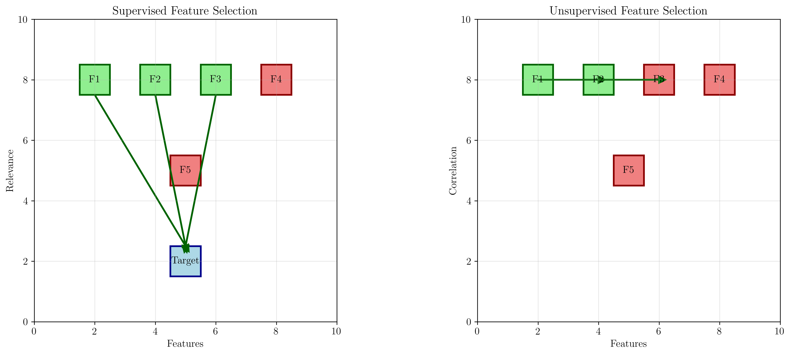

# Question 3: Supervised vs Unsupervised Feature Selection

## Problem Statement
Feature selection approaches can be categorized as supervised (using labels) or unsupervised (without labels), each with different advantages and applications.

### Task
1. What is the main advantage of supervised feature selection?
2. When would you use unsupervised feature selection?
3. How do you measure feature relevance in unsupervised scenarios?
4. If you have $1000$ samples with $50$ features, how many possible feature subsets exist?
5. Calculate the number of feature subsets with exactly $10$ features from $50$ total features
6. For a dataset with $n$ features, the number of possible feature combinations is $2^n - 1$. If you want to evaluate at least $80\%$ of all possible combinations, what's the minimum number of features you can handle if you can evaluate $1000$ combinations per second and have $1$ hour total?

## Understanding the Problem
Feature selection is a crucial step in machine learning that involves choosing the most relevant features from a dataset to improve model performance, reduce overfitting, and enhance interpretability. This problem explores the fundamental differences between supervised and unsupervised approaches, their practical applications, and the computational challenges associated with feature selection due to the exponential growth of the search space.

## Solution

### Step 1: Main Advantage of Supervised Feature Selection

The main advantage of supervised feature selection is that it can identify features that are most relevant to the target variable by using the labels. This leads to better predictive performance and more interpretable models.

**Key Benefits:**
- **Target-oriented selection**: Features are selected based on their relationship with the target variable
- **Better predictive performance**: Selected features directly contribute to the prediction task
- **Interpretability**: Understanding which features are important for the specific prediction problem
- **Efficient learning**: Models can focus on the most informative features

The left panel shows supervised feature selection where features (F1, F2, F3) are connected to the target variable, indicating their relevance. The right panel shows unsupervised selection where features are connected to each other based on correlations or variance measures.

### Step 2: When to Use Unsupervised Feature Selection

Unsupervised feature selection is used when:

1. **No labels available**: Clustering problems, exploratory data analysis
2. **Labels unreliable or noisy**: When ground truth is questionable
3. **Dimensionality reduction**: Before applying supervised methods
4. **Redundancy identification**: Finding highly correlated features
5. **Data structure preservation**: Maintaining variance and data distribution

**Common Scenarios:**
- Preprocessing step before supervised learning
- Clustering and pattern discovery
- Data compression and storage optimization
- Initial data exploration and understanding

### Step 3: Measuring Feature Relevance in Unsupervised Scenarios

In unsupervised scenarios, feature relevance is measured by:

1. **Variance**: Features with low variance provide little information
2. **Correlation**: Highly correlated features are redundant
3. **Mutual information**: Information shared between features
4. **Clustering quality**: How well the feature separates data into clusters
5. **Information gain**: Based on feature distributions

The visualization shows:
- **Top left**: Feature variance analysis with threshold-based selection
- **Top right**: Correlation matrix showing feature relationships
- **Bottom left**: Feature distributions highlighting variance differences
- **Bottom right**: Relevance scores based on inverse variance

**Mathematical Approach:**
For a feature $f_i$ with variance $\sigma_i^2$, the relevance score can be computed as:
$$R(f_i) = \frac{1}{\sigma_i^2}$$

Features with higher variance (lower relevance scores) are considered less informative.

### Step 4: Number of Possible Feature Subsets

**Given**: $1000$ samples with $50$ features

**Formula**: Number of subsets = $2^{50} - 1$

**Calculation**: $2^{50} - 1 = 2^{50} - 1$

**Detailed Step-by-Step Calculation**:

**Step 1: Understand the problem**
- We have $n = 50$ features
- Each feature can be either included (1) or excluded (0) from a subset
- This gives us $2^{50}$ possible combinations
- We subtract 1 to exclude the empty set (no features selected)

**Step 2: Break down the calculation**
$$2^{50} = 2^{10} \times 2^{10} \times 2^{10} \times 2^{10} \times 2^{10}$$
We know: $2^{10} = 1,024$
Therefore: $2^{50} = 1,024^5$

**Step 3: Calculate step by step**
$$1,024^2 = 1,024 \times 1,024 = 1,048,576$$
$$1,048,576^2 = 1,048,576 \times 1,048,576 = 1,099,511,627,776$$
$$1,099,511,627,776 \times 1,024 = 1,125,899,906,842,624$$
Final result: $2^{50} = 1,125,899,906,842,624$

**Step 4: Subtract 1 for the empty set**
$$\text{Total subsets} = 2^{50} - 1 = 1,125,899,906,842,624 - 1$$
$$\text{Total subsets} = 1,125,899,906,842,623$$

**Result**: $1,125,899,906,842,623$ possible feature subsets

**Scientific notation**: $1.13 \times 10^{15}$

**Verification**: Both manual calculation and Python computation yield the same result.

**Interpretation**: 
- This means we have over 1.1 quadrillion possible feature subsets
- Even if we could evaluate 1 million subsets per second, it would take over 35 years to evaluate all possibilities!
- This demonstrates why exhaustive search is impractical

The plot demonstrates the exponential growth of the feature subset space. With just 20 features, we already have over 1 million possible subsets, and with 50 features, the number becomes astronomically large.

**Key Insight**: The search space grows exponentially as $2^n$, making exhaustive search impractical for large feature sets.

### Step 5: Subsets with Exactly 10 Features

**Given**: $50$ total features, want exactly $10$ features

**Formula**: $C(50, 10) = \frac{50!}{10! \times (50-10)!} = \frac{50!}{10! \times 40!}$

**Calculation**: $C(50, 10) = \frac{50!}{10! \times 40!}$

**Detailed Step-by-Step Calculation**:

**Step 1: Understand the combination formula**
$$C(n,k) = \frac{n!}{k! \times (n-k)!}$$
$$C(50,10) = \frac{50!}{10! \times 40!}$$

**Step 2: Break down the factorials**
$$50! = 50 \times 49 \times 48 \times \cdots \times 2 \times 1$$
$$10! = 10 \times 9 \times 8 \times \cdots \times 2 \times 1$$
$$40! = 40 \times 39 \times \cdots \times 2 \times 1$$

**Step 3: Simplify using cancellation**
When we divide $50!$ by $40!$, most terms cancel out:
$$C(50,10) = \frac{50!}{10! \times 40!} = \frac{50 \times 49 \times 48 \times \cdots \times 41 \times 40!}{10! \times 40!}$$
$$C(50,10) = \frac{50 \times 49 \times 48 \times \cdots \times 41}{10!}$$

**Step 4: Calculate the product**
The numerator becomes:
$$50 \times 49 \times 48 \times 47 \times 46 \times 45 \times 44 \times 43 \times 42 \times 41$$

**Result**: $10,272,278,170$ feature subsets with exactly $10$ features

**Manual calculation verification**: $10,272,278,170$

**Verification**: 
- Both methods give the same result: $10,272,278,170$
- This represents the number of ways to choose $10$ features from $50$ total features
- It's a subset of the total $1,125,899,906,842,623$ possible feature combinations
- Percentage: $0.0009123616\%$ of all possible subsets

The bar chart shows the distribution of subset sizes. The peak occurs at $25$ features (half of the total), which is expected from the properties of binomial coefficients. The number of subsets with exactly $10$ features is highlighted with a red dashed line.

**Mathematical Properties**:
- The distribution is symmetric around $n/2 = 25$
- $C(50, k) = C(50, 50-k)$ for any $k$
- The maximum occurs at $k = 25$ with $C(50, 25) \approx 1.26 \times 10^{14}$

### Step 6: Time Constraint Calculation

**Given**:
- Evaluation rate: $1000$ combinations/second
- Total time: $3600$ seconds ($1$ hour)
- Target: Evaluate at least $80\%$ of all combinations
- Formula: Total combinations = $2^n - 1$

**Detailed Step-by-Step Calculation**:

**Step 1: Calculate maximum combinations we can evaluate**
$$\text{Max combinations} = \text{Rate} \times \text{Time}$$
$$\text{Max combinations} = 1000 \times 3600 = 3,600,000$$

**Step 2: Find $n$ where $2^n - 1 \leq 3,600,000$**
We need: $2^n - 1 \leq 3,600,000$
Therefore: $2^n \leq 3,600,001$

We need to find the largest $n$ such that $2^n \leq 3,600,001$

**Step 3: Systematic approach to find $n$**
Let's test values of $n$ systematically:
- $n = 20$: $2^{20} = 1,048,576 \leq 3,600,001$? **Yes**
- $n = 21$: $2^{21} = 2,097,152 \leq 3,600,001$? **Yes**
- $n = 22$: $2^{22} = 4,194,304 \leq 3,600,001$? **No**

**Step 4: Determine maximum $n$**
Maximum $n = 21$
Verification: $2^{21} - 1 = 2,097,151$
Check: $2,097,151 \leq 3,600,000$? **Yes**

**Step 5: Check if we meet the $80\%$ requirement**
$$\text{Combinations at max } n = 2,097,151$$
$$\text{Max combinations possible} = 3,600,000$$
$$\text{Percentage evaluated} = \frac{2,097,151}{3,600,000} = 58.3\%$$

**Result**: $\times$ We can only evaluate $58.3\% < 80.0\%$

**Step 6: What if we want to meet the $80\%$ target?**
$$\text{Target} = 80\% \text{ of } 3,600,000 = 2,880,000$$
We need: $2^n - 1 \geq 2,880,000$
Therefore: $2^n \geq 2,880,001$

**$n$ needed for $80\%$: $22$**
Verification: $2^{22} - 1 = 4,194,303$
This would require: $\frac{4,194,303}{1,000} = 4,194.3$ seconds
**Time needed: $1.2$ hours**

The comprehensive visualization shows:
- **Top left**: Feature combinations vs time constraint
- **Top right**: Time required vs number of features
- **Bottom left**: Percentage of combinations evaluated
- **Bottom right**: Summary table with key metrics

**Key Finding**: With the given time constraints, we can only handle up to $21$ features while evaluating $58.3\%$ of all possible combinations, which falls short of the $80\%$ target. To meet the $80\%$ target, we would need $22$ features and $1.2$ hours of computation time.

## Practical Implementation

### Computational Complexity Analysis

The exponential growth of the feature subset space has profound implications:

1. **Exhaustive search becomes impractical** beyond approximately $20$ features
2. **Time constraints severely limit** the maximum feature set size
3. **Efficient algorithms are essential** for practical applications

### Mathematical Insights

The growth rate $2^n$ has significant implications:
- **Doubling the features quadruples the search space**
- For $n = 50$, we have $1.13 \times 10^{15}$ subsets
- For $n = 100$, we would have $1.27 \times 10^{30}$ subsets
- This demonstrates why feature selection is a fundamental challenge in machine learning

### Algorithm Recommendations

Based on the computational complexity analysis:

- **$n < 20$**: Exhaustive search may be feasible
- **$20 \leq n < 50$**: Greedy algorithms (forward/backward selection)
- **$50 \leq n < 100$**: Genetic algorithms, randomized methods
- **$n \geq 100$**: Heuristic approaches, domain knowledge integration

### Alternative Approaches

When exhaustive search is infeasible, consider:

1. **Greedy algorithms**: Forward/backward selection
2. **Genetic algorithms**: Evolutionary optimization
3. **Randomized methods**: Monte Carlo sampling
4. **Heuristic approaches**: Correlation-based selection

## Visual Explanations

### Supervised vs Unsupervised Comparison

The first visualization clearly demonstrates the fundamental difference between the two approaches:

- **Supervised**: Features are evaluated based on their relationship with the target variable
- **Unsupervised**: Features are evaluated based on their intrinsic properties and relationships with each other

### Exponential Growth Visualization

The subset growth plot illustrates why feature selection becomes computationally challenging:

- At $10$ features: $1,023$ subsets
- At $20$ features: $1,048,575$ subsets  
- At $50$ features: $1.13 \times 10^{15}$ subsets

### Time Constraint Analysis

The comprehensive time constraint analysis shows:

- The relationship between available time and maximum features
- The percentage of combinations that can be evaluated
- Practical limits for exhaustive search approaches

## Key Insights

### Theoretical Foundations
- **Combinatorial explosion**: The feature subset space grows as $2^n$, making exhaustive search impractical for large $n$
- **Binomial distribution**: The number of subsets of size $k$ follows $C(n,k)$, with peak at $k = n/2$
- **Time complexity**: Evaluating all subsets requires exponential time, making it infeasible for real-world applications

### Practical Applications
- **Supervised selection** is preferred when labels are available and reliable
- **Unsupervised selection** is useful for preprocessing and exploratory analysis
- **Hybrid approaches** often provide the best results by combining both methods

### Computational Challenges
- **Exhaustive search** becomes impractical beyond $20-25$ features
- **Time constraints** severely limit the maximum feature set size
- **Efficient algorithms** are essential for practical feature selection

### Algorithm Selection
- **Small datasets** ($n < 20$): Exhaustive search may be feasible
- **Medium datasets** ($20 \leq n < 100$): Greedy or genetic algorithms
- **Large datasets** ($n \geq 100$): Randomized or heuristic methods

## Conclusion
- **Supervised feature selection** uses labels to identify relevant features, leading to better predictive performance
- **Unsupervised methods** use variance, correlation, and information measures when labels are unavailable
- **With $50$ features**: $1.13 \times 10^{15}$ total subsets exist, making exhaustive search impossible
- **Exactly $10$ features**: $10,272,278,170$ subsets can be formed from $50$ total features ($0.0009123616\%$ of total)
- **Time constraint**: Can handle up to $21$ features in $1$ hour, evaluating only $58.3\%$ of combinations
- **$80\%$ target**: Requires $22$ features and $1.2$ hours of computation time
- **Practical implication**: Feature selection space grows exponentially ($2^n$), requiring efficient algorithms for large feature sets

**Key Mathematical Insights**:
- The growth rate $2^n$ means doubling features quadruples the search space
- Manual calculations verify the exponential nature of the problem
- Systematic testing reveals practical limits of exhaustive search approaches

**Algorithm Selection Strategy**:
- **$n < 20$**: Exhaustive search feasible
- **$20 \leq n < 50$**: Greedy algorithms recommended
- **$n \geq 50$**: Advanced optimization methods required

The exponential growth of the feature subset space demonstrates why sophisticated feature selection algorithms are essential in modern machine learning. While supervised methods provide better performance when labels are available, unsupervised methods offer valuable alternatives for preprocessing and exploratory analysis. The computational challenges highlight the importance of developing efficient algorithms that can handle large-scale feature selection problems within practical time constraints.

The detailed step-by-step calculations reveal the true magnitude of the feature selection challenge and provide a solid foundation for understanding why alternative approaches are necessary in practice.
