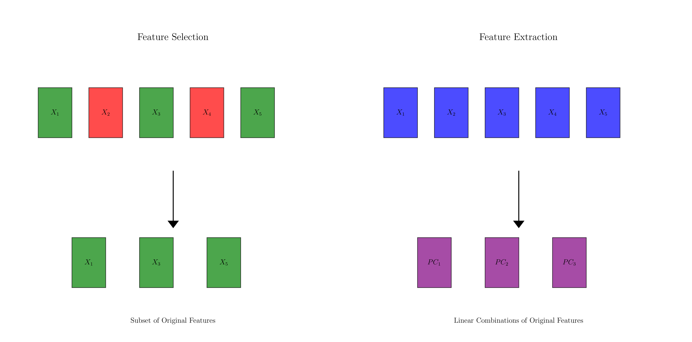
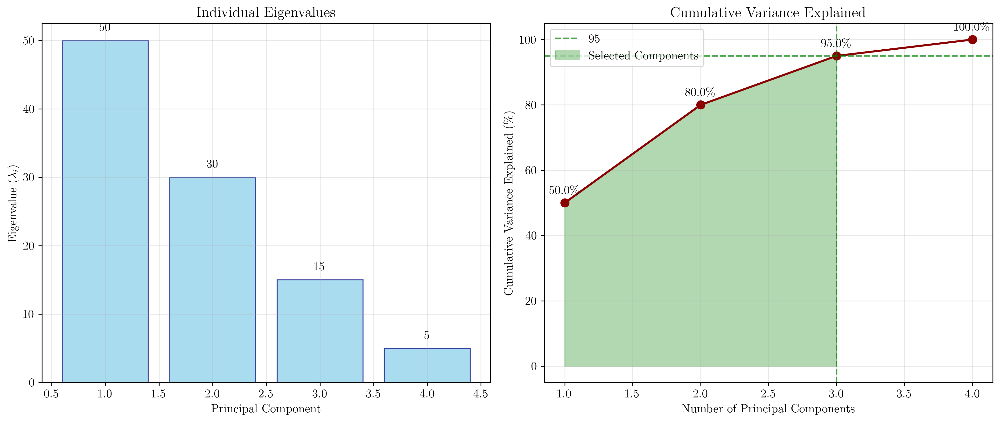
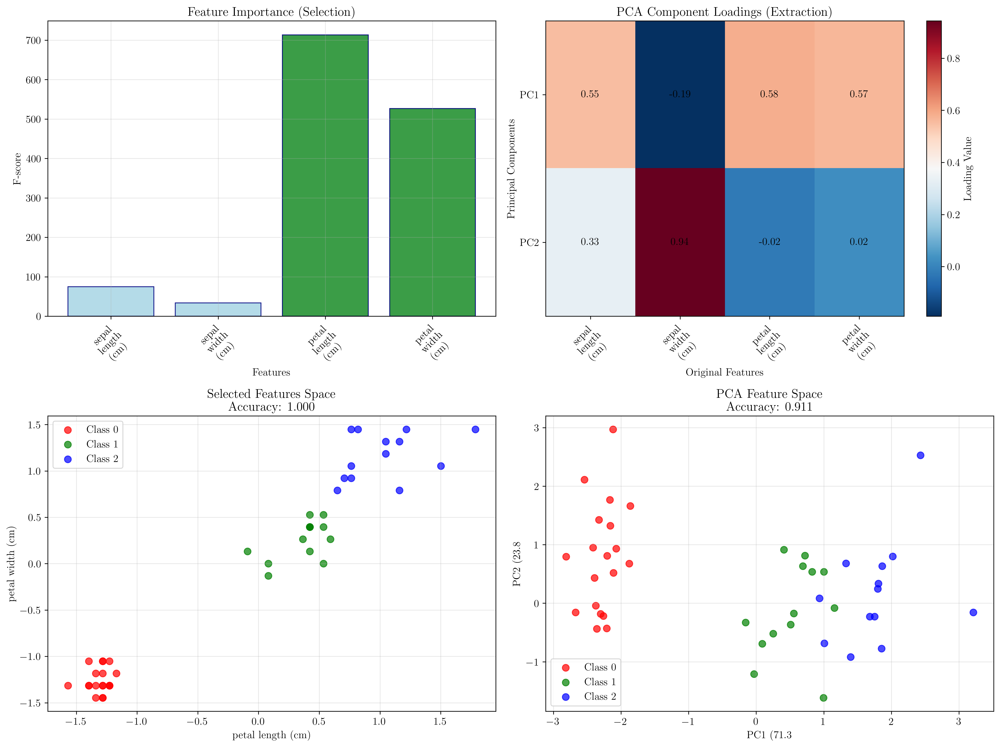
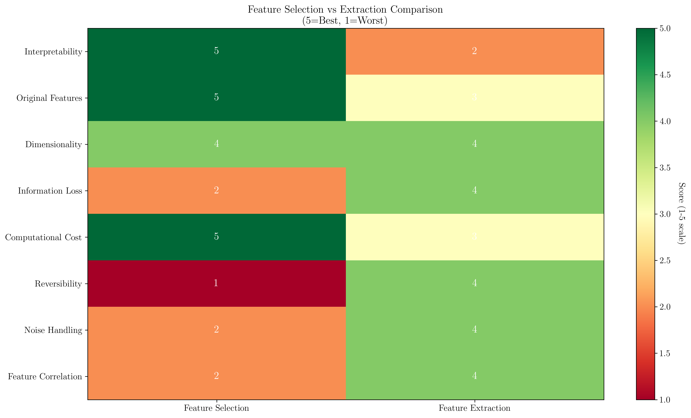

# Question 4: Feature Selection vs Feature Extraction

## Problem Statement
Feature selection and feature extraction are different approaches to dimensionality reduction with distinct trade-offs. Understanding when to use each approach is crucial for effective machine learning model development.

### Task
1. What is the key difference between selection and extraction?
2. Which approach preserves original feature interpretability?
3. When would you choose extraction over selection?
4. If you transform features using PCA, is this selection or extraction?
5. Compare the interpretability and computational cost of both approaches
6. PCA reduces dimensions by finding eigenvectors. If you have $100$ features and want to retain $95\%$ of variance, and the eigenvalues are $\lambda_1 = 50$, $\lambda_2 = 30$, $\lambda_3 = 15$, $\lambda_4 = 5$, how many principal components do you need? Calculate the cumulative variance explained.

## Understanding the Problem
Dimensionality reduction is a critical preprocessing step in machine learning that helps address the curse of dimensionality, reduce computational complexity, and improve model performance. Two main approaches exist: feature selection and feature extraction.

**Feature Selection** involves choosing a subset of the original features that are most relevant for the task, discarding the rest. The selected features maintain their original meaning and interpretation.

**Feature Extraction** creates new features by transforming or combining the original features, typically through mathematical transformations like Principal Component Analysis (PCA). The resulting features are linear combinations of the original features.

## Solution

### Step 1: Key Differences Between Selection and Extraction

The fundamental difference lies in how they handle the original features:

**Feature Selection:**
- Chooses a subset of original features
- Preserves the original feature space
- Results in interpretable features with clear meaning
- Information from unselected features is completely lost

**Feature Extraction:**
- Creates new features through transformation
- Maps data to a new feature space
- Results in transformed features that are combinations of originals
- Preserves maximum information while reducing dimensions

The visualization shows how feature selection picks specific original features (green boxes) while discarding others (red boxes), whereas feature extraction creates entirely new features (purple boxes) that are linear combinations of all original features.

### Step 2: Interpretability Preservation

**Feature Selection preserves original feature interpretability** because:
- Selected features retain their original meaning
- Domain experts can easily understand what each feature represents
- Relationships between features and outcomes remain transparent
- No mathematical transformation obscures the feature meaning

Feature extraction sacrifices interpretability for information preservation, as the new features are mathematical combinations that may not have clear real-world interpretations.

### Step 3: When to Choose Extraction Over Selection

Choose **Feature Extraction** when:

1. **High-dimensional data with correlated features** - PCA can capture relationships between correlated variables
2. **Maximum information preservation is critical** - Extraction minimizes information loss
3. **Noise reduction is important** - Transformation can filter out noise in the data
4. **Computational efficiency in downstream tasks** - Fewer dimensions speed up algorithms
5. **Multicollinearity issues** - Principal components are orthogonal by design
6. **Visualization needs** - Reducing to 2-3 dimensions for plotting
7. **Working with signal, image, or text data** - Where features are naturally correlated

### Step 4: PCA Classification

**PCA is Feature Extraction**, not selection, because:
- It creates new features (principal components) through linear transformation
- Each principal component is a weighted combination of all original features
- No original features are discarded; they are all transformed
- The transformation matrix allows reconstruction of original data (with some loss if dimensions are reduced)

### Step 5: PCA Variance Calculation

Given eigenvalues: $\lambda_1 = 50$, $\lambda_2 = 30$, $\lambda_3 = 15$, $\lambda_4 = 5$

**Total variance:** $\sum_{i=1}^{4} \lambda_i = 50 + 30 + 15 + 5 = 100$

**Cumulative variance calculation:**
- PC1: $\frac{50}{100} = 0.500$ (50.0%)
- PC1 + PC2: $\frac{50 + 30}{100} = 0.800$ (80.0%) 
- PC1 + PC2 + PC3: $\frac{50 + 30 + 15}{100} = 0.950$ (95.0%)
- PC1 + PC2 + PC3 + PC4: $\frac{100}{100} = 1.000$ (100.0%)

**Answer: 3 principal components are needed to retain 95% of variance.**

The left plot shows individual eigenvalues, while the right plot demonstrates cumulative variance explained. The green shaded area indicates the components needed for 95% variance retention.

## Practical Implementation

### Real-World Example: Iris Dataset Analysis

Using the Iris dataset with 4 features, we compared both approaches:

**Feature Selection Results:**
- Selected features: petal length and petal width (highest F-scores: 713.5 and 526.5)
- Classification accuracy: 100%
- Features remain interpretable as physical measurements

**Feature Extraction Results:**
- PC1 explains 71.3% of variance, PC2 explains 23.8% (total: 95.1%)
- Classification accuracy: 91.1%
- Features become mathematical combinations:
  - PC1 = 0.549×sepal_length - 0.191×sepal_width + 0.585×petal_length + 0.566×petal_width
  - PC2 = 0.329×sepal_length + 0.944×sepal_width - 0.023×petal_length + 0.023×petal_width

The visualization compares feature importance (selection) vs PCA loadings (extraction), and shows how the data appears in both reduced spaces.

### Comparative Analysis

**Interpretability and Computational Cost:**

The heatmap provides a comprehensive comparison across multiple dimensions:

| Aspect | Feature Selection | Feature Extraction |
|--------|------------------|-------------------|
| **Interpretability** | ⭐⭐⭐⭐⭐ High | ⭐⭐ Low |
| **Original Features** | ⭐⭐⭐⭐⭐ Preserved | ⭐⭐⭐ Transformed |
| **Information Loss** | ⭐⭐ Complete loss of unselected | ⭐⭐⭐⭐ Minimal |
| **Computational Cost** | ⭐⭐⭐⭐⭐ Low | ⭐⭐⭐ Higher |
| **Noise Handling** | ⭐⭐ Limited | ⭐⭐⭐⭐ Good |

## Visual Explanations

### Decision Framework

The choice between feature selection and extraction depends on your priorities:

**Choose Feature Selection when:**
- Interpretability is paramount
- Working with domain experts
- Regulatory compliance requires explainable features
- Limited computational resources
- Features have clear business meaning

**Choose Feature Extraction when:**
- Maximum information preservation needed
- Dealing with highly correlated features
- Noise reduction is important
- Visualization of high-dimensional data required
- Working with signal/image/text data

### Mathematical Foundation

**Feature Selection:** If original features are $X = [x_1, x_2, ..., x_n]$, selection produces $X_{selected} = [x_i, x_j, x_k]$ where $\{i,j,k\} \subset \{1,2,...,n\}$.

**Feature Extraction:** Transformation produces $Y = [y_1, y_2, ..., y_m]$ where each $y_i = \sum_{j=1}^{n} w_{ij} x_j$ and $m < n$.

For PCA specifically: $Y = XW$ where $W$ contains the eigenvectors of the covariance matrix, ordered by eigenvalue magnitude.

## Key Insights

### Theoretical Foundations
- **Feature selection** is a combinatorial optimization problem focused on finding the optimal subset
- **Feature extraction** is a linear algebra problem focused on finding optimal transformations
- PCA finds the directions of maximum variance in the data, ensuring orthogonal components
- The eigenvalues represent the amount of variance captured by each principal component

### Practical Applications
- **Financial data:** Selection for regulatory compliance, extraction for risk modeling
- **Medical diagnosis:** Selection for doctor interpretability, extraction for pattern recognition
- **Image processing:** Extraction almost always preferred due to pixel correlations
- **Text analysis:** Extraction (like LSA/LDA) handles high dimensionality better than selection

### Implementation Considerations
- **Selection methods:** Filter (statistical tests), wrapper (model-based), embedded (regularization)
- **Extraction methods:** PCA (linear), kernel PCA (nonlinear), ICA (independent components)
- **Hybrid approaches:** Apply extraction first, then selection on transformed features
- **Validation:** Use cross-validation to ensure dimensionality reduction doesn't hurt performance

## Conclusion
- **Key difference:** Selection chooses original features; extraction creates new transformed features
- **Interpretability:** Feature selection preserves original feature meaning; extraction sacrifices interpretability for information preservation
- **PCA is feature extraction** because it creates linear combinations of original features
- **For 95% variance retention:** 3 principal components needed (cumulative variance: 50% + 30% + 15% = 95%)
- **Trade-offs:** Selection offers interpretability and simplicity; extraction offers better information preservation and noise handling
- **Choice depends on context:** Use selection when interpretability matters; use extraction when maximum information preservation and noise reduction are priorities

The optimal approach often depends on the specific use case, with some applications benefiting from hybrid approaches that combine both techniques sequentially.
