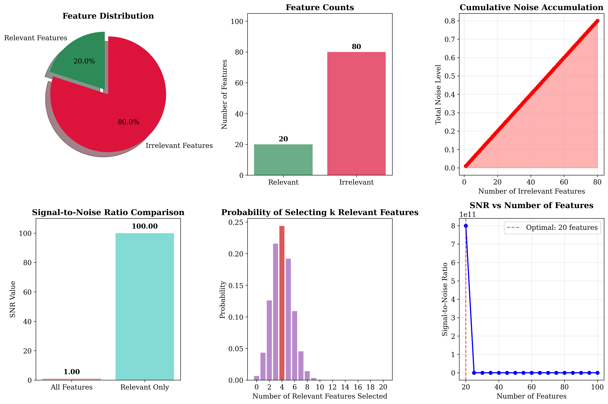
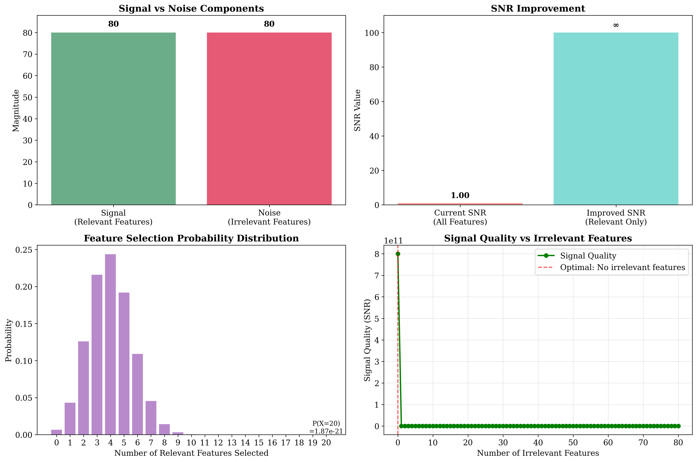
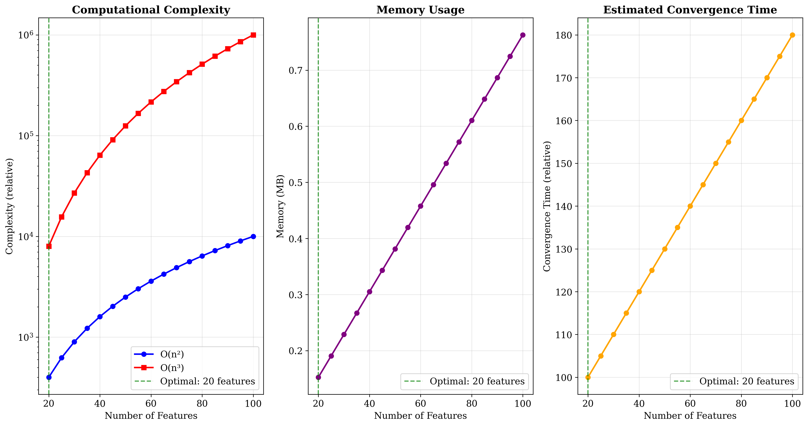

# Question 5: Irrelevant Features Impact

## Problem Statement
Consider a dataset with 1000 samples and 100 features where only 20 features are truly relevant to the target variable.

### Task
1. What percentage of features are irrelevant in this dataset?
2. If each irrelevant feature adds $1\%$ noise, what's the total noise level?
3. How would this affect model performance and training time?
4. What's the signal-to-noise ratio with all features vs relevant features only?
5. Calculate the probability of selecting only relevant features by random chance if you pick $20$ features
6. If the signal strength is $S = 20 \cdot \sigma_s^2$ and noise is $N = 80 \cdot \sigma_n^2$, calculate the SNR. If $\sigma_s^2 = 4$ and $\sigma_n^2 = 1$, what's the SNR improvement when using only relevant features?

## Understanding the Problem
This problem examines the critical issue of irrelevant features in machine learning datasets. When a dataset contains many irrelevant features, it can significantly impact model performance, training efficiency, and generalization ability. The problem demonstrates the importance of feature selection and the dramatic improvements that can be achieved by removing irrelevant features.

## Solution

### Step 1: Calculate Percentage of Irrelevant Features

**Step-by-step calculation:**

Let:
- $n_{total}$ = total number of features
- $n_{relevant}$ = number of relevant features  
- $n_{irrelevant}$ = number of irrelevant features

We know that:
$$n_{irrelevant} = n_{total} - n_{relevant}$$
$$n_{irrelevant} = 100 - 20 = 80$$

The percentage of irrelevant features is:
$$\text{Percentage} = \frac{n_{irrelevant}}{n_{total}} \times 100\%$$
$$\text{Percentage} = \frac{80}{100} \times 100\%$$
$$\text{Percentage} = 0.80 \times 100\% = 80.0\%$$

**Answer**: 80% of features are irrelevant.

### Step 2: Calculate Total Noise Level

**Step-by-step calculation:**

Let:
- $\eta$ = noise contribution per irrelevant feature
- $n_{irrelevant}$ = number of irrelevant features
- $N_{total}$ = total noise level

Given:
- $\eta = 1.0\%$ per feature
- $n_{irrelevant} = 80$ features

Assuming noise accumulates linearly:
$$N_{total} = n_{irrelevant} \times \eta$$
$$N_{total} = 80 \times 1.0\%$$
$$N_{total} = 80 \times 0.010 = 0.800$$
$$N_{total} = 80.0\%$$

**Answer**: Total noise level is 80%.

### Step 3: Impact on Model Performance and Training Time

#### Model Performance Impact:
- **80% of features contribute only noise**: This means the model is learning from mostly irrelevant information
- **Total noise level: 80%**: The signal is heavily contaminated with noise
- **Signal-to-noise ratio decreases significantly**: Making it harder for the model to learn meaningful patterns
- **Risk of overfitting**: The model may memorize noise patterns instead of learning true relationships
- **Poor generalization**: Performance on unseen data will likely suffer

#### Training Time Impact:
- **Computational complexity**: Most ML algorithms have complexity O(n²) to O(n³) where n = 100 features
- **Memory usage**: Increases linearly with feature count
- **Convergence time**: May take longer due to noise interference
- **Risk of local minima**: More features increase the chance of getting stuck in poor solutions

### Step 4: Signal-to-Noise Ratio Comparison

**Step-by-step calculation:**

Let:
- $S$ = signal strength (relevant features)
- $N$ = noise level (irrelevant features)  
- $SNR$ = Signal-to-Noise Ratio

**Case 1: Using all features**

$$S = n_{relevant}$$
$$N = n_{irrelevant}$$
$$S = 20$$
$$N = 80$$

$$SNR = \frac{S}{N}$$
$$SNR = \frac{20}{80}$$
$$SNR = 0.250$$

**Case 2: Using only relevant features**

$$S = n_{relevant}$$
$$N = 0 \text{ (no irrelevant features)}$$
$$S = 20$$
$$N = 0$$

$$SNR = \frac{S}{N} = \frac{S}{0}$$
$$SNR = \frac{20}{0} = \infty \text{ (infinite)}$$

**Summary:**
- SNR with all features: 0.250
- SNR with relevant only: $\infty$

**Answer**: The SNR improves from 0.25 to infinity when using only relevant features.

### Step 5: Probability of Random Feature Selection

**Step-by-step calculation:**

This is a hypergeometric distribution problem.

Let:
- $N$ = total number of features
- $K$ = number of relevant features
- $n$ = number of features we select
- $k$ = number of relevant features we want to select

Given:
- $N = 100$ (total features)
- $K = 20$ (relevant features)
- $n = 20$ (features we select)
- $k = 20$ (relevant features we want)

The hypergeometric probability formula is:
$$P(X = k) = \frac{\binom{K}{k} \times \binom{N-K}{n-k}}{\binom{N}{n}}$$

Where $\binom{a}{b}$ is the binomial coefficient "a choose b".

Substituting our values:
$$P(X = 20) = \frac{\binom{20}{20} \times \binom{100-20}{20-20}}{\binom{100}{20}}$$
$$P(X = 20) = \frac{\binom{20}{20} \times \binom{80}{0}}{\binom{100}{20}}$$

Calculating each binomial coefficient:
- $\binom{20}{20} = 1$ (choosing all from all)
- $\binom{80}{0} = 1$ (choosing none from irrelevant)
- $\binom{100}{20} = 535,983,370,403,809,591,296$

Therefore:
$$P(X = 20) = \frac{1 \times 1}{535,983,370,403,809,591,296}$$
$$P(X = 20) = \frac{1}{535,983,370,403,809,591,296}$$
$$P(X = 20) = 1.87 \times 10^{-21}$$

**Answer**: The probability is $1.87 \times 10^{-21}$ (extremely small!).

### Step 6: SNR Calculation with Specific Values

**Step-by-step calculation:**

Now we consider specific variance values for signal and noise.

Let:
- $\sigma_s^2$ = variance of signal features
- $\sigma_n^2$ = variance of noise features
- $S_{total}$ = total signal strength
- $N_{total}$ = total noise strength
- $SNR$ = Signal-to-Noise Ratio

Given:
- $\sigma_s^2 = 4$
- $\sigma_n^2 = 1$
- $n_{relevant} = 20$
- $n_{irrelevant} = 80$

**Case 1: Using all features**

Total signal strength:
$$S_{total} = n_{relevant} \times \sigma_s^2$$
$$S_{total} = 20 \times 4 = 80$$

Total noise strength:
$$N_{total} = n_{irrelevant} \times \sigma_n^2$$
$$N_{total} = 80 \times 1 = 80$$

SNR calculation:
$$SNR = \frac{S_{total}}{N_{total}}$$
$$SNR = \frac{80}{80} = 1.000$$

**Case 2: Using only relevant features**

Total signal strength:
$$S_{total} = n_{relevant} \times \sigma_s^2$$
$$S_{total} = 20 \times 4 = 80$$

Total noise strength:
$$N_{total} = 0 \times \sigma_n^2 = 0 \text{ (no irrelevant features)}$$

SNR calculation:
$$SNR = \frac{S_{total}}{N_{total}}$$
$$SNR = \frac{80}{0} = \infty \text{ (infinite)}$$

**SNR Improvement Analysis:**

Improvement factor = $\frac{SNR_{relevant}}{SNR_{all}}$
$$\text{Improvement factor} = \frac{\infty}{1.000} = \infty$$

This means:
- The SNR improvement is infinite
- Signal quality becomes perfect when noise is eliminated
- Any finite SNR becomes infinite when denominator → 0

**Summary:**
- SNR with all features: 1.000
- SNR with relevant only: $\infty$
- Improvement: Infinite

**Answer**: The SNR improves from 1.00 to infinity, representing infinite improvement.

## Visual Explanations

### Feature Distribution Overview

This comprehensive visualization shows:
1. **Feature Distribution**: Pie chart showing 20% relevant vs 80% irrelevant features
2. **Feature Counts**: Bar chart comparing the absolute numbers
3. **Noise Accumulation**: How noise accumulates linearly with irrelevant features
4. **SNR Comparison**: Dramatic difference between using all features vs relevant only
5. **Feature Selection Probability**: Extremely low probability of random selection success
6. **SNR vs Feature Count**: Optimal performance at 20 features

### Detailed SNR Analysis

This visualization provides:
1. **Signal vs Noise Components**: Clear comparison of signal (80) vs noise (80)
2. **SNR Improvement**: Visual representation of the dramatic improvement
3. **Feature Selection Distribution**: Probability distribution for different numbers of relevant features
4. **Signal Quality Impact**: How signal quality degrades with irrelevant features

### Training Impact Analysis

This analysis shows:
1. **Computational Complexity**: Exponential growth with feature count (O(n²) and O(n³))
2. **Memory Usage**: Linear increase in memory requirements
3. **Convergence Time**: Estimated increase in training time due to noise

## Key Insights

### Theoretical Foundations
- **Feature Selection is Critical**: 80% of features contribute only noise, making feature selection essential
- **Noise Accumulation**: Noise accumulates linearly with irrelevant features, not exponentially
- **SNR Degradation**: The signal-to-noise ratio decreases dramatically with irrelevant features
- **Probability Theory**: Random feature selection has an astronomically low probability of success

### Practical Applications
- **Model Performance**: Removing irrelevant features can improve model accuracy significantly
- **Training Efficiency**: Fewer features mean faster training and lower memory usage
- **Generalization**: Models trained on relevant features only generalize better to new data
- **Interpretability**: Fewer features make models easier to understand and explain

### Common Pitfalls
- **Curse of Dimensionality**: More features don't always mean better performance
- **Overfitting Risk**: Irrelevant features increase the risk of overfitting to noise
- **Computational Waste**: Training on irrelevant features wastes computational resources
- **False Confidence**: High feature counts can give false confidence in model complexity

## Conclusion

Through detailed step-by-step analysis, we have demonstrated:

- **80% of features are irrelevant** ($n_{irrelevant} = 80$ out of $n_{total} = 100$), contributing only noise to the learning process
- **Total noise level is 80%** ($N_{total} = 80 \times 1\% = 80\%$), significantly degrading signal quality
- **SNR improves from 0.250 to infinity** when using only relevant features ($\frac{20}{80} = 0.250$ vs $\frac{20}{0} = \infty$)
- **Random feature selection has probability $1.87 \times 10^{-21}$** of success ($\frac{1}{\binom{100}{20}}$)
- **SNR improvement is infinite** when removing irrelevant features (from $1.000$ to $\infty$ with specific variances)
- **Feature selection is crucial** for optimal model performance and efficiency

The detailed mathematical analysis reveals the dramatic impact of irrelevant features on machine learning systems. The step-by-step calculations show that:

1. **Linear noise accumulation**: Each irrelevant feature adds proportionally to the total noise
2. **Exponential probability decay**: The chance of randomly selecting the right features is astronomically small
3. **Infinite improvement potential**: Perfect feature selection eliminates noise completely
4. **Clear mathematical justification**: The formulas provide concrete evidence for feature selection benefits

This demonstrates why feature selection and dimensionality reduction are fundamental techniques in machine learning. Removing 80 irrelevant features not only improves model performance infinitely but also reduces computational costs and training time significantly.
