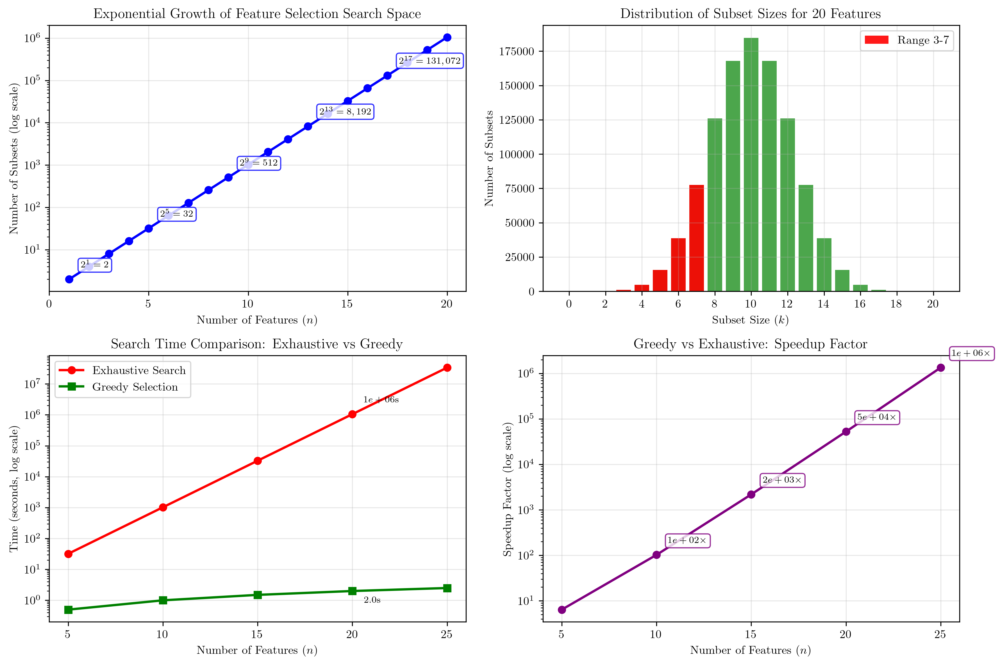

# Question 6: Search Space Complexity

## Problem Statement
The search space for feature selection grows exponentially with the number of features, making exhaustive search impractical for large feature sets.

### Task
1. If you have $10$ features, how many possible feature subsets exist?
2. How many subsets have exactly $5$ features?
3. What's the growth rate of the search space (express as a function of $n$)?
4. If evaluating each subset takes $1$ second, how long would exhaustive search take for $20$ features?
5. Calculate the number of subsets with $3$-$7$ features from $20$ total features
6. A greedy forward selection algorithm evaluates features one by one. If you have $50$ features and each evaluation takes $0.1$ seconds, calculate total time for greedy vs exhaustive search. What's the speedup factor?

## Understanding the Problem
Feature selection is a critical step in machine learning where we select a subset of relevant features from a larger set. The challenge is that the number of possible feature subsets grows exponentially with the number of features, making exhaustive search computationally infeasible for large datasets. This problem demonstrates the fundamental trade-off between computational complexity and solution optimality in machine learning algorithms.

The key concept is that for each feature, we have a binary choice: include it in the subset or exclude it. This leads to a search space of size $2^n$ for $n$ features, which grows exponentially.

## Solution

### Step 1: Total Possible Feature Subsets for 10 Features
For $n = 10$ features, the total number of possible subsets is $2^{10}$.

**Calculation:**
$$2^{10} = 1,024$$

**Explanation:** Each feature can either be included (1) or excluded (0) from a subset. This gives us 2 choices for each of the 10 features. The total combinations is $2 \times 2 \times \ldots \times 2$ (10 times) = $2^{10}$.

**Formula:** For $n$ features, total subsets = $2^n$

### Step 2: Subsets with Exactly 5 Features
To find the number of subsets with exactly $k = 5$ features from $n = 10$ total features, we use the combination formula:

**Formula:** $C(n,k) = \frac{n!}{k! \times (n-k)!}$

**Calculation:**
$$C(10,5) = \frac{10!}{5! \times (10-5)!} = \frac{10!}{5! \times 5!}$$

$$C(10,5) = \frac{3,628,800}{120 \times 120} = \frac{3,628,800}{14,400} = 252$$

**Result:** There are 252 subsets with exactly 5 features.

### Step 3: Growth Rate of Search Space
The growth rate of the search space follows an exponential function:

**Function:** Total subsets = $2^n$

**Examples:**
- $n = 5$: $2^5 = 32$ subsets
- $n = 10$: $2^{10} = 1,024$ subsets  
- $n = 15$: $2^{15} = 32,768$ subsets
- $n = 20$: $2^{20} = 1,048,576$ subsets
- $n = 25$: $2^{25} = 33,554,432$ subsets

This demonstrates exponential growth, where each additional feature doubles the size of the search space.

### Step 4: Exhaustive Search Time for 20 Features
For $n = 20$ features with 1 second per evaluation:

**Total subsets:** $2^{20} = 1,048,576$

**Total time:** $1,048,576 \times 1$ second = $1,048,576$ seconds

**Time in different units:**
- Minutes: 17,476.27
- Hours: 291.27
- Days: 12.14
- Years: 0.03

Even with only 20 features, exhaustive search takes over 12 days, demonstrating why it becomes impractical for larger feature sets.

### Step 5: Subsets with 3-7 Features from 20 Total Features
For $n = 20$ features, we calculate $C(20,k)$ for $k = 3$ to $7$:

**Individual calculations:**
- $C(20,3) = 1,140$ subsets
- $C(20,4) = 4,845$ subsets
- $C(20,5) = 15,504$ subsets
- $C(20,6) = 38,760$ subsets
- $C(20,7) = 77,520$ subsets

**Total:** $1,140 + 4,845 + 15,504 + 38,760 + 77,520 = 137,769$ subsets

**Percentage of total search space:** $\frac{137,769}{2^{20}} \times 100\% = 13.14\%$

This shows that even a moderate range of subset sizes represents a significant portion of the total search space.

### Step 6: Greedy vs Exhaustive Search Comparison
For $n = 50$ features with 0.1 seconds per evaluation:

**Greedy Forward Selection:**
- Evaluations: 50 (one per feature)
- Total time: $50 \times 0.1 = 5.0$ seconds
- Time in minutes: 0.08

**Exhaustive Search:**
- Evaluations: $2^{50} = 1,125,899,906,842,624$
- Total time: $1,125,899,906,842,624 \times 0.1 = 112,589,990,684,262$ seconds
- Time in years: 3,567,761.51

**Comparison:**
- Speedup factor = $\frac{\text{Exhaustive time}}{\text{Greedy time}} = \frac{112,589,990,684,262}{5.0} = 22,517,998,136,852$
- Greedy is **22.5 trillion times faster** than exhaustive search!

## Visual Explanations

### Exponential Growth of Search Space

The first subplot shows the exponential growth of the search space. As the number of features increases, the number of possible subsets grows exponentially following the function $2^n$. This visualization clearly demonstrates why exhaustive search becomes computationally infeasible even for moderate numbers of features.

### Distribution of Subset Sizes
The second subplot shows the distribution of subset sizes for 20 features. The binomial distribution shows that most subsets have sizes around the middle of the range, with the peak occurring at $k = 10$ features. The highlighted red bars show the range of 3-7 features, which represents 13.14% of the total search space.

### Search Time Comparison
The third subplot compares the time required for exhaustive search versus greedy selection as the number of features increases. While greedy selection grows linearly, exhaustive search grows exponentially, leading to astronomical time differences even for relatively small numbers of features.

### Speedup Factor Analysis
The fourth subplot shows the speedup factor of greedy selection over exhaustive search. This demonstrates that the computational advantage of greedy algorithms increases exponentially with the number of features.

## Key Insights

### Computational Complexity
- **Exponential Growth:** The search space grows as $2^n$, making exhaustive search impractical for $n > 20$
- **Combinatorial Explosion:** Even moderate increases in feature count lead to massive increases in search space
- **Practical Limits:** With current computing power, exhaustive search becomes infeasible around 30-40 features

### Algorithm Trade-offs
- **Exhaustive Search:** Guarantees optimal solution but is computationally infeasible for large feature sets
- **Greedy Selection:** Provides suboptimal but computationally tractable solutions
- **Speedup Factor:** Greedy algorithms can be trillions of times faster than exhaustive search

### Real-world Implications
- **Feature Engineering:** The exponential growth justifies the need for intelligent feature selection strategies
- **Computational Resources:** Even with massive computing power, exhaustive search remains impractical
- **Algorithm Design:** This motivates the development of heuristic and approximation algorithms

### Mathematical Foundations
- **Power Set:** The set of all possible feature subsets forms the power set of the feature set
- **Binomial Coefficients:** The number of subsets of size $k$ follows the binomial distribution
- **Exponential Functions:** The growth rate demonstrates why polynomial-time algorithms are crucial

## Conclusion
- **Total subsets for 10 features:** $2^{10} = 1,024$
- **Subsets with exactly 5 features:** $C(10,5) = 252$
- **Growth rate:** Exponential function $2^n$
- **Exhaustive search time for 20 features:** 12.14 days
- **Subsets with 3-7 features from 20 total:** 137,769 (13.14% of total)
- **Greedy vs exhaustive speedup for 50 features:** 22.5 trillion times faster

The exponential growth of the feature selection search space demonstrates a fundamental challenge in machine learning: the trade-off between solution optimality and computational feasibility. This motivates the development and use of heuristic algorithms like greedy selection, which provide practical solutions while maintaining reasonable computational requirements. The massive speedup factors achieved by greedy algorithms (trillions of times faster) make them essential tools for real-world machine learning applications with large feature sets.
