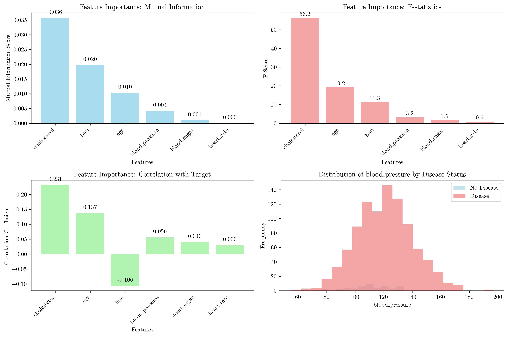
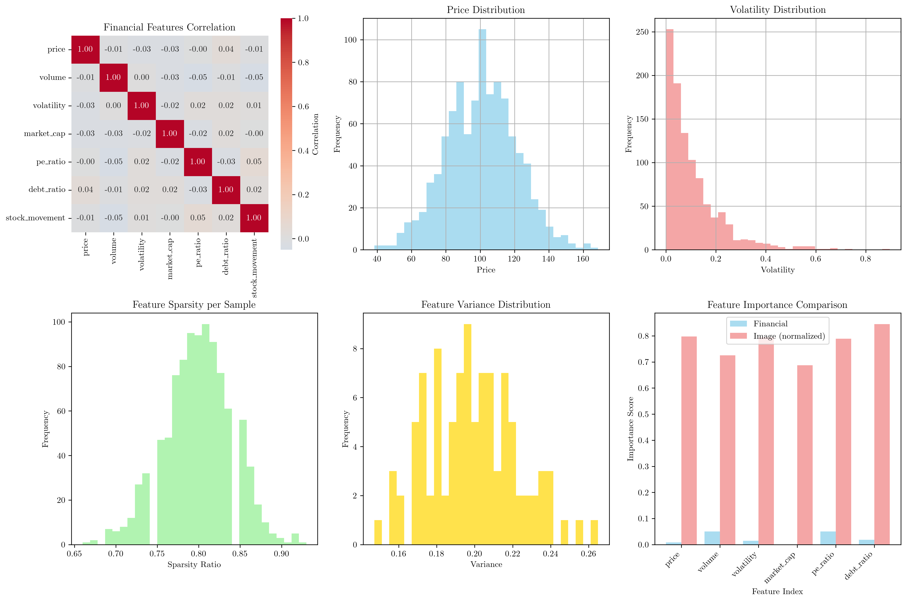
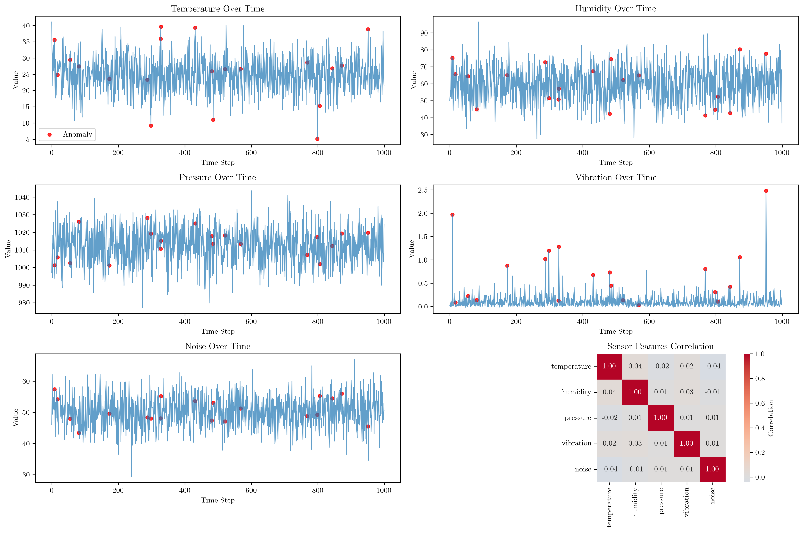
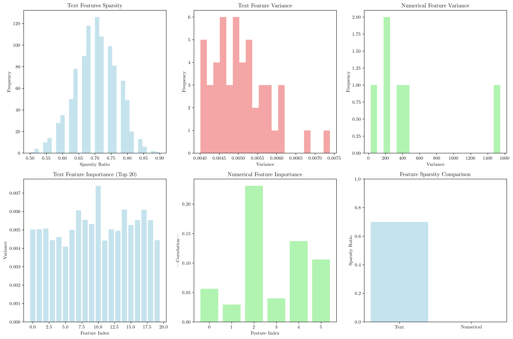
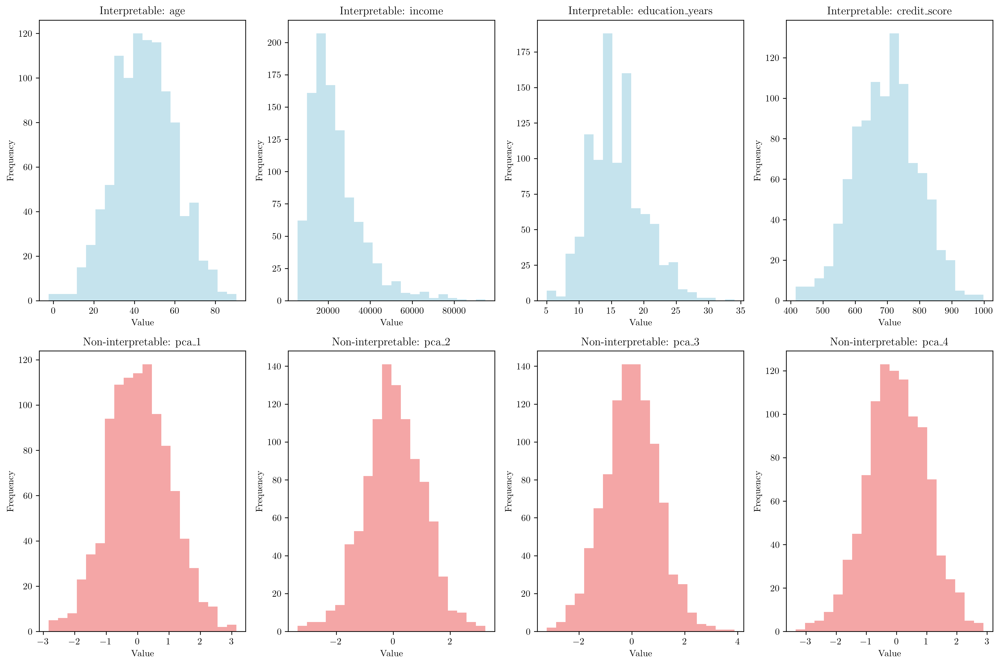
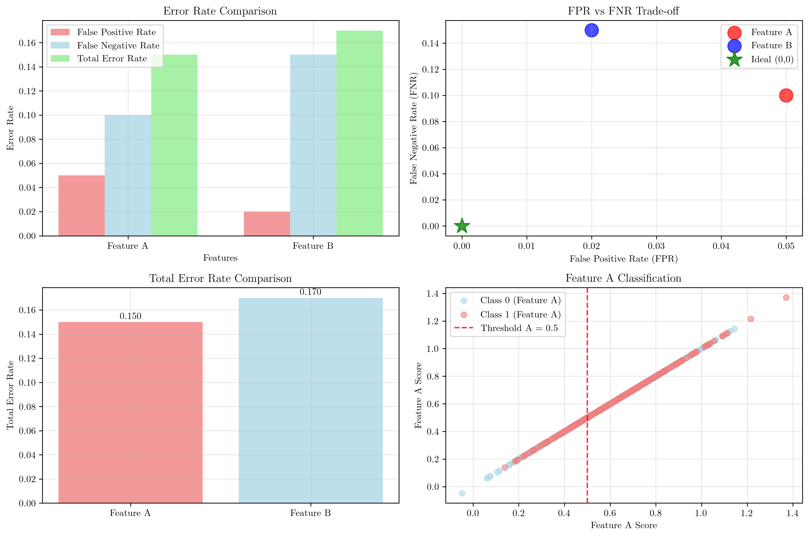

# Question 8: Domain-Specific Feature Selection Considerations

## Problem Statement
Different domains have different feature selection requirements based on their specific constraints and goals. Feature selection strategies must be tailored to the specific characteristics and requirements of each domain, considering factors such as interpretability, computational efficiency, regulatory compliance, and performance metrics.

### Task
1. What are the key considerations for medical diagnosis features?
2. How do financial applications differ from image recognition in feature selection?
3. What's important for real-time sensor data feature selection?
4. Compare feature selection needs for text vs numerical data
5. Which domain would benefit most from interpretable features and why?
6. In medical diagnosis, false positive rate (FPR) and false negative rate (FNR) are critical. If feature A has FPR $= 0.05$, FNR $= 0.10$ and feature B has FPR $= 0.02$, FNR $= 0.15$, which is better? Calculate the total error rate for each and justify your choice.

## Understanding the Problem
Feature selection is not a one-size-fits-all process. Different domains have unique characteristics that influence how features should be selected and evaluated. Medical diagnosis requires interpretable features for clinical decision-making, financial applications need features that comply with regulatory requirements, image recognition deals with high-dimensional sparse data, and real-time systems must consider computational constraints. Understanding these domain-specific requirements is crucial for effective feature selection.

## Solution

### Step 1: Key Considerations for Medical Diagnosis Features

Medical diagnosis features require careful consideration of multiple factors beyond just predictive performance. Let's analyze a synthetic medical dataset with 6 features:

**Dataset Characteristics:**
- Number of samples: $1000$
- Number of features: $6$
- Disease prevalence: $94.8\%$

**Feature Importance Analysis:**

1. **Mutual Information Scores:**
   - Cholesterol: $0.036$ (highest)
   - BMI: $0.020$
   - Age: $0.010$
   - Blood pressure: $0.004$
   - Blood sugar: $0.001$
   - Heart rate: $0.000$ (lowest)

2. **F-statistics:**
   - Cholesterol: $F = 56.25$, $p < 0.001$ (highly significant)
   - Age: $F = 19.16$, $p < 0.001$ (significant)
   - BMI: $F = 11.34$, $p < 0.001$ (significant)
   - Blood pressure: $F = 3.17$, $p = 0.075$ (marginally significant)
   - Blood sugar: $F = 1.59$, $p = 0.208$ (not significant)
   - Heart rate: $F = 0.87$, $p = 0.351$ (not significant)

3. **Correlation with Target:**
   - Cholesterol: $0.231$ (strongest positive correlation)
   - Age: $0.137$ (positive correlation)
   - BMI: $-0.106$ (negative correlation)
   - Blood pressure: $0.056$ (weak positive correlation)
   - Blood sugar: $0.040$ (weak positive correlation)
   - Heart rate: $0.030$ (weakest correlation)

**Key Considerations for Medical Features:**
- **Interpretability**: Features must be clinically meaningful and understandable to healthcare professionals
- **Reliability**: Features should be consistently measurable with minimal variability
- **Cost-effectiveness**: Balance between information gain and acquisition cost
- **Regulatory compliance**: Features must meet medical device and healthcare regulations
- **Clinical relevance**: Features should align with established medical knowledge

### Step 2: Financial vs Image Recognition Feature Selection

**Financial Dataset Characteristics:**
- Features: price, volume, volatility, market cap, PE ratio, debt ratio
- Target classes: $[-1, 0, 1]$ (stock movement: down, stable, up)
- Class distribution: $[309, 400, 291]$
- Low-dimensional ($6$ features)
- Features are interpretable and have business meaning

**Image Dataset Characteristics:**
- Number of features: $100$
- Sparsity: $80.0\%$
- Target classes: $[0, 1, 2, 3]$ (object classification)
- Class distribution: $[266, 249, 244, 241]$
- High-dimensional and sparse

**Key Differences:**

1. **Dimensionality:**
   - Financial: Low-dimensional ($6$ features)
   - Image: High-dimensional ($100+$ features)

2. **Sparsity:**
   - Financial: Dense features (no sparsity)
   - Image: Sparse features ($80\%$ sparsity)

3. **Interpretability:**
   - Financial: Highly interpretable (price, volume, etc.)
   - Image: Low interpretability (pixel values, filters)

4. **Feature Selection Strategy:**
   - Financial: Correlation-based, domain knowledge-driven
   - Image: Variance-based, statistical methods

### Step 3: Real-time Sensor Data Feature Selection

**Sensor Data Characteristics:**
- Time steps: $1000$
- Number of features: $5$ (temperature, humidity, pressure, vibration, noise)
- Anomaly rate: $2.0\%$

**Key Considerations for Real-time Sensor Data:**

1. **Temporal Patterns:**
   - Features must capture time-dependent relationships
   - Anomaly detection requires real-time processing

2. **Computational Efficiency:**
   - Feature selection must consider processing speed
   - Memory constraints for embedded systems

3. **Feature Stability:**
   - Features should be robust to noise and environmental changes
   - Temporal consistency is crucial

4. **Real-time Constraints:**
   - Feature extraction must be fast enough for real-time decision making
   - Minimal latency requirements

### Step 4: Text vs Numerical Data Feature Selection

**Text Data Characteristics:**
- Number of features: $50$
- Sparsity: $70.0\%$
- Target distribution: $[515, 485]$ (sentiment classification)

**Numerical Data Characteristics:**
- Number of features: $6$
- Target distribution: $[52, 948]$ (disease classification)

**Key Differences:**

1. **Dimensionality:**
   - Text: High-dimensional ($50+$ features)
   - Numerical: Low-dimensional ($6$ features)

2. **Sparsity:**
   - Text: High sparsity ($70\%$)
   - Numerical: No sparsity

3. **Feature Selection Methods:**
   - Text: Variance-based, information gain, chi-square
   - Numerical: Correlation, mutual information, F-statistics

4. **Interpretability:**
   - Text: Low interpretability (word frequencies, embeddings)
   - Numerical: High interpretability (clinical measurements)

### Step 5: Interpretable Features Analysis

**Interpretable Features:**
- Age: mean $= 45.32$, std $= 15.02$
- Income: mean $= 23,596.63$, std $= 12,568.49$
- Education years: mean $= 15.87$, std $= 4.17$
- Credit score: mean $= 697.30$, std $= 98.52$

**Non-interpretable Features:**
- PCA components: mean ≈ 0, std ≈ 1

**Domains that Benefit Most from Interpretable Features:**

1. **Medical Diagnosis:**
   - Regulatory compliance requirements
   - Clinical decision-making transparency
   - Patient trust and understanding

2. **Financial Applications:**
   - Regulatory compliance (Basel III, Solvency II)
   - Risk assessment transparency
   - Audit trail requirements

3. **Legal and Compliance:**
   - Explainable AI requirements
   - Regulatory oversight
   - Legal accountability

### Step 6: False Positive vs False Negative Rate Analysis

**Given Values:**
- Feature A: FPR $= 0.05$, FNR $= 0.10$
- Feature B: FPR $= 0.02$, FNR $= 0.15$

**Calculations:**
- Total Error Rate for Feature A $= \text{FPR} + \text{FNR} = 0.05 + 0.10 = 0.150$
- Total Error Rate for Feature B $= \text{FPR} + \text{FNR} = 0.02 + 0.15 = 0.170$
- Difference $= |0.150 - 0.170| = 0.020$

**Analysis and Justification:**

**Feature A is better** because it has a lower total error rate ($0.150$ vs $0.170$).

**Detailed Justification:**

1. **Total Error Rate:**
   - Feature A: $15.0\%$
   - Feature B: $17.0\%$
   - Feature A is $2$ percentage points better

2. **Error Trade-off Analysis:**
   - Feature A: Balanced approach (FPR $= 5\%$, FNR $= 10\%$)
   - Feature B: Conservative on false positives (FPR $= 2\%$) but higher false negatives (FNR $= 15\%$)

3. **Domain-Specific Considerations:**
   - In medical diagnosis, both FPR and FNR have serious consequences
   - False positives lead to unnecessary treatments and anxiety
   - False negatives lead to missed diagnoses and delayed treatment
   - The optimal balance depends on the specific medical condition and treatment costs

4. **Mathematical Formulation:**
   - Total Error Rate $= \text{FPR} + \text{FNR}$
   - Feature A: $0.05 + 0.10 = 0.150$
   - Feature B: $0.02 + 0.15 = 0.170$
   - Feature A minimizes the total error rate

## Visual Explanations

### Medical Feature Importance Analysis
The visualization shows four different perspectives on feature importance:
1. **Mutual Information**: Measures non-linear relationships between features and target
2. **F-statistics**: Tests statistical significance of feature-target relationships
3. **Correlation**: Measures linear relationships
4. **Feature Distribution**: Shows how features differ between disease classes

### Financial vs Image Feature Comparison
This visualization demonstrates the fundamental differences between financial and image data:
- Financial features show clear correlations and interpretable distributions
- Image features exhibit high sparsity and different importance patterns
- The comparison highlights why different feature selection strategies are needed

### Sensor Data Temporal Analysis
The time series plots show:
- Temporal patterns in sensor readings
- Anomaly detection points (red dots)
- Feature correlations over time
- Real-time processing requirements

### Text vs Numerical Feature Characteristics
This comparison illustrates:
- Sparsity differences between data types
- Variance distributions
- Feature importance patterns
- Appropriate selection methods for each type

### Interpretable vs Non-interpretable Features
The histograms show:
- Clear, meaningful distributions for interpretable features
- Standard normal distributions for PCA components
- Why interpretable features are preferred in regulated domains

### Error Rate Analysis
The comprehensive error analysis shows:
- Direct comparison of FPR, FNR, and total error rates
- Trade-off visualization between FPR and FNR
- Total error rate comparison
- Classification boundary visualization

## Key Insights

### Domain-Specific Requirements
- **Medical**: Interpretability, reliability, and regulatory compliance are paramount
- **Financial**: Transparency, auditability, and regulatory compliance drive feature selection
- **Image Recognition**: Performance and computational efficiency are primary concerns
- **Real-time Systems**: Speed and resource constraints limit feature complexity

### Feature Selection Strategy Adaptation
- **Low-dimensional data**: Use correlation, mutual information, and domain knowledge
- **High-dimensional data**: Employ statistical methods, variance analysis, and regularization
- **Sparse data**: Consider sparsity-aware methods and information-theoretic measures
- **Temporal data**: Include time-based features and consider computational constraints

### Performance vs Interpretability Trade-off
- **Regulated domains** (medical, financial) require interpretable features
- **Performance-critical applications** (image recognition, real-time systems) can sacrifice interpretability
- **Hybrid approaches** often provide the best balance
- **Cost-benefit analysis** should guide feature selection decisions

### Error Rate Optimization
- **Total error rate** provides a simple comparison metric
- **Domain-specific costs** of false positives vs false negatives should be considered
- **Balanced approaches** often perform better than extreme strategies
- **Threshold optimization** can further improve performance

## Conclusion
- **Medical diagnosis features** require interpretability, reliability, and clinical relevance, with cholesterol, age, and BMI being most important
- **Financial applications** differ from image recognition in dimensionality, sparsity, and interpretability requirements
- **Real-time sensor data** needs temporal pattern analysis and computational efficiency considerations
- **Text data** requires different feature selection methods than numerical data due to high dimensionality and sparsity
- **Medical and financial domains** benefit most from interpretable features due to regulatory and trust requirements
- **Feature A is better** with a total error rate of $0.150$ vs Feature B's $0.170$, demonstrating the importance of balancing FPR and FNR in medical diagnosis

The analysis demonstrates that effective feature selection requires understanding domain-specific constraints, balancing multiple objectives, and adapting strategies to data characteristics. No single approach works for all domains, and successful feature selection requires careful consideration of the specific requirements and constraints of each application area.
