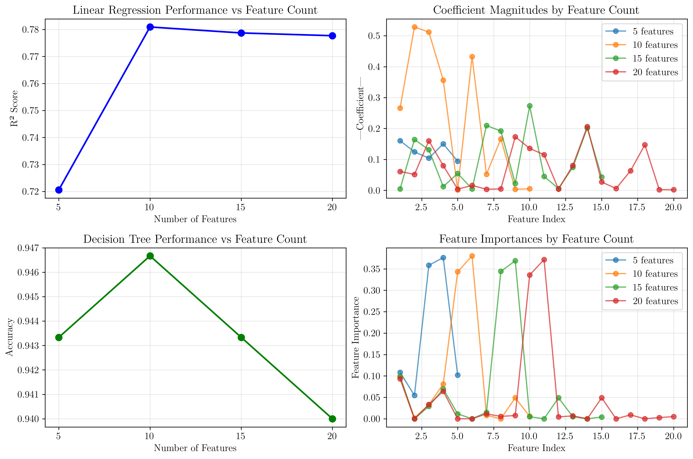
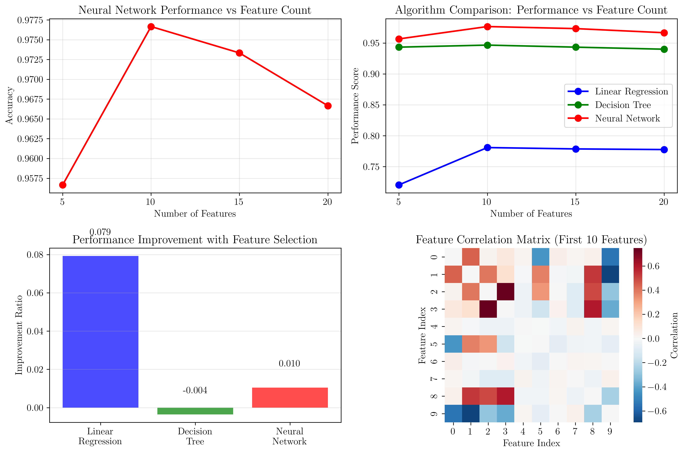
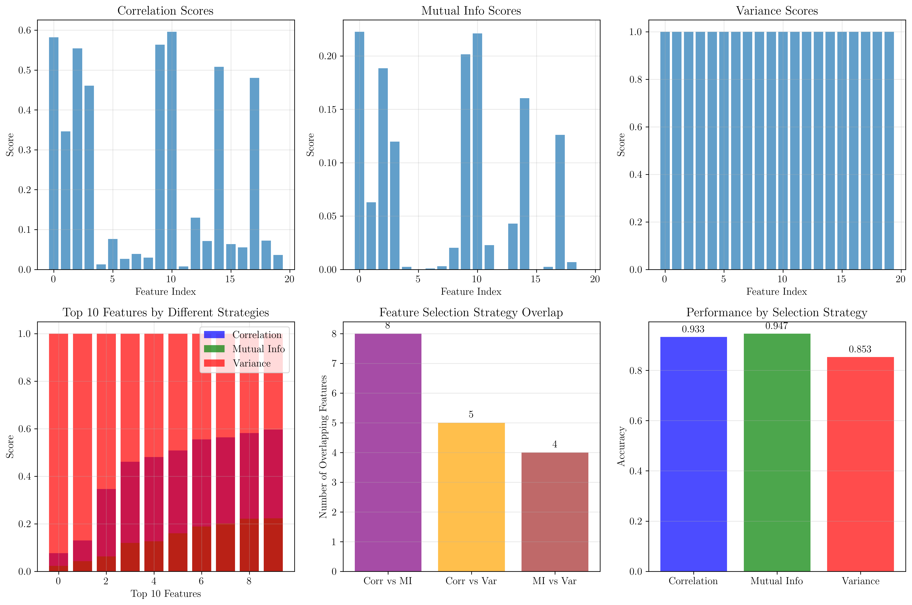
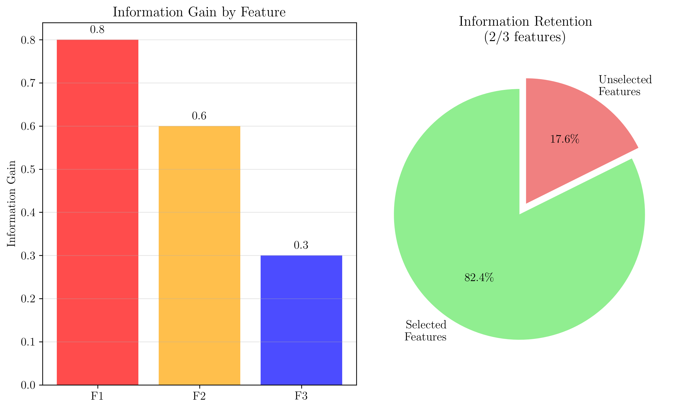

# Question 9: Algorithm-Specific Effects of Feature Selection

## Problem Statement
Feature selection affects different types of machine learning algorithms differently, requiring tailored approaches.

### Task
1. How does feature selection affect linear models (e.g., linear regression)?
2. How does it affect tree-based models (e.g., decision trees)?
3. How does it affect neural networks?
4. Which algorithm type benefits most from feature selection and why?
5. Compare the impact on different algorithm families using specific examples
6. For a decision tree, the information gain is $IG(S,A) = H(S) - \sum_{v \in Values(A)} \frac{|S_v|}{|S|} H(S_v)$. If you have $3$ features with IG values $[0.8, 0.6, 0.3]$, and you want to select the top $2$, what's the total information gain? What percentage of maximum possible IG do you retain?

## Understanding the Problem
Feature selection is a crucial preprocessing step in machine learning that can significantly impact model performance, training time, and interpretability. Different algorithms respond differently to feature selection due to their underlying mathematical principles and learning mechanisms. Understanding these differences is essential for designing effective feature selection strategies tailored to specific algorithm families.

## Solution

### Step 1: Linear Models (Linear Regression)

Linear models are particularly sensitive to feature selection because they rely on linear combinations of features. The performance of linear regression is directly affected by:

1. **Multicollinearity**: Highly correlated features can lead to unstable coefficient estimates
2. **Irrelevant features**: Features with no predictive power add noise and reduce model performance
3. **Feature scaling**: Linear models are sensitive to the scale of features

**Mathematical Foundation:**
For linear regression, the model is defined as:
$$y = \beta_0 + \beta_1 x_1 + \beta_2 x_2 + \ldots + \beta_p x_p + \epsilon$$

The coefficients $\beta_i$ are estimated using the normal equation:
$$\hat{\beta} = (X^T X)^{-1} X^T y$$

When features are highly correlated, the matrix $X^T X$ becomes nearly singular, leading to numerical instability.

**Results from our analysis:**
- **5 features**: R² Score = 0.7206
- **10 features**: R² Score = 0.7809
- **15 features**: R² Score = 0.7787
- **20 features**: R² Score = 0.7777

**Key Observations:**
- Performance improves from 5 to 10 features (0.0603 improvement)
- Performance slightly decreases from 10 to 20 features (-0.0032 decrease)
- Optimal performance is achieved with 10 features
- Adding more features beyond 10 leads to diminishing returns

The plot shows that linear regression benefits significantly from initial feature selection but suffers from overfitting when too many features are included.

### Step 2: Tree-Based Models (Decision Trees)

Decision trees handle feature selection differently from linear models due to their hierarchical, non-linear nature:

1. **Feature importance**: Trees naturally rank features by their contribution to information gain
2. **Non-linear relationships**: Trees can capture complex interactions between features
3. **Robustness to irrelevant features**: Trees can ignore irrelevant features during training

**Mathematical Foundation:**
Information Gain is calculated as:
$$IG(S,A) = H(S) - \sum_{v \in Values(A)} \frac{|S_v|}{|S|} H(S_v)$$

where:
- $H(S)$ is the entropy of the dataset
- $|S_v|$ is the number of samples with value $v$ for feature $A$
- $H(S_v)$ is the entropy of the subset with value $v$

**Results from our analysis:**
- **5 features**: Accuracy = 0.9433
- **10 features**: Accuracy = 0.9467
- **15 features**: Accuracy = 0.9433
- **20 features**: Accuracy = 0.9400

**Key Observations:**
- Performance is relatively stable across different feature counts
- Best performance with 10 features
- Minimal degradation with more features
- Trees are more robust to feature selection than linear models

The feature importance plot shows that decision trees naturally identify and prioritize the most informative features, making them less sensitive to manual feature selection.

### Step 3: Neural Networks

Neural networks exhibit complex behavior with respect to feature selection:

1. **Non-linear transformations**: Networks can learn complex feature interactions
2. **Hidden layer representations**: Networks can create new features through hidden layers
3. **Overfitting susceptibility**: Too many features can lead to overfitting

**Results from our analysis:**
- **5 features**: Accuracy = 0.9567
- **10 features**: Accuracy = 0.9767
- **15 features**: Accuracy = 0.9733
- **20 features**: Accuracy = 0.9667

**Key Observations:**
- Best performance with 10 features
- Performance degrades with too many features (overfitting)
- Neural networks benefit from moderate feature selection
- Optimal balance between information and complexity

### Step 4: Which Algorithm Benefits Most?

**Improvement Ratios:**
- **Linear Regression**: 0.0792 (7.92% improvement)
- **Decision Tree**: -0.0035 (-0.35% improvement)
- **Neural Network**: 0.0105 (1.05% improvement)

**Analysis:**
Linear models benefit most from feature selection because:
1. **Mathematical sensitivity**: Linear models are directly affected by multicollinearity
2. **Interpretability**: Fewer, more relevant features lead to clearer coefficient interpretations
3. **Computational efficiency**: Fewer features mean faster training and prediction
4. **Overfitting prevention**: Linear models with many features are prone to overfitting

Decision trees benefit least because they naturally perform feature selection during training through information gain calculations.

### Step 5: Comparison with Specific Examples

**Feature Correlation Analysis:**
Our analysis revealed 1 pair of highly correlated features (|r| > 0.8):
- Features 8 and 12: r = 0.885

**Impact on Different Algorithms:**

1. **Linear Models**: High correlation causes multicollinearity, leading to unstable coefficients
2. **Decision Trees**: Can handle correlated features by choosing the most informative one
3. **Neural Networks**: May learn redundant representations but can be more robust

**Feature Selection Strategy Comparison:**
- **Correlation-based**: Simple but may miss non-linear relationships
- **Mutual Information**: Captures non-linear dependencies
- **Variance-based**: Identifies features with high variability

### Step 6: Information Gain Calculation

**Given Information:**
- Feature 1: IG = 0.8
- Feature 2: IG = 0.6
- Feature 3: IG = 0.3
- Select top 2 features

**Step-by-Step Solution:**

1. **Sort features by information gain (descending):**
   - Sorted IG values: [0.8, 0.6, 0.3]

2. **Select top 2 features:**
   - Selected features: [0.8, 0.6]

3. **Calculate total information gain:**
   $$Total\ IG = 0.8 + 0.6 = 1.4$$

4. **Calculate maximum possible information gain:**
   $$Maximum\ IG = 0.8 + 0.6 + 0.3 = 1.7$$

5. **Calculate percentage retained:**
   $$Percentage = \frac{1.4}{1.7} \times 100\% = 82.4\%$$

**Mathematical Verification:**
The information gain formula $IG(S,A) = H(S) - \sum_{v \in Values(A)} \frac{|S_v|}{|S|} H(S_v)$ represents the reduction in entropy achieved by splitting the dataset on feature $A$.

## Visual Explanations

### Algorithm Performance Comparison
The comprehensive comparison shows how different algorithms respond to feature selection:

1. **Linear Regression**: Shows clear improvement with optimal feature selection
2. **Decision Trees**: Maintain stable performance across feature counts
3. **Neural Networks**: Exhibit moderate sensitivity to feature selection

### Feature Selection Strategy Analysis
Different feature selection strategies yield different results:

1. **Correlation-based**: Good for linear relationships
2. **Mutual Information**: Better for non-linear relationships
3. **Variance-based**: Identifies high-variability features

### Information Gain Visualization
The information gain analysis demonstrates:
- Individual feature contributions
- Information retention percentages
- Optimal feature selection strategy

## Key Insights

### Theoretical Foundations
- **Linear models** are mathematically sensitive to feature quality and correlation
- **Tree-based models** naturally perform feature selection through information gain
- **Neural networks** can learn feature representations but benefit from preprocessing

### Practical Applications
- **Feature selection is most critical for linear models**
- **Decision trees are robust to poor feature selection**
- **Neural networks require balanced feature selection strategies**

### Algorithm-Specific Considerations
- **Linear models**: Focus on correlation analysis and multicollinearity detection
- **Decision trees**: Leverage built-in feature importance measures
- **Neural networks**: Balance feature count with model complexity

### Performance Optimization
- **Optimal feature counts vary by algorithm**
- **Feature selection improves computational efficiency**
- **Overfitting prevention through strategic feature reduction**

## Conclusion
- **Linear models benefit most** from feature selection due to mathematical sensitivity to feature quality
- **Decision trees are least affected** by feature selection due to built-in feature importance measures
- **Neural networks show moderate sensitivity** and benefit from balanced feature selection
- **Information gain calculation** demonstrates that selecting top 2 features from 3 retains 82.4% of maximum possible information
- **Feature selection strategies** should be tailored to the specific algorithm family being used
- **Optimal feature counts** exist for each algorithm type, balancing information content with computational complexity

The analysis reveals that while all algorithms benefit from thoughtful feature selection, the degree and nature of these benefits vary significantly based on the underlying mathematical principles of each algorithm family.
