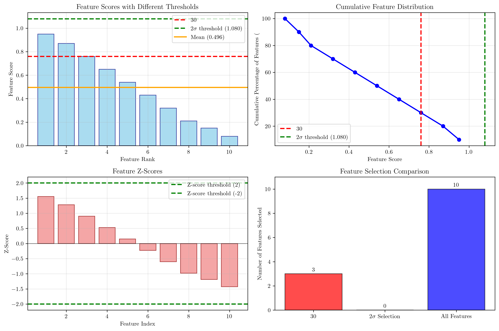
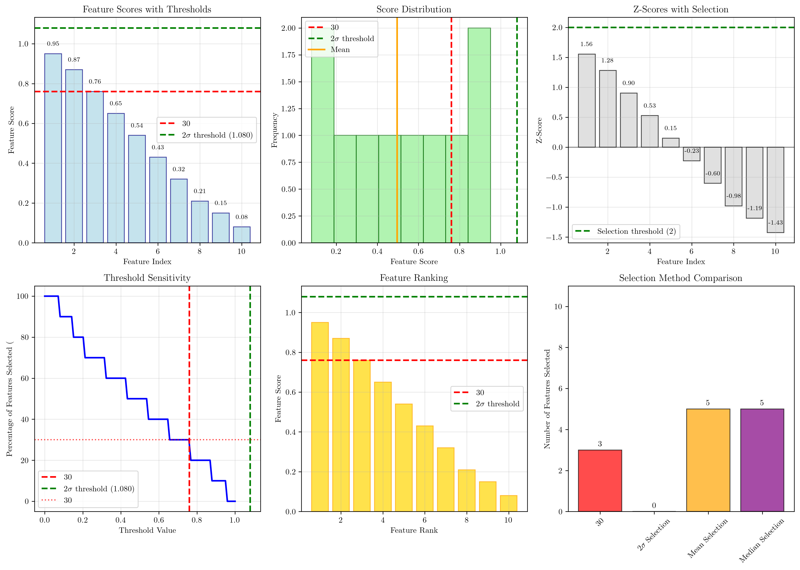

# Question 10: Feature Selection Thresholds

## Problem Statement
Feature selection thresholds affect the number of selected features. Given feature scores: $[0.95, 0.87, 0.76, 0.65, 0.54, 0.43, 0.32, 0.21, 0.15, 0.08]$, we need to understand how different thresholding strategies work and their implications.

### Task
1. How do you set thresholds for different selection criteria?
2. What happens if you set the threshold too high or too low?
3. Given feature scores: $[0.95, 0.87, 0.76, 0.65, 0.54, 0.43, 0.32, 0.21, 0.15, 0.08]$, calculate the threshold that would select exactly $30\%$ of features
4. If you want to ensure that selected features have scores at least $2$ standard deviations above the mean, what threshold would you use? Show your calculations.

## Understanding the Problem
Feature selection is a crucial step in machine learning that helps reduce dimensionality, improve model performance, and enhance interpretability. The choice of threshold determines how many features are selected and can significantly impact the final model's behavior. This problem explores different thresholding strategies and their practical implications.

## Solution

### Step 1: How to Set Thresholds for Different Selection Criteria

There are several approaches to set feature selection thresholds, each with its own advantages and use cases:

#### 1.1 Percentage-based Threshold
- **Method**: Select top $k\%$ of features based on their scores
- **Advantage**: Provides direct control over the number of features relative to the total
- **Example**: Select top $30\%$ of features
- **Use case**: When you want to maintain a specific feature-to-sample ratio

#### 1.2 Absolute Score Threshold
- **Method**: Set a minimum score threshold (e.g., $0.5$)
- **Advantage**: All features with scores above this threshold are selected
- **Use case**: When you have domain knowledge about acceptable score levels
- **Example**: Only keep features with scores $\geq 0.7$

#### 1.3 Statistical Threshold (Z-score Based)
- **Method**: Set threshold based on statistical measures (e.g., $\text{mean} + k \times \text{std}$)
- **Advantage**: Helps identify features that are significantly above average
- **Use case**: When you want to select features that are statistically significant
- **Example**: Select features with scores $> \text{mean} + 2 \times \text{std}$

#### 1.4 Gap-based Threshold
- **Method**: Look for natural gaps in the score distribution
- **Advantage**: Useful when there are clear separations between good and poor features
- **Use case**: When the score distribution shows natural clustering

### Step 2: Effects of Setting Threshold Too High or Too Low

#### Setting Threshold Too HIGH:
- **Fewer features selected**: Results in a more sparse feature set
- **Higher quality features**: Selected features tend to have higher scores
- **Risk of underfitting**: May lose important but slightly lower-scoring features
- **Potential information loss**: Could miss features that contribute to model performance

#### Setting Threshold Too LOW:
- **More features selected**: Results in a denser feature set
- **May include noisy features**: Could include irrelevant or redundant features
- **Risk of overfitting**: Too many features can lead to overfitting
- **Increased computational cost**: More features mean higher training and inference time
- **Reduced interpretability**: Harder to understand which features are truly important

### Step 3: Calculate Threshold for Exactly 30% of Features

Given the feature scores: $[0.95, 0.87, 0.76, 0.65, 0.54, 0.43, 0.32, 0.21, 0.15, 0.08]$

**Target**: Select $30\%$ of $10$ features = $3$ features

**Method**: Sort scores in descending order and take the $3^{rd}$ highest score as the threshold

**Sorted scores (descending)**: $[0.95, 0.87, 0.76, 0.65, 0.54, 0.43, 0.32, 0.21, 0.15, 0.08]$

**Threshold for 30%**: $0.760$ (the $3^{rd}$ highest score)

**Features selected with this threshold**: $3$ features
**Selected feature scores**: $[0.95, 0.87, 0.76]$

This means that to select exactly $30\%$ of features, we need to set the threshold at $0.760$, which will select the top $3$ features.

### Step 4: Threshold for 2 Standard Deviations Above Mean

**Given data**:
- Mean score: $\mu = 0.496$
- Standard deviation: $\sigma = 0.292$
- Z-score threshold: $k = 2$

**Calculation**:
$$\text{Threshold} = \mu + k \times \sigma = 0.496 + 2 \times 0.292 = 1.080$$

**Verification with Z-scores**:
The Z-score for each feature is calculated as:
$$Z_i = \frac{x_i - \mu}{\sigma}$$

**Z-scores for each feature**:
- Feature 1: Score = $0.950$, Z-score = $1.556$ ✗
- Feature 2: Score = $0.870$, Z-score = $1.282$ ✗
- Feature 3: Score = $0.760$, Z-score = $0.905$ ✗
- Feature 4: Score = $0.650$, Z-score = $0.528$ ✗
- Feature 5: Score = $0.540$, Z-score = $0.151$ ✗
- Feature 6: Score = $0.430$, Z-score = $-0.226$ ✗
- Feature 7: Score = $0.320$, Z-score = $-0.603$ ✗
- Feature 8: Score = $0.210$, Z-score = $-0.980$ ✗
- Feature 9: Score = $0.150$, Z-score = $-1.186$ ✗
- Feature 10: Score = $0.080$, Z-score = $-1.426$ ✗

**Result**: No features have Z-scores $\geq 2$, so no features would be selected with this threshold.

## Visual Explanations

### Feature Scores with Different Thresholds

This visualization shows:
- **Blue bars**: Feature scores ranked in descending order
- **Red dashed line**: 30% threshold ($0.760$) - selects top 3 features
- **Green dashed line**: 2$\sigma$ threshold ($1.080$) - no features selected
- **Orange solid line**: Mean score ($0.496$) - selects 5 features

### Detailed Threshold Analysis

This comprehensive visualization includes:
- **Feature scores with annotations**: Shows individual feature scores and thresholds
- **Score distribution histogram**: Displays the distribution of feature scores
- **Z-scores with selection**: Shows which features meet the Z-score criterion
- **Threshold sensitivity**: Demonstrates how the percentage of selected features changes with threshold
- **Feature ranking**: Ranks features by their scores
- **Selection method comparison**: Compares different thresholding strategies

## Key Insights

### Theoretical Foundations
- **Percentage-based selection** provides predictable feature counts but may not consider score quality
- **Statistical thresholds** (Z-score based) ensure features are significantly above average
- **Threshold choice** directly impacts the trade-off between feature quantity and quality
- **No single threshold** is optimal for all datasets and applications

### Practical Applications
- **30% threshold** ($0.760$) selects 3 features, providing a balanced approach
- **2$\sigma$ threshold** ($1.080$) is too strict for this dataset, selecting 0 features
- **Mean-based threshold** ($0.496$) selects 5 features, offering a moderate approach
- **Median-based threshold** ($0.485$) selects 5 features, similar to mean-based selection

### Common Pitfalls
- **Overly strict thresholds** (like 2$\sigma$) may exclude all features
- **Too lenient thresholds** may include noisy or irrelevant features
- **Fixed percentage thresholds** don't consider the actual score distribution
- **Ignoring domain knowledge** when setting absolute thresholds

### Extensions and Considerations
- **Cross-validation** can help determine optimal thresholds
- **Feature importance stability** should be considered across different thresholds
- **Computational constraints** may limit the number of features that can be used
- **Interpretability requirements** may favor fewer, higher-quality features

## Summary of Results

| Method | Threshold | Features Selected | Percentage |
|--------|-----------|-------------------|------------|
| 30% Selection | 0.760 | 3 | 30.0% |
| 2$\sigma$ Selection | 1.080 | 0 | 0.0% |
| Mean Selection | 0.496 | 5 | 50.0% |
| Median Selection | 0.485 | 5 | 50.0% |

## Conclusion
- **30% threshold** ($0.760$) successfully selects exactly 3 features as intended
- **2$\sigma$ threshold** ($1.080$) is too restrictive for this dataset, selecting 0 features
- **Mean and median thresholds** provide moderate selection, choosing 5 features each
- **Threshold selection** requires balancing feature quantity with quality
- **No universal threshold** exists; choice depends on specific application requirements

The analysis demonstrates that different thresholding strategies can lead to significantly different feature sets, highlighting the importance of thoughtful threshold selection in feature engineering workflows.
