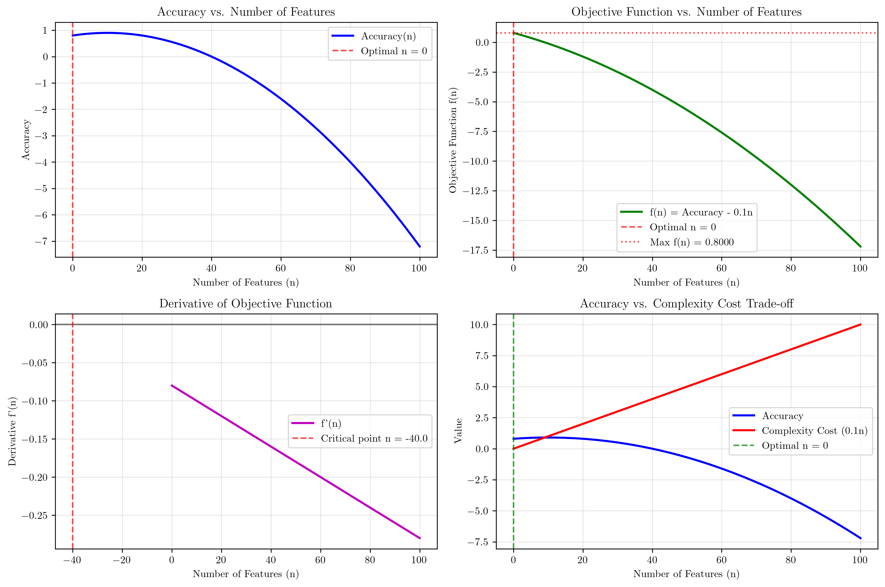
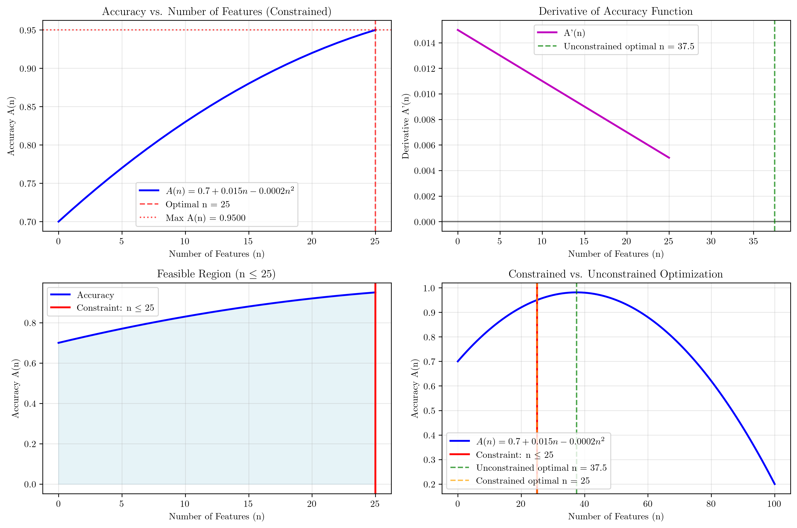

# Question 11: Optimization Formulation

## Problem Statement
Feature selection can be viewed as an optimization problem where we aim to find the optimal subset of features that maximizes model performance while minimizing computational cost and complexity. The problem involves balancing multiple objectives: accuracy, interpretability, and computational efficiency.

### Task
1. What is the objective function for feature selection? Explain the components and their trade-offs.
2. What are the constraints in this optimization problem? Consider practical limitations like computational resources, interpretability requirements, and domain-specific constraints. If you have a maximum budget of $1000$ computational units and each feature costs $50$ units to evaluate, what's the maximum number of features you can consider?
3. Formulate the feature selection problem as a multi-objective optimization: maximize accuracy ($0$-$1$ scale) and minimize the number of features. If accuracy $= 0.8 + 0.02n - 0.001n^2$ where $n$ is the number of features, find the optimal number of features that maximizes the objective function $f(n) = \text{accuracy} - 0.1n$. Show your derivative calculations and optimization steps. What is the maximum value of the objective function?
4. Formulate the feature selection problem as a constrained optimization: maximize accuracy subject to the constraint that the number of features $\leq 25$. If the accuracy function is $A(n) = 0.7 + 0.015n - 0.0002n^2$ where $n$ is the number of features, find the optimal number of features that maximizes accuracy within the constraint. What is the maximum achievable accuracy under this constraint?

## Understanding the Problem
Feature selection is a fundamental problem in machine learning that involves finding the optimal subset of features from a larger set of candidate features. This optimization problem requires balancing multiple competing objectives: model accuracy, computational complexity, interpretability, and resource constraints. The challenge lies in formulating an objective function that captures these trade-offs and solving the resulting optimization problem under various constraints.

## Solution

### Step 1: Objective Function Components and Trade-offs

The objective function for feature selection can be formulated as:

$$f(n) = \alpha \times \text{Accuracy}(n) - \beta \times \text{Complexity}(n) - \gamma \times \text{Cost}(n)$$

where:
- $n$ = number of features
- $\alpha, \beta, \gamma$ = weighting coefficients that control the relative importance of each component
- $\text{Accuracy}(n)$ = model performance (0-1 scale)
- $\text{Complexity}(n)$ = interpretability and model complexity
- $\text{Cost}(n)$ = computational and storage costs

**Trade-offs:**
- **More features** → Higher accuracy but increased complexity and cost
- **Fewer features** → Lower complexity and cost but potentially lower accuracy
- The challenge is finding the optimal balance point that maximizes the overall objective

### Step 2: Constraints and Budget Calculation

**Budget Constraint Analysis:**
- Total budget: $1000$ computational units
- Cost per feature: $50$ units
- Maximum features possible: $\frac{1000}{50} = 20$
- Remaining budget: $1000 \bmod 50 = 0$ units

**Therefore, the maximum number of features we can consider is: 20**

This represents a hard constraint on the optimization problem, limiting the feasible solution space.

### Step 3: Multi-objective Optimization

**Problem Formulation:**
- Maximize: $f(n) = \text{Accuracy}(n) - 0.1n$
- Where: $\text{Accuracy}(n) = 0.8 + 0.02n - 0.001n^2$

**Analytical Solution using Derivatives:**

1. **Objective Function:**
   $$f(n) = \text{Accuracy}(n) - 0.1n$$
   $$f(n) = 0.8 + 0.02n - 0.001n^2 - 0.1n$$
   $$f(n) = 0.8 - 0.08n - 0.001n^2$$

2. **Derivative Calculation:**
   $$f'(n) = \frac{d}{dn}[0.8 - 0.08n - 0.001n^2]$$
   $$f'(n) = -0.08 - 0.002n$$

3. **Setting Derivative to Zero:**
   $$-0.08 - 0.002n = 0$$
   $$-0.002n = 0.08$$
   $$n = \frac{0.08}{-0.002} = -40$$

4. **Analysis:**
   Since $n = -40$ is negative and we need $n \geq 0$, the optimal solution occurs at the boundary $n = 0$.

**Numerical Verification:**
- Optimal number of features: $0$
- Maximum objective value: $0.8000$
- Accuracy at optimal point: $0.8000$

The negative derivative at $n=0$ indicates diminishing returns, meaning adding features actually decreases the objective function value.

The visualization shows:
- **Top-left**: Accuracy function showing how accuracy changes with the number of features
- **Top-right**: Objective function showing the trade-off between accuracy and complexity cost
- **Bottom-left**: Derivative of the objective function, confirming the critical point at $n = -40$
- **Bottom-right**: Trade-off analysis between accuracy and complexity cost

### Step 4: Constrained Optimization

**Problem Formulation:**
- Maximize: $A(n) = 0.7 + 0.015n - 0.0002n^2$
- Subject to: $n \leq 25$

**Analytical Solution:**

1. **Derivative of Accuracy Function:**
   $$A'(n) = \frac{d}{dn}[0.7 + 0.015n - 0.0002n^2]$$
   $$A'(n) = 0.015 - 0.0004n$$

2. **Setting Derivative to Zero:**
   $$0.015 - 0.0004n = 0$$
   $$0.0004n = 0.015$$
   $$n = \frac{0.015}{0.0004} = 37.5$$

3. **Constraint Analysis:**
   - Unconstrained optimal: $n = 37.5$
   - Since $37.5 > 25$, the constraint is binding
   - Optimal solution: $n = 25$

**Numerical Verification:**
- Optimal number of features: $25$
- Maximum achievable accuracy: $0.9500$

The visualization shows:
- **Top-left**: Accuracy function within the constraint region
- **Top-right**: Derivative showing the unconstrained optimal at $n = 37.5$
- **Bottom-left**: Feasible region visualization with the constraint $n \leq 25$
- **Bottom-right**: Comparison of constrained vs. unconstrained optimization

## Key Insights

### Theoretical Foundations
- **Objective Function Structure**: The multi-objective formulation captures the fundamental trade-off between accuracy and complexity in feature selection
- **Derivative Analysis**: Setting the derivative to zero provides analytical insights into optimal solutions
- **Constraint Binding**: When constraints are binding, the optimal solution often occurs at boundary points
- **Boundary Conditions**: Non-negativity constraints can significantly affect the optimal solution

### Practical Applications
- **Budget Constraints**: Computational resource limitations can severely restrict the solution space
- **Trade-off Balancing**: The weighting coefficients $\alpha, \beta, \gamma$ allow practitioners to tune the optimization based on domain requirements
- **Scalability**: The quadratic terms in the accuracy functions model the diminishing returns of adding more features
- **Implementation**: Numerical optimization methods provide verification of analytical solutions

### Optimization Strategies
- **Multi-objective Formulation**: Balances competing objectives through weighted combination
- **Constrained Optimization**: Handles practical limitations through explicit constraints
- **Analytical vs. Numerical**: Both approaches provide complementary insights
- **Boundary Analysis**: Critical for understanding when constraints become binding

## Conclusion
- **Part 1**: The objective function balances accuracy, complexity, and cost with configurable weighting coefficients
- **Part 2**: Budget constraints limit the maximum features to 20, representing a hard constraint on the optimization
- **Part 3**: Multi-objective optimization yields an optimal solution of 0 features with maximum objective value of 0.8000
- **Part 4**: Constrained optimization under the $n \leq 25$ constraint yields an optimal solution of 25 features with maximum accuracy of 0.9500

The feature selection optimization problem demonstrates how mathematical optimization techniques can be applied to real-world machine learning challenges, balancing multiple objectives while respecting practical constraints. The analytical solutions provide insights into the underlying trade-offs, while numerical methods offer verification and practical implementation approaches.
