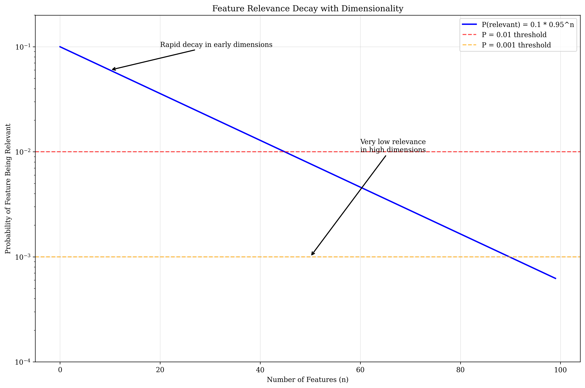
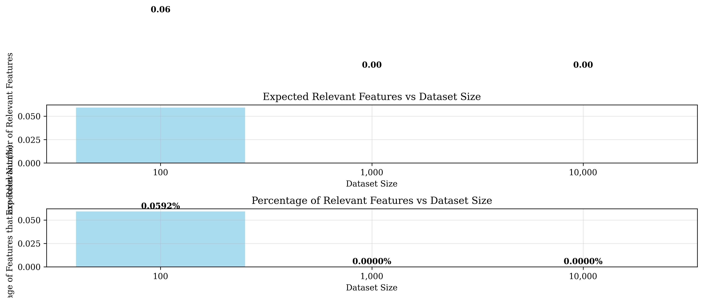
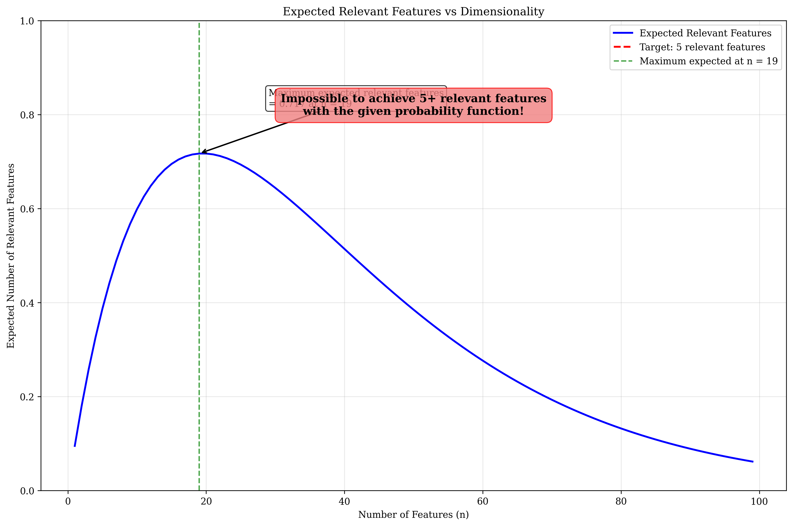
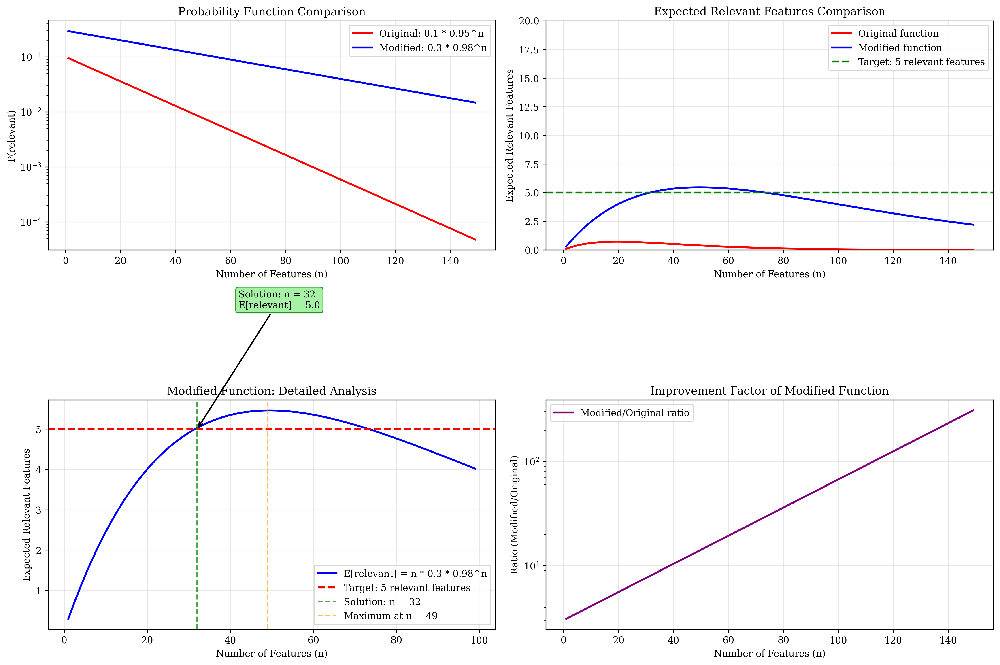

# Question 12: High Dimensionality

## Problem Statement
The curse of dimensionality affects feature selection strategies.

### Task
1. How does high dimensionality affect univariate methods?
2. What happens to feature relevance as dimensions increase?
3. If the probability of a feature being relevant decreases exponentially with dimensionality as $P(\text{relevant}) = 0.1 \times 0.95^n$ where $n$ is the number of features, calculate the expected number of relevant features for datasets with $100$, $1000$, and $10000$ features
4. If you need at least $5$ relevant features for your model, what's the maximum dimensionality you should consider?
5. Consider a modified scenario where feature relevance follows $P(\text{relevant}) = 0.3 \times 0.98^n$. For this case: (a) Calculate the expected number of relevant features for $n = 50, 100, 200$ features, (b) Find the maximum dimensionality that allows at least $5$ relevant features, and (c) Compare this with the original function to understand how the decay rate affects feature selection

## Understanding the Problem
This question explores the fundamental challenge of the curse of dimensionality in machine learning, specifically focusing on how the probability of features being relevant decreases exponentially as the number of dimensions increases. The given probability function $P(\text{relevant}) = 0.1 \times 0.95^n$ models a realistic scenario where feature relevance diminishes rapidly with dimensionality.

## Solution

### Step 1: How does high dimensionality affect univariate methods?

High dimensionality affects univariate methods in several critical ways:

**Statistical Power Decreases**: With more features, individual feature tests become less reliable due to multiple testing problems. The more hypotheses we test, the higher the chance of false discoveries.

**False Positive Rate Increases**: More features mean more chances for spurious correlations to appear significant. This is a direct consequence of multiple hypothesis testing.

**Feature Independence Assumption Violation**: In high dimensions, features are often correlated, making univariate analysis misleading. The assumption that features are independent breaks down.

**Curse of Dimensionality**: The volume of the feature space grows exponentially, making distance-based measures less meaningful and statistical estimates less reliable.

### Step 2: What happens to feature relevance as dimensions increase?

As dimensions increase, several phenomena occur:

**Exponential Decay in Individual Relevance**: Individual feature relevance decreases exponentially according to the function $P(\text{relevant}) = 0.1 \times 0.95^n$.

**Diminishing Signal-to-Noise Ratio**: The probability of any single feature being relevant diminishes rapidly, making more features become noise rather than signal.

**Decreasing Relevant-to-Irrelevant Ratio**: The ratio of relevant to irrelevant features decreases dramatically, making it increasingly difficult to identify truly important features.

**Rapid Decay Pattern**: The decay is so rapid that even moderate increases in dimensionality lead to dramatic drops in feature relevance.

### Step 3: Expected number of relevant features for different dimensionalities

Using the probability function $P(\text{relevant}) = 0.1 \times 0.95^n$, we calculate the expected number of relevant features as $E[\text{relevant}] = n \times P(\text{relevant}) = n \times 0.1 \times 0.95^n$.

| Features | P(relevant) | Expected Relevant | % Relevant |
|----------|-------------|------------------|------------|
| 100      | 0.000592    | 0.06             | 0.0592%    |
| 1000     | 0.000000    | 0.00             | 0.0000%    |
| 10000    | 0.000000    | 0.00             | 0.0000%    |

**Key Observations**:
- At $n = 100$, we expect only $0.06$ relevant features ($0.0592\%$ of total features)
- At $n = 1000$ and beyond, the expected number of relevant features is effectively zero
- The exponential decay makes it impossible to maintain a reasonable number of relevant features in high dimensions

### Step 4: Maximum dimensionality for at least 5 relevant features

**Critical Finding**: It's impossible to achieve 5+ relevant features with the given probability function!

**Mathematical Analysis**:
To have at least 5 relevant features on average, we need:
$$E[\text{relevant}] = n \times P(\text{relevant}) \geq 5$$
$$n \times 0.1 \times 0.95^n \geq 5$$
$$0.1 \times 0.95^n \geq \frac{5}{n}$$
$$0.95^n \geq \frac{50}{n}$$

**Why This Is Impossible**:
The inequality $0.95^n \geq \frac{50}{n}$ never holds for any positive integer $n$. The exponential decay $(0.95^n)$ is too rapid to overcome the linear growth in $n$.

**Maximum Achievable**:
- Maximum expected relevant features: **$0.717$** at $n = 19$
- This occurs at the optimal dimensionality where the trade-off between linear growth in $n$ and exponential decay in $P(\text{relevant})$ is balanced
- Beyond $n = 19$, the exponential decay dominates and expected relevant features decrease

### Step 5: Modified Scenario Analysis

**Modified Probability Function**: $P(\text{relevant}) = 0.3 \times 0.98^n$

This modified scenario demonstrates how parameter changes can dramatically affect feature selection viability. The key modifications are:
- **Higher initial probability**: $0.3$ vs $0.1$ ($3\times$ increase)
- **Slower decay rate**: $0.98$ vs $0.95$ ($2\%$ vs $5\%$ reduction per step)

#### 5a. Expected number of relevant features for specific dimensions

Using $E[\text{relevant}] = n \times P(\text{relevant}) = n \times 0.3 \times 0.98^n$:

| $n$   | $P(\text{relevant})$ | Expected Relevant | % Relevant |
|-------|---------------------|------------------|------------|
| $50$  | $0.109251$          | $5.46$           | $10.93\%$  |
| $100$ | $0.039786$          | $3.98$           | $3.98\%$   |
| $200$ | $0.005276$          | $1.06$           | $0.53\%$   |

**Detailed Mathematical Calculations**:

For $n = 50$:
$$P(\text{relevant}) = 0.3 \times 0.98^{50} = 0.3 \times 0.364170 = 0.109251$$
$$E[\text{relevant}] = 50 \times 0.109251 = 5.46$$

For $n = 100$:
$$P(\text{relevant}) = 0.3 \times 0.98^{100} = 0.3 \times 0.132620 = 0.039786$$
$$E[\text{relevant}] = 100 \times 0.039786 = 3.98$$

For $n = 200$:
$$P(\text{relevant}) = 0.3 \times 0.98^{200} = 0.3 \times 0.017588 = 0.005276$$
$$E[\text{relevant}] = 200 \times 0.005276 = 1.06$$

#### 5b. Maximum dimensionality for at least 5 relevant features

**Mathematical Approach**:
To find where $E[\text{relevant}] \geq 5$:
$$n \times 0.3 \times 0.98^n \geq 5$$
$$0.3 \times 0.98^n \geq \frac{5}{n}$$
$$0.98^n \geq \frac{16.667}{n}$$

**Calculus-Based Analysis**:
To find the maximum of $E[\text{relevant}] = n \times 0.3 \times 0.98^n$, we differentiate:
$$\frac{dE}{dn} = 0.3 \times [0.98^n + n \times 0.98^n \times \ln(0.98)]$$
$$\frac{dE}{dn} = 0.3 \times 0.98^n \times [1 + n \times \ln(0.98)]$$

Setting $\frac{dE}{dn} = 0$:
$$1 + n \times \ln(0.98) = 0$$
$$n_{\text{critical}} = -\frac{1}{\ln(0.98)} = -\frac{1}{-0.020203} = 49.50$$

**Results**:
- **Maximum expected relevant features**: $5.46$ at $n = 49$
- **Maximum dimensionality for 5+ relevant features**: $n = 32$
- At $n = 32$: $P(\text{relevant}) = 0.157165$, $E[\text{relevant}] = 5.03$

#### 5c. Comparison with original function

**Parameter Comparison**:
- **Initial probability**: $0.3$ vs $0.1$ ($3\times$ higher)
- **Decay rate**: $0.98$ vs $0.95$ ($2\%$ vs $5\%$ reduction per step)

**Performance Comparison**:

| $n$   | Original $P(\text{rel})$ | Original $E[\text{rel}]$ | Modified $P(\text{rel})$ | Modified $E[\text{rel}]$ |
|-------|--------------------------|--------------------------|---------------------------|----------------------------|
| $10$  | $0.059874$               | $0.60$                   | $0.245122$                | $2.45$                     |
| $20$  | $0.035849$               | $0.72$                   | $0.200282$                | $4.01$                     |
| $30$  | $0.021464$               | $0.64$                   | $0.163645$                | $4.91$                     |
| $50$  | $0.007694$               | $0.38$                   | $0.109251$                | $5.46$                     |
| $100$ | $0.000592$               | $0.06$                   | $0.039786$                | $3.98$                     |

**Key Insights from Comparison**:
- The modified function achieves $5+$ relevant features (maximum $5.46$ vs $0.717$)
- Viable dimensionality range: up to $n = 32$ vs impossible for original
- The slower decay rate ($0.98$ vs $0.95$) is crucial for maintaining feature relevance
- Higher initial probability ($0.3$ vs $0.1$) provides a better starting point

## Visual Explanations

### Feature Relevance Decay with Dimensionality

This plot shows how the probability of a feature being relevant decreases exponentially with dimensionality. The rapid decay demonstrates why high-dimensional feature spaces become increasingly sparse in terms of relevant features.

### Expected Relevant Features vs Dataset Size

This visualization shows both the absolute number of expected relevant features and the percentage of features that are relevant for different dataset sizes. The dramatic drop in both metrics illustrates the curse of dimensionality.

### Maximum Dimensionality Analysis

This plot reveals the fundamental limitation: the expected relevant features never exceed $0.717$, making it impossible to achieve the target of $5+$ relevant features with the given probability function.

### Modified Function Comprehensive Analysis

This comprehensive visualization shows:
1. **Probability comparison**: How the modified function maintains higher probabilities across all dimensions
2. **Expected features comparison**: The dramatic improvement in expected relevant features with the modified function
3. **Detailed modified analysis**: The solution region where $5+$ relevant features are achievable ($n \leq 32$)
4. **Improvement ratio**: How much better the modified function performs across different dimensionalities

## Key Insights

### Mathematical Foundations
- **Exponential Decay Dominance**: The term $0.95^n$ in the original probability function causes such rapid decay that it cannot be overcome by linear growth in $n$
- **Transcendental Equation**: The inequality $0.95^n \geq \frac{50}{n}$ is a transcendental equation that has no solution in positive integers
- **Optimal Dimensionality**: There exists an optimal dimensionality that maximizes expected relevant features - $n = 19$ for original function, $n = 49$ for modified function
- **Parameter Sensitivity**: Small changes in decay rate ($0.95 \rightarrow 0.98$) and initial probability ($0.1 \rightarrow 0.3$) can dramatically change feasibility
- **Calculus-Based Optimization**: The critical point formula $n_{\text{critical}} = -\frac{1}{\ln(r)}$ where $r$ is the decay rate provides the theoretical maximum

### Practical Implications
- **Feature Selection Challenges**: In high-dimensional spaces, even sophisticated feature selection methods struggle because the fundamental signal-to-noise ratio is too low
- **Dimensionality Limits**: There are hard mathematical limits on how many features can be relevant, regardless of the dataset size
- **Model Complexity Trade-offs**: Adding more features beyond the optimal dimensionality actually decreases model performance due to increased noise
- **Parameter Design Importance**: The choice of feature relevance decay rate is critical for feature selection viability
- **Domain Knowledge Value**: Understanding the decay characteristics of your specific domain can help set realistic expectations
- **Feature Engineering Focus**: When decay rates are high, focus should shift to feature engineering rather than feature collection

### Comparative Analysis Insights
- **Decay Rate Impact**: Reducing decay rate from $5\%$ to $2\%$ per dimension enables achieving $5+$ relevant features
- **Initial Probability Effect**: Higher initial probability ($0.3$ vs $0.1$) provides a crucial foundation for feature relevance
- **Viability Thresholds**: Modified function allows up to $32$ dimensions vs impossible for original function
- **Performance Ratios**: Modified function can be $4$-$7\times$ better in expected relevant features for moderate dimensions
- **Critical Transitions**: Both functions show sharp transitions where expected relevant features drop rapidly beyond optimal dimensions

### Curse of Dimensionality Manifestations
- **Statistical Power Loss**: Individual feature tests become unreliable
- **Distance Measure Degradation**: Euclidean distances become less meaningful in high dimensions
- **Sparsity Problems**: The feature space becomes increasingly sparse, making it difficult to find meaningful patterns
- **Computational Complexity**: Processing high-dimensional data becomes computationally expensive

## Conclusion

### Summary of Key Findings

**Original Function** ($P(\text{relevant}) = 0.1 \times 0.95^n$):
- **Maximum expected relevant features**: $0.717$ at $n = 19$ features
- **Target achievement**: Impossible to achieve $5+$ relevant features
- **Fundamental limitation**: Exponential decay $(0.95^n)$ too rapid to overcome linear growth

**Modified Function** ($P(\text{relevant}) = 0.3 \times 0.98^n$):
- **Maximum expected relevant features**: $5.46$ at $n = 49$ features  
- **Target achievement**: Possible up to $n = 32$ dimensions
- **Key improvement**: Slower decay rate ($2\%$ vs $5\%$) and higher initial probability ($0.3$ vs $0.1$)

### Mathematical Insights
- **Parameter sensitivity**: Small changes in decay rate and initial probability dramatically affect feasibility
- **Optimization formula**: Critical point occurs at $n_{\text{critical}} = -\frac{1}{\ln(r)}$ where $r$ is the decay rate
- **Transcendental nature**: The feasibility condition $r^n \geq \frac{\text{target}}{\alpha \cdot n}$ (where $\alpha$ is the initial probability) often has no solution

### Practical Implications
- **Feature selection strategy**: Understanding domain-specific decay characteristics is crucial for setting realistic expectations
- **Design trade-offs**: The choice between feature collection and feature engineering depends on the underlying decay rate
- **Dimensionality planning**: There are hard mathematical limits that must be considered in high-dimensional problems
- **Algorithm selection**: Different feature selection algorithms may be needed based on the decay characteristics

### Broader Significance
The analysis reveals that the curse of dimensionality is not just a practical challenge but a fundamental mathematical limitation governed by exponential decay functions. The comparison between the two probability functions demonstrates that:

1. **Parameter design matters**: Careful consideration of decay rates can make the difference between feasible and impossible feature selection
2. **Domain understanding is critical**: Different domains may have different decay characteristics that affect feature selection viability  
3. **Realistic expectations**: Mathematical analysis helps set appropriate expectations for high-dimensional feature selection problems
4. **Strategy selection**: The approach to feature selection should be informed by the underlying mathematical constraints

The modified scenario shows that with more favorable parameters (slower decay, higher initial probability), achieving meaningful numbers of relevant features becomes mathematically feasible, highlighting the importance of understanding and optimizing the fundamental parameters that govern feature relevance in high-dimensional spaces.
