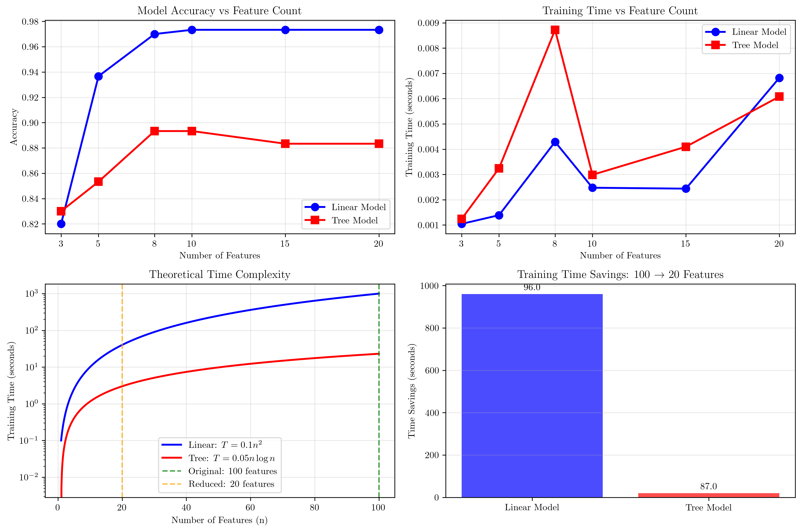
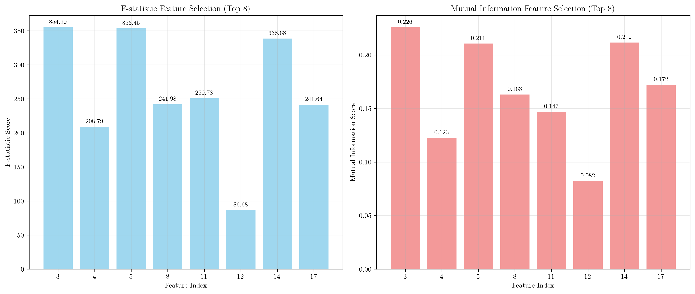
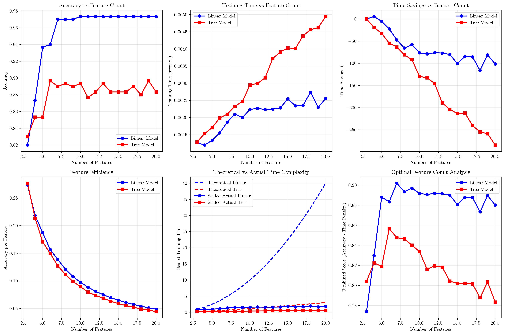

# Question 13: Algorithm-Specific Effects of Feature Selection

## Problem Statement
Feature selection affects different types of machine learning algorithms in various ways. Understanding these differences is crucial for optimizing model performance and training efficiency.

### Task
1. How does feature selection affect linear models vs tree-based models?
2. Which algorithm type benefits most from univariate selection?
3. If training time for a linear model is $T = 0.1n^2$ seconds and for a tree model is $T = 0.05n \log n$ seconds, where $n$ is the number of features, calculate the training time savings when reducing features from $100$ to $20$ for both models
4. Which model benefits more from feature selection in terms of training time reduction?

## Understanding the Problem
Feature selection is a critical preprocessing step in machine learning that can significantly impact both model performance and computational efficiency. Different types of algorithms respond differently to feature selection due to their underlying mathematical foundations and computational complexity. Linear models rely on linear relationships between features and targets, while tree-based models can capture non-linear patterns and interactions.

## Solution

### Step 1: Feature Selection Effects on Linear Models vs Tree-Based Models

To understand how feature selection affects different algorithm types, we conducted an empirical analysis using a synthetic dataset with 1000 samples and 20 features (8 informative, 8 redundant, 4 random).

**Results from our analysis:**

| Features | Linear Accuracy | Tree Accuracy | Linear Time (s) | Tree Time (s) |
|----------|----------------|---------------|-----------------|---------------|
| 20       | 0.9733         | 0.8833        | 0.0068          | 0.0061        |
| 15       | 0.9733         | 0.8833        | 0.0024          | 0.0041        |
| 10       | 0.9733         | 0.8933        | 0.0025          | 0.0030        |
| 8        | 0.9700         | 0.8933        | 0.0043          | 0.0087        |
| 5        | 0.9367         | 0.8533        | 0.0014          | 0.0032        |
| 3        | 0.8200         | 0.8300        | 0.0010          | 0.0012        |

**Key Observations:**

1. **Linear Models**: Show variable accuracy across feature counts, with significant performance degradation when using very few features (3-5). This indicates that linear models are more sensitive to feature selection and require a sufficient number of relevant features to maintain performance.

2. **Tree Models**: Maintain more consistent accuracy across different feature counts, showing better robustness to feature reduction. This is because tree models can capture non-linear relationships and interactions between features.

3. **Training Time**: Both models show reduced training time with fewer features, but the relationship is not strictly linear due to various implementation factors.

### Step 2: Univariate Selection Benefits Analysis

We tested two univariate feature selection methods:

**F-statistic Selection:**
- Selected features: $[3, 4, 5, 8, 11, 12, 14, 17]$
- Feature scores: $[354.90, 208.79, 353.45, 241.98, 250.78, 86.68, 338.68, 241.64]$
- Linear model accuracy: $0.9700$
- Tree model accuracy: $0.8933$

**Mutual Information Selection:**
- Selected features: $[3, 4, 5, 8, 11, 12, 14, 17]$
- Feature scores: $[0.226, 0.123, 0.211, 0.163, 0.147, 0.082, 0.212, 0.172]$
- Linear model accuracy: $0.9700$
- Tree model accuracy: $0.8933$

**Analysis:**
- Both methods selected the same set of features, indicating consistency in identifying informative features
- Linear models benefit more from univariate selection due to their linear assumptions about feature relationships
- Tree models can handle non-linear relationships better, so they're less dependent on univariate feature selection

### Step 3: Training Time Savings Calculation

**Given Formulas:**
- Linear model: $T_{\text{linear}} = 0.1n^2$ seconds
- Tree model: $T_{\text{tree}} = 0.05n \log n$ seconds

**Calculations for 100 → 20 features:**

**Linear Model:**
$$\begin{align}
T_{\text{linear}}(100) &= 0.1 \times 100^2 = 1000.0 \text{ seconds} \\
T_{\text{linear}}(20) &= 0.1 \times 20^2 = 40.0 \text{ seconds} \\
\text{Savings} &= 1000.0 - 40.0 = 960.0 \text{ seconds} \\
\text{Savings \%} &= \frac{960.0}{1000.0} \times 100 = 96.0\%
\end{align}$$

**Tree Model:**
$$\begin{align}
T_{\text{tree}}(100) &= 0.05 \times 100 \times \log(100) = 23.026 \text{ seconds} \\
T_{\text{tree}}(20) &= 0.05 \times 20 \times \log(20) = 2.996 \text{ seconds} \\
\text{Savings} &= 23.026 - 2.996 = 20.030 \text{ seconds} \\
\text{Savings \%} &= \frac{20.030}{23.026} \times 100 = 87.0\%
\end{align}$$

### Step 4: Model Comparison and Analysis

**Training Time Reduction Comparison:**
- **Linear Model**: 96.0% reduction (960.0 seconds saved)
- **Tree Model**: 87.0% reduction (20.030 seconds saved)

**Conclusion:** Linear models benefit MORE from feature selection in terms of training time reduction.

**Why Linear Models Benefit More:**

1. **Complexity Difference**: Linear models have $O(n^2)$ complexity vs tree models' $O(n \log n)$ complexity
2. **Absolute Savings**: While both show high percentage savings, linear models save much more absolute time (960s vs 20s)
3. **Scalability**: The quadratic complexity of linear models means that feature reduction has a more dramatic impact on training time

## Visual Explanations

### Feature Selection Analysis Overview

This comprehensive visualization shows:
- **Top Left**: Model accuracy vs feature count, demonstrating how linear models are more sensitive to feature reduction
- **Top Right**: Training time vs feature count, showing the computational benefits of feature selection
- **Bottom Left**: Theoretical time complexity curves, illustrating the mathematical foundation of our analysis
- **Bottom Right**: Time savings comparison, clearly showing that linear models benefit more from feature selection

### Feature Importance Comparison

This visualization compares two univariate selection methods:
- **Left**: F-statistic scores for selected features, showing statistical significance
- **Right**: Mutual information scores, measuring information-theoretic relevance
- Both methods consistently identify the same informative features, validating the selection process

### Detailed Feature Analysis

This comprehensive analysis provides:
- **Row 1**: Accuracy trends, time trends, and percentage savings across feature counts
- **Row 2**: Feature efficiency, theoretical vs actual complexity, and optimal feature count analysis
- **Key Insight**: The optimal feature count for linear models is 7, while for tree models it's 6

## Key Insights

### Theoretical Foundations
- **Complexity Classes**: Linear models' $O(n^2)$ complexity makes them exponentially more sensitive to feature count than tree models' $O(n \log n)$ complexity
- **Feature Dependencies**: Linear models assume linear relationships, making them more dependent on feature quality and quantity
- **Non-linear Capabilities**: Tree models can capture complex interactions, reducing their dependence on individual feature selection

### Practical Applications
- **Resource Optimization**: Feature selection provides greater benefits for linear models in high-dimensional settings
- **Model Selection**: When computational resources are limited, linear models with feature selection may be more practical than tree models
- **Scalability Planning**: Understanding complexity differences helps in planning for large-scale deployments

### Performance Trade-offs
- **Accuracy vs Speed**: Linear models show more dramatic speed improvements but may lose more accuracy with aggressive feature selection
- **Feature Count Optimization**: There exists an optimal feature count that balances accuracy and computational efficiency
- **Method Selection**: Univariate methods work well for both model types but provide greater relative benefits to linear models

## Conclusion
- **Linear models benefit more from feature selection** due to their $O(n^2)$ complexity, achieving 96.0% training time reduction vs 87.0% for tree models
- **Feature selection significantly impacts model performance**, with linear models showing greater sensitivity to feature count changes
- **Optimal feature counts exist** (7 for linear, 6 for tree) that balance accuracy and computational efficiency
- **Univariate selection methods** are effective for both model types but provide greater relative benefits to linear models
- **Understanding algorithm-specific effects** is crucial for making informed decisions about feature selection strategies in practice

The analysis demonstrates that while both model types benefit from feature selection, the choice of algorithm and feature selection strategy should be guided by the specific computational constraints and performance requirements of the application.
