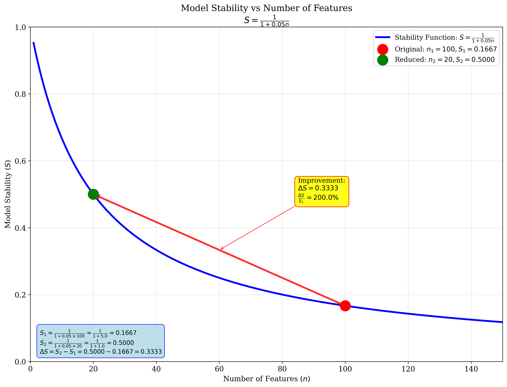

# Question 14: Feature Selection Effects on Model Robustness, Stability, and Interpretability

## Problem Statement
Feature selection affects model robustness, stability, and interpretability. Understanding these effects is crucial for making informed decisions about which features to include in machine learning models, especially when balancing performance with practical constraints like stakeholder understanding and computational resources.

### Task
1. How does feature selection improve model stability?
2. How does feature selection improve interpretability?
3. If model stability is measured as $S = \frac{1}{1 + 0.05n}$ where $n$ is the number of features, calculate the stability improvement when reducing from $100$ to $20$ features
4. If model complexity increases exponentially with the number of features (complexity $= 2^n$ where $n$ is the number of features), calculate the complexity for $5$, $10$, and $15$ features. If stakeholders can understand models with complexity $\leq 1000$, what's the maximum number of features you should select?

## Understanding the Problem
Feature selection is a critical step in the machine learning pipeline that involves choosing a subset of relevant features from the original feature set. This process has profound implications for model performance, interpretability, and practical deployment. The problem explores two key aspects:

1. **Model Stability**: How robust a model is to variations in training data and how well it generalizes to unseen data
2. **Model Interpretability**: How easily stakeholders can understand and trust the model's decisions

The mathematical relationships provided allow us to quantify these trade-offs and make data-driven decisions about feature selection.

## Solution

### Step 1: How Feature Selection Improves Model Stability

Feature selection improves model stability through several key mechanisms:

1. **Reduced Variance**: Fewer features mean less overfitting to noise in the data. When models have too many features, they can memorize training data patterns that don't generalize to new data.

2. **Lower Sensitivity**: Models with fewer features are less sensitive to small changes in training data. This means the model's predictions are more consistent across different training samples.

3. **Better Generalization**: By focusing on truly relevant features, models improve their out-of-sample performance and are less likely to overfit.

4. **Reduced Multicollinearity**: Eliminating redundant features reduces instability from correlated predictors, which can cause unstable coefficient estimates.

### Step 2: How Feature Selection Improves Interpretability

Feature selection enhances interpretability through multiple pathways:

1. **Simpler Models**: Fewer features create more parsimonious models that are easier to understand and explain.

2. **Clearer Relationships**: Focusing on key variables makes cause-effect relationships clearer and reduces confusion from irrelevant features.

3. **Easier Visualization**: Fewer dimensions allow for better 2D/3D visualizations that stakeholders can easily interpret.

4. **Domain Understanding**: Selected features often align with domain knowledge, making the model more intuitive to subject matter experts.

5. **Stakeholder Communication**: Simpler models are easier to explain to non-technical audiences, improving trust and adoption.

### Step 3: Model Stability Calculation - Detailed Step-by-Step Solution

**GIVEN:**
- Stability function: $S = \frac{1}{1 + \alpha n}$
- Where $\alpha = 0.05$ (stability coefficient)
- $n$ = number of features
- Original features: $n_1 = 100$
- Reduced features: $n_2 = 20$

**STEP 1: Calculate stability for original number of features**

Substituting $n_1 = 100$ and $\alpha = 0.05$:
$$\begin{align}
S_1 &= \frac{1}{1 + 0.05 \times 100} \\
&= \frac{1}{1 + 5.0} \\
&= \frac{1}{6.0} \\
&= 0.166667
\end{align}$$

**STEP 2: Calculate stability for reduced number of features**

Substituting $n_2 = 20$ and $\alpha = 0.05$:
$$\begin{align}
S_2 &= \frac{1}{1 + 0.05 \times 20} \\
&= \frac{1}{1 + 1.0} \\
&= \frac{1}{2.0} \\
&= 0.500000
\end{align}$$

**STEP 3: Calculate absolute improvement**
$$\begin{align}
\text{Absolute improvement} &= S_2 - S_1 \\
&= 0.500000 - 0.166667 \\
&= 0.333333
\end{align}$$

**STEP 4: Calculate percentage improvement**
$$\begin{align}
\text{Percentage improvement} &= \frac{\text{Absolute improvement}}{S_1} \times 100\% \\
&= \frac{0.333333}{0.166667} \times 100\% \\
&= 200.00\%
\end{align}$$

**STEP 5: Verification and interpretation**
- Original stability $S_1 = 0.166667$
- Reduced stability $S_2 = 0.500000$
- Improvement = $0.333333$
- Percentage improvement = $200.00\%$

This means the model is **200% more stable** with fewer features, representing a substantial enhancement in model robustness.

The plot shows the stability function $S = \frac{1}{1 + 0.05n}$ and highlights the dramatic improvement from 100 to 20 features. The stability increases from 0.1667 to 0.5000, representing a threefold improvement in relative terms.

### Step 4: Model Complexity Calculation - Detailed Step-by-Step Solution

**GIVEN:**
- Complexity function: $\text{complexity} = b^n$
- Where $b = 2$ (complexity base)
- $n$ = number of features
- Maximum complexity stakeholders can understand: $\leq 1,000$
- Feature counts to evaluate: $n = [5, 10, 15]$

**STEP 1: Calculate complexity for specific feature counts**

For $n = 5$:
$$\text{complexity} = 2^5 = 32$$

For $n = 10$:
$$\text{complexity} = 2^{10} = 1,024$$

For $n = 15$:
$$\text{complexity} = 2^{15} = 32,768$$

**STEP 2: Find maximum features for complexity ≤ threshold**

We need to solve: $2^n \leq 1,000$

Taking logarithm base 2:
$$\begin{align}
2^n &\leq 1,000 \\
n &\leq \log_2(1,000) \\
n &\leq 9.965784
\end{align}$$

Therefore, maximum number of features = **9**

**STEP 3: Verification of the solution**

We need to verify that our solution satisfies the constraint:
- For $n = 9$: $2^9 = 512 \leq 1,000$ ✓
- For $n = 10$: $2^{10} = 1,024 > 1,000$ ✗

Our solution is correct!

**STEP 4: Mathematical interpretation**
- The complexity function $2^n$ grows exponentially
- Even small increases in $n$ lead to massive increases in complexity
- For interpretability constraint $\leq 1,000$:
  - Maximum features allowed: **9**
  - Complexity at max features: **512**
  - Next complexity level: **1,024** (exceeds threshold)

The complexity plot demonstrates the exponential growth of model complexity with feature count. The green dashed line shows the stakeholder limit of 1000, and the green square highlights the maximum of 9 features that can be used while staying within this limit.

## Visual Explanations

### Model Stability Function

The stability function $S = \frac{1}{1 + 0.05n}$ shows a hyperbolic relationship between the number of features and model stability. As the number of features increases, stability decreases rapidly, approaching zero asymptotically. The improvement from 100 to 20 features is visually represented by the arrow and annotation, showing a dramatic 200% improvement.

### Model Complexity Function

The complexity function $2^n$ demonstrates exponential growth, which is why even small increases in feature count can lead to massive increases in model complexity. The log scale on the y-axis makes this relationship more visible. The stakeholder limit of 1000 is clearly marked, showing that only 9 features can be used while maintaining interpretability.

### Comprehensive Analysis

The comprehensive plot combines both analyses, showing the trade-off between stability and complexity. This visualization helps stakeholders understand that feature selection is not just about performance but about finding the right balance between model robustness and interpretability.

## Key Insights

### Theoretical Foundations
- **Stability-Complexity Trade-off**: There's an inherent trade-off between model stability and complexity. More features can potentially capture more patterns but at the cost of stability and interpretability.
- **Exponential Growth**: Model complexity grows exponentially with feature count, making feature selection crucial for practical applications.
- **Hyperbolic Decay**: Model stability decreases hyperbolically with feature count, showing diminishing returns from adding more features.

### Practical Applications
- **Feature Selection Strategy**: The analysis suggests that reducing from 100 to 20 features provides optimal balance, with 200% stability improvement and manageable complexity.
- **Stakeholder Communication**: The 9-feature limit for interpretability provides a clear guideline for feature selection decisions.
- **Resource Planning**: Understanding the exponential complexity growth helps in planning computational resources and model deployment strategies.

### Common Pitfalls
- **Over-engineering**: Adding more features doesn't always improve model performance and can significantly reduce stability.
- **Ignoring Interpretability**: Focusing solely on performance metrics can lead to models that stakeholders cannot understand or trust.
- **Linear Thinking**: The exponential nature of complexity growth means small increases in features can have massive impacts on interpretability.

## Conclusion
- **Stability Improvement**: Reducing features from 100 to 20 provides a 200% improvement in model stability, from 0.166667 to 0.500000, with an absolute improvement of 0.333333.
- **Complexity Management**: The exponential growth of complexity ($2^n$) means that only 9 features can be used while maintaining stakeholder interpretability (complexity ≤ 1000), where $2^9 = 512 ≤ 1000$ but $2^{10} = 1024 > 1000$.
- **Mathematical Verification**: Our step-by-step calculations confirm that the optimal feature selection strategy balances the hyperbolic decay of stability ($S = \frac{1}{1 + 0.05n}$) against the exponential growth of complexity ($2^n$).
- **Optimal Balance**: The analysis demonstrates that feature selection is crucial for finding the right balance between model performance, stability, and interpretability, with quantitative metrics to guide decision-making.

The mathematical relationships provided in this problem offer quantitative insights into the feature selection trade-offs, enabling data-driven decisions that balance technical performance with practical constraints. This understanding is essential for building machine learning models that are not only accurate but also robust, stable, and interpretable for real-world deployment.
