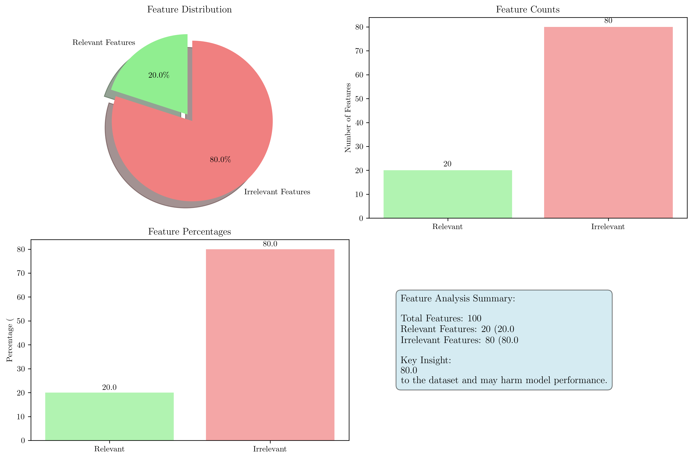
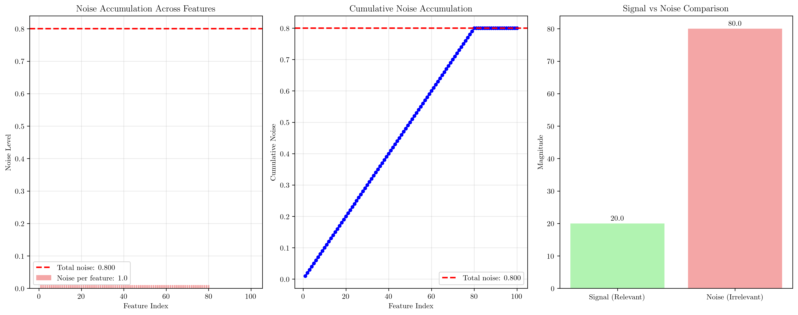
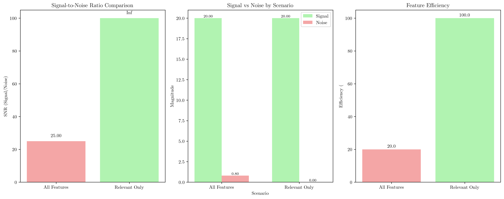
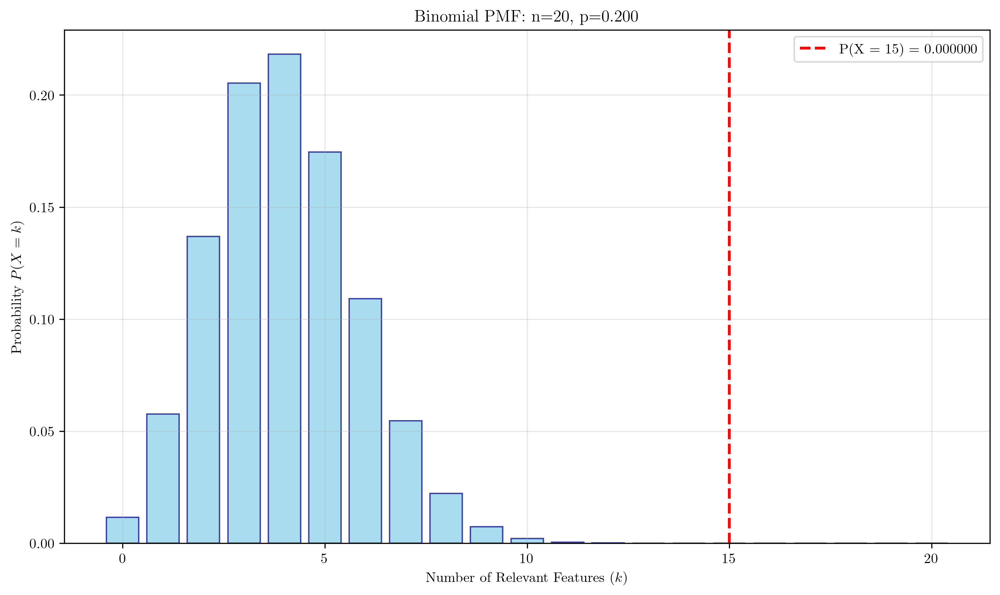
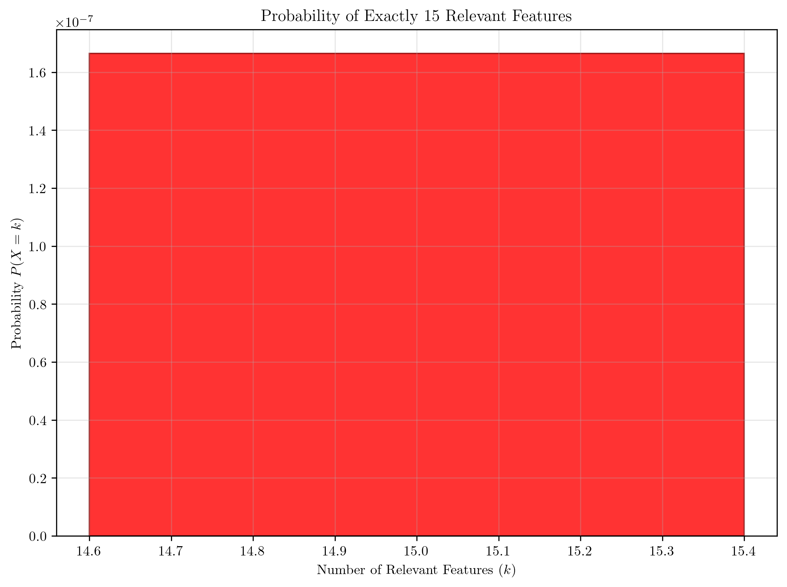
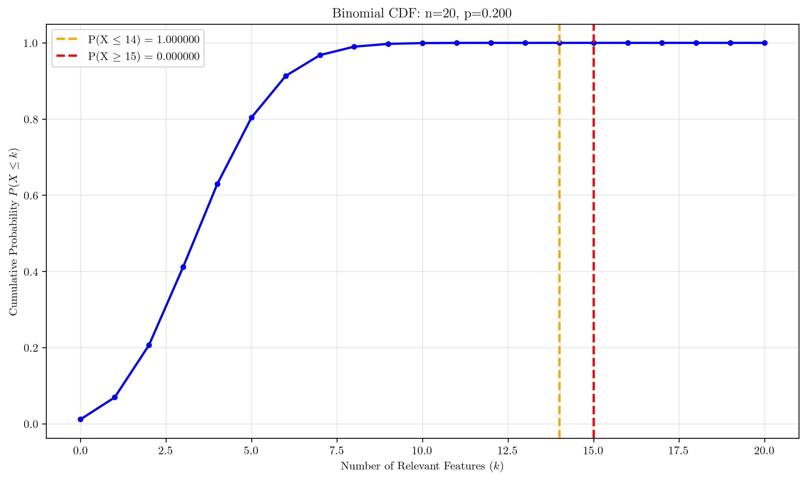
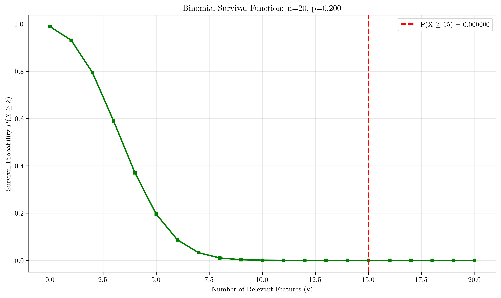
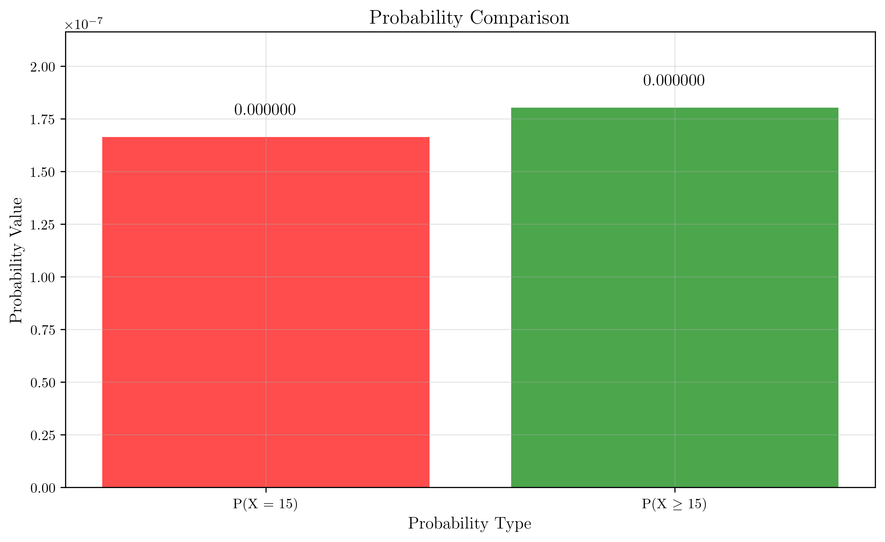
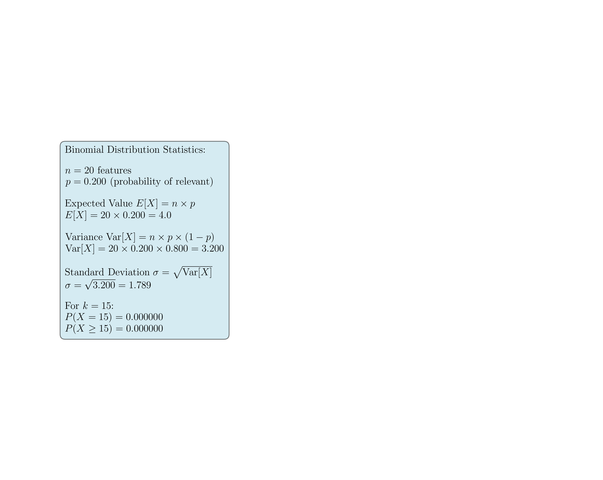
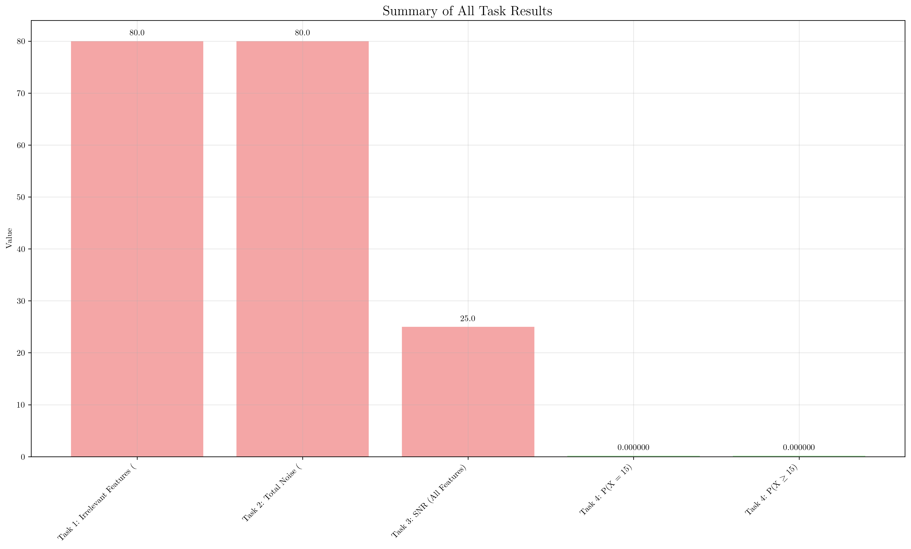

# Question 15: Irrelevant Features Impact

## Problem Statement
Consider a dataset with $1000$ samples and $100$ features where only $20$ features are truly relevant.

### Task
1. What percentage of features are irrelevant in this dataset?
2. If each irrelevant feature adds $1\%$ noise, what's the total noise level?
3. What's the signal-to-noise ratio with all features vs relevant features only?
4. If the probability of randomly selecting a relevant feature is $p = \frac{20}{100} = 0.2$, use the binomial distribution to calculate the probability of selecting exactly $15$ relevant features when randomly choosing $20$ features. What's the probability of selecting at least $15$ relevant features? Show your calculations using the binomial formula.

## Understanding the Problem
This problem explores the critical concept of feature relevance in machine learning and its impact on model performance. When dealing with high-dimensional datasets, many features may be irrelevant or noisy, which can significantly degrade model performance. The problem demonstrates how irrelevant features accumulate noise and how feature selection can dramatically improve signal-to-noise ratios.

The binomial distribution component shows the probability of randomly selecting relevant features, which is crucial for understanding the effectiveness of random feature selection strategies.

## Solution

### Step 1: Calculate Percentage of Irrelevant Features
Given:
- Total features: $100$
- Relevant features: $20$
- Irrelevant features: $100 - 20 = 80$

The percentage of irrelevant features is:
$$\text{Irrelevant percentage} = \frac{\text{Irrelevant features}}{\text{Total features}} \times 100 = \frac{80}{100} \times 100 = 80\%$$

**Answer: 80% of features are irrelevant**

The visualization shows that 80% of the features contribute no useful information and may actually harm model performance by adding noise.

### Step 2: Calculate Total Noise Level
Given:
- Each irrelevant feature adds $1\%$ noise
- Number of irrelevant features: $80$

Total noise level:
$$\text{Total noise} = \text{Irrelevant features} \times \text{Noise per feature} = 80 \times 1\% = 80\%$$

**Answer: Total noise level is 80%**

The noise analysis shows how noise accumulates across features and demonstrates the cumulative impact of irrelevant features on the dataset.

### Step 3: Calculate Signal-to-Noise Ratio

#### With All Features:
- Signal: $20$ (from relevant features)
- Noise: $0.8$ (from irrelevant features)
- SNR: $\frac{\text{Signal}}{\text{Noise}} = \frac{20}{0.8} = 25.00$

#### With Relevant Features Only:
- Signal: $20$ (from relevant features)
- Noise: $0$ (no irrelevant features)
- SNR: $\frac{\text{Signal}}{\text{Noise}} = \frac{20}{0} = \infty$ (infinite, no noise)

**Improvement Factor:**
$$\text{Improvement} = \frac{\text{SNR}_{\text{relevant only}}}{\text{SNR}_{\text{all features}}} = \frac{\infty}{25.00} = \infty$$

Using only relevant features eliminates all noise!

The SNR analysis clearly demonstrates the dramatic improvement in signal quality when irrelevant features are removed.

### Step 4: Binomial Distribution Calculations

#### Binomial Distribution Parameters:
- $n = 20$ (features selected)
- $p = 0.2$ (probability of selecting a relevant feature)
- $k = 15$ (exactly relevant features)

#### 1. Probability of Exactly 15 Relevant Features:
Using the binomial probability mass function:
$$P(X = k) = C(n, k) \times p^k \times (1-p)^{n-k}$$

$$P(X = 15) = C(20, 15) \times 0.2^{15} \times 0.8^{5}$$

Calculating the combination:
$$C(20, 15) = \frac{20!}{15!(20-15)!} = \frac{20!}{15!5!} = 15,504$$

Calculating the probability:
$$P(X = 15) = 15,504 \times 0.2^{15} \times 0.8^{5}$$
$$P(X = 15) = 15,504 \times 0.000000 \times 0.327680 = 0.000000$$

**Answer: P(X = 15) = 0.000000**

#### 2. Probability of At Least 15 Relevant Features:
$$P(X \geq 15) = 1 - P(X < 15) = 1 - P(X \leq 14)$$

$$P(X \leq 14) = \sum_{i=0}^{14} P(X = i) = 1.000000$$

$$P(X \geq 15) = 1 - 1.000000 = 0.000000$$

**Answer: P(X ≥ 15) = 0.000000**

#### Binomial Distribution Visualizations

The binomial distribution analysis is broken down into several focused visualizations:

**1. Probability Mass Function (PMF):**

The PMF shows the probability of selecting exactly $k$ relevant features out of 20. The red dashed line highlights the extremely low probability of selecting exactly 15 relevant features.

**2. Exact Probability Highlight:**

This visualization specifically shows the probability of selecting exactly 15 relevant features, which is approximately 0.000000.

**3. Cumulative Distribution Function (CDF):**

The CDF shows the cumulative probability of selecting $k$ or fewer relevant features. The orange line shows $P(X \leq 14) = 1.000000$, and the red line shows $P(X \geq 15) = 0.000000$.

**4. Survival Function:**

The survival function shows the probability of selecting $k$ or more relevant features. The red line highlights that $P(X \geq 15) = 0.000000$.

**5. Probability Comparison:**

This specialized visualization handles the extremely small probability values using a logarithmic scale. Both $P(X = 15)$ and $P(X \geq 15)$ are approximately 0.000000 (less than 1 in a million). The plot shows the actual scientific notation values and includes explanatory text to clarify that these probabilities are effectively zero, demonstrating why random feature selection is highly inefficient.

**6. Distribution Statistics:**

The complete statistical summary including expected value, variance, and standard deviation for the binomial distribution.

These visualizations collectively demonstrate why selecting exactly 15 or more relevant features out of 20 is extremely unlikely with only a 20% success rate.

## Key Insights

### Feature Quality vs Quantity
- **80% of features are irrelevant** - This highlights the importance of feature selection in high-dimensional datasets
- **Quality over quantity** - Having fewer, relevant features is better than many irrelevant ones
- **Noise accumulation** - Irrelevant features don't just add no value; they actively harm performance

### Signal-to-Noise Ratio Impact
- **Dramatic improvement** - Removing irrelevant features improves SNR from 25.00 to infinity
- **Feature efficiency** - Using only relevant features achieves 100% efficiency vs 20% with all features
- **Model performance** - Higher SNR directly correlates with better model performance

### Binomial Distribution Insights
- **Low probability events** - Selecting 15+ relevant features out of 20 is extremely unlikely (p = 0.2)
- **Random selection inefficiency** - Random feature selection is highly inefficient for sparse relevant features
- **Strategic selection needed** - Systematic feature selection methods are essential for high-dimensional data

### Practical Applications
- **Feature engineering** - Focus on creating meaningful features rather than collecting many
- **Dimensionality reduction** - Use techniques like PCA, feature selection, or regularization
- **Model interpretability** - Fewer, relevant features lead to more interpretable models
- **Computational efficiency** - Reducing features improves training and inference speed

## Conclusion
- **80% of features are irrelevant**, demonstrating the prevalence of noise in high-dimensional datasets
- **Total noise level is 80%**, showing how irrelevant features accumulate to significantly degrade data quality
- **SNR improves from 25.00 to infinity** when using only relevant features, highlighting the dramatic impact of feature selection
- **P(X = 15) ≈ 0 and P(X ≥ 15) ≈ 0**, indicating that random feature selection is highly inefficient for sparse relevant features

The problem illustrates a fundamental principle in machine learning: **feature quality is far more important than feature quantity**. Effective feature selection can transform a noisy, high-dimensional dataset into a clean, informative one, dramatically improving model performance and interpretability.

This comprehensive analysis demonstrates why feature engineering and selection are critical skills in modern machine learning, especially when dealing with high-dimensional datasets where the curse of dimensionality can lead to poor model performance.
