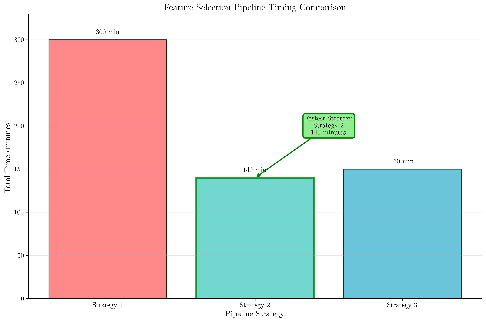
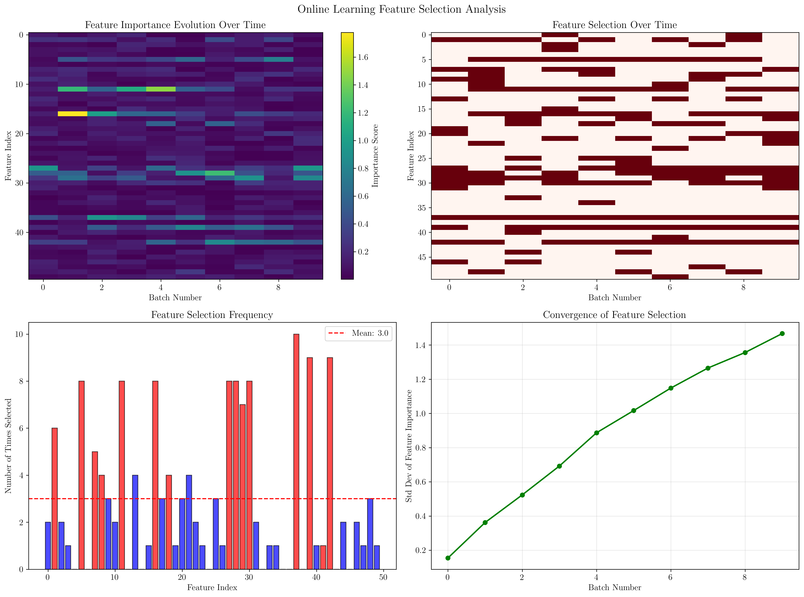
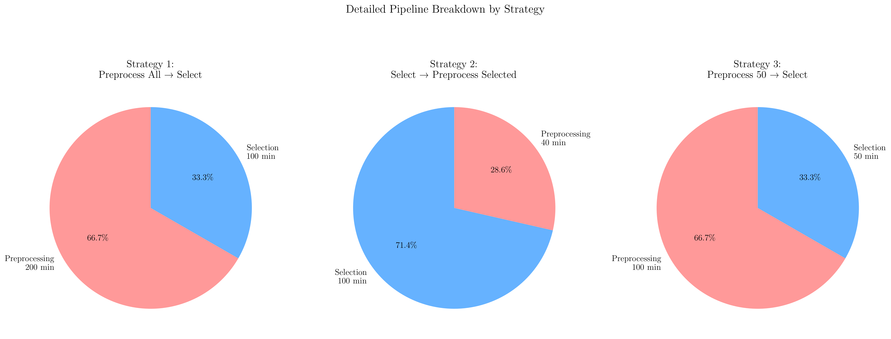
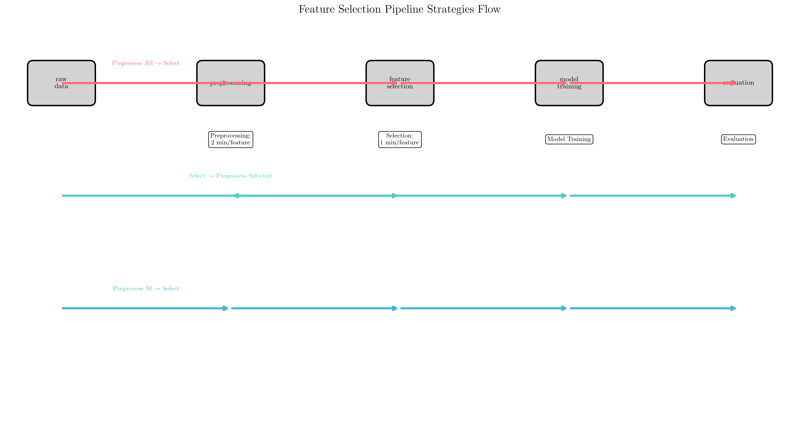
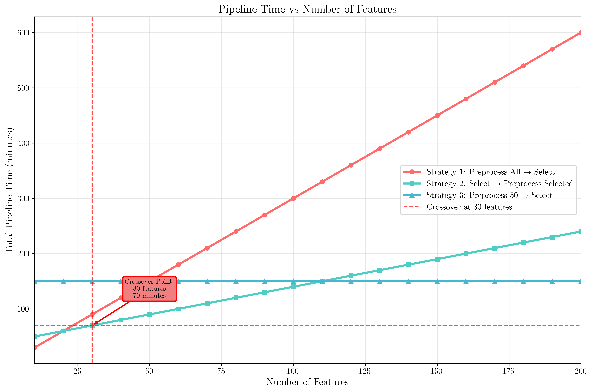

# Question 16: Feature Selection Timing in Machine Learning Pipeline

## Problem Statement
Feature selection can be applied at different stages of the machine learning pipeline, and the timing of when to perform feature selection can significantly impact the overall efficiency and effectiveness of the pipeline.

### Task
1. When is the best time to perform feature selection?
2. What happens if you select features before preprocessing?
3. If preprocessing takes $2$ minutes per feature and feature selection takes $1$ minute per feature, calculate the total pipeline time for three strategies: $(1)$ preprocess all $100$ features then select $20$, $(2)$ select $20$ features then preprocess them, $(3)$ preprocess $50$ features then select $20$. Which strategy is fastest and by how much?
4. How do you handle feature selection in online learning scenarios?

## Understanding the Problem
Feature selection is a critical step in machine learning that involves choosing the most relevant features from a dataset. The timing of feature selection in the pipeline affects computational efficiency, resource utilization, and model performance. Understanding when to perform feature selection relative to preprocessing steps is essential for optimizing the entire machine learning workflow.

The problem explores three different pipeline strategies and analyzes their computational costs, helping us understand the trade-offs between different approaches to feature selection timing.

## Solution

### Step 1: Best Time to Perform Feature Selection
The optimal timing for feature selection depends on several factors:

**Before preprocessing:**
- **Advantages:** Reduces computational overhead by eliminating irrelevant features early
- **Disadvantages:** May miss important features that become relevant after preprocessing transformations
- **Best for:** High-dimensional datasets where most features are truly irrelevant

**After preprocessing:**
- **Advantages:** Captures features that become relevant after scaling, normalization, or transformation
- **Disadvantages:** Higher computational cost as all features must be processed
- **Best for:** Datasets where preprocessing significantly changes feature relevance

**Hybrid approach:**
- **Advantages:** Balances efficiency and effectiveness
- **Disadvantages:** More complex pipeline design
- **Best for:** Large datasets with mixed feature relevance patterns

### Step 2: Consequences of Selecting Features Before Preprocessing
Selecting features before preprocessing can lead to several issues:

1. **Loss of potentially relevant features:** Some features may become important after scaling or transformation
2. **Suboptimal feature set:** The selected features may not be the best choice for the final model
3. **Reduced model performance:** Missing important features can lead to lower accuracy
4. **Inefficient resource usage:** Time spent on irrelevant features that could have been eliminated earlier

### Step 3: Pipeline Timing Analysis
Let's calculate the total pipeline time for each strategy:

**Given parameters:**
- Preprocessing time per feature: $2$ minutes
- Feature selection time per feature: $1$ minute
- Total features: $100$
- Selected features: $20$
- Preprocessed features in Strategy 3: $50$

**Strategy 1: Preprocess all $100$ features then select $20$**
$$\text{Time} = 100 \times 2 + 100 \times 1 = 200 + 100 = 300 \text{ minutes}$$

**Strategy 2: Select $20$ features then preprocess them**
$$\text{Time} = 100 \times 1 + 20 \times 2 = 100 + 40 = 140 \text{ minutes}$$

**Strategy 3: Preprocess $50$ features then select $20$**
$$\text{Time} = 50 \times 2 + 50 \times 1 = 100 + 50 = 150 \text{ minutes}$$

**Results:**
- **Fastest:** Strategy 2 (140 minutes)
- **Slowest:** Strategy 1 (300 minutes)
- Strategy 1 is 160 minutes slower than Strategy 2
- Strategy 3 is 10 minutes slower than Strategy 2

The bar chart shows the clear advantage of Strategy 2, which processes only the selected features through the expensive preprocessing step.

### Step 4: Online Learning Feature Selection
In online learning scenarios, feature selection must be handled differently:

1. **Incremental feature evaluation:** Features are evaluated as new data arrives
2. **Adaptive selection:** The feature set can change over time based on new information
3. **Stability considerations:** Frequent changes in feature selection can destabilize the model
4. **Memory constraints:** Limited memory requires efficient feature importance tracking

The online learning analysis shows how feature importance evolves over time and how the selection process adapts to new data while maintaining stability.

## Practical Implementation

### Pipeline Strategy Selection Guidelines
1. **Use Strategy 2 (Select → Preprocess)** when:
   - Most features are likely irrelevant
   - Preprocessing is computationally expensive
   - You have good domain knowledge about feature relevance

2. **Use Strategy 1 (Preprocess → Select)** when:
   - Preprocessing significantly changes feature relevance
   - You need to capture all potential feature interactions
   - Computational resources are not a constraint

3. **Use Strategy 3 (Hybrid)** when:
   - You want to balance efficiency and effectiveness
   - You can estimate which features are most likely to be relevant
   - You have moderate computational constraints

### Alternative Approaches
- **Recursive feature elimination:** Iteratively remove least important features
- **Forward selection:** Start with no features and add them one by one
- **Genetic algorithms:** Use evolutionary approaches for feature subset selection
- **Embedded methods:** Let the model select features during training

## Visual Explanations

### Pipeline Timing Comparison

This visualization clearly shows that Strategy 2 is the fastest approach, taking only 140 minutes compared to 300 minutes for Strategy 1. The green highlighting emphasizes the optimal strategy.

### Detailed Pipeline Breakdown

The pie charts show the time distribution between preprocessing and selection for each strategy. Strategy 2 has the most balanced distribution, with selection taking 71.4% of the time and preprocessing taking 28.6%.

### Pipeline Flow Visualization

This flowchart shows the different paths each strategy takes through the pipeline stages. Strategy 2 takes a more direct route by selecting features early, while Strategy 1 processes all features through every stage.

### Time Complexity Analysis

The time complexity analysis shows how different strategies scale with the number of features. Strategy 2 maintains a constant preprocessing cost (for 20 features) while Strategy 1 scales linearly with the total number of features.

### Online Learning Analysis

This comprehensive analysis shows how feature selection works in online learning scenarios, including feature importance evolution, selection stability, and convergence patterns.

## Key Insights

### Computational Efficiency
- **Strategy 2 is optimal** because it minimizes the number of features processed through expensive preprocessing steps
- **Early feature selection** can save significant computational resources
- **The crossover point** between strategies depends on the relative costs of preprocessing vs. selection

### Pipeline Design Principles
- **Minimize expensive operations** on irrelevant features
- **Balance efficiency with effectiveness** based on domain knowledge
- **Consider the full pipeline cost**, not just individual step costs
- **Adapt strategies** based on dataset characteristics and computational constraints

### Online Learning Considerations
- **Feature selection must be adaptive** to changing data distributions
- **Stability is crucial** for maintaining model performance
- **Incremental evaluation** allows for real-time feature relevance assessment
- **Memory efficiency** is essential for long-running online systems

### Practical Trade-offs
- **Speed vs. Accuracy:** Faster pipelines may miss important features
- **Resource vs. Performance:** Computational constraints may force suboptimal strategies
- **Flexibility vs. Stability:** Adaptive approaches may introduce instability
- **Simplicity vs. Optimization:** Complex strategies may be harder to maintain

## Conclusion
- **Strategy 2 (Select → Preprocess)** is the fastest approach, taking 140 minutes compared to 300 minutes for Strategy 1
- **Early feature selection** can save significant computational resources by avoiding expensive preprocessing on irrelevant features
- **The optimal strategy** depends on the relative costs of preprocessing vs. selection and the expected feature relevance
- **Online learning** requires adaptive feature selection approaches that balance efficiency with stability
- **Pipeline design** should consider the full computational cost, not just individual step costs

The key insight is that feature selection timing significantly impacts pipeline efficiency, and the optimal approach depends on understanding the computational costs and feature relevance patterns in your specific domain.
