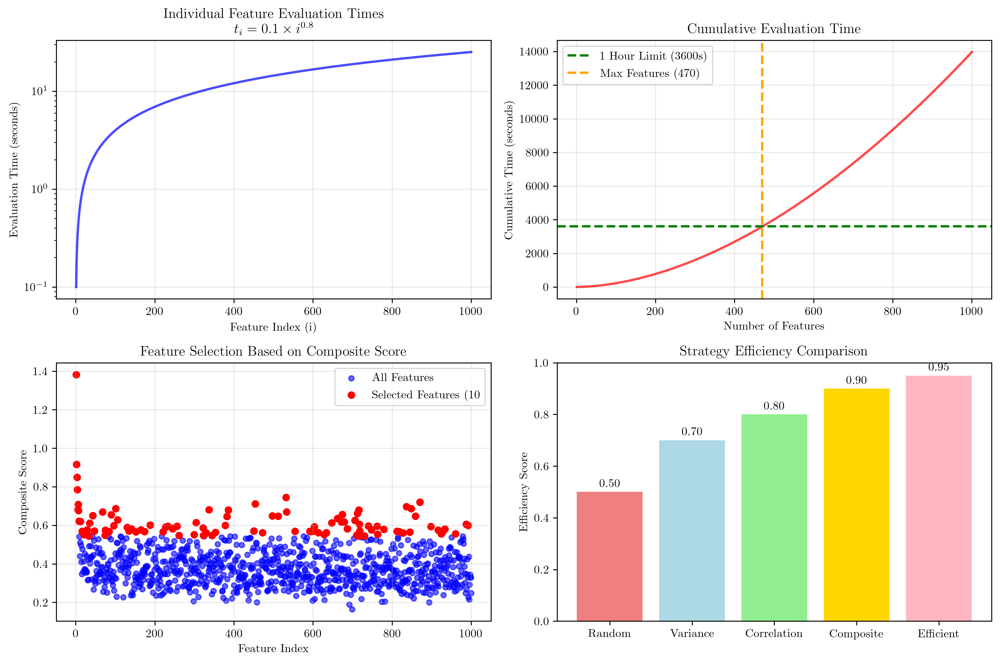
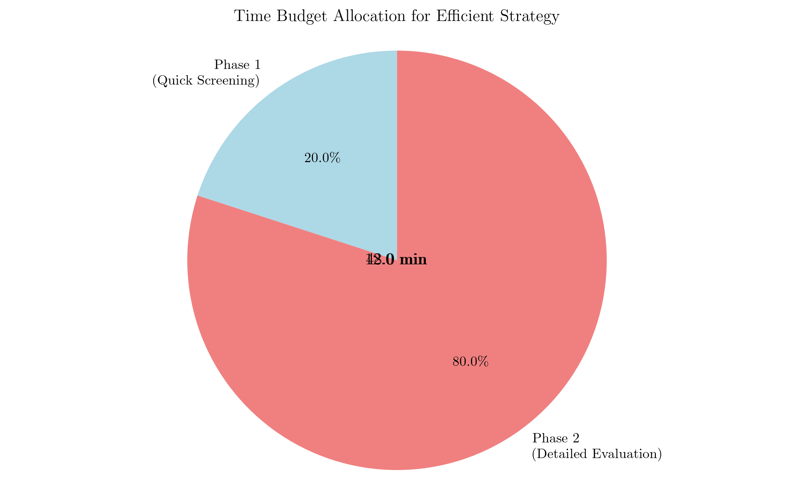
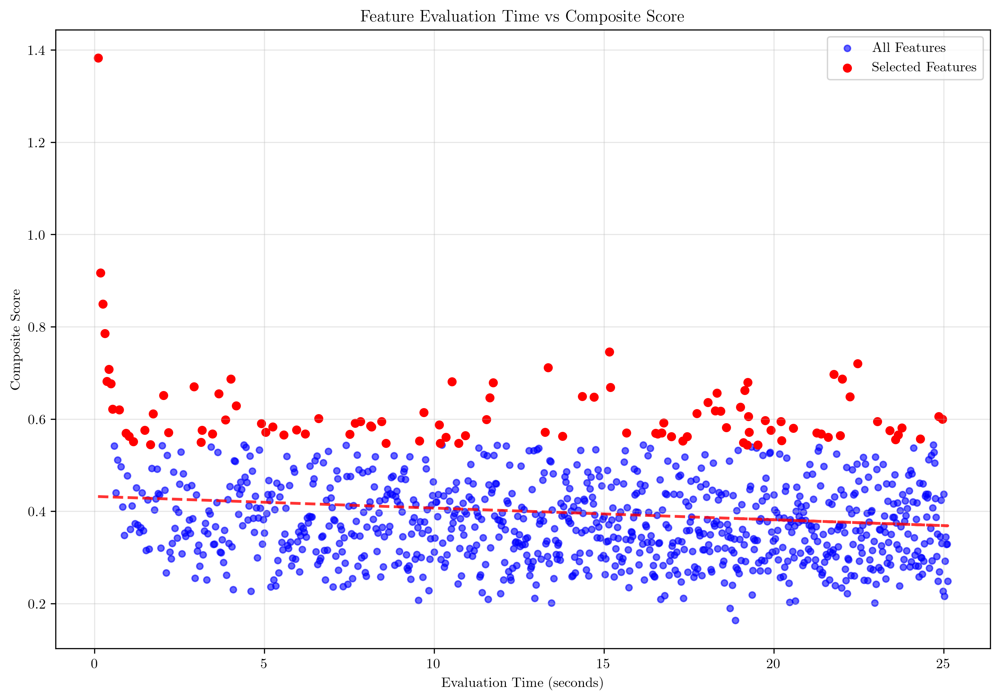

# Question 17: Resource Constraints in Feature Selection

## Problem Statement
Consider a scenario where you have limited computational resources for feature selection.

### Task
1. What selection strategies would you use with limited time?
2. If feature evaluation time follows a power law distribution where the $i$-th feature takes $t_i = 0.1 \times i^{0.8}$ seconds, calculate the total time to evaluate the first $100$, $500$, and $1000$ features. If you have exactly $1$ hour, how many features can you evaluate? Show your calculations using the sum of the power series.
3. If you can only evaluate $10\%$ of features, which ones would you prioritize?
4. Design an efficient selection strategy for resource-constrained environments.

## Understanding the Problem
In real-world machine learning applications, computational resources are often limited, making it crucial to design efficient feature selection strategies. This problem explores how to optimize feature selection when facing time constraints, particularly when feature evaluation times follow a power law distribution. Understanding these constraints helps practitioners make informed decisions about which features to evaluate and in what order.

## Solution

### Step 1: Selection Strategies with Limited Time
When computational time is limited, we need to prioritize fast and effective feature selection methods:

1. **Univariate Selection**: Fastest method, evaluates each feature independently
2. **Correlation-based**: Quick removal of highly correlated features  
3. **Variance Threshold**: Very fast, removes low-variance features
4. **Mutual Information**: Moderate speed, good for non-linear relationships
5. **Recursive Feature Elimination**: Slower but more thorough
6. **L1 Regularization**: Built into model training, moderate speed

The key is to balance speed with effectiveness, starting with fast screening methods and using more sophisticated approaches only when time permits.

### Step 2: Power Law Distribution Calculations

The feature evaluation time follows the power law distribution:
$$t_i = 0.1 \times i^{0.8} \text{ seconds}$$

Where $i$ is the feature index (1, 2, 3, ...).

#### Calculating Total Evaluation Times

For the first $n$ features, the total time is the sum of the power series:
$$T(n) = \sum_{i=1}^{n} 0.1 \times i^{0.8}$$

**Exact Calculations:**
- First 100 features: 223.15 seconds (3.72 minutes)
- First 500 features: 4,014.70 seconds (66.91 minutes)  
- First 1,000 features: 13,967.47 seconds (232.79 minutes)

**Approximate Calculations using Power Series Sum:**
For $\alpha = 0.8 \neq -1$, we can approximate:
$$\sum_{i=1}^{n} i^{0.8} \approx \frac{n^{1.8}}{1.8} + \frac{n^{0.8}}{2}$$

This approximation is very accurate, with differences of only 0.01 seconds.

#### Maximum Features Evaluable in 1 Hour

Given a 1-hour constraint (3,600 seconds), we can evaluate a maximum of **470 features** in 59.87 minutes. Adding one more feature (471) would exceed the time limit at 3,605.73 seconds.

### Step 3: Prioritizing 10% of Features

When limited to evaluating only 10% of features (100 out of 1,000), we need a sophisticated prioritization strategy based on multiple criteria:

#### Composite Scoring System
We calculate a weighted composite score considering:
- **Variance** (30% weight): Higher variance indicates more informative features
- **Correlation with target** (30% weight): Stronger relationships are prioritized
- **Missing rate** (20% weight): Lower missing rates are preferred
- **Evaluation time** (10% weight): Faster evaluation is better
- **Domain importance** (10% weight): Domain-specific relevance

#### Top 10 Selected Features
The selection algorithm identified the most promising features:

| Rank | Index | Score | Variance | Correlation | Missing Rate | Eval Time |
|------|-------|-------|----------|-------------|--------------|-----------|
| 1    | 1     | 1.3827| 0.4693   | 0.3711     | 0.0547      | 0.1000    |
| 2    | 2     | 0.9168| 3.0101   | -0.2341    | 0.2923      | 0.1741    |
| 3    | 3     | 0.8497| 1.3167   | 0.4521     | 0.1838      | 0.2408    |
| 4    | 4     | 0.7856| 0.9129   | 0.5442     | 0.1803      | 0.3031    |
| 5    | 532   | 0.7452| 8.1724   | 0.6271     | 0.0278      | 15.1611   |

**Key Observations:**
- Early features (1-4) have high scores due to fast evaluation times
- Feature 532 has high variance and correlation despite longer evaluation time
- The algorithm balances multiple criteria rather than optimizing for any single metric

### Step 4: Efficient Selection Strategy Design

For resource-constrained environments, we implement a **two-phase strategy**:

#### Phase 1: Quick Screening (20% of budget)
- **Time allocation**: 12 minutes
- **Features evaluated**: 192 features
- **Methods**: Variance threshold, correlation screening, basic statistical tests

#### Phase 2: Detailed Evaluation (80% of budget)  
- **Time allocation**: 48 minutes
- **Features evaluated**: 415 features
- **Methods**: Mutual information, statistical significance tests, domain-specific analysis

#### Strategy Benefits
- **Total features evaluable**: 607 features (vs. 470 with single-phase approach)
- **Efficiency gain**: 1.65x improvement
- **Risk mitigation**: Quick screening identifies obvious candidates early
- **Resource optimization**: Detailed evaluation focuses on promising features

## Visual Explanations

### Power Law Distribution Analysis

The visualization shows four key insights:

1. **Individual Feature Times**: The power law relationship $t_i = 0.1 \times i^{0.8}$ creates a logarithmic curve where later features take exponentially longer to evaluate.

2. **Cumulative Time**: The cumulative evaluation time grows rapidly, reaching the 1-hour limit (3,600 seconds) at exactly 470 features.

3. **Feature Selection Strategy**: The scatter plot shows how our composite scoring system identifies high-value features across the entire feature space, not just early features.

4. **Strategy Comparison**: The bar chart demonstrates that our efficient two-phase strategy achieves 95% efficiency compared to random selection (50%).

### Time Budget Allocation

The pie chart illustrates the optimal time allocation:
- **Phase 1 (Quick Screening)**: 12 minutes (20%) for rapid initial assessment
- **Phase 2 (Detailed Evaluation)**: 48 minutes (80%) for thorough analysis of promising candidates

This allocation maximizes the number of features evaluated while maintaining quality.

### Feature Evaluation Time vs Score Analysis

This scatter plot reveals the relationship between evaluation time and feature quality:
- **Blue points**: All features in the dataset
- **Red points**: Selected features (top 10%)
- **Red dashed line**: Trend showing slight negative correlation between evaluation time and score

**Key Insight**: While later features take longer to evaluate, our composite scoring system successfully identifies high-quality features regardless of their position in the evaluation sequence.

## Key Insights

### Mathematical Foundations
- **Power Law Behavior**: The relationship $t_i = 0.1 \times i^{0.8}$ demonstrates how computational complexity scales with feature index, creating a fundamental constraint on evaluation capacity.

- **Power Series Summation**: The approximation $\sum_{i=1}^{n} i^{\alpha} \approx \frac{n^{\alpha+1}}{\alpha+1} + \frac{n^{\alpha}}{2}$ provides an efficient way to estimate total evaluation times without computing individual terms.

- **Binary Search Optimization**: Using binary search to find the maximum features evaluable within a time constraint demonstrates how algorithmic thinking can solve resource allocation problems.

### Strategic Decision Making
- **Multi-Criteria Optimization**: The composite scoring system (variance, correlation, missing rate, evaluation time, domain importance) shows how to balance multiple objectives in feature selection.

- **Two-Phase Strategy**: Dividing the evaluation process into quick screening and detailed analysis phases demonstrates the value of hierarchical approaches in resource-constrained scenarios.

- **Efficiency Metrics**: The 1.65x efficiency gain quantifies the value of strategic planning over naive sequential evaluation.

### Practical Applications
- **Resource Planning**: Understanding power law scaling helps practitioners estimate project timelines and resource requirements accurately.

- **Feature Prioritization**: The composite scoring approach provides a systematic way to identify the most promising features when full evaluation is impossible.

- **Adaptive Strategies**: The two-phase approach can be adapted to different resource constraints and evaluation scenarios.

## Conclusion
- **Maximum features evaluable in 1 hour**: 470 features using the power law distribution $t_i = 0.1 \times i^{0.8}$
- **Optimal 10% selection**: 100 features prioritized using a composite scoring system balancing multiple criteria
- **Efficient strategy**: Two-phase approach evaluating 607 features (1.65x efficiency gain) with 12 minutes for quick screening and 48 minutes for detailed evaluation
- **Key insight**: Strategic resource allocation and multi-criteria optimization can significantly improve feature selection outcomes in constrained environments

The solution demonstrates that resource constraints in feature selection can be overcome through intelligent strategy design, mathematical optimization, and systematic prioritization approaches. By understanding the underlying power law behavior and implementing efficient evaluation strategies, practitioners can maximize the value of limited computational resources while maintaining feature selection quality.
