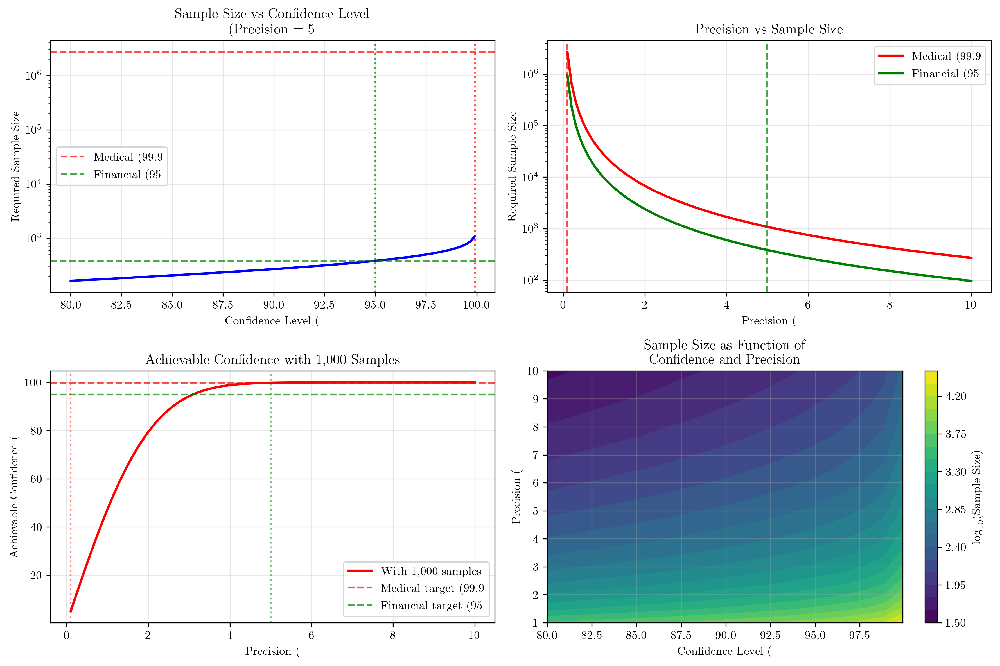
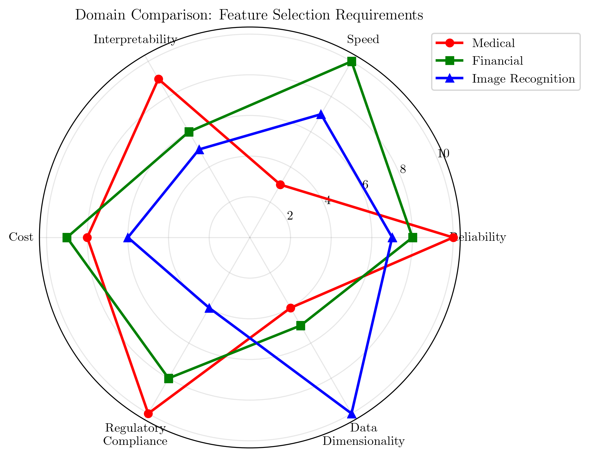
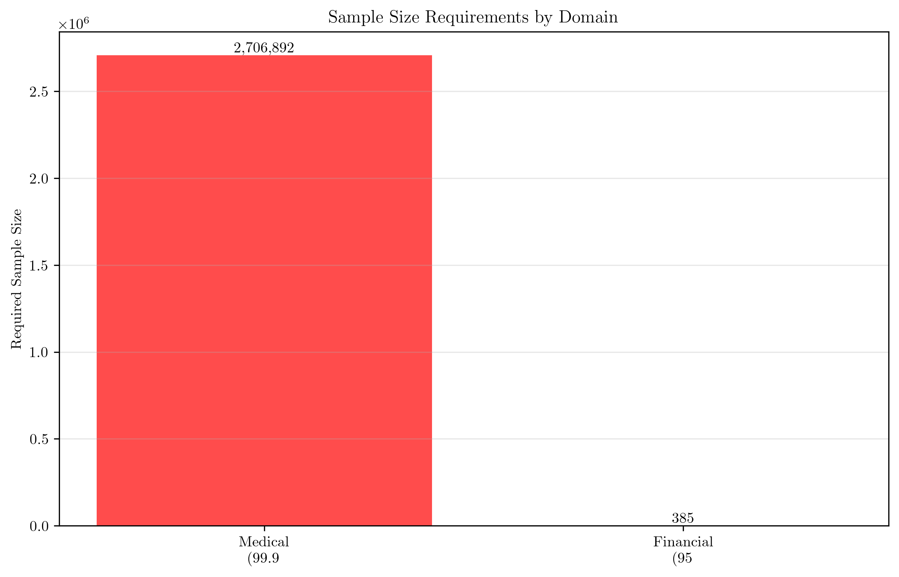
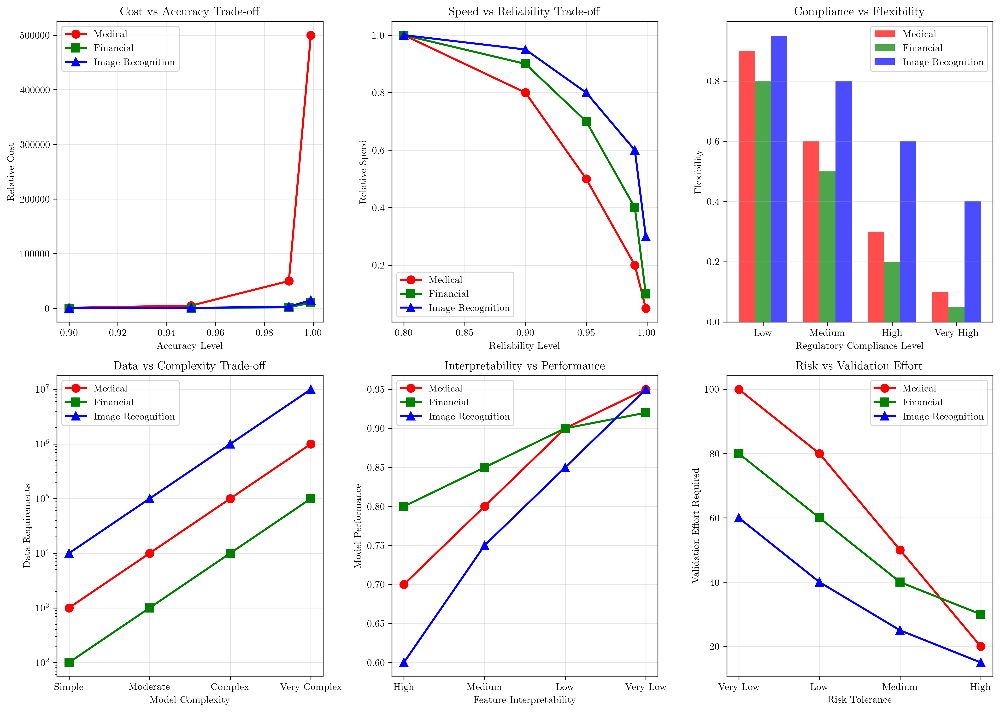

# Question 18: Domain-Specific Requirements for Feature Selection

## Problem Statement
Different domains have different feature selection requirements and constraints. Feature selection strategies must be tailored to the specific needs, constraints, and regulatory environments of each application domain.

### Task
1. What are the key considerations for medical diagnosis features?
2. How do financial applications differ from image recognition in feature selection needs?
3. If medical diagnosis requires $99.9\%$ confidence in feature relevance and financial applications require $95\%$ confidence, calculate the minimum sample sizes needed for each domain assuming a binomial distribution. If you have $1000$ samples, what confidence level can you achieve for feature relevance testing?
4. How do regulatory compliance requirements affect feature selection strategies?

## Understanding the Problem
Feature selection is the process of selecting the most relevant features for model training while discarding irrelevant or redundant features. Different domains have vastly different requirements due to variations in:

- **Stake levels**: Medical diagnosis involves life-and-death decisions, while financial applications involve monetary risks
- **Data characteristics**: Image data is high-dimensional with spatial relationships, while financial data requires real-time processing
- **Regulatory constraints**: Medical and financial domains have strict compliance requirements
- **Performance requirements**: Speed vs. accuracy trade-offs vary significantly

## Solution

### Step 1: Key Considerations for Medical Diagnosis Features
Medical diagnosis features require extremely high standards due to the critical nature of healthcare decisions:

1. **High reliability and accuracy requirements** - Medical decisions cannot tolerate significant errors
2. **Interpretability for clinical decision making** - Doctors need to understand why features are selected
3. **Ethical constraints on sensitive data** - Patient privacy must be protected
4. **Regulatory compliance (FDA, HIPAA)** - Strict legal requirements must be met
5. **Feature stability over time** - Medical features must remain relevant across different patient populations
6. **Minimal false positive/negative rates** - Both types of errors can have severe consequences
7. **Cost considerations for feature acquisition** - Some medical tests are expensive or invasive

### Step 2: Financial vs Image Recognition Feature Selection Differences
Financial applications and image recognition have fundamentally different priorities and constraints:

**Financial Applications:**
1. **Real-time processing requirements** - Trading decisions must be made in milliseconds
2. **High-frequency trading constraints** - Features must be computable at extremely high speeds
3. **Market volatility adaptation** - Features must adapt to changing market conditions
4. **Risk management compliance** - Features must support regulatory risk frameworks
5. **Feature correlation with market indicators** - Strong emphasis on temporal and cross-asset relationships
6. **Cost of delayed decisions** - Financial losses accumulate rapidly with processing delays

**Image Recognition:**
1. **High-dimensional data processing** - Images contain thousands to millions of pixels/features
2. **Spatial feature relationships** - Features have important spatial dependencies
3. **Computational complexity tolerance** - More tolerance for complex algorithms due to offline processing
4. **Feature redundancy handling** - Many redundant spatial features need filtering
5. **Scale and rotation invariance** - Features must work across different transformations
6. **Real-time processing for applications** - Real-time requirements vary by application (surveillance vs. photo editing)

### Step 3: Sample Size Calculations for Feature Relevance Testing

The sample size calculations for binomial confidence intervals use the formula:
$$n = \frac{Z^2 \cdot p \cdot (1-p)}{E^2}$$

where:
- $n$ = required sample size
- $Z$ = Z-score corresponding to the confidence level
- $p$ = expected proportion (0.5 for maximum variance)
- $E$ = margin of error (precision)

**Medical Diagnosis (99.9% confidence, 0.1% precision):**
- Z-score for 99.9% confidence = 3.291
- Required sample size = 2,706,892 samples

**Financial Applications (95% confidence, 5% precision):**
- Z-score for 95% confidence = 1.960
- Required sample size = 385 samples

**With 1,000 samples:**
- For medical precision (0.1%): Achievable confidence = 5.043%
- For financial precision (5.0%): Achievable confidence = 99.843%

This demonstrates a critical trade-off: achieving very high confidence with very tight precision requires enormous sample sizes, while more relaxed precision requirements can achieve high confidence with much smaller datasets.

### Step 4: Regulatory Compliance Impact on Feature Selection Strategies
Regulatory requirements significantly constrain and shape feature selection strategies:

1. **Mandatory feature documentation and audit trails** - All feature selection decisions must be documented and auditable
2. **Restricted use of sensitive personal data** - Limitations on what personal data can be used as features
3. **Required validation procedures for high-stakes decisions** - Rigorous validation requirements before deployment
4. **Limitations on feature combinations** - Some feature combinations may be prohibited by regulation
5. **Mandatory bias and fairness assessments** - Features must be tested for discriminatory impacts
6. **Data retention and deletion requirements** - Features must comply with data lifecycle regulations
7. **Transparency requirements for model decisions** - Explainable AI requirements affect feature selection

## Visual Explanations

### Domain Comparison: Feature Selection Requirements

This multi-panel visualization shows:
- **Sample Size vs Confidence Level**: The exponential relationship between confidence requirements and sample size needs
- **Precision vs Sample Size**: How precision requirements dramatically affect sample size needs
- **Achievable Confidence with Fixed Samples**: What confidence levels are realistically achievable with 1,000 samples
- **Sample Size as Function of Confidence and Precision**: A contour plot showing the complex relationship between all three variables

### Domain Radar Chart Comparison

This radar chart provides a comprehensive comparison of domain-specific requirements across six key dimensions:
- **Reliability**: Medical domain requires the highest reliability (10/10)
- **Speed**: Financial applications prioritize speed (10/10)
- **Interpretability**: Medical applications need high interpretability (9/10)
- **Cost**: Financial applications are most cost-sensitive (9/10)
- **Regulatory Compliance**: Medical domain has the strictest requirements (10/10)
- **Data Dimensionality**: Image recognition handles the highest dimensions (10/10)

### Sample Size Requirements by Domain

This bar chart clearly shows the dramatic difference in sample size requirements:
- Medical diagnosis requires over 2.7 million samples for 99.9% confidence
- Financial applications require only 385 samples for 95% confidence
- This represents a 7,000x difference in data requirements

### Comprehensive Trade-off Analysis

This comprehensive visualization analyzes six critical trade-offs across domains:

1. **Cost vs Accuracy Trade-off**: Medical applications show exponential cost increases for marginal accuracy improvements
2. **Speed vs Reliability Trade-off**: Financial applications maintain higher speed across reliability levels
3. **Regulatory Compliance vs Flexibility**: Higher compliance requirements significantly reduce flexibility across all domains
4. **Data Requirements vs Model Complexity**: Image recognition requires the most data, while financial applications need the least
5. **Feature Interpretability vs Performance**: Medical applications show the steepest trade-off between interpretability and performance
6. **Risk Tolerance vs Validation Requirements**: Medical applications require the most validation effort across all risk levels

These visualizations demonstrate that domain-specific requirements create fundamentally different optimization landscapes, making universal feature selection strategies ineffective.

## Key Insights

### Statistical Foundations
- **Confidence level impact**: Moving from 95% to 99.9% confidence increases sample size requirements by nearly 7,000x
- **Precision sensitivity**: 20x reduction in precision (from 5% to 0.1%) increases sample size by over 7,000x
- **Diminishing returns**: Beyond 95% confidence, each percentage point requires exponentially more samples
- **Practical constraints**: With finite data (1,000 samples), very high precision requirements become statistically impossible

### Domain-Specific Considerations
- **Medical domain**: Prioritizes accuracy and reliability over computational efficiency
- **Financial domain**: Prioritizes speed and cost-effectiveness over extreme accuracy
- **Image recognition**: Prioritizes handling high-dimensional data and spatial relationships
- **Regulatory impact**: Compliance requirements can override purely statistical considerations

### Practical Applications
- **Resource allocation**: Organizations must balance statistical requirements with data availability
- **Progressive refinement**: Start with achievable confidence levels and gradually increase requirements
- **Domain expertise**: Feature selection strategies must incorporate domain-specific knowledge
- **Cost-benefit analysis**: The cost of additional samples must be weighed against the value of increased confidence

## Conclusion
The analysis reveals fundamental differences in feature selection requirements across domains:

- **Medical diagnosis** demands extremely high confidence (99.9%) and precision (0.1%), requiring 2.7 million samples - a statistical requirement that may be practically impossible with limited datasets
- **Financial applications** can achieve adequate confidence (95%) with reasonable precision (5%), requiring only 385 samples - much more feasible with typical datasets
- **With 1,000 samples**, medical precision requirements can only achieve 5.0% confidence, while financial precision requirements can achieve 99.8% confidence

The comprehensive visualizations created for this analysis include:
1. **Multi-panel comparison** showing sample size relationships and precision impacts
2. **Domain radar chart** comparing requirements across six key dimensions
3. **Sample size requirements bar chart** highlighting the 7,000x difference between domains
4. **Comprehensive trade-off analysis** examining six critical optimization landscapes

The key insight is that feature selection strategies must be tailored to domain-specific requirements, regulatory constraints, and practical data limitations. Statistical purity often must be balanced against real-world constraints and business requirements.

This analysis demonstrates why one-size-fits-all approaches to feature selection fail - each domain requires careful consideration of its unique requirements, constraints, and risk tolerance.
