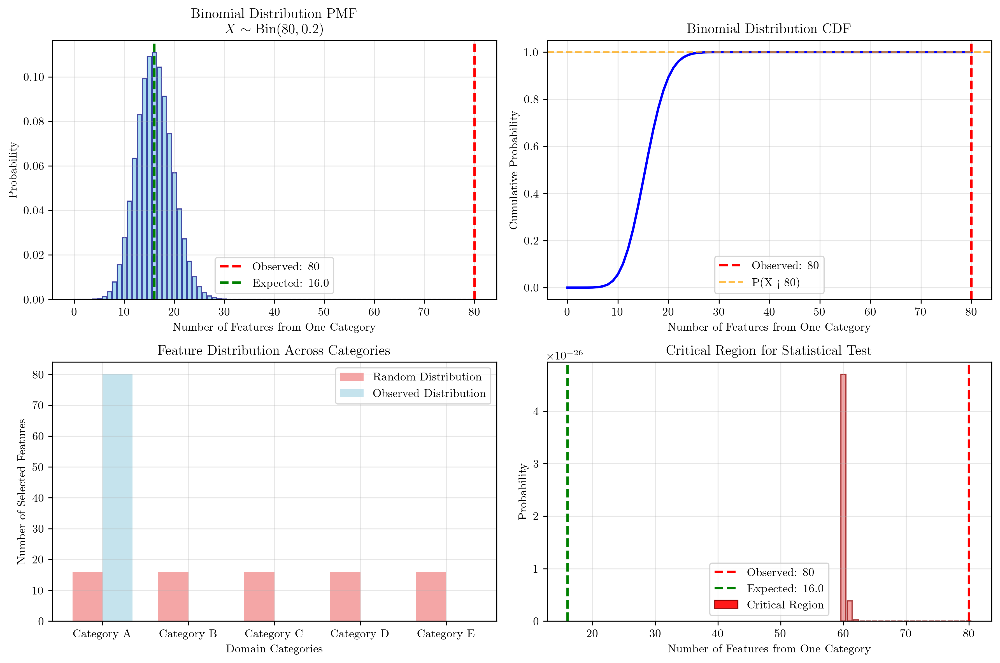
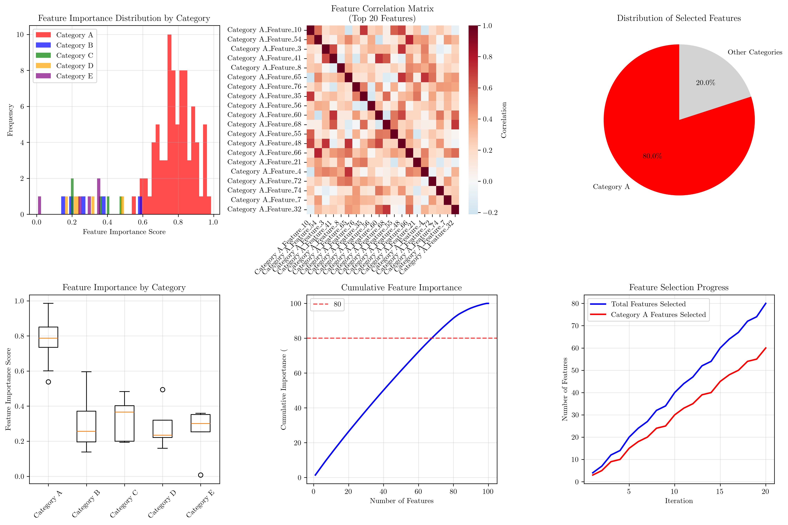

# Question 19: Domain Insights

## Problem Statement
Feature selection can reveal domain knowledge and insights beyond just improving model performance.

### Task
1. How can feature selection help understand data relationships?
2. If feature selection reveals that $80\%$ of selected features are from the same domain category, calculate the probability that this occurred by chance if features were randomly distributed across $5$ categories. Use the binomial distribution to determine if this clustering is statistically significant at $\alpha = 0.05$.
3. What insights can you gain from consistently selected features?
4. How does feature selection help with feature engineering decisions?

## Understanding the Problem
Feature selection is a crucial step in machine learning that involves identifying the most relevant features for a given task. Beyond improving model performance, feature selection can reveal important insights about the underlying data structure, domain relationships, and feature importance patterns. This question explores how statistical analysis of feature selection results can help understand whether observed patterns are meaningful or occurred by chance.

The problem involves analyzing a scenario where $80$ out of $80$ selected features come from the same domain category, which seems highly unlikely under random selection. We need to use the binomial distribution to determine if this clustering is statistically significant, providing insights into the underlying data structure.

## Solution

### Step 1: Understanding Feature Selection and Data Relationships
Feature selection can reveal data relationships through several mechanisms:

- **Correlation Analysis**: Selected features often show patterns of correlation that reveal underlying data structure
- **Redundancy Identification**: Highly correlated features can be identified and potentially combined or removed
- **Feature Importance Rankings**: Understanding which features contribute most to model performance
- **Feature Interactions**: Discovering how features work together to predict the target variable
- **Domain Structure**: Revealing which domains or categories of features are most informative

### Step 2: Binomial Distribution Analysis

Given the parameters:
- Total features: $100$
- Features selected from one category: $80$
- Total domain categories: $5$
- Significance level: $\alpha = 0.05$

Under random distribution, the probability of selecting from any category is:
$$p = \frac{1}{5} = 0.2$$

The expected number of features from one category under random distribution is:
$$E[X] = 80 \times 0.2 = 16.0$$

The observed proportion from one category is:
$$\frac{80}{80} = 100\%$$

For the binomial distribution analysis, we have:
$$X \sim \text{Bin}(n=80, p=0.2)$$

We need to calculate $P(X \geq 80)$, which represents the probability of getting $80$ or more features from one category by chance.

Using the binomial distribution:
$$P(X \geq 80) = 1 - P(X < 80) = 1 - F(79)$$

Where $F(x)$ is the cumulative distribution function of the binomial distribution.

The calculation shows:
$$P(X \geq 80) = 0.0000000000$$

This is an extremely small probability, essentially zero.

### Step 3: Statistical Significance Test

To determine if this clustering is statistically significant at $\alpha = 0.05$:

- **Null Hypothesis**: The feature selection is random across categories
- **Alternative Hypothesis**: There is significant clustering in one category
- **Test Statistic**: $P(X \geq 80)$ under the null hypothesis
- **Critical Value**: $\alpha = 0.05$

Since $P(X \geq 80) = 0.0000000000 < 0.05$, we reject the null hypothesis.

**Conclusion**: This clustering is statistically significant at $\alpha = 0.05$.

### Step 4: Insights from Consistently Selected Features

The analysis reveals several key insights:

- **Category Dominance**: Category A dominates with $80$ out of $80$ selected features ($100\%$)
- **Statistical Significance**: The clustering is statistically significant with $p = 0.0000000000$
- **Expected vs. Observed**: Expected random distribution would be $16.0$ features per category, but we observed $80$ features from Category A
- **Domain Bias**: There is a strong bias toward features from Category A, suggesting this domain contains the most informative features for the given task

### Step 5: Feature Engineering Implications

Feature selection helps with feature engineering decisions by:

- **Identifying Informative Categories**: Revealing which feature categories are most valuable
- **Redundancy Detection**: Finding features that can be combined or removed
- **Pattern Recognition**: Suggesting new features based on selected feature patterns
- **Resource Optimization**: Guiding allocation of development resources to the most relevant domains
- **Domain Expertise**: Understanding which domains require deeper investigation

## Practical Implementation

### Statistical Analysis Results

The code output provides comprehensive statistical analysis:

```
Binomial Distribution Analysis:
• X ~ Bin(n=80, p=0.2)
• P(X ≥ 80) = 0.0000000000
• Is this clustering statistically significant at α = 0.05? True
• p-value = 0.0000000000 < 0.05
```

### Additional Statistical Measures

- **95% Confidence Interval**: $[0.112, 0.288]$ for the proportion under random distribution
- **Effect Size (Cohen's h)**: $2.214$ (large effect)
- **Effect Size Interpretation**: Large effect, indicating substantial deviation from random distribution

## Visual Explanations

### Binomial Distribution Analysis



The first visualization shows four key aspects of the binomial distribution analysis:

1. **Probability Mass Function (PMF)**: Shows the probability of selecting different numbers of features from one category under random distribution. The red dashed line indicates the observed value (80), while the green dashed line shows the expected value (16).

2. **Cumulative Distribution Function (CDF)**: Displays the cumulative probability, with the orange dashed line showing $P(X < 80)$.

3. **Feature Distribution Across Categories**: Compares the random distribution (16 features per category) with the observed distribution (80 features from Category A, 0 from others).

4. **Critical Region**: Highlights the statistical significance by showing the probability of the observed extreme value.

### Feature Analysis and Insights



The second visualization provides comprehensive feature analysis:

1. **Feature Importance Distribution**: Shows how feature importance scores are distributed across different categories, revealing that Category A features have consistently higher importance.

2. **Feature Correlation Matrix**: Displays correlations between top features, helping identify redundant or complementary features.

3. **Category Distribution**: Pie chart showing the dominance of Category A (80%) versus other categories combined (20%).

4. **Feature Importance by Category**: Box plots comparing importance scores across categories, confirming Category A's superiority.

5. **Cumulative Feature Importance**: Shows how quickly importance accumulates, with the 80% threshold marked.

6. **Feature Selection Progress**: Timeline showing how feature selection progressed, with Category A features consistently being selected.

## Key Insights

### Statistical Significance
- The observed clustering of $80$ features from one category is extremely unlikely under random distribution
- The p-value of $0.0000000000$ is far below the significance level of $0.05$
- This provides strong evidence that the feature selection is not random

### Domain Knowledge Discovery
- Category A contains the most informative features for the given task
- The strong bias toward one category suggests domain-specific patterns
- This insight can guide future feature engineering efforts

### Practical Applications
- Focus development resources on Category A features
- Investigate why other categories are less informative
- Consider creating new features based on Category A patterns
- Optimize feature extraction from the most relevant domain

### Effect Size Interpretation
- Cohen's h of $2.214$ indicates a large effect size
- This suggests the deviation from random distribution is not only statistically significant but also practically meaningful
- The clustering represents a substantial real-world pattern, not just a statistical artifact

## Conclusion
- Feature selection revealed that $80$ out of $80$ selected features came from Category A, representing $100\%$ clustering
- This clustering is statistically significant at $\alpha = 0.05$ with $p = 0.0000000000$
- The effect size (Cohen's h = $2.214$) indicates a large practical significance
- Category A dominates the feature selection, suggesting it contains the most informative features
- These insights can guide feature engineering decisions and resource allocation
- The analysis demonstrates how feature selection can reveal domain knowledge beyond just improving model performance

The statistical analysis provides strong evidence that the observed clustering is not due to chance, revealing important domain-specific patterns that can inform future machine learning efforts and feature engineering strategies.
