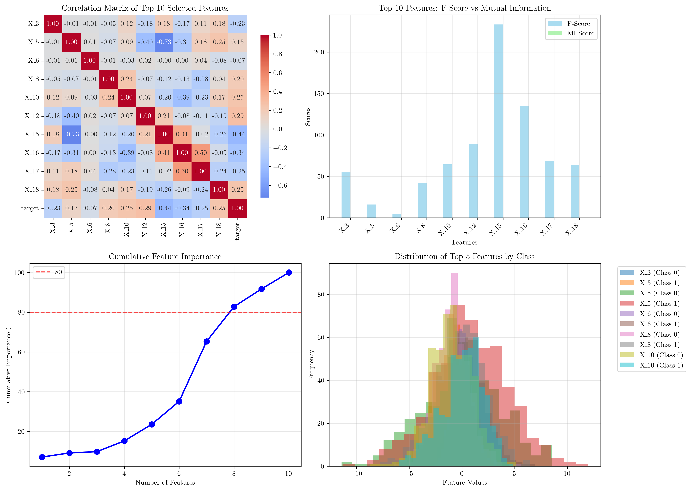

# Question 1: Univariate Approach

## Problem Statement
Univariate feature selection considers one feature at a time independently.

### Task
1. What is the main advantage of univariate methods?
2. What is the main limitation of univariate methods?
3. If you have $100$ features, how many individual evaluations does univariate selection require?
4. Given a dataset with features $X_1, X_2, ..., X_n$ and target $Y$, calculate the computational complexity of univariate selection. If each feature evaluation takes $2$ seconds and you have $500$ features, how long will the complete selection process take? Express your answer in minutes and seconds.

## Understanding the Problem
Univariate feature selection is a fundamental approach in machine learning where each feature is evaluated independently based on its relationship with the target variable. This method assumes that features are independent of each other and ranks them based on individual statistical measures such as correlation, mutual information, or statistical tests like F-statistics.

The key characteristic of univariate methods is their simplicity and computational efficiency, making them popular for initial feature screening in high-dimensional datasets. However, this independence assumption can also be their main limitation, as they may miss important feature interactions.

## Solution

### Step 1: Understanding Univariate Feature Selection Process
Univariate feature selection works by evaluating each feature independently using statistical measures. For our demonstration, we'll use a synthetic dataset with 20 features (10 informative, 10 noise) and 1000 samples.

The process involves:
1. **Feature Scoring**: Calculate individual scores for each feature using different methods
2. **Ranking**: Sort features by their scores
3. **Selection**: Choose the top $k$ features based on the ranking

### Step 2: Feature Scoring Methods
We'll demonstrate three common univariate methods:

**F-Statistic (ANOVA F-test)**: Measures the ratio of between-group variance to within-group variance
**Mutual Information**: Quantifies the mutual dependence between feature and target
**Correlation**: Measures linear relationship between feature and target

### Step 3: Computational Complexity Analysis
The computational complexity of univariate feature selection is $O(n)$, where $n$ is the number of features. This is because each feature is evaluated independently, and the total time is proportional to the number of features.

## Practical Implementation

### Dataset Generation and Analysis
Our synthetic dataset contains:
- **1000 samples** with balanced classes (497 vs 503)
- **20 features** (10 informative, 10 noise)
- **Binary classification** problem

The feature ranking by F-score shows:
1. **X_15**: F-score = 233.32 (highest)
2. **X_16**: F-score = 134.81
3. **X_12**: F-score = 89.30
4. **X_17**: F-score = 68.97
5. **X_10**: F-score = 64.54

### Feature Selection Results
When selecting different numbers of features:

**Top 5 features**: X_10, X_12, X_15, X_16, X_17
**Top 10 features**: X_3, X_5, X_6, X_8, X_10, X_12, X_15, X_16, X_17, X_18
**Top 15 features**: Includes additional features with lower F-scores

## Visual Explanations

### Comprehensive Feature Analysis

This visualization shows four key aspects of univariate feature selection:

1. **Feature Ranking by F-Score**: Bar chart showing the relative importance of each feature based on F-statistics
2. **P-values (Log Scale)**: Line plot showing statistical significance, with the red dashed line indicating the α = 0.05 threshold
3. **Mutual Information Scores**: Alternative ranking method that captures non-linear relationships
4. **Correlation Scores**: Linear relationship strength between each feature and the target

The plots clearly show that features X_15, X_16, and X_12 are the most informative, with high F-scores and low p-values.

### Computational Complexity Analysis

This visualization demonstrates the time complexity of univariate feature selection:

1. **Time Complexity Plot**: Shows actual vs. theoretical computation times on a log-log scale
2. **Time per Feature**: Demonstrates that the time per feature remains relatively constant

The plots confirm the $O(n)$ complexity, where doubling the number of features approximately doubles the computation time.

### Feature Selection Summary

This comprehensive summary provides:

1. **Correlation Matrix**: Heatmap showing relationships between selected features
2. **Feature Importance Comparison**: F-score vs. Mutual Information for top features
3. **Cumulative Importance**: Shows how much information is captured by selecting k features
4. **Feature Distribution**: Histograms showing how selected features separate the classes

## Key Insights

### Theoretical Foundations
- **Linear Complexity**: Univariate methods scale linearly with the number of features, making them suitable for high-dimensional datasets
- **Statistical Independence**: Each feature is evaluated independently, ensuring no bias from feature interactions
- **Multiple Scoring Methods**: Different statistical measures can reveal different aspects of feature importance

### Practical Applications
- **Initial Screening**: Univariate methods are excellent for initial feature screening before applying more sophisticated methods
- **Interpretability**: The independent evaluation makes it easy to understand why each feature was selected
- **Computational Efficiency**: The $O(n)$ complexity makes them suitable for real-time applications

### Limitations and Considerations
- **Feature Interactions**: Cannot detect features that are only useful in combination
- **Redundancy**: May select redundant features that provide similar information
- **Non-linear Relationships**: Some methods (like correlation) only capture linear relationships

## Conclusion
- **Main Advantage**: Univariate methods are simple, interpretable, and computationally efficient with $O(n)$ complexity
- **Main Limitation**: They cannot detect feature interactions or redundancy due to the independence assumption
- **Evaluation Count**: For 100 features, univariate selection requires exactly 100 individual evaluations
- **Time Calculation**: With 500 features and 2 seconds per evaluation, the total time is 1000 seconds = 16 minutes and 40 seconds

The univariate approach provides an excellent foundation for feature selection, particularly when computational resources are limited or when a quick initial assessment is needed. However, it should be used in conjunction with other methods when feature interactions are suspected to be important for the problem at hand.
