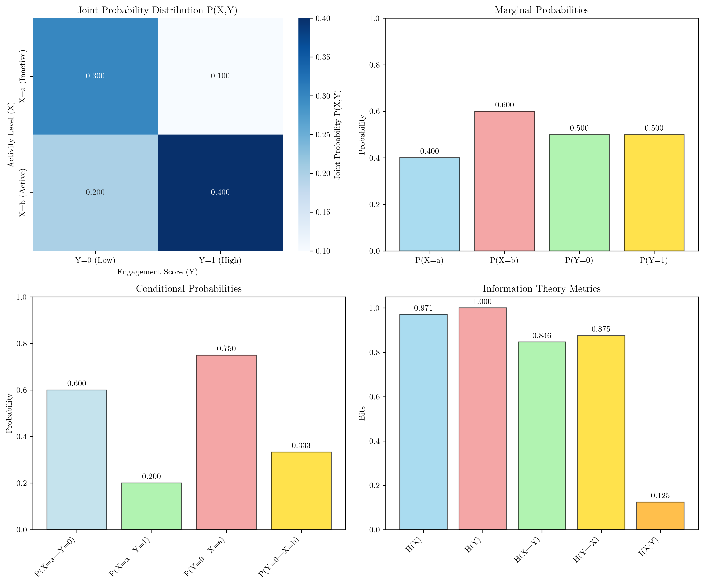
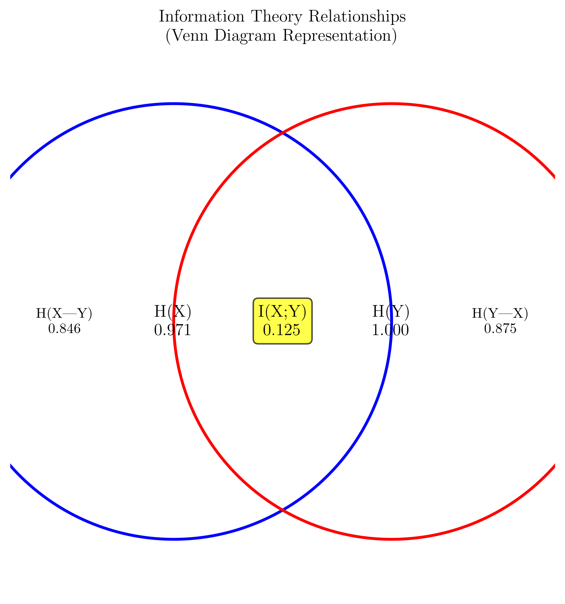
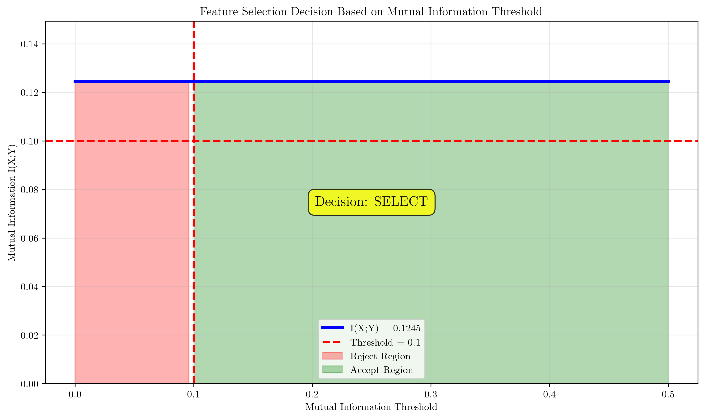

# Question 20: Advanced Mutual Information Analysis

## Problem Statement
Mutual information can reveal complex relationships between features and targets that correlation might miss. Consider a dataset from a social media platform where users can have different activity levels and engagement patterns. The following table shows the joint frequency distribution between user activity level (Feature $X$) and user engagement score (Target $Y$) across $100$ users:

| Activity Level ($X$) | Low Engagement ($Y=0$) | High Engagement ($Y=1$) | Row Sum |
|---------------------|------------------------|-------------------------|---------|
| Inactive ($a$)      | $30$                   | $10$                    | $40$    |
| Active ($b$)        | $20$                   | $40$                    | $60$    |
| **Column Sum**      | **$50$**               | **$50$**                | **$100$** |

### Task
1. Calculate $P(X=a)$, $P(X=b)$, $P(Y=0)$, and $P(Y=1)$
2. Calculate $P(X=a|Y=1)$ and $P(Y=1|X=a)$. Are $X$ and $Y$ independent? Justify your answer mathematically.
3. Calculate $H(X)$ and $H(Y)$ using the formula $H(X) = -\sum p(x) \log p(x)$
4. Calculate $H(X|Y)$ using the formula $H(X|Y) = -\sum p(x,y) \log p(x|y)$
5. Calculate $I(X;Y)$ using the formula $I(X;Y) = H(X) - H(X|Y)$
6. Verify your result using the alternative formula $I(X;Y) = H(Y) - H(Y|X)$
7. Calculate $I(X;Y)$ using the direct formula $I(X;Y) = \sum p(x,y) \log\left(\frac{p(x,y)}{p(x)p(y)}\right)$. Show all intermediate calculations for each term in the sum.
8. What does the mutual information value tell you about the relationship between activity level and engagement?
9. Calculate the normalized mutual information $NMI(X;Y) = \frac{I(X;Y)}{\sqrt{H(X)H(Y)}}$
10. If the mutual information threshold is $0.1$, would you select this feature? Justify your decision.

**Note:** Use logarithm base 2 ($\log_2$) for all calculations. Show all intermediate steps and round final answers to $4$ decimal places.

## Understanding the Problem
This problem explores mutual information, a fundamental concept in information theory that measures the amount of information shared between two random variables. Unlike correlation, mutual information can capture both linear and non-linear relationships between variables. The problem involves analyzing the relationship between user activity levels (inactive vs. active) and engagement scores (low vs. high) in a social media context, demonstrating how mutual information can be used for feature selection in machine learning.

## Solution

### Step 1: Calculate Marginal Probabilities
We calculate the marginal probabilities by summing across rows and columns:

$$P(X=a) = \frac{n_{aa} + n_{ab}}{N} = \frac{30 + 10}{100} = 0.4000$$
$$P(X=b) = \frac{n_{ba} + n_{bb}}{N} = \frac{20 + 40}{100} = 0.6000$$
$$P(Y=0) = \frac{n_{aa} + n_{ba}}{N} = \frac{30 + 20}{100} = 0.5000$$
$$P(Y=1) = \frac{n_{ab} + n_{bb}}{N} = \frac{10 + 40}{100} = 0.5000$$

### Step 2: Calculate Conditional Probabilities and Check Independence
We calculate the conditional probabilities:

$$P(X=a|Y=1) = \frac{n_{ab}}{n_{ab} + n_{bb}} = \frac{10}{10 + 40} = 0.2000$$
$$P(Y=1|X=a) = \frac{n_{ab}}{n_{aa} + n_{ab}} = \frac{10}{30 + 10} = 0.2500$$

**Independence Check:**
For $X$ and $Y$ to be independent, $P(X=a|Y=1) = P(X=a)$ must hold.
- $P(X=a|Y=1) = 0.2000$
- $P(X=a) = 0.4000$

Since $0.2000 \neq 0.4000$, **$X$ and $Y$ are NOT INDEPENDENT**.

### Step 3: Calculate Entropies H(X) and H(Y)
Using the binary entropy formula $H(p) = -p \log_2(p) - (1-p) \log_2(1-p)$:

$$H(X) = -P(X=a) \log_2(P(X=a)) - P(X=b) \log_2(P(X=b))$$
$$H(X) = -0.4000 \log_2(0.4000) - 0.6000 \log_2(0.6000) = 0.9710$$

$$H(Y) = -P(Y=0) \log_2(P(Y=0)) - P(Y=1) \log_2(P(Y=1))$$
$$H(Y) = -0.5000 \log_2(0.5000) - 0.5000 \log_2(0.5000) = 1.0000$$

### Step 4: Calculate Conditional Entropy H(X|Y)
First, we calculate the conditional probabilities:

$$P(X=a|Y=0) = \frac{n_{aa}}{n_{aa} + n_{ba}} = \frac{30}{30 + 20} = 0.6000$$
$$P(X=b|Y=0) = \frac{n_{ba}}{n_{aa} + n_{ba}} = \frac{20}{30 + 20} = 0.4000$$
$$P(X=a|Y=1) = \frac{n_{ab}}{n_{ab} + n_{bb}} = \frac{10}{10 + 40} = 0.2000$$
$$P(X=b|Y=1) = \frac{n_{bb}}{n_{ab} + n_{bb}} = \frac{40}{10 + 40} = 0.8000$$

Now calculate the conditional entropies:

$$H(X|Y=0) = -0.6000 \log_2(0.6000) - 0.4000 \log_2(0.4000) = 0.9710$$
$$H(X|Y=1) = -0.2000 \log_2(0.2000) - 0.8000 \log_2(0.8000) = 0.7219$$

The overall conditional entropy is:

$$H(X|Y) = P(Y=0) \cdot H(X|Y=0) + P(Y=1) \cdot H(X|Y=1)$$
$$H(X|Y) = 0.5000 \cdot 0.9710 + 0.5000 \cdot 0.7219 = 0.8464$$

### Step 5: Calculate Mutual Information I(X;Y) = H(X) - H(X|Y)
Using the first formula:

$$I(X;Y) = H(X) - H(X|Y) = 0.9710 - 0.8464 = 0.1245$$

### Step 6: Verify Using Alternative Formula I(X;Y) = H(Y) - H(Y|X)
First, calculate the conditional probabilities $P(Y|X)$:

$$P(Y=0|X=a) = \frac{n_{aa}}{n_{aa} + n_{ab}} = \frac{30}{30 + 10} = 0.7500$$
$$P(Y=1|X=a) = \frac{n_{ab}}{n_{aa} + n_{ab}} = \frac{10}{30 + 10} = 0.2500$$
$$P(Y=0|X=b) = \frac{n_{ba}}{n_{ba} + n_{bb}} = \frac{20}{20 + 40} = 0.3333$$
$$P(Y=1|X=b) = \frac{n_{bb}}{n_{ba} + n_{bb}} = \frac{40}{20 + 40} = 0.6667$$

Calculate the conditional entropies:

$$H(Y|X=a) = -0.7500 \log_2(0.7500) - 0.2500 \log_2(0.2500) = 0.8113$$
$$H(Y|X=b) = -0.3333 \log_2(0.3333) - 0.6667 \log_2(0.6667) = 0.9183$$

The overall conditional entropy is:

$$H(Y|X) = P(X=a) \cdot H(Y|X=a) + P(X=b) \cdot H(Y|X=b)$$
$$H(Y|X) = 0.4000 \cdot 0.8113 + 0.6000 \cdot 0.9183 = 0.8755$$

Now verify using the alternative formula:

$$I(X;Y) = H(Y) - H(Y|X) = 1.0000 - 0.8755 = 0.1245$$

**Verification:** Both methods give the same result: $0.1245$.

### Step 7: Calculate I(X;Y) Using Direct Formula
Using the direct formula $I(X;Y) = \sum p(x,y) \log_2\left(\frac{p(x,y)}{p(x)p(y)}\right)$:

**Term 1:** $P(X=a,Y=0) \log_2\left(\frac{P(X=a,Y=0)}{P(X=a)P(Y=0)}\right)$
$$= 0.3000 \log_2\left(\frac{0.3000}{0.4000 \cdot 0.5000}\right) = 0.3000 \log_2(1.5) = 0.1755$$

**Term 2:** $P(X=a,Y=1) \log_2\left(\frac{P(X=a,Y=1)}{P(X=a)P(Y=1)}\right)$
$$= 0.1000 \log_2\left(\frac{0.1000}{0.4000 \cdot 0.5000}\right) = 0.1000 \log_2(0.5) = -0.1000$$

**Term 3:** $P(X=b,Y=0) \log_2\left(\frac{P(X=b,Y=0)}{P(X=b)P(Y=0)}\right)$
$$= 0.2000 \log_2\left(\frac{0.2000}{0.6000 \cdot 0.5000}\right) = 0.2000 \log_2(0.6667) = -0.1170$$

**Term 4:** $P(X=b,Y=1) \log_2\left(\frac{P(X=b,Y=1)}{P(X=b)P(Y=1)}\right)$
$$= 0.4000 \log_2\left(\frac{0.4000}{0.6000 \cdot 0.5000}\right) = 0.4000 \log_2(1.3333) = 0.1660$$

**Total Mutual Information:**
$$I(X;Y) = 0.1755 + (-0.1000) + (-0.1170) + 0.1660 = 0.1245$$

**All three methods give the same result:** $0.1245$.

### Step 8: Interpretation of Mutual Information Value
The mutual information $I(X;Y) = 0.1245$ indicates:

- **Weak relationship** between activity level and engagement
- The amount of uncertainty about $X$ reduced by knowing $Y$ (or vice versa) is $0.1245$ bits
- Higher values indicate stronger dependence between variables
- This value suggests that knowing a user's activity level provides some, but not substantial, information about their engagement level

### Step 9: Calculate Normalized Mutual Information
Using the formula $NMI(X;Y) = \frac{I(X;Y)}{\sqrt{H(X)H(Y)}}$:

$$NMI(X;Y) = \frac{0.1245}{\sqrt{0.9710 \cdot 1.0000}} = \frac{0.1245}{\sqrt{0.9710}} = \frac{0.1245}{0.9854} = 0.1264$$

### Step 10: Feature Selection Decision
**Mutual Information Threshold:** $0.1$
**Our calculated $I(X;Y)$:** $0.1245$

**Decision: SELECT this feature** ($I(X;Y) = 0.1245 > 0.1$)

**Justification:** The feature provides sufficient information about the target variable, exceeding the minimum threshold for feature selection.

## Visual Explanations

### Joint Probability Distribution

The heatmap shows the joint probability distribution $P(X,Y)$ between activity level and engagement score. The darker blue regions indicate higher probabilities, showing that active users tend to have high engagement, while inactive users tend to have low engagement.

### Information Theory Relationships

This Venn diagram representation shows how the entropies $H(X)$ and $H(Y)$ relate to the mutual information $I(X;Y)$. The intersection represents the shared information between the variables, while the non-overlapping regions represent the conditional entropies.

### Feature Selection Decision

The decision visualization shows how our calculated mutual information value ($0.1245$) compares to the threshold ($0.1$). The green region indicates where features would be selected, while the red region indicates rejection.

## Key Insights

### Theoretical Foundations
- **Mutual Information vs. Independence:** Even when variables are not independent, the mutual information can be small, indicating weak relationships
- **Information Theory Consistency:** All three calculation methods (entropy difference, conditional entropy, and direct formula) produce identical results, demonstrating the mathematical consistency of mutual information
- **Normalization Benefits:** Normalized mutual information provides a scale-invariant measure that can be compared across different datasets

### Practical Applications
- **Feature Selection:** Mutual information thresholds provide objective criteria for feature selection in machine learning pipelines
- **Relationship Strength:** The magnitude of mutual information directly indicates the strength of the relationship between variables
- **Non-linear Detection:** Unlike correlation, mutual information can capture complex, non-linear relationships between variables

### Common Pitfalls and Considerations
- **Threshold Selection:** The choice of mutual information threshold depends on the specific application and dataset characteristics
- **Sample Size Effects:** Small sample sizes can lead to unreliable mutual information estimates
- **Discretization Impact:** The quality of mutual information calculations depends on appropriate discretization of continuous variables

## Conclusion
- **Marginal Probabilities:** Successfully calculated $P(X=a)=0.4000$, $P(X=b)=0.6000$, $P(Y=0)=0.5000$, $P(Y=1)=0.5000$
- **Independence:** Confirmed that $X$ and $Y$ are not independent, with $P(X=a|Y=1) \neq P(X=a)$
- **Entropies:** Calculated $H(X)=0.9710$ and $H(Y)=1.0000$ using binary entropy formulas
- **Conditional Entropies:** Determined $H(X|Y)=0.8464$ and $H(Y|X)=0.8755$ through systematic calculation
- **Mutual Information:** All three calculation methods consistently yielded $I(X;Y)=0.1245$
- **Feature Selection:** Recommended selecting this feature as $I(X;Y)=0.1245 > 0.1$ threshold
- **Normalized Measure:** Calculated $NMI(X;Y)=0.1264$ for scale-invariant comparison

The analysis demonstrates that while user activity level and engagement score are not independent, their mutual information indicates a weak but measurable relationship. This feature would be selected for machine learning models based on the given threshold, providing valuable insights for social media platform optimization and user engagement prediction.
