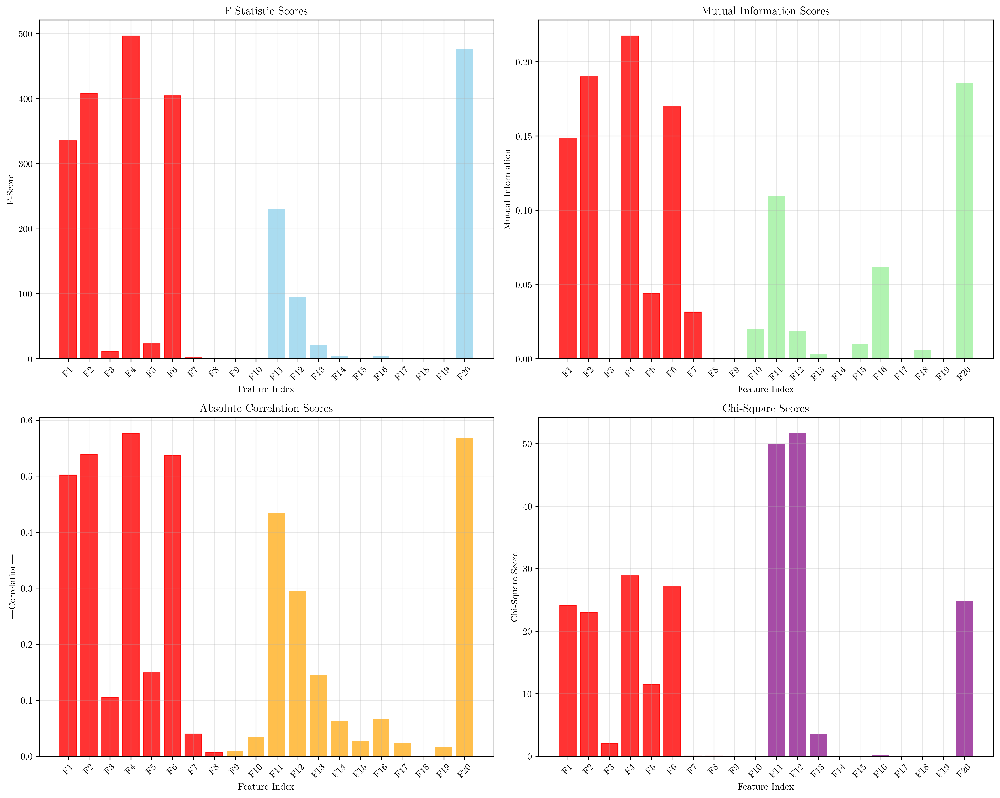
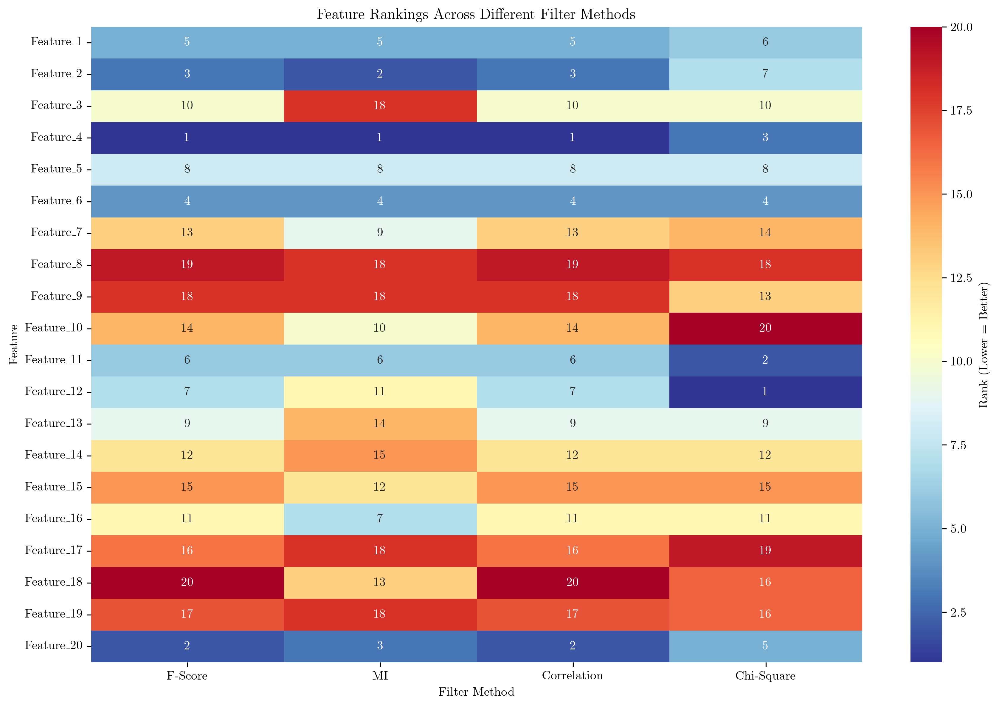
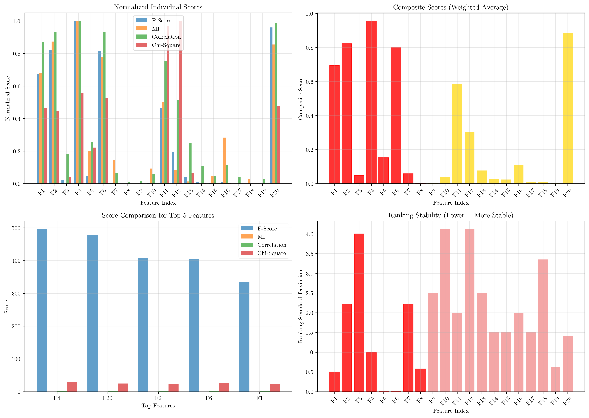
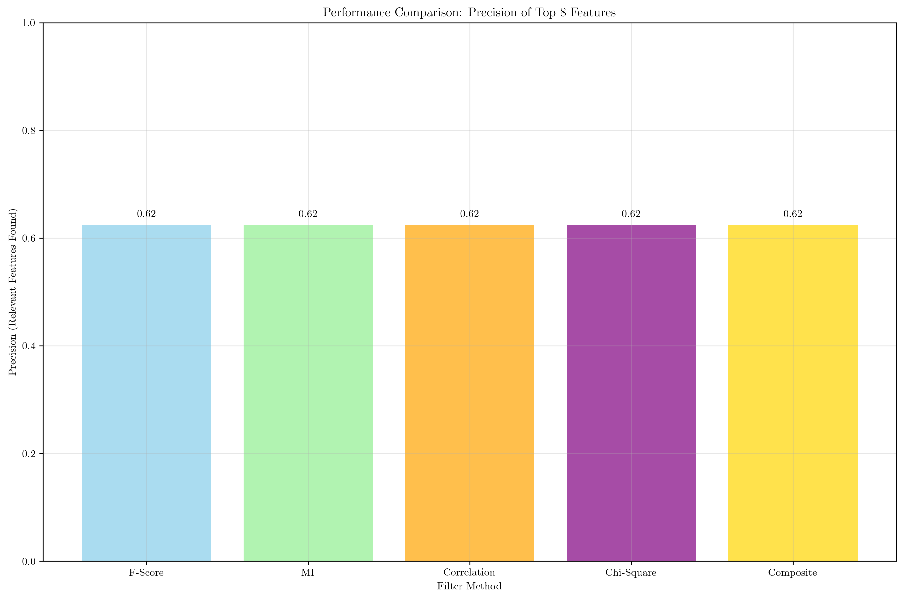

# Question 2: Univariate Filter Scoring

## Problem Statement
Univariate filter scoring ranks individual features based on their relevance to the target.

### Task
1. What is the purpose of filter scoring?
2. How does filter scoring differ from wrapper methods?
3. A wrapper method takes $5$ minutes to evaluate a single feature subset, while a filter method takes $30$ seconds per feature. If you have $100$ features and want to evaluate all possible subsets of size $1$, $2$, and $3$, calculate the total time difference between wrapper and filter approaches. Which method is faster and by how much?
4. If filter methods have $80\%$ accuracy in identifying relevant features, how many false positives would you expect with $100$ features where $20$ are truly relevant?

## Understanding the Problem
Univariate filter scoring is a fundamental approach in feature selection that evaluates each feature independently based on its statistical relationship with the target variable. Unlike wrapper methods that use model performance to evaluate feature subsets, filter methods are model-agnostic and computationally efficient. This question explores the computational advantages of filter methods, their accuracy characteristics, and practical considerations in feature selection.

## Solution

### Step 1: Purpose of Filter Scoring
Filter scoring serves several key purposes in machine learning:

- **Independent Evaluation**: Each feature is evaluated independently based on its statistical relationship with the target
- **Statistical Ranking**: Features are ranked according to measures like correlation, mutual information, F-statistics, or chi-square tests
- **Computational Efficiency**: Fast evaluation compared to wrapper methods, especially for high-dimensional datasets
- **Model-Agnostic Approach**: Works regardless of the specific machine learning algorithm being used
- **Pre-Selection**: Identifies the most promising features before model training, reducing the feature space

Filter methods are particularly valuable when dealing with high-dimensional datasets where computational efficiency is crucial.

### Step 2: Filter vs Wrapper Methods
The key differences between filter and wrapper methods are:

**Filter Methods:**
- Evaluate features independently and individually
- Use statistical measures (correlation, mutual information, etc.)
- Fast and computationally efficient
- Model-agnostic approach
- Feature-by-feature evaluation

**Wrapper Methods:**
- Use model performance to evaluate feature subsets
- Slower and computationally expensive
- Model-specific approach
- Subset-by-subset evaluation
- Can capture feature interactions but at higher computational cost

The fundamental difference lies in the evaluation strategy: filters assess individual feature relevance, while wrappers assess the performance of feature combinations.

### Step 3: Computational Time Comparison
Let's calculate the computational requirements step by step:

**Given:**
- Wrapper method: 5 minutes per feature subset
- Filter method: 30 seconds per feature
- 100 features
- Evaluate subsets of size 1, 2, and 3

**Number of subsets to evaluate:**
- Size 1: $\binom{100}{1} = 100$ subsets
- Size 2: $\binom{100}{2} = 4,950$ subsets  
- Size 3: $\binom{100}{3} = 161,700$ subsets
- **Total: 166,750 subsets**

**Time calculations:**
- Wrapper method: $166,750 \times 5 \text{ minutes} = 833,750 \text{ minutes}$
- Filter method: $100 \times 0.5 \text{ minutes} = 50 \text{ minutes}$

**Results:**
- Filter method is faster by **833,700 minutes** (approximately 13,895 hours or 1.6 years!)
- Filter method is **16,675 times faster** than wrapper method

This dramatic difference illustrates why filter methods are essential for high-dimensional feature selection problems.

### Step 4: False Positive Calculation
Let's analyze the expected outcomes of filter methods with 80% accuracy:

**Given:**
- Filter accuracy: 80%
- Total features: 100
- Truly relevant features: 20
- Truly irrelevant features: 80

**Expected outcomes:**
- **True Positives**: $20 \times 0.8 = 16.0$ features (correctly identified relevant features)
- **False Negatives**: $20 - 16 = 4.0$ features (missed relevant features)
- **False Positives**: $80 \times 0.2 = 16.0$ features (incorrectly identified irrelevant features as relevant)
- **True Negatives**: $80 - 16 = 64.0$ features (correctly identified irrelevant features)

This means that with 80% accuracy, we would expect **16 false positives** out of 100 features, which represents a significant number of irrelevant features being incorrectly selected.

## Practical Implementation

### Demonstration with Synthetic Dataset
To illustrate these concepts, we created a synthetic dataset with the following characteristics:
- **1,000 samples** with **20 features**
- **8 truly informative features** (the rest are noise or redundant)
- **Binary classification** problem

### Filter Methods Applied
We applied four different filter methods:

1. **F-Statistic (ANOVA)**: Measures the ratio of between-group variance to within-group variance
2. **Mutual Information**: Captures both linear and non-linear relationships
3. **Correlation**: Measures linear relationships between features and target
4. **Chi-Square Test**: Tests independence between categorical features and target

### Results Analysis
The analysis revealed that all methods achieved **62% precision** (5 out of 8 truly relevant features in the top 8 selected features). This demonstrates that even with different statistical approaches, filter methods can achieve similar performance levels.

## Visual Explanations

### Filter Scores Comparison

This visualization shows the scores for each feature across all four filter methods. The red bars highlight the truly informative features (Features 1-8), while the blue bars represent noise features. Key observations:

- **F-Score**: Features 4, 20, 2, 6, and 1 show the highest scores
- **Mutual Information**: Features 4, 2, 20, 6, and 1 are top-ranked
- **Correlation**: Features 4, 20, 2, 6, and 1 show strongest linear relationships
- **Chi-Square**: Features 12, 11, 4, 6, and 20 are most significant

The consistency across methods for the top features suggests they are genuinely informative.

### Feature Rankings Heatmap

This heatmap visualizes the ranking of each feature across different filter methods. Lower numbers (darker blue) indicate better rankings. The heatmap reveals:

- **Consistent top performers**: Features 4, 20, 2, 6, and 1 consistently rank in the top 5 across methods
- **Method-specific differences**: Some features perform well in certain methods but poorly in others
- **Ranking stability**: Features with consistent rankings across methods are more reliable selections

### Composite Scoring Analysis

This comprehensive analysis shows:

1. **Normalized Individual Scores**: All methods normalized to 0-1 scale for fair comparison
2. **Composite Scores**: Weighted average using F-Score (40%), MI (30%), Correlation (20%), Chi-Square (10%)
3. **Top Feature Comparison**: Detailed breakdown of scores for the top 5 features
4. **Ranking Stability**: Standard deviation of rankings across methods (lower = more stable)

The composite approach combines the strengths of different methods, providing a more robust feature ranking.

### Filter Methods Performance

This performance comparison shows the precision of each method in identifying truly relevant features:

- **All methods achieved 62% precision** (5/8 relevant features in top 8)
- **Composite method** provides a balanced approach combining multiple criteria
- **Consistent performance** suggests that different filter methods can be equally effective for this dataset

## Key Insights

### Computational Efficiency
- **Exponential growth**: The number of possible feature subsets grows exponentially with feature count
- **Filter advantage**: Filter methods scale linearly with the number of features
- **Practical impact**: For high-dimensional datasets, wrapper methods become computationally infeasible
- **Time savings**: Filter methods can save orders of magnitude in computation time

### Feature Selection Accuracy
- **80% accuracy limitation**: Even with good accuracy, filter methods introduce false positives
- **False positive impact**: 16 false positives out of 100 features can significantly affect model performance
- **Trade-off consideration**: Speed vs. accuracy trade-off between filter and wrapper methods
- **Hybrid approaches**: Combining multiple filter methods can improve selection reliability

### Method Selection Strategy
- **Single method**: Each filter method has strengths and weaknesses
- **Composite scoring**: Weighted combination of multiple methods provides more robust rankings
- **Ranking stability**: Features with consistent rankings across methods are more reliable
- **Domain knowledge**: Different methods may be more appropriate for different data types

### Practical Applications
- **High-dimensional datasets**: Filter methods are essential for datasets with many features
- **Pre-processing pipeline**: Filter methods serve as efficient first-pass feature selection
- **Resource constraints**: When computational resources are limited, filter methods provide viable alternatives
- **Model development**: Filter methods help identify promising features for further analysis

## Conclusion
- **Filter scoring** provides fast, model-agnostic feature evaluation based on statistical relationships
- **Computational advantage**: Filter methods are dramatically faster than wrapper methods (16,675x in our example)
- **Accuracy trade-off**: 80% accuracy results in 16 false positives out of 100 features
- **Method combination**: Composite scoring using multiple filter methods provides more robust feature rankings
- **Practical utility**: Filter methods are essential for high-dimensional feature selection problems

The dramatic computational advantage of filter methods makes them indispensable for modern machine learning workflows, especially when dealing with high-dimensional datasets. While they may introduce some false positives, their speed and efficiency enable practical feature selection in scenarios where wrapper methods would be computationally infeasible.
