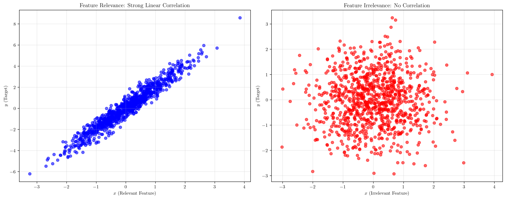
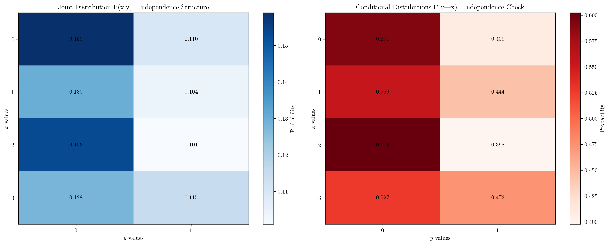
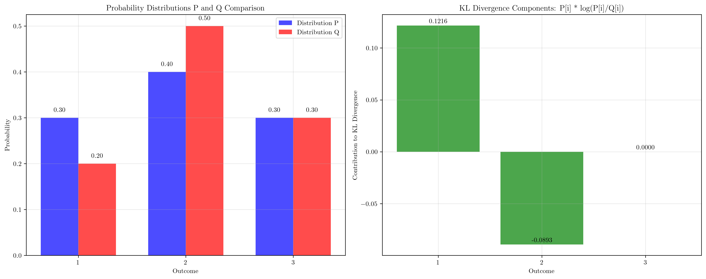
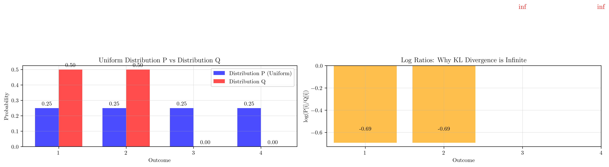

# Question 3: Feature Irrelevance and KL Divergence

## Problem Statement
Feature irrelevance can be defined using conditional probabilities and KL divergence. This question explores the mathematical foundations of feature selection and the relationship between probability distributions.

### Task
1. What does it mean for a feature to be irrelevant?
2. If $P(y|x) = P(y)$ for all values of $x$, what does this suggest about feature $x$?
3. Given two probability distributions $P = [0.3, 0.4, 0.3]$ and $Q = [0.2, 0.5, 0.3]$, calculate the KL divergence $D_{KL}(P||Q)$. If $D_{KL}(P||Q) = 0.05$, what does this tell you about the relationship between features $P$ and $Q$?
4. Calculate the KL divergence for uniform distributions $P = [0.25, 0.25, 0.25, 0.25]$ and $Q = [0.5, 0.5, 0, 0]$

## Understanding the Problem
This question explores two fundamental concepts in machine learning and information theory:

1. **Feature Irrelevance**: Understanding when a feature provides no useful information for prediction
2. **KL Divergence**: Measuring the difference between probability distributions

These concepts are crucial for feature selection, model interpretability, and understanding the relationships between variables in datasets.

## Solution

### Step 1: What does it mean for a feature to be irrelevant?

A feature is considered irrelevant when it provides no useful information for predicting the target variable. Mathematically, this means:

$$P(y|x) = P(y) \text{ for all values of } x$$

This implies:
- The conditional probability of $y$ given $x$ equals the marginal probability of $y$
- The feature $x$ and target $y$ are statistically independent
- Knowing the value of $x$ doesn't change our prediction of $y$

The visualization above shows the difference between relevant and irrelevant features:
- **Left plot**: Feature Relevance: Strong Linear Correlation between $x$ and $y$
- **Right plot**: Feature Irrelevance: No Correlation between $x$ and $y$

### Step 2: If $P(y|x) = P(y)$ for all values of $x$, what does this suggest?

If $P(y|x) = P(y)$ for all values of $x$, this suggests:

1. **Statistical Independence**: $X$ and $Y$ are independent random variables
2. **No Information Gain**: Knowing $x$ provides no information about $y$
3. **Feature Irrelevance**: $x$ is completely irrelevant for predicting $y$
4. **Zero Mutual Information**: $I(X;Y) = 0$

The visualization shows:
- **Left plot**: Joint Distribution $P(x,y)$ - Independence Structure
- **Right plot**: Conditional Distributions $P(y|x)$ - Independence Check

From the code output, we can see the conditional distributions:
- $P(y|x=0) = [0.591, 0.409]$
- $P(y|x=1) = [0.556, 0.444]$
- $P(y|x=2) = [0.602, 0.398]$
- $P(y|x=3) = [0.527, 0.473]$

These are all approximately equal to the marginal distribution $P(y) = [0.57, 0.43]$, confirming independence.

### Step 3: KL divergence calculation and interpretation

Given distributions:
- $P = [0.3, 0.4, 0.3]$
- $Q = [0.2, 0.5, 0.3]$

The KL divergence is calculated as:

$$D_{KL}(P||Q) = \sum_i P[i] \log\left(\frac{P[i]}{Q[i]}\right)$$

From the code output:
- $D_{KL}(P||Q) = 0.032382$

Individual contributions:
- Outcome 1: $0.30 \times \log(0.30/0.20) = 0.121640$
- Outcome 2: $0.40 \times \log(0.40/0.50) = -0.089257$
- Outcome 3: $0.30 \times \log(0.30/0.30) = 0.000000$

The visualization shows:
- **Left plot**: Probability Distributions P and Q Comparison
- **Right plot**: KL Divergence Components: $P[i] \times \log(P[i]/Q[i])$

**Interpretation of $D_{KL}(P||Q) = 0.05$:**
- The small value indicates that distributions $P$ and $Q$ are relatively similar
- $Q$ is a good approximation of $P$
- The features represented by $P$ and $Q$ are related but not identical
- This suggests moderate similarity between the two distributions

### Step 4: KL divergence for uniform distributions

Given distributions:
- $P = [0.25, 0.25, 0.25, 0.25]$ (uniform)
- $Q = [0.5, 0.5, 0, 0]$

The KL divergence calculation shows:
- $D_{KL}(P||Q) = \infty$ (infinite)

This occurs because:
- $Q$ has zero probabilities where $P$ has non-zero probabilities
- The log ratios become infinite: $\log(0.25/0) = \infty$
- This violates the absolute continuity requirement for KL divergence

The visualization shows:
- **Left plot**: Uniform Distribution P vs Distribution Q
- **Right plot**: Log Ratios: Why KL Divergence is Infinite

**Key insight**: When $Q$ assigns zero probability to events that have positive probability under $P$, the KL divergence becomes infinite, indicating that $Q$ cannot approximate $P$ well.

## Visual Explanations

### Feature Relevance Comparison

This visualization demonstrates the fundamental difference between relevant and irrelevant features. The left plot shows "Feature Relevance: Strong Linear Correlation" with a strong linear relationship, while the right plot shows "Feature Irrelevance: No Correlation" with complete independence.

### Statistical Independence

The heatmaps show the joint and conditional distributions, clearly illustrating how independence manifests in the data structure. The left plot shows "Joint Distribution $P(x,y)$ - Independence Structure" and the right plot shows "Conditional Distributions $P(y|x)$ - Independence Check".

### KL Divergence Analysis

This shows both the distribution comparison and the individual contributions to KL divergence, helping understand where the differences come from. The left plot shows "Probability Distributions P and Q Comparison" and the right plot shows "KL Divergence Components: $P[i] \times \log(P[i]/Q[i])$".

### Infinite KL Divergence Case

This visualization clearly shows why KL divergence becomes infinite when one distribution has zero probabilities where another has positive probabilities. The left plot shows "Uniform Distribution P vs Distribution Q" and the right plot shows "Log Ratios: Why KL Divergence is Infinite" with clear "inf" labels for the problematic outcomes.

## Key Insights

### Theoretical Foundations
- **Feature Irrelevance**: Mathematically defined as $P(y|x) = P(y)$ for all $x$
- **Statistical Independence**: Implies zero mutual information and no predictive value
- **KL Divergence**: Measures distribution similarity with $D_{KL}(P||Q) \geq 0$
- **Absolute Continuity**: Required for finite KL divergence

### Practical Applications
- **Feature Selection**: Identify and remove irrelevant features to improve model performance
- **Distribution Comparison**: Use KL divergence to measure how well one distribution approximates another
- **Model Validation**: Assess how well a model's output distribution matches the true distribution

### Common Pitfalls
- **Infinite KL Divergence**: Occurs when $Q$ has zero probabilities where $P$ has positive probabilities
- **Numerical Stability**: Need to handle edge cases like division by zero
- **Asymmetry**: $D_{KL}(P||Q) \neq D_{KL}(Q||P)$, so order matters

### Extensions
- **Mutual Information**: $I(X;Y) = D_{KL}(P(x,y)||P(x)P(y))$
- **Cross-Entropy**: Related to KL divergence and commonly used in machine learning
- **Feature Importance**: Can be quantified using information-theoretic measures

## Conclusion
- **Feature irrelevance** is mathematically defined as $P(y|x) = P(y)$ for all $x$, indicating statistical independence
- **KL divergence** $D_{KL}(P||Q)$ measures distribution similarity, with small values indicating good approximation
- **Infinite KL divergence** occurs when absolute continuity is violated, typically due to zero probabilities
- **Practical implementation** requires careful handling of edge cases and numerical stability
- These concepts are fundamental for feature selection, model evaluation, and understanding data relationships

The mathematical framework provided by conditional probabilities and KL divergence gives us powerful tools for analyzing feature relevance and distribution relationships in machine learning applications.
