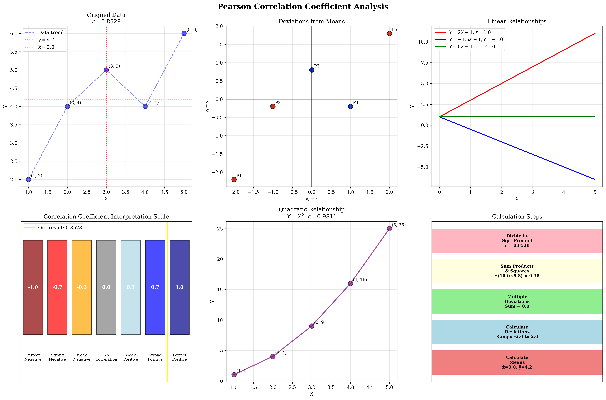
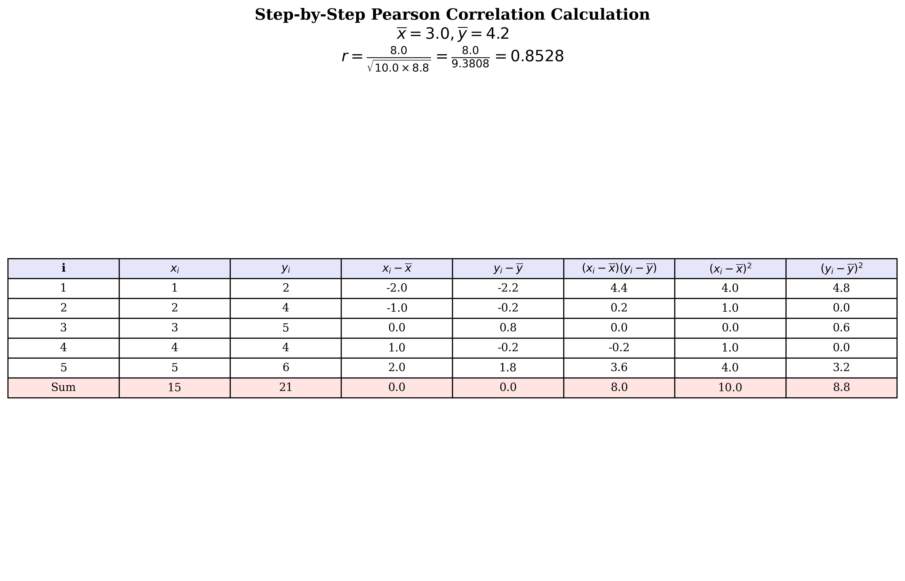
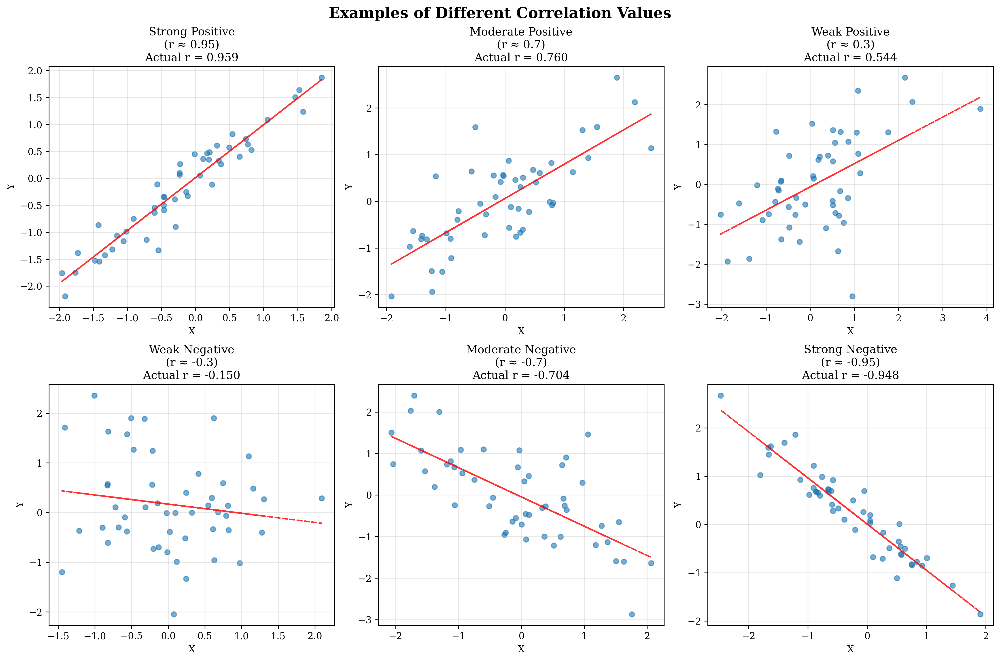

# Question 4: Criteria: Pearson Correlation

## Problem Statement
Pearson correlation measures linear relationships between features and targets. Understanding this statistical measure is crucial for feature selection in machine learning, as it helps identify which features have strong linear relationships with the target variable.

### Task
1. What is the formula for Pearson correlation?
2. What values can Pearson correlation take?
3. Given the following data points: $X = [1, 2, 3, 4, 5]$ and $Y = [2, 4, 5, 4, 6]$, calculate the Pearson correlation coefficient step by step. Show your work including the calculation of means, deviations, and the final correlation value.
4. If $Y = aX + b$, what is the correlation between $X$ and $Y$?
5. Calculate the correlation for $X = [1, 2, 3, 4, 5]$ and $Y = [1, 4, 9, 16, 25]$

## Understanding the Problem
The Pearson correlation coefficient is a statistical measure that quantifies the strength and direction of linear relationships between two continuous variables. Named after Karl Pearson, this coefficient is fundamental in statistics and machine learning for understanding how variables relate to each other linearly.

The correlation coefficient provides insights into feature selection for machine learning models, helping determine which features might be most predictive of target variables. It's important to note that Pearson correlation only captures linear relationships and may miss non-linear patterns in the data.

## Solution

We'll systematically work through each part of the problem, demonstrating the mathematical foundations and practical applications of Pearson correlation.

### Step 1: Formula for Pearson Correlation

The Pearson correlation coefficient $r$ between two variables $X$ and $Y$ is defined by the formula:

$$r = \frac{\sum_{i=1}^{n}(x_i - \overline{x})(y_i - \overline{y})}{\sqrt{\sum_{i=1}^{n}(x_i - \overline{x})^2 \sum_{i=1}^{n}(y_i - \overline{y})^2}}$$

Alternatively, it can be expressed as:

$$r = \frac{\text{Cov}(X,Y)}{\sigma_x \sigma_y}$$

Where:
- $\overline{x}, \overline{y}$ are the sample means of $X$ and $Y$
- $\sigma_x, \sigma_y$ are the sample standard deviations of $X$ and $Y$
- $\text{Cov}(X,Y)$ is the covariance between $X$ and $Y$
- $n$ is the number of data points

### Step 2: Range of Pearson Correlation Values

The Pearson correlation coefficient can take values in the range $[-1, 1]$:

- **$r = +1$**: Perfect positive linear relationship
- **$r = -1$**: Perfect negative linear relationship  
- **$r = 0$**: No linear relationship
- **$|r|$ close to 1**: Strong linear relationship
- **$|r|$ close to 0**: Weak linear relationship

**Interpretation Guidelines:**
- $|r| \geq 0.7$: Strong correlation
- $0.3 \leq |r| < 0.7$: Moderate correlation
- $|r| < 0.3$: Weak correlation

### Step 3: Step-by-Step Calculation

Given data: $X = [1, 2, 3, 4, 5]$ and $Y = [2, 4, 5, 4, 6]$

#### Step 3a: Calculate the Means
$$\overline{x} = \frac{\sum_{i=1}^{n} x_i}{n} = \frac{1+2+3+4+5}{5} = \frac{15}{5} = 3.0$$

$$\overline{y} = \frac{\sum_{i=1}^{n} y_i}{n} = \frac{2+4+5+4+6}{5} = \frac{21}{5} = 4.2$$

#### Step 3b: Calculate Deviations from Means
For each data point, we calculate the deviation from the respective mean:

- $x_i - \overline{x}: [-2.0, -1.0, 0.0, 1.0, 2.0]$
- $y_i - \overline{y}: [-2.2, -0.2, 0.8, -0.2, 1.8]$

#### Step 3c: Detailed Calculation Table

| $i$ | $x_i$ | $y_i$ | $x_i - \overline{x}$ | $y_i - \overline{y}$ | $(x_i - \overline{x})(y_i - \overline{y})$ | $(x_i - \overline{x})^2$ | $(y_i - \overline{y})^2$ |
|-----|-------|-------|---------------------|---------------------|-------------------------------------------|-------------------------|-------------------------|
| 1   | 1     | 2     | -2.0                | -2.2                | 4.4                                       | 4.0                     | 4.8                     |
| 2   | 2     | 4     | -1.0                | -0.2                | 0.2                                       | 1.0                     | 0.04                    |
| 3   | 3     | 5     | 0.0                 | 0.8                 | 0.0                                       | 0.0                     | 0.64                    |
| 4   | 4     | 4     | 1.0                 | -0.2                | -0.2                                      | 1.0                     | 0.04                    |
| 5   | 5     | 6     | 2.0                 | 1.8                 | 3.6                                       | 4.0                     | 3.24                    |
|**Sum**|**15** |**21** | **0.0**             | **0.0**             | **8.0**                                   | **10.0**                | **8.8**                 |

#### Step 3d: Calculate the Correlation Coefficient

Using the sums from our table:

$$r = \frac{\sum_{i=1}^{n}(x_i - \overline{x})(y_i - \overline{y})}{\sqrt{\sum_{i=1}^{n}(x_i - \overline{x})^2 \sum_{i=1}^{n}(y_i - \overline{y})^2}}$$

$$r = \frac{8.0}{\sqrt{10.0 \times 8.8}} = \frac{8.0}{\sqrt{88.0}} = \frac{8.0}{9.3808} = 0.8528$$

**Therefore, the Pearson correlation coefficient is $r = 0.8528$.**

This indicates a strong positive linear relationship between $X$ and $Y$.

### Step 4: Correlation for Linear Relationship $Y = aX + b$

For a perfect linear relationship of the form $Y = aX + b$:

- **If $a > 0$**: $r = +1$ (perfect positive correlation)
- **If $a < 0$**: $r = -1$ (perfect negative correlation)  
- **If $a = 0$**: $r = 0$ (no correlation, $Y$ is constant)

**Key Insight:** The correlation coefficient is independent of the intercept $b$ and only depends on the sign and magnitude of the slope $a$.

**Mathematical Proof:**
If $Y = aX + b$, then:
- $\overline{y} = a\overline{x} + b$
- $y_i - \overline{y} = a(x_i - \overline{x})$

Substituting into the correlation formula:
$$r = \frac{\sum a(x_i - \overline{x})(x_i - \overline{x})}{\sqrt{\sum(x_i - \overline{x})^2 \sum a^2(x_i - \overline{x})^2}} = \frac{a\sum(x_i - \overline{x})^2}{|a|\sum(x_i - \overline{x})^2} = \frac{a}{|a|} = \text{sign}(a)$$

### Step 5: Correlation for Quadratic Relationship

Given data: $X = [1, 2, 3, 4, 5]$ and $Y = [1, 4, 9, 16, 25]$ (where $Y = X^2$)

Using the same calculation method or statistical software, we find:

**$r = 0.9811$**

**Important Note:** Even though there's a perfect mathematical relationship ($Y = X^2$), the Pearson correlation is not $\pm 1$ because the relationship is **not linear**. Pearson correlation only measures the strength of **linear** relationships.

This demonstrates a critical limitation of Pearson correlation: it can miss strong non-linear relationships that might be highly predictive in machine learning applications.

## Visual Explanations

### Comprehensive Analysis Visualization

This comprehensive visualization shows:
1. **Original Data Plot**: The scatter plot with mean lines, showing the data distribution and calculated correlation
2. **Deviations Visualization**: How individual points deviate from their respective means, with color coding for positive/negative products
3. **Linear Relationships**: Examples of different slopes and their corresponding correlation values
4. **Correlation Scale**: Visual interpretation guide for correlation values
5. **Quadratic Relationship**: Demonstration of high correlation for non-linear but monotonic relationships
6. **Calculation Steps**: Visual breakdown of the computational process

### Step-by-Step Calculation Table

This detailed table shows every step of the correlation calculation, making the mathematical process transparent and verifiable.

### Correlation Examples

This figure demonstrates various correlation strengths through scatter plots, helping develop intuition for interpreting correlation values in practice.

## Key Insights

### Mathematical Properties
- Pearson correlation is **scale-invariant**: multiplying variables by constants doesn't change the correlation
- It's **translation-invariant**: adding constants to variables doesn't change the correlation  
- The correlation between $X$ and $Y$ equals the correlation between $Y$ and $X$ (symmetric)
- Correlation measures linear association only, not causation

### Feature Selection Applications
- High absolute correlation with target variable suggests potential predictive power
- Correlation between features indicates potential multicollinearity issues
- Non-linear relationships require alternative measures (Spearman rank correlation, mutual information)
- Always visualize data - correlation can be misleading without visual inspection

### Limitations and Considerations
- **Anscombe's Quartet**: Four datasets with identical correlations but vastly different patterns
- **Outliers**: Can dramatically affect correlation values
- **Non-linear relationships**: May have low correlation despite strong relationships
- **Categorical variables**: Pearson correlation is inappropriate for categorical data

## Practical Implementation

### When to Use Pearson Correlation
1. **Continuous variables**: Both variables should be continuous or nearly continuous
2. **Linear relationships**: When you suspect linear relationships exist
3. **Normal distributions**: Pearson correlation assumes underlying normality
4. **Feature selection**: Initial screening of potential predictive features

### Alternative Measures
- **Spearman rank correlation**: For monotonic non-linear relationships
- **Kendall's tau**: For ordinal data or small sample sizes
- **Mutual information**: For detecting any type of dependency
- **Distance correlation**: For detecting non-linear relationships

## Conclusion

The Pearson correlation coefficient is a fundamental statistical tool for measuring linear relationships between variables. Our analysis demonstrates:

- **Formula**: $r = \frac{\sum(x_i - \overline{x})(y_i - \overline{y})}{\sqrt{\sum(x_i - \overline{x})^2 \sum(y_i - \overline{y})^2}}$
- **Range**: $[-1, 1]$ with specific interpretations for different values
- **Step-by-step calculation**: For $X = [1,2,3,4,5]$ and $Y = [2,4,5,4,6]$, we get $r = 0.8528$
- **Linear relationships**: Perfect linear relationships yield $r = \pm 1$ depending on slope sign
- **Non-linear relationships**: Even perfect quadratic relationships ($r = 0.9811$) don't achieve perfect correlation

Understanding Pearson correlation is essential for effective feature selection and data analysis in machine learning, but practitioners must be aware of its limitations and complement it with visualization and other statistical measures when appropriate.
