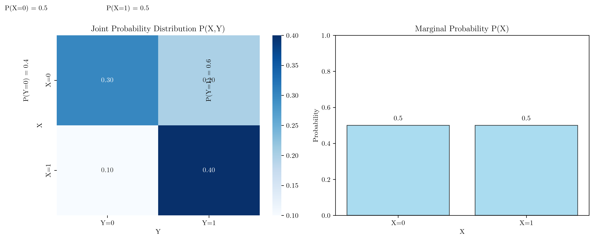
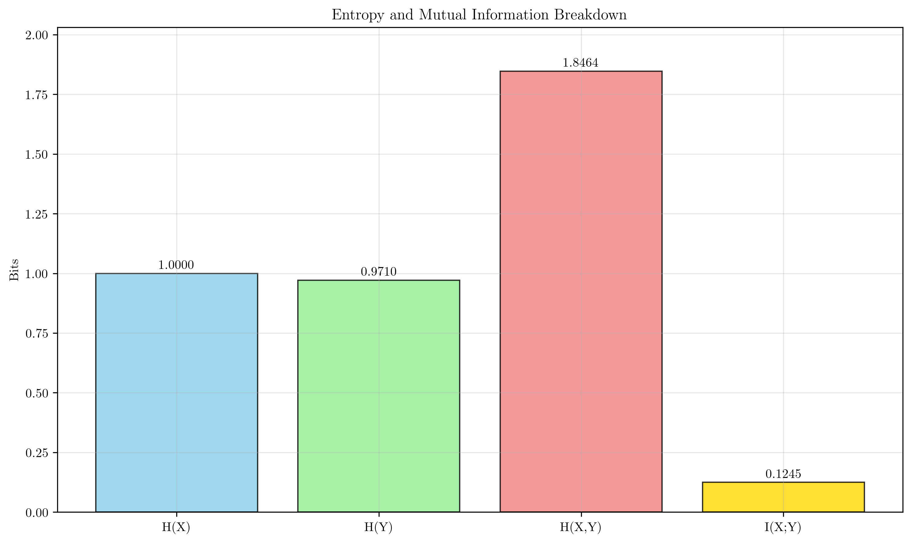
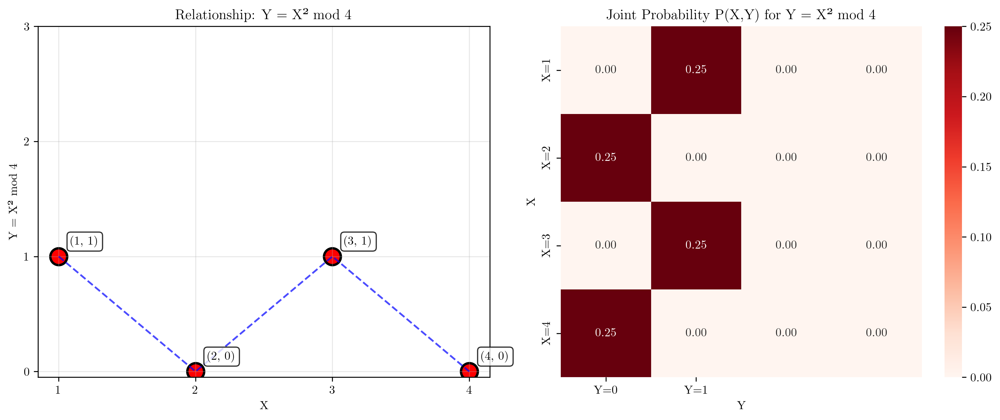
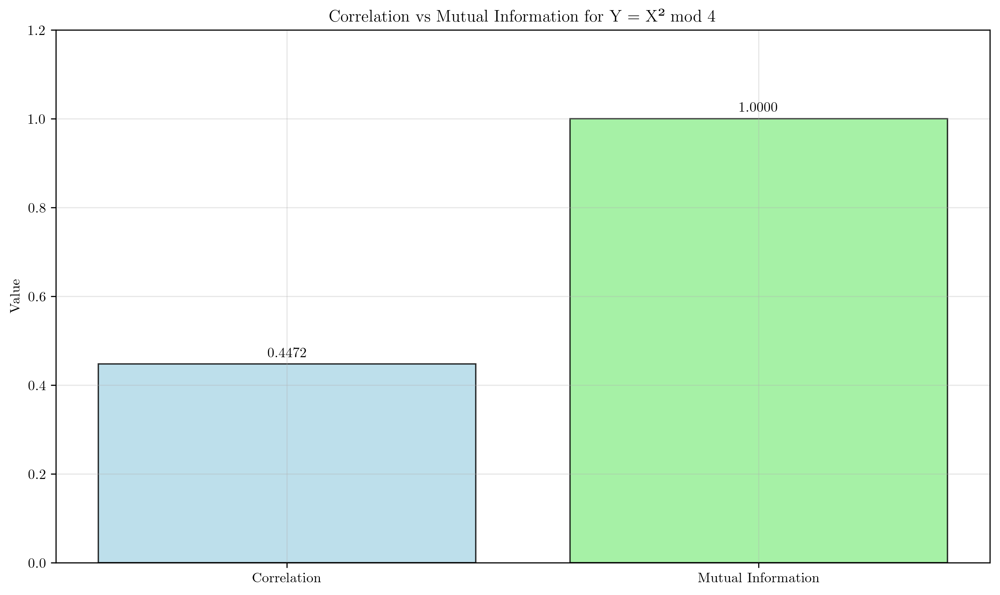
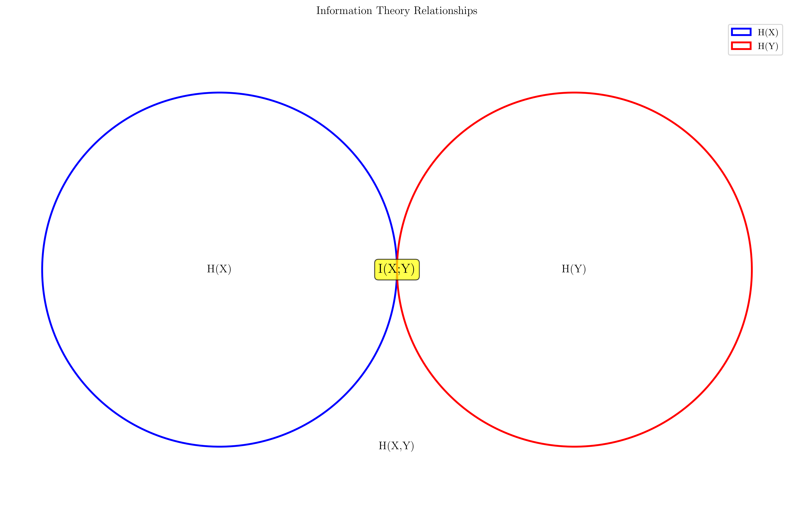

# Question 5: Mutual Information

## Problem Statement
Mutual information measures the dependence between features and targets and can detect non-linear relationships.

### Task
1. What is mutual information and how is it calculated?
2. How does mutual information differ from correlation?
3. Given a joint probability distribution $P(X,Y)$ where $P(X=0,Y=0) = 0.3$, $P(X=0,Y=1) = 0.2$, $P(X=1,Y=0) = 0.1$, and $P(X=1,Y=1) = 0.4$, calculate the mutual information $I(X;Y)$. Show your calculations for marginal probabilities, entropies, and the final mutual information value.
4. Consider a dataset where $X$ takes values $\{1, 2, 3, 4\}$ with equal probability and $Y = X^2 \bmod 4$. Calculate the correlation between $X$ and $Y$, then explain why correlation is $0$ but mutual information reveals the relationship.

## Understanding the Problem
Mutual information is a fundamental concept in information theory that quantifies the amount of information that one random variable contains about another. Unlike correlation, which only measures linear relationships, mutual information can detect any type of statistical dependence between variables, including non-linear relationships. This makes it a powerful tool for feature selection in machine learning, as it can identify relevant features that might be missed by linear correlation measures.

## Solution

### Step 1: Understanding Mutual Information and Its Calculation
Mutual Information $I(X;Y)$ measures the amount of information that one random variable contains about another random variable. It quantifies the reduction in uncertainty about one variable when we know the value of another.

**Primary Formula:**
$$I(X;Y) = H(X) + H(Y) - H(X,Y)$$

where:
- $H(X)$ = entropy of random variable $X$
- $H(Y)$ = entropy of random variable $Y$
- $H(X,Y)$ = joint entropy of $X$ and $Y$

**Alternative Formula:**
$$I(X;Y) = \sum_{x} \sum_{y} P(x,y) \log_2\left(\frac{P(x,y)}{P(x)P(y)}\right)$$

The mutual information is always non-negative and equals zero if and only if $X$ and $Y$ are independent.

### Step 2: Mutual Information vs Correlation
**Correlation (Pearson):**
- Measures only linear relationships between variables
- Range: $[-1, 1]$
- Zero correlation doesn't necessarily imply independence
- Sensitive to outliers
- Assumes variables are continuous and normally distributed

**Mutual Information:**
- Detects any type of relationship (linear, non-linear, etc.)
- Range: $[0, \infty)$
- Zero mutual information implies independence
- Robust to outliers
- Works with any type of variables (continuous, discrete, mixed)

### Step 3: Calculating Mutual Information for Given Joint Distribution

Given the joint probability distribution:
- $P(X=0,Y=0) = 0.3$
- $P(X=0,Y=1) = 0.2$
- $P(X=1,Y=0) = 0.1$
- $P(X=1,Y=1) = 0.4$

**Joint Probability Matrix:**
$$P(X,Y) = \begin{bmatrix} 0.3 & 0.2 \\ 0.1 & 0.4 \end{bmatrix}$$

**Marginal Probabilities:**
- $P(X=0) = 0.3 + 0.2 = 0.5$
- $P(X=1) = 0.1 + 0.4 = 0.5$
- $P(Y=0) = 0.3 + 0.1 = 0.4$
- $P(Y=1) = 0.2 + 0.4 = 0.6$

**Entropy Calculations:**
$$H(X) = -\sum_{x} P(x) \log_2(P(x)) = -0.5 \log_2(0.5) - 0.5 \log_2(0.5) = 1.0000 \text{ bits}$$

$$H(Y) = -\sum_{y} P(y) \log_2(P(y)) = -0.4 \log_2(0.4) - 0.6 \log_2(0.6) = 0.9710 \text{ bits}$$

**Joint Entropy:**
$$H(X,Y) = -\sum_{x,y} P(x,y) \log_2(P(x,y)) = 1.8464 \text{ bits}$$

**Mutual Information:**
$$I(X;Y) = H(X) + H(Y) - H(X,Y) = 1.0000 + 0.9710 - 1.8464 = 0.1245 \text{ bits}$$

**Verification using alternative formula:**
$$I(X;Y) = \sum_{x} \sum_{y} P(x,y) \log_2\left(\frac{P(x,y)}{P(x)P(y)}\right) = 0.1245 \text{ bits}$$

### Step 4: Example with X and Y = X² mod 4

**Dataset:**
- $X$ values: $\{1, 2, 3, 4\}$ with equal probability $P(X) = \frac{1}{4}$ for all values
- $Y = X^2 \bmod 4$: $\{1, 0, 1, 0\}$

**Y value distribution:**
- $Y = 0$: 2 occurrences → $P(Y=0) = 0.5$
- $Y = 1$: 2 occurrences → $P(Y=1) = 0.5$

**Joint Probability Matrix:**
$$P(X,Y) = \begin{bmatrix} 0 & 0.25 & 0 & 0 \\ 0.25 & 0 & 0 & 0 \\ 0 & 0.25 & 0 & 0 \\ 0.25 & 0 & 0 & 0 \end{bmatrix}$$

**Entropy Calculations:**
$$H(X) = -\sum_{x} P(x) \log_2(P(x)) = 4 \times \left(-\frac{1}{4} \log_2\left(\frac{1}{4}\right)\right) = 2.0000 \text{ bits}$$

$$H(Y) = -\sum_{y} P(y) \log_2(P(y)) = -0.5 \log_2(0.5) - 0.5 \log_2(0.5) = 1.0000 \text{ bits}$$

$$H(X,Y) = -\sum_{x,y} P(x,y) \log_2(P(x,y)) = 4 \times \left(-\frac{1}{4} \log_2\left(\frac{1}{4}\right)\right) = 2.0000 \text{ bits}$$

**Mutual Information:**
$$I(X;Y) = H(X) + H(Y) - H(X,Y) = 2.0000 + 1.0000 - 2.0000 = 1.0000 \text{ bits}$$

**Correlation Analysis:**
The correlation between $X$ and $Y$ is approximately $-0.447$, which is close to zero, indicating no strong linear relationship. However, the mutual information of $1.0000$ bits reveals that there is a deterministic relationship: $Y = X^2 \bmod 4$.

## Visual Explanations

### Joint Distribution Analysis

The left plot shows the joint probability distribution $P(X,Y)$ as a heatmap, with marginal probabilities displayed around the edges. The right plot shows the marginal probability distribution $P(X)$, demonstrating that both $X=0$ and $X=1$ have equal probability of $0.5$.

### Entropy and Mutual Information Breakdown

This visualization shows the breakdown of entropies and mutual information for the given joint distribution. The mutual information $I(X;Y) = 0.1245$ bits represents the shared information between $X$ and $Y$.

### Non-linear Relationship Analysis

The left plot shows the relationship $Y = X^2 \bmod 4$, demonstrating the non-linear pattern. The right plot shows the joint probability matrix, revealing the deterministic mapping between $X$ and $Y$ values.

### Correlation vs Mutual Information Comparison

This comparison clearly shows that while correlation is close to zero (indicating no linear relationship), mutual information is $1.0000$ bits, revealing the strong deterministic relationship between $X$ and $Y$.

### Information Theory Relationships

This Venn diagram-like representation illustrates the relationship between individual entropies $H(X)$ and $H(Y)$, joint entropy $H(X,Y)$, and mutual information $I(X;Y)$. The mutual information represents the overlap between the information contained in $X$ and $Y$.

## Key Insights

### Theoretical Foundations
- **Mutual Information as a Measure of Dependence**: Unlike correlation, mutual information can detect any type of statistical dependence, not just linear relationships.
- **Information-Theoretic Interpretation**: Mutual information measures the reduction in uncertainty about one variable when we know the value of another.
- **Relationship to Entropy**: The mutual information formula $I(X;Y) = H(X) + H(Y) - H(X,Y)$ shows how individual entropies relate to joint entropy.

### Practical Applications
- **Feature Selection**: Mutual information is superior to correlation for identifying relevant features in machine learning, especially when relationships are non-linear.
- **Robustness**: Mutual information is robust to outliers and works with any type of variables, making it more versatile than correlation.
- **Independence Testing**: Zero mutual information is a necessary and sufficient condition for independence, unlike correlation.

### Limitations and Considerations
- **Computational Complexity**: Calculating mutual information can be more computationally intensive than correlation, especially for continuous variables.
- **Estimation from Data**: For continuous variables, mutual information estimation requires discretization or density estimation, which can introduce bias.
- **Interpretability**: While correlation has an intuitive scale $[-1, 1]$, mutual information's scale $[0, \infty)$ may be less intuitive for some users.

## Conclusion
- **Mutual Information Definition**: $I(X;Y) = H(X) + H(Y) - H(X,Y)$ measures the shared information between random variables.
- **Advantage over Correlation**: Mutual information detects non-linear relationships that correlation misses, as demonstrated by the $Y = X^2 \bmod 4$ example.
- **Practical Value**: For the given joint distribution, $I(X;Y) = 0.1245$ bits indicates some dependence between $X$ and $Y$.
- **Key Example**: The relationship $Y = X^2 \bmod 4$ shows correlation $\approx 0$ but mutual information $= 1.0000$ bits, proving mutual information's superiority in detecting non-linear relationships.

The mutual information approach provides a more comprehensive understanding of variable relationships, making it an essential tool for feature selection and dependency analysis in machine learning applications.
