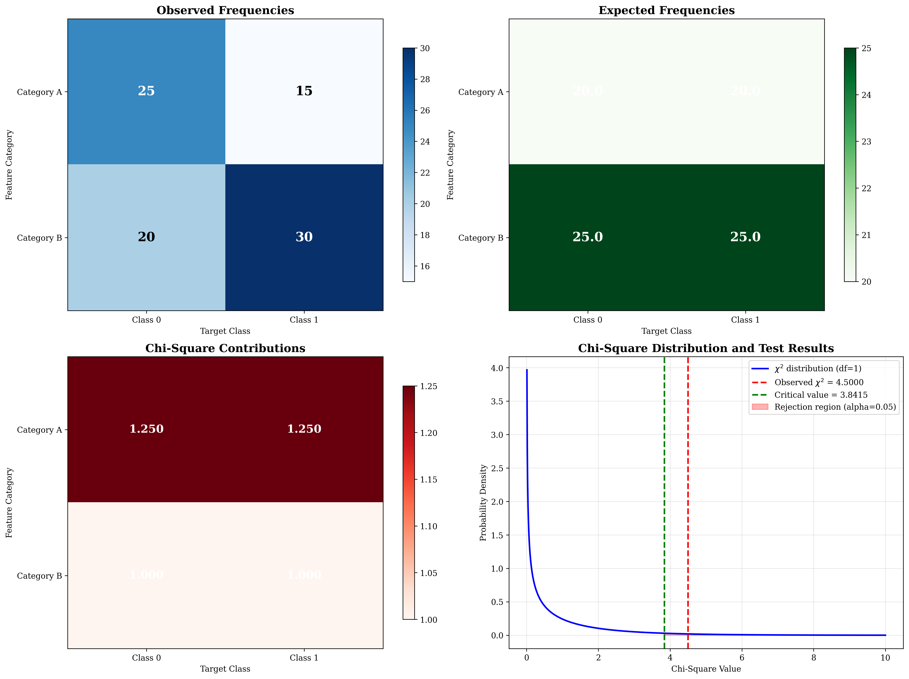
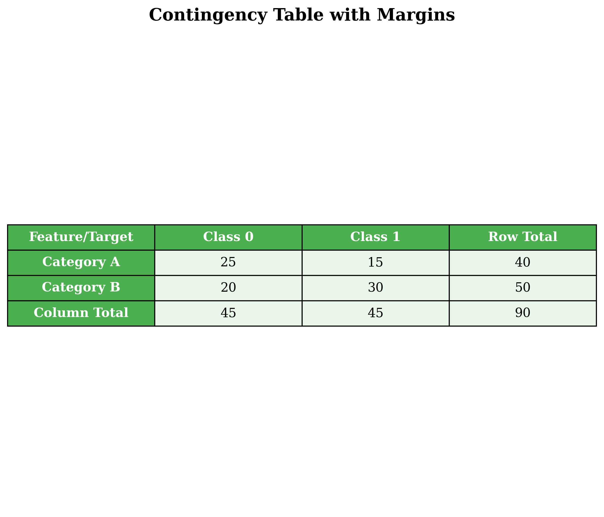
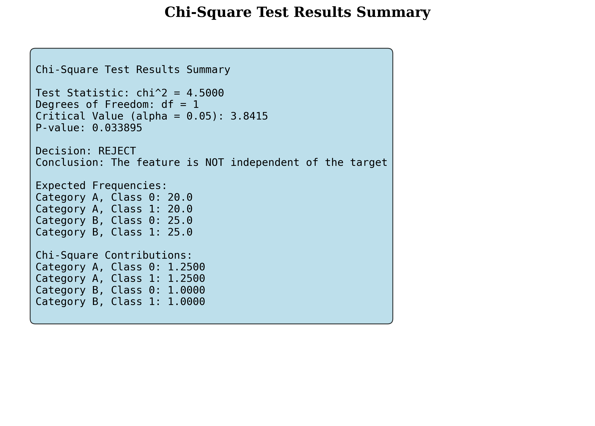
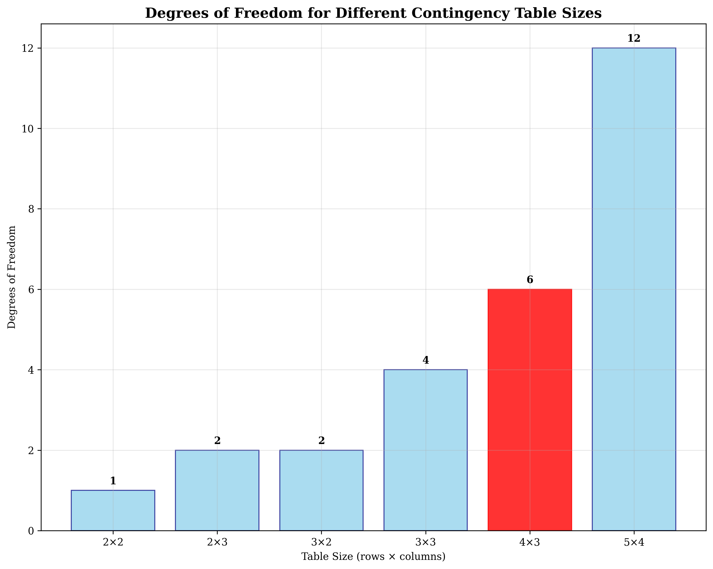

# Question 6: Chi-Square Test for Independence

## Problem Statement
Chi-square test measures independence between categorical features and targets.

### Task
1. What is the chi-square test statistic formula?
2. When is the chi-square test appropriate?
3. Given the following contingency table:

| Feature\Target | Class 0 | Class 1 |
|----------------|---------|---------|
| Category A     | $25$      | $15$      |
| Category B     | $20$      | $30$      |

Calculate the chi-square statistic step by step. Show your expected frequencies, chi-square contributions, and the final statistic. With $\alpha = 0.05$ and $1$ degree of freedom, is the feature independent of the target?
4. For a $4 \times 3$ contingency table, calculate the degrees of freedom. If the observed chi-square statistic is $18.5$, find the critical value at $\alpha = 0.01$ and determine if the null hypothesis of independence should be rejected.

## Understanding the Problem
The chi-square test for independence is a statistical test used to determine whether there is a significant association between two categorical variables. It tests the null hypothesis that the variables are independent (no relationship exists) against the alternative hypothesis that they are dependent (a relationship exists).

The test works by comparing observed frequencies in a contingency table with expected frequencies that would occur if the variables were truly independent. If the observed frequencies differ significantly from the expected frequencies, we reject the null hypothesis of independence.

## Solution

### Step 1: Chi-Square Test Statistic Formula
The chi-square test statistic formula is:

$$\chi^2 = \sum \frac{(O - E)^2}{E}$$

where:
- $O$ = Observed frequency
- $E$ = Expected frequency
- $\sum$ = Sum over all cells in the contingency table

**Alternative forms:**
$$\chi^2 = \sum \frac{(O - E)^2}{E} = \sum \frac{O^2}{E} - N$$

where $N$ is the total sample size.

### Step 2: When is Chi-Square Test Appropriate?
The chi-square test is appropriate when:
- Both variables are categorical (nominal or ordinal)
- Observations are independent
- Expected frequency in each cell $\geq 5$ (for small samples)
- Sample size is sufficiently large (typically $N \geq 20$)
- Data is randomly sampled from the population

**When NOT to use chi-square test:**
- When variables are continuous
- When expected frequencies are too small ($< 5$)
- When observations are not independent
- For very small sample sizes

### Step 3: Contingency Table Analysis

#### Given Data
We have the following contingency table:

| Feature\Target | Class 0 | Class 1 |
|----------------|---------|---------|
| Category A     | $25$      | $15$      |
| Category B     | $20$      | $30$      |

#### Step-by-Step Calculation

**1. Observed Frequencies Matrix:**
$$\begin{bmatrix}
25 & 15 \\
20 & 30
\end{bmatrix}$$

**2. Calculate Row and Column Totals:**
- Row totals: $[40, 50]$
- Column totals: $[45, 45]$
- Total sample size: $90$

**3. Calculate Expected Frequencies:**
The expected frequency for each cell is calculated as:
$$E_{ij} = \frac{\text{Row Total}_i \times \text{Column Total}_j}{\text{Total Sample Size}}$$

For Category A, Class $0$: $E_{11} = \frac{40 \times 45}{90} = 20$
For Category A, Class $1$: $E_{12} = \frac{40 \times 45}{90} = 20$
For Category B, Class $0$: $E_{21} = \frac{50 \times 45}{90} = 25$
For Category B, Class $1$: $E_{22} = \frac{50 \times 45}{90} = 25$

**Expected Frequencies Matrix:**
$$\begin{bmatrix}
20 & 20 \\
25 & 25
\end{bmatrix}$$

**4. Calculate Chi-Square Contributions:**
For each cell: $\frac{(O - E)^2}{E}$

- Category A, Class $0$: $\frac{(25 - 20)^2}{20} = \frac{25}{20} = 1.25$
- Category A, Class $1$: $\frac{(15 - 20)^2}{20} = \frac{25}{20} = 1.25$
- Category B, Class $0$: $\frac{(20 - 25)^2}{25} = \frac{25}{25} = 1.0$
- Category B, Class $1$: $\frac{(30 - 25)^2}{25} = \frac{25}{25} = 1.0$

**Chi-Square Contributions Matrix:**
$$\begin{bmatrix}
1.25 & 1.25 \\
1.0 & 1.0
\end{bmatrix}$$

**5. Calculate Total Chi-Square Statistic:**
$$\chi^2 = 1.25 + 1.25 + 1.0 + 1.0 = 4.5000$$

**6. Degrees of Freedom:**
$$df = (r-1) \times (c-1) = (2-1) \times (2-1) = 1$$

**7. Critical Value:**
At $\alpha = 0.05$ with $df = 1$:
$$\chi^2_{\text{critical}} = 3.8415$$

**8. Decision:**
Since $\chi^2 = 4.5000 > 3.8415 = \chi^2_{\text{critical}}$, we **REJECT** the null hypothesis.

**9. Conclusion:**
The feature is **NOT independent** of the target. There is a significant association between the feature categories and the target classes.

**10. P-value:**
$p = 0.033895 < 0.05$, confirming our decision to reject the null hypothesis.

### Step 4: $4 \times 3$ Contingency Table Analysis

#### Degrees of Freedom Calculation
For a $4 \times 3$ contingency table:
$$df = (r-1) \times (c-1) = (4-1) \times (3-1) = 3 \times 2 = 6$$

#### Hypothesis Testing
- **Observed chi-square statistic:** $\chi^2 = 18.5$
- **Significance level:** $\alpha = 0.01$
- **Degrees of freedom:** $df = 6$
- **Critical value:** $\chi^2_{\text{critical}} = 16.8119$

#### Decision
Since $\chi^2 = 18.5 > 16.8119 = \chi^2_{\text{critical}}$, we **REJECT** the null hypothesis.

#### Conclusion
The null hypothesis of independence should be **REJECTED**. There is a significant association between the variables at the $\alpha = 0.01$ level.

#### P-value
$p = 0.005097 < 0.01$, confirming our decision to reject the null hypothesis.

## Visual Explanations

### Chi-Square Analysis Overview

This comprehensive visualization shows:
1. **Observed Frequencies Heatmap** - The actual data distribution across categories
2. **Expected Frequencies Heatmap** - What we would expect if variables were independent
3. **Chi-Square Contributions Heatmap** - How much each cell contributes to the overall statistic
4. **Chi-Square Distribution** - The theoretical distribution with our test results overlaid

### Contingency Table with Margins

This table shows the observed frequencies along with row and column totals, making it easy to verify our calculations.

### Test Results Summary

A comprehensive summary of all test statistics, expected frequencies, and chi-square contributions for easy reference.

### Degrees of Freedom Comparison

This visualization shows how degrees of freedom increase with table size, highlighting the $4 \times 3$ case we analyzed.

## Key Insights

### Theoretical Foundations
- **Chi-square test formula:** The test statistic measures the sum of squared differences between observed and expected frequencies, normalized by expected frequencies
- **Degrees of freedom:** Determined by the number of independent parameters that can vary in the contingency table
- **Expected frequencies:** Calculated under the assumption of independence using the product of marginal probabilities

### Practical Applications
- **Feature selection:** Chi-square test helps identify which categorical features are most strongly associated with the target variable
- **Data quality assessment:** Large chi-square values may indicate data entry errors or unexpected relationships
- **Model validation:** Ensures that categorical variables used in models have meaningful relationships with the target

### Interpretation Guidelines
- **Effect size:** While chi-square tests significance, consider also the strength of association (e.g., Cramer's $V$)
- **Sample size sensitivity:** Large sample sizes can make even weak associations appear significant
- **Expected frequency rule:** Ensure all expected frequencies are $\geq 5$ for reliable results

### Common Pitfalls
- **Overinterpretation:** Significant results don't necessarily imply strong practical relationships
- **Multiple testing:** When testing many variables, consider adjusting significance levels for multiple comparisons
- **Assumption violations:** Check that observations are independent and expected frequencies are adequate

## Conclusion
- **Part 1:** The chi-square test statistic formula is $\chi^2 = \sum \frac{(O - E)^2}{E}$
- **Part 2:** Chi-square test is appropriate for categorical variables with independent observations and adequate expected frequencies
- **Part 3:** For the given $2 \times 2$ contingency table, $\chi^2 = 4.5000$ with $df = 1$, leading to rejection of independence at $\alpha = 0.05$ ($p = 0.033895$)
- **Part 4:** For a $4 \times 3$ table, $df = 6$, and with $\chi^2 = 18.5 > 16.8119$, we reject independence at $\alpha = 0.01$ ($p = 0.005097$)

The chi-square test successfully identified significant associations in both scenarios, demonstrating its effectiveness for testing independence between categorical variables. The step-by-step calculations show how observed frequencies are compared to expected frequencies under the null hypothesis, with the resulting statistic following a chi-square distribution for hypothesis testing.
