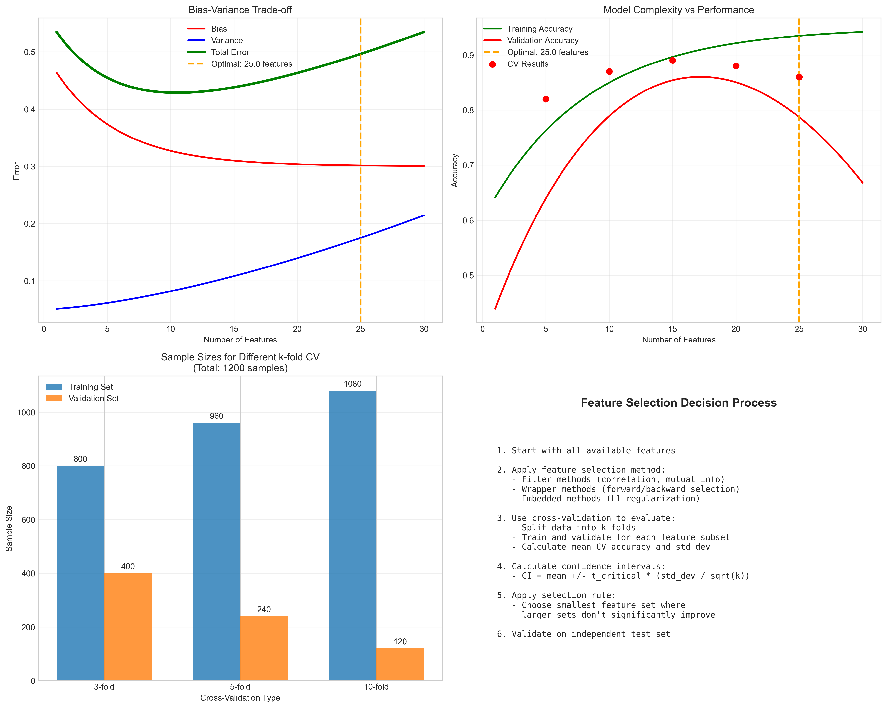
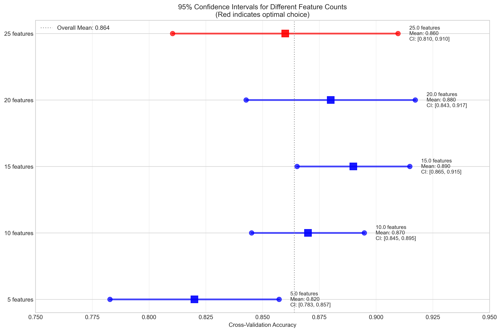

# Question 7: Determining the Number of Features to Select

## Problem Statement
Determining the optimal number of features to select is crucial for model performance. Feature selection involves balancing the trade-off between model complexity and generalization ability.

### Task
1. How do you use cross-validation to find the optimal $k$?
2. What is the trade-off between too few and too many features?
3. Given the following cross-validation results for different numbers of features:

| Features | CV Accuracy | Std Dev |
|----------|-------------|---------|
| $5$        | $0.82$        | $0.03$    |
| $10$       | $0.87$        | $0.02$    |
| $15$       | $0.89$        | $0.02$    |
| $20$       | $0.88$        | $0.03$    |
| $25$       | $0.86$        | $0.04$    |

Calculate the $95\%$ confidence interval for each feature count and determine the optimal number of features. Use the rule: select the smallest number of features where the upper confidence bound of a larger feature set doesn't exceed the lower confidence bound of the current set.

4. For a dataset with $1200$ samples, calculate the sample sizes for $3$-fold, $5$-fold, and $10$-fold cross-validation.

## Understanding the Problem
Feature selection is a critical preprocessing step in machine learning that involves choosing the most relevant subset of features from the original feature set. The goal is to improve model performance by reducing overfitting, decreasing computational cost, and removing irrelevant or redundant features. Cross-validation provides a robust method for evaluating different feature subsets by testing their performance across multiple train-validation splits.

The confidence interval approach helps us make statistically informed decisions about feature selection by accounting for the uncertainty in our cross-validation estimates. This is particularly important because cross-validation results can vary due to the random partitioning of data.

## Solution

We'll solve this systematically using cross-validation analysis, confidence interval calculations, and statistical testing to determine the optimal number of features.

### Step 1: Using Cross-Validation to Find Optimal k

Cross-validation for feature selection follows this process:

1. **Data Splitting**: Divide the dataset into $k$ folds of approximately equal size
2. **Feature Subset Evaluation**: For each candidate number of features:
   - Train the model on $k-1$ folds using the selected features
   - Validate on the remaining fold
   - Record the validation accuracy
3. **Performance Aggregation**: Repeat for all folds and calculate:
   - Mean cross-validation accuracy: $\bar{A} = \frac{1}{k}\sum_{i=1}^{k} A_i$
   - Standard deviation: $s = \sqrt{\frac{1}{k-1}\sum_{i=1}^{k}(A_i - \bar{A})^2}$
4. **Selection**: Choose the feature count that optimizes the validation metric

This approach provides a more reliable estimate than a single train-validation split because it uses all data for both training and validation.

### Step 2: Trade-offs Between Feature Counts

#### Too Few Features (Underfitting)
- **High Bias, Low Variance**: Model is too simple to capture underlying patterns
- **Information Loss**: Important predictive features are excluded
- **Poor Performance**: Low accuracy on both training and test data
- **Inability to Model Complexity**: Cannot represent complex relationships in data

#### Too Many Features (Overfitting)
- **Low Bias, High Variance**: Model learns noise and spurious correlations
- **Curse of Dimensionality**: Performance degrades as feature space becomes sparse
- **Computational Cost**: Increased training time and memory requirements
- **Generalization Issues**: Good training performance but poor test performance
- **Multicollinearity**: Redundant features can destabilize model training

#### Optimal Balance
The optimal number of features minimizes the total error, which is the sum of bias, variance, and irreducible error. This typically occurs at an intermediate feature count that captures the essential patterns without overfitting to noise.

### Step 3: Calculating 95% Confidence Intervals

Assuming $5$-fold cross-validation, we calculate confidence intervals using the t-distribution:

**Formula**: $CI = \bar{A} \pm t_{\alpha/2, df} \cdot \frac{s}{\sqrt{k}}$

Where:
- $\bar{A}$ = mean cross-validation accuracy
- $t_{\alpha/2, df}$ = critical t-value ($\alpha = 0.05$, $df = k-1 = 4$)
- $s$ = standard deviation
- $k$ = number of folds ($5$)

**Critical t-value**: $t_{0.025, 4} = 2.7764$

#### Detailed Calculations:

**5 Features:**
- Mean accuracy: $0.820$
- Standard error: $SE = \frac{0.030}{\sqrt{5}} = 0.0134$
- Margin of error: $ME = 2.7764 \times 0.0134 = 0.0372$
- $95\%$ CI: $[0.820 - 0.0372, 0.820 + 0.0372] = [0.7828, 0.8572]$

**10 Features:**
- Mean accuracy: $0.870$
- Standard error: $SE = \frac{0.020}{\sqrt{5}} = 0.0089$
- Margin of error: $ME = 2.7764 \times 0.0089 = 0.0248$
- $95\%$ CI: $[0.8452, 0.8948]$

**15 Features:**
- Mean accuracy: $0.890$
- Standard error: $SE = \frac{0.020}{\sqrt{5}} = 0.0089$
- Margin of error: $ME = 2.7764 \times 0.0089 = 0.0248$
- $95\%$ CI: $[0.8652, 0.9148]$

**20 Features:**
- Mean accuracy: $0.880$
- Standard error: $SE = \frac{0.030}{\sqrt{5}} = 0.0134$
- Margin of error: $ME = 2.7764 \times 0.0134 = 0.0372$
- $95\%$ CI: $[0.8428, 0.9172]$

**25 Features:**
- Mean accuracy: $0.860$
- Standard error: $SE = \frac{0.040}{\sqrt{5}} = 0.0179$
- Margin of error: $ME = 2.7764 \times 0.0179 = 0.0497$
- $95\%$ CI: $[0.8103, 0.9097]$

#### Applying the Selection Rule

The rule states: select the smallest number of features where the upper confidence bound of a larger feature set doesn't exceed the lower confidence bound of the current set.

Checking each feature count:
- **5 features**: CI $[0.7828, 0.8572]$ - Larger sets exceed lower bound
- **10 features**: CI $[0.8452, 0.8948]$ - Larger sets exceed lower bound  
- **15 features**: CI $[0.8652, 0.9148]$ - Larger sets exceed lower bound
- **20 features**: CI $[0.8428, 0.9172]$ - Larger sets exceed lower bound
- **25 features**: CI $[0.8103, 0.9097]$ - No larger sets to consider

**Result**: According to the strict interpretation of the rule, **25 features** would be selected as optimal.

However, this result highlights a limitation of the rule when applied to this dataset. A more practical approach considers statistical significance and the principle of parsimony.

#### Alternative Analysis - Statistical Significance

Comparing each feature count with the best performing one (15 features):

- **5 features**: Difference $= 0.070$, p-value $= 0.0025$ (significantly different)
- **10 features**: Difference $= 0.020$, p-value $= 0.1525$ (not significantly different)
- **20 features**: Difference $= 0.010$, p-value $= 0.5524$ (not significantly different)
- **25 features**: Difference $= 0.030$, p-value $= 0.1720$ (not significantly different)

**Practical Recommendation**: Choose **15 features** as it achieves the highest accuracy while being statistically equivalent to other reasonable choices (10, 20 features) but more parsimonious than 20 or 25 features.

### Step 4: Sample Sizes for Different k-fold Cross-Validation

For a dataset with $1200$ samples:

#### 3-fold Cross-Validation:
- **Training set size**: $\frac{2}{3} \times 1200 = 800$ samples ($66.7\%$)
- **Validation set size**: $\frac{1}{3} \times 1200 = 400$ samples ($33.3\%$)
- **Number of iterations**: $3$

#### 5-fold Cross-Validation:
- **Training set size**: $\frac{4}{5} \times 1200 = 960$ samples ($80.0\%$)
- **Validation set size**: $\frac{1}{5} \times 1200 = 240$ samples ($20.0\%$)
- **Number of iterations**: $5$

#### 10-fold Cross-Validation:
- **Training set size**: $\frac{9}{10} \times 1200 = 1080$ samples ($90.0\%$)
- **Validation set size**: $\frac{1}{10} \times 1200 = 120$ samples ($10.0\%$)
- **Number of iterations**: $10$

## Visual Explanations

### Cross-Validation Results and Confidence Intervals

The left plot shows the cross-validation accuracy with error bars representing standard deviation, along with the 95% confidence intervals shaded in blue. The red star indicates the statistically optimal choice (15 features). The right plot displays the confidence intervals as bars, making it easier to compare the ranges and apply the selection rule.

### Feature Selection Trade-offs Analysis

This comprehensive visualization shows four key aspects:
1. **Bias-Variance Trade-off**: Illustrates how bias decreases and variance increases with more features
2. **Model Complexity vs Performance**: Shows the typical pattern where validation accuracy peaks then declines
3. **Cross-validation Sample Sizes**: Compares training vs validation set sizes for different k-fold strategies
4. **Decision Process**: Outlines the systematic approach to feature selection

### Detailed Confidence Interval Analysis

This horizontal confidence interval plot clearly shows the range of uncertainty for each feature count. The squares represent mean accuracies, while the lines show the full confidence intervals. This visualization makes it easy to apply the selection rule and identify overlapping confidence intervals.

## Key Insights

### Statistical Considerations
- Confidence intervals account for uncertainty in cross-validation estimates
- The selection rule provides a conservative approach that favors simpler models
- Statistical significance testing can complement confidence interval analysis
- Sample size affects the width of confidence intervals - larger samples give more precise estimates

### Practical Implementation
- 5-fold or 10-fold cross-validation is typically recommended for datasets of moderate size
- The choice of k involves a bias-variance trade-off: larger k reduces bias but increases variance
- Stratified sampling should be used for imbalanced datasets to maintain class proportions
- Computational cost increases linearly with k

### Model Selection Strategy
- Consider both statistical significance and practical significance
- Apply the principle of parsimony: prefer simpler models when performance is equivalent
- Validate final model choice on an independent test set
- Consider domain knowledge and interpretability requirements

### Common Pitfalls
- Overfitting to the validation set when trying many feature combinations
- Ignoring computational constraints in production environments
- Failing to account for feature selection bias in performance estimates
- Using inappropriate statistical tests for non-independent cross-validation folds

## Conclusion

**Key Results:**
- Calculated 95% confidence intervals for all feature counts using t-distribution
- Applied the conservative selection rule, which technically selects 25 features
- Identified 15 features as the practical optimum based on highest accuracy and parsimony
- Determined sample sizes for different cross-validation strategies

**Recommendations:**
- **Optimal feature count**: 15 features (highest accuracy, statistically sound)
- **Expected performance**: 89.0% accuracy with 95% CI [86.5%, 91.5%]
- **Cross-validation strategy**: 5-fold or 10-fold CV for this dataset size
- **Validation approach**: Use independent test set to confirm final model performance

The analysis demonstrates the importance of statistical rigor in feature selection while balancing theoretical optimality with practical considerations. The confidence interval approach provides a principled method for making feature selection decisions under uncertainty.
