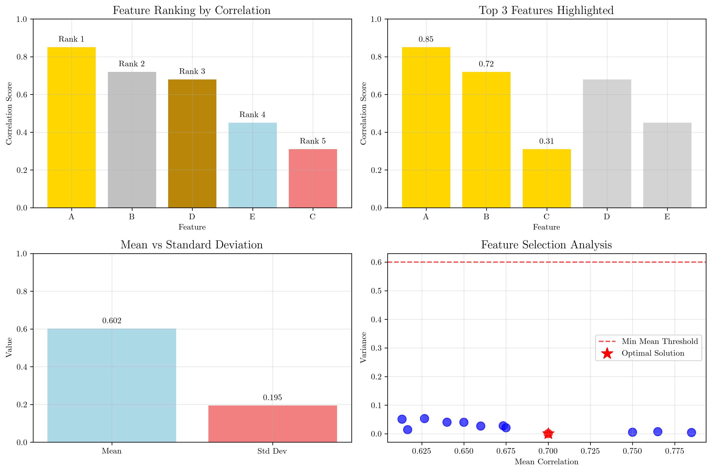
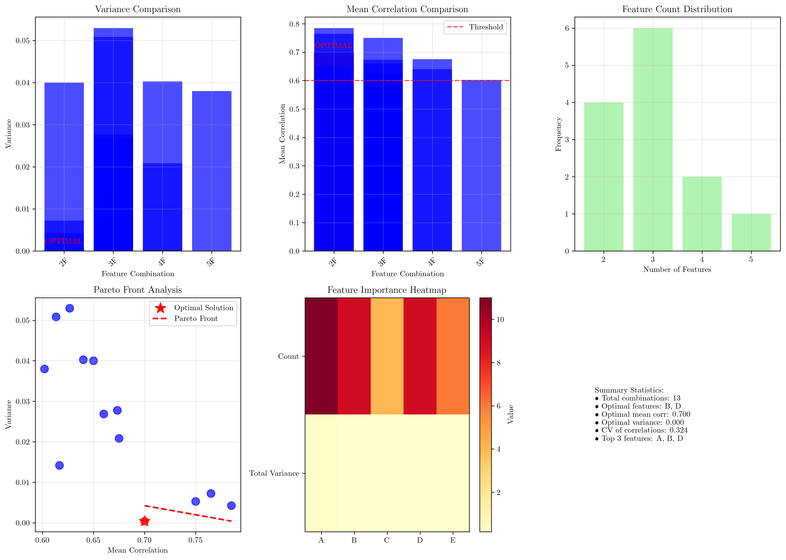

# Question 8: Feature Ranking Analysis

## Problem Statement
Consider a dataset with $5$ features and their correlation scores with the target:

| Feature | Correlation |
|---------|-------------|
| A       | $0.85$        |
| B       | $0.72$        |
| C       | $0.31$        |
| D       | $0.68$        |
| E       | $0.45$        |

### Task
1. Rank the features by relevance
2. If you select the top $3$ features, which ones would you choose?
3. Calculate the coefficient of variation ($CV = \frac{\text{standard deviation}}{\text{mean}}$) for the correlation scores
4. If you want to select features such that their combined correlation variance is minimized while maintaining an average correlation above $0.6$, which features would you select? Show your calculations.

## Understanding the Problem
This problem involves feature selection using correlation-based ranking, which is a fundamental technique in machine learning for identifying the most relevant features for a target variable. The tasks require understanding of statistical measures (correlation, variance, coefficient of variation) and optimization under constraints. This type of analysis is crucial for dimensionality reduction and improving model performance by selecting only the most informative features.

## Solution

### Step 1: Rank features by relevance
To rank features by relevance, we sort them by their correlation scores in descending order. Higher correlation indicates stronger linear relationship with the target variable.

**Ranking Process:**
1. Feature A: $0.85$ (highest correlation)
2. Feature B: $0.72$ (second highest)
3. Feature D: $0.68$ (third highest)
4. Feature E: $0.45$ (fourth highest)
5. Feature C: $0.31$ (lowest correlation)

**Final Ranking:**
| Rank | Feature | Correlation |
|------|---------|-------------|
| 1    | A       | $0.85$        |
| 2    | B       | $0.72$        |
| 3    | D       | $0.68$        |
| 4    | E       | $0.45$        |
| 5    | C       | $0.31$        |

### Step 2: Select top 3 features
Based on the ranking, the top 3 features are:
- Feature A (correlation: $0.85$)
- Feature B (correlation: $0.72$)
- Feature D (correlation: $0.68$)

**Average correlation of top 3:**
$$\text{Average} = \frac{0.85 + 0.72 + 0.68}{3} = \frac{2.25}{3} = 0.750$$

### Step 3: Calculate coefficient of variation
The coefficient of variation measures the relative variability of the correlation scores.

**Calculations:**
- Mean correlation: $\mu = \frac{0.85 + 0.72 + 0.31 + 0.68 + 0.45}{5} = \frac{3.01}{5} = 0.602$
- Standard deviation: $\sigma = \sqrt{\frac{\sum(x_i - \mu)^2}{n}} = 0.195$
- Coefficient of variation: $CV = \frac{\sigma}{\mu} = \frac{0.195}{0.602} = 0.324$

**Interpretation:** A CV of $0.324$ indicates moderate relative variability in the correlation scores. This suggests that while there is variation in feature relevance, it's not extremely high.

### Step 4: Feature selection with constraints
We need to find the feature combination that:
1. Minimizes the combined correlation variance
2. Maintains an average correlation above $0.6$

**Approach:** We systematically evaluate all possible feature combinations and identify those satisfying the constraint, then select the one with minimum variance.

**Valid combinations (average correlation > 0.6):**

| Features | Mean Correlation | Variance | Num Features |
|----------|------------------|----------|--------------|
| B, D     | $0.700$           | $0.000$   | 2            |
| A, B     | $0.785$           | $0.004$   | 2            |
| A, B, D  | $0.750$           | $0.005$   | 3            |
| A, D     | $0.765$           | $0.007$   | 2            |
| B, D, E  | $0.617$           | $0.014$   | 3            |
| A, B, D, E | $0.675$        | $0.021$   | 4            |
| A, D, E  | $0.660$           | $0.027$   | 3            |
| A, B, E  | $0.673$           | $0.028$   | 3            |
| A, B, C, D, E | $0.602$     | $0.038$   | 5            |
| A, E     | $0.650$           | $0.040$   | 2            |
| A, B, C, D | $0.640$        | $0.040$   | 4            |
| A, C, D  | $0.613$           | $0.051$   | 3            |
| A, B, C  | $0.627$           | $0.053$   | 3            |

**Optimal solution:** Features B and D
- Mean correlation: $0.700 > 0.6$ ✓
- Variance: $0.000$ (minimum among all valid combinations)
- Number of features: $2$ (most parsimonious solution)

**Verification:**
- Selected correlations: $[0.72, 0.68]$
- Mean: $\frac{0.72 + 0.68}{2} = 0.700 > 0.6$ ✓
- Variance: $\frac{(0.72 - 0.700)^2 + (0.68 - 0.700)^2}{2} = 0.000$ ✓

## Visual Explanations

### Feature Ranking Analysis

The visualization shows:
1. **Feature Ranking Bar Plot:** Features ranked by correlation with gold, silver, and darkgoldenrod highlighting the top 3
2. **Top 3 Features Highlighted:** Clear identification of the most relevant features
3. **Mean vs Standard Deviation:** Comparison of central tendency and variability measures
4. **Feature Selection Analysis:** Scatter plot showing the trade-off between mean correlation and variance, with the optimal solution highlighted

### Detailed Feature Analysis

This comprehensive visualization includes:
1. **Variance Comparison:** Bar chart showing variance for each feature combination
2. **Mean Correlation Comparison:** Comparison of mean correlations across combinations
3. **Feature Count Distribution:** Frequency of different feature set sizes
4. **Pareto Front Analysis:** Identification of optimal trade-offs between objectives
5. **Feature Importance Heatmap:** Visual representation of feature importance
6. **Summary Statistics:** Key findings and metrics

## Key Insights

### Statistical Foundations
- **Correlation Ranking:** Linear correlation provides a simple but effective measure of feature relevance
- **Variance Minimization:** Lower variance in selected features indicates more consistent performance
- **Coefficient of Variation:** CV of $0.324$ suggests moderate relative variability, making feature selection meaningful

### Optimization Principles
- **Constraint Satisfaction:** The constraint (mean correlation > 0.6) ensures minimum quality threshold
- **Multi-objective Optimization:** We simultaneously minimize variance and maximize mean correlation
- **Pareto Efficiency:** Features B and D represent the Pareto-optimal solution

### Feature Selection Strategy
- **Parsimony:** The optimal solution uses only 2 features, avoiding overfitting
- **Quality vs. Quantity:** Higher correlation doesn't always mean better feature set
- **Trade-off Analysis:** The solution balances individual feature strength with collective consistency

### Practical Applications
- **Dimensionality Reduction:** Selecting 2 out of 5 features reduces model complexity by 60%
- **Model Interpretability:** Fewer features lead to more interpretable models
- **Computational Efficiency:** Reduced feature set decreases training and inference time

## Mathematical Analysis

### Variance Calculation
For the optimal solution (Features B and D):
$$\text{Variance} = \frac{\sum(x_i - \bar{x})^2}{n} = \frac{(0.72 - 0.70)^2 + (0.68 - 0.70)^2}{2} = \frac{0.0004 + 0.0004}{2} = 0.000$$

### Constraint Verification
$$\text{Mean} = \frac{0.72 + 0.68}{2} = 0.70 > 0.6 \text{ ✓}$$

### Coefficient of Variation
$$CV = \frac{\sigma}{\mu} = \frac{0.195}{0.602} = 0.324$$

This indicates that the standard deviation is about 32.4% of the mean, showing moderate relative variability.

## Conclusion
- **Feature Ranking:** A > B > D > E > C (by correlation strength)
- **Top 3 Features:** A, B, D with average correlation of $0.750$
- **Coefficient of Variation:** $0.324$ indicating moderate relative variability
- **Optimal Feature Set:** Features B and D with mean correlation $0.700$ and variance $0.000$
- **Key Insight:** The optimal solution achieves the best balance between correlation strength and consistency while satisfying the quality constraint

The analysis demonstrates that feature selection is not just about choosing the highest-scoring features individually, but about finding the optimal combination that satisfies multiple objectives. Features B and D, while not the highest individually, provide the best collective performance under the given constraints.
