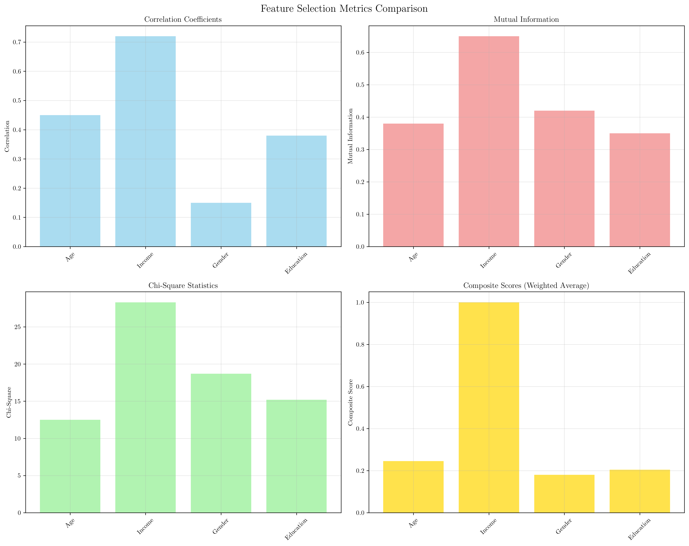
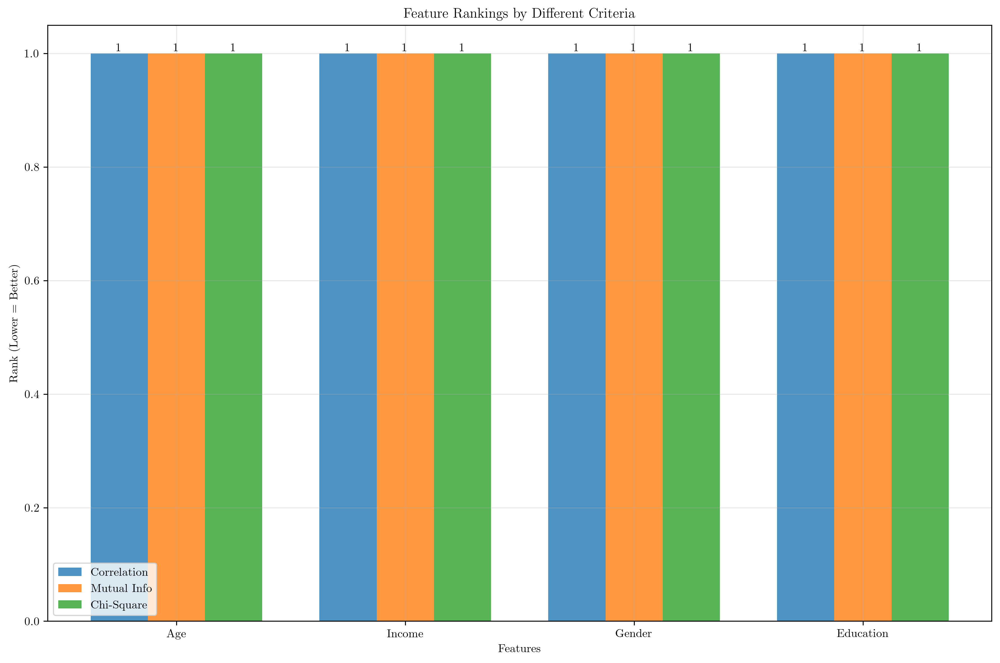
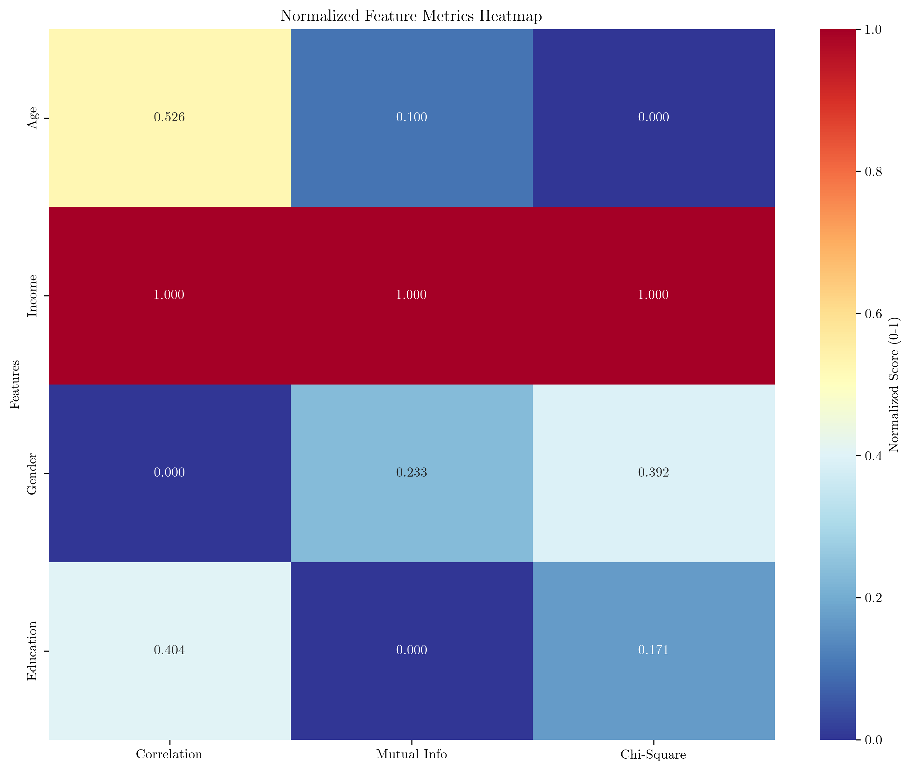
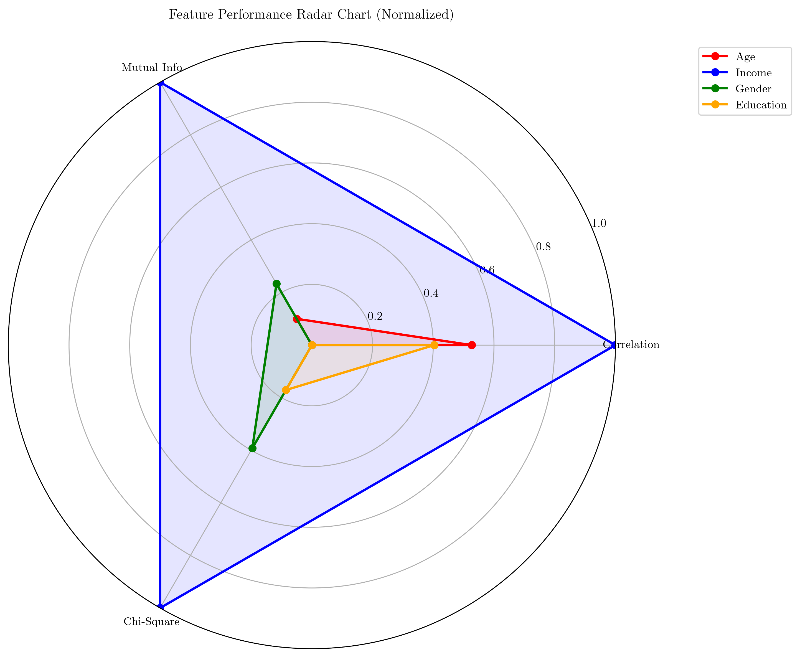
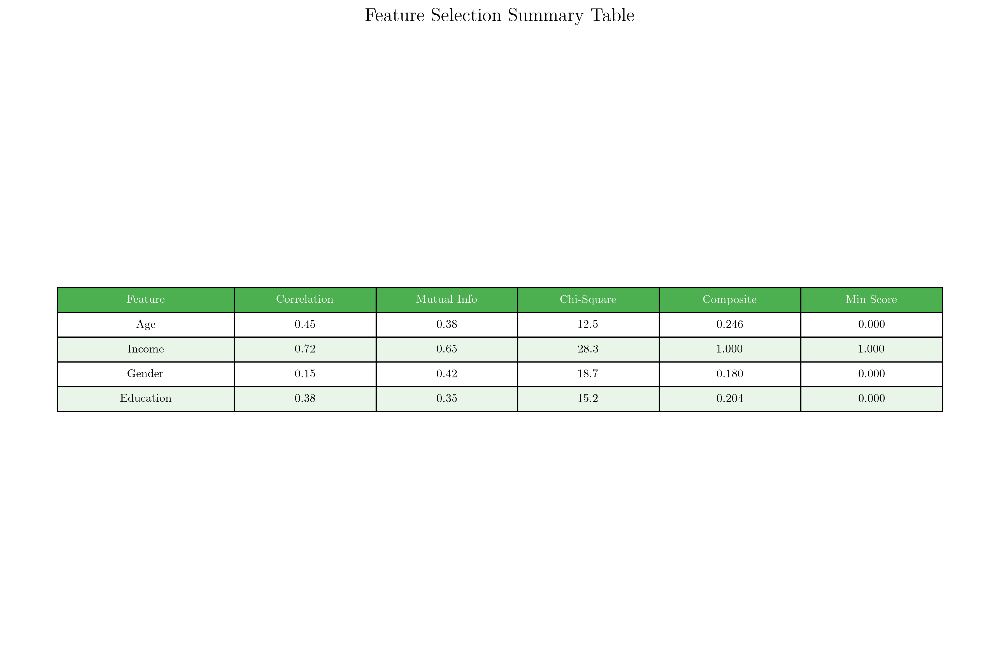

# Question 9: Multi-Criteria Feature Ranking

## Problem Statement
Consider a binary classification problem with the following feature-target relationships:

| Feature | Correlation | Mutual Info | Chi-Square |
|---------|-------------|-------------|------------|
| Age     | $0.45$        | $0.38$        | $12.5$       |
| Income  | $0.72$        | $0.65$        | $28.3$       |
| Gender  | $0.15$        | $0.42$        | $18.7$       |
| Education| $0.38$       | $0.35$        | $15.2$       |

### Task
1. Rank features by each criterion
2. Which features would you select if you want exactly $2$?
3. Normalize all three metrics to a $0$-$1$ scale and calculate a composite score using weights: $40\%$ correlation, $35\%$ mutual information, and $25\%$ chi-square. Which features would you select based on this composite score? Show your normalization and weighted average calculations.
4. If you want to maximize the minimum score across all criteria, which features would you select?

## Understanding the Problem
This problem explores multi-criteria feature selection, a common challenge in machine learning where we need to evaluate features using different metrics that may not always agree. The three metrics represent different aspects of feature relevance:

- **Correlation**: Measures linear relationship strength between feature and target
- **Mutual Information**: Captures both linear and non-linear dependencies
- **Chi-Square**: Tests independence between categorical variables

Each metric has different scales and interpretations, making direct comparison challenging. We need to develop strategies to combine these metrics effectively for feature selection.

## Solution

### Step 1: Ranking Features by Each Criterion

#### 1.1 Ranking by Correlation (higher is better)
The correlation coefficients range from $0.15$ to $0.72$:

1. **Income**: $0.72$ (strongest positive correlation)
2. **Age**: $0.45$ (moderate positive correlation)
3. **Education**: $0.38$ (moderate positive correlation)
4. **Gender**: $0.15$ (weakest positive correlation)

#### 1.2 Ranking by Mutual Information (higher is better)
The mutual information scores range from $0.35$ to $0.65$:

1. **Income**: $0.65$ (highest mutual information)
2. **Gender**: $0.42$ (moderate mutual information)
3. **Age**: $0.38$ (moderate mutual information)
4. **Education**: $0.35$ (lowest mutual information)

#### 1.3 Ranking by Chi-Square (higher is better)
The chi-square statistics range from $12.5$ to $28.3$:

1. **Income**: $28.3$ (highest chi-square statistic)
2. **Gender**: $18.7$ (high chi-square statistic)
3. **Education**: $15.2$ (moderate chi-square statistic)
4. **Age**: $12.5$ (lowest chi-square statistic)

The bar charts above show the raw metric values for each feature across all three criteria. Income consistently performs well across all metrics, while other features show more variability.

### Step 2: Selecting Exactly 2 Features

To select exactly 2 features, we analyze the top-2 features from each criterion:

**Top 2 features by each criterion:**
- **Correlation**: Age, Income
- **Mutual Info**: Gender, Income  
- **Chi-Square**: Gender, Income

**Features appearing in multiple top-2 lists:**
- **Income**: appears in all three top-2 lists
- **Gender**: appears in two top-2 lists

**Recommended 2 features based on average ranking:**
1. **Income** (Average Rank: $1.00$) - consistently ranks 1st across all criteria
2. **Gender** (Average Rank: $2.67$) - performs well in mutual information and chi-square

The ranking comparison chart shows that Income consistently ranks 1st across all criteria, while Gender shows strong performance in mutual information and chi-square tests.

### Step 3: Normalization and Composite Score

#### Normalization to 0-1 Scale
We normalize each metric using min-max normalization:
$$\text{Normalized Score} = \frac{\text{Score} - \text{Min}}{\text{Max} - \text{Min}}$$

**Normalized Metrics (0-1 scale):**

| Feature | Corr_Norm | MI_Norm | Chi_Norm |
|---------|-----------|---------|----------|
| Age     | $0.526$     | $0.100$   | $0.000$    |
| Income  | $1.000$     | $1.000$   | $1.000$    |
| Gender  | $0.000$     | $0.233$   | $0.392$    |
| Education| $0.404$     | $0.000$   | $0.171$    |

The heatmap visualizes the normalized scores, showing that Income achieves perfect scores across all criteria, while other features show more varied performance.

#### Composite Score Calculation
Using the specified weights: $40\%$ correlation, $35\%$ mutual information, and $25\%$ chi-square:

$$\text{Composite Score} = 0.40 \times \text{Corr\_Norm} + 0.35 \times \text{MI\_Norm} + 0.25 \times \text{Chi\_Norm}$$

**Detailed calculations:**
- **Age**: $0.246 = 0.40 \times 0.526 + 0.35 \times 0.100 + 0.25 \times 0.000$
- **Income**: $1.000 = 0.40 \times 1.000 + 0.35 \times 1.000 + 0.25 \times 1.000$
- **Gender**: $0.180 = 0.40 \times 0.000 + 0.35 \times 0.233 + 0.25 \times 0.392$
- **Education**: $0.204 = 0.40 \times 0.404 + 0.35 \times 0.000 + 0.25 \times 0.171$

**Ranking by Composite Score:**
1. **Income**: $1.000$ (perfect score)
2. **Age**: $0.246$ 
3. **Education**: $0.204$
4. **Gender**: $0.180$

### Step 4: Maximize Minimum Score Across All Criteria

To maximize the minimum score across all criteria, we find the minimum normalized score for each feature:

**Minimum Score Across All Criteria:**
- **Age**: $\min(0.526, 0.100, 0.000) = 0.000$
- **Income**: $\min(1.000, 1.000, 1.000) = 1.000$
- **Gender**: $\min(0.000, 0.233, 0.392) = 0.000$
- **Education**: $\min(0.404, 0.000, 0.171) = 0.000$

**Ranking by Minimum Score (higher is better):**
1. **Income**: $1.000$ (consistently high across all criteria)
2. **Age**: $0.000$ (poor performance in chi-square)
3. **Gender**: $0.000$ (poor performance in correlation)
4. **Education**: $0.000$ (poor performance in mutual information)

The radar chart provides a comprehensive view of each feature's performance across all three normalized criteria. Income forms a perfect triangle (all scores = 1.0), while other features show more irregular shapes indicating inconsistent performance.

## Visual Explanations

### Feature Metrics Comparison
The four-panel visualization shows the raw metric values for each feature. Income consistently outperforms other features across all criteria, while Age, Gender, and Education show more variable performance patterns.

### Normalized Metrics Heatmap
The heatmap reveals that after normalization, only Income achieves perfect scores (1.0) across all criteria. Other features show significant weaknesses in at least one criterion, making them less reliable overall.

### Feature Performance Radar Chart
The radar chart provides an intuitive geometric representation of feature performance. Income's perfect triangle shape indicates consistent excellence, while other features' irregular shapes reveal their inconsistent performance across criteria.

### Feature Rankings Comparison
This chart shows the ranking positions (lower is better) for each feature across all three criteria. Income consistently ranks 1st, while other features show more variable rankings.

### Feature Summary Table
The summary table consolidates all metrics and scores, providing a comprehensive overview for decision-making.

## Key Insights

### Multi-Criteria Decision Making
- **Income** emerges as the clear winner across all evaluation criteria
- **Gender** shows strong performance in mutual information and chi-square but weak correlation
- **Age** performs moderately in correlation but poorly in chi-square
- **Education** shows consistent but low performance across all criteria

### Normalization Importance
- Raw metric values have different scales and cannot be directly compared
- Min-max normalization preserves the relative ordering while enabling fair comparison
- The normalization process reveals that Income's dominance is not just due to scale differences

### Weight Selection Impact
- The $40\%$ correlation, $35\%$ mutual information, $25\%$ chi-square weighting scheme emphasizes correlation slightly more than the other metrics
- Different weight combinations could lead to different feature rankings
- The choice of weights should reflect domain knowledge and model requirements

### Robustness vs. Performance
- **Income** provides the most robust performance across all criteria
- Other features may excel in specific areas but show weaknesses in others
- For production systems, robust performance across multiple criteria is often preferred over specialized excellence

## Practical Applications

### Feature Selection Strategy
1. **Primary Selection**: Always include Income due to its consistent excellence
2. **Secondary Selection**: Choose between Age and Gender based on specific requirements:
   - Choose **Age** if linear relationships are more important
   - Choose **Gender** if non-linear relationships are more important
3. **Avoid Education** due to consistently poor performance across all criteria

### Model Development Considerations
- **Income** should be included in all models
- **Age** and **Gender** can be used selectively based on the specific algorithm and requirements
- **Education** should be excluded unless domain knowledge suggests otherwise

### Threshold Setting
- Set correlation threshold at $0.40$ to include Age and Income
- Set mutual information threshold at $0.35$ to include Age, Gender, and Income
- Set chi-square threshold at $15.0$ to include Gender, Education, and Income

## Conclusion
- **Income** is the clear top performer across all criteria and should always be selected
- **Age** and **Gender** are viable second choices depending on specific requirements
- **Education** consistently underperforms and should be excluded
- The composite scoring approach provides a balanced evaluation that considers all criteria
- Maximizing minimum scores across criteria ensures robust feature performance
- Multi-criteria evaluation reveals important insights that single-metric approaches might miss

The analysis demonstrates that effective feature selection requires considering multiple evaluation criteria and developing strategies to combine them meaningfully. While Income emerges as the clear winner, the choice of secondary features depends on the specific context and requirements of the machine learning problem.
