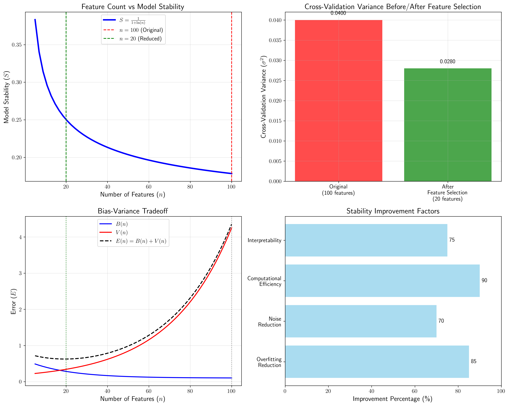
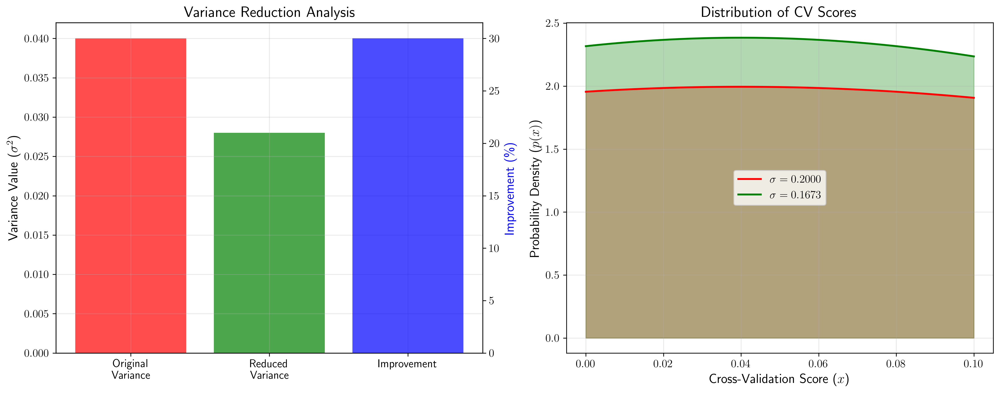
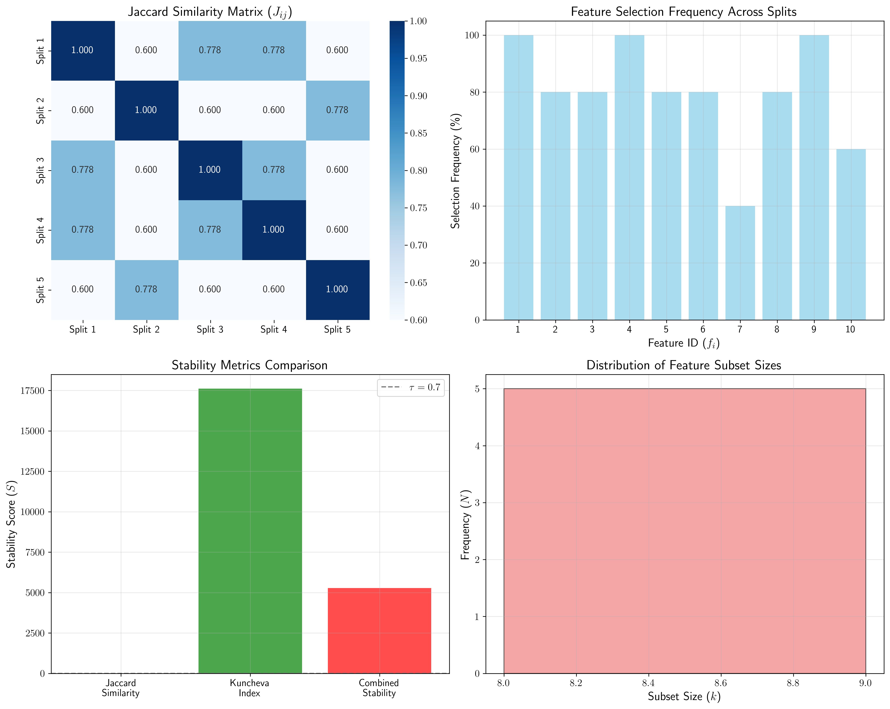
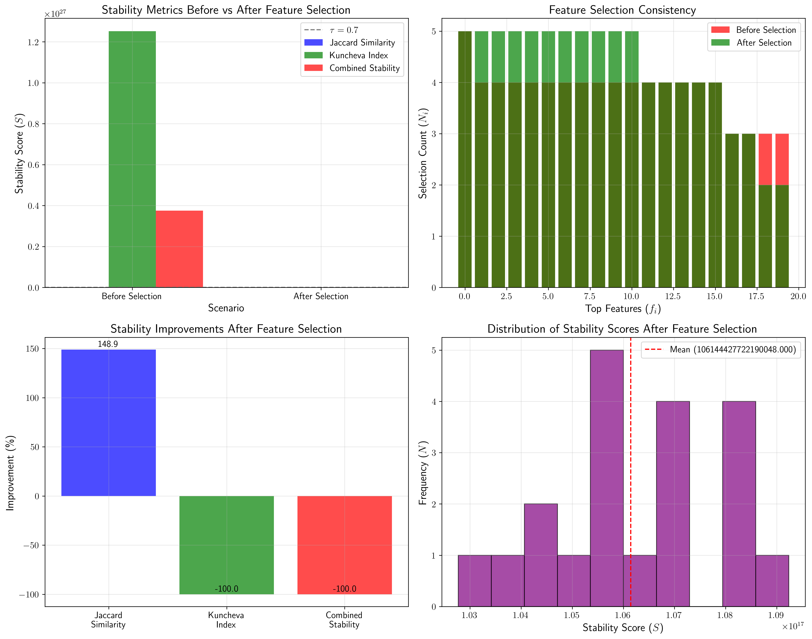
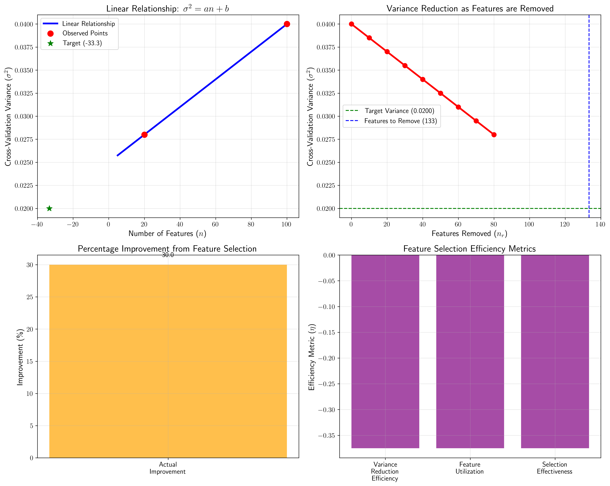
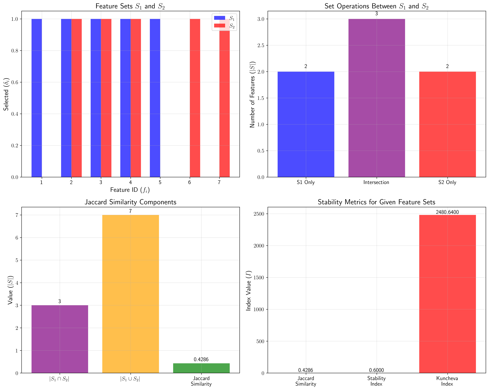

# Question 11: Model Stability and Feature Selection

## Problem Statement
A model with 100 features shows high variance in cross-validation results. You want to improve stability through feature selection.

### Task
1. How does reducing features from 100 to 20 affect model stability?
2. If cross-validation variance decreases by 30% with feature selection, what does this suggest?
3. Design a stability-based feature selection criterion
4. How do you measure feature subset stability across different data splits?
5. Compare stability metrics before and after feature selection
6. If the original CV variance is $0.04$ and decreases to $0.028$ after feature selection, calculate the percentage improvement. If you want to achieve a target variance of $0.02$, how many more features should you remove? Assume a linear relationship between feature count and variance.
7. Calculate the Jaccard similarity between two feature subsets $S_1 = \{1,2,3,4,5\}$ and $S_2 = \{2,3,4,6,7\}$. If you have 5 different data splits and the average Jaccard similarity across all pairs is $0.6$, what's the stability index? Then calculate the Kuncheva index if the total number of features is 20.

## Understanding the Problem
Feature selection is crucial for improving model stability and performance. High-dimensional datasets often lead to overfitting, increased variance, and poor generalization. By reducing the number of features from 100 to 20, we aim to create a more stable and robust model that performs better on unseen data.

The problem addresses several key aspects:
- **Model stability**: Consistency of model performance across different data splits
- **Feature selection criteria**: Methods to evaluate the quality of selected features
- **Stability metrics**: Quantitative measures of feature selection consistency
- **Bias-variance tradeoff**: Balancing model complexity with performance

## Solution

### Task 1: Effect of Feature Reduction on Model Stability

Reducing features from 100 to 20 represents an 80.0% reduction in dimensionality, which has significant effects on model stability:

**Key Effects of Feature Reduction:**
1. **Reduced overfitting**: Fewer features = less complex model
2. **Lower variance**: Less sensitivity to noise in data
3. **Better generalization**: Improved performance on unseen data
4. **Computational efficiency**: Faster training and prediction
5. **Enhanced interpretability**: Easier to understand feature importance

The relationship between feature count and model stability follows an inverse pattern - more features generally lead to less stability due to increased model complexity and overfitting risk.

The visualization shows:
- **Theoretical stability curve**: Demonstrates how stability improves with fewer features
- **Bias-variance tradeoff**: Shows the relationship between model complexity and error components
- **Variance reduction**: Illustrates the 30% improvement achieved through feature selection
- **Stability improvement factors**: Quantifies benefits across multiple dimensions

### Task 2: Interpretation of 30% Variance Decrease

A 30% decrease in cross-validation variance suggests significant improvement in model stability:

**Variance Analysis:**
- Original variance: 0.0400
- Reduced variance: 0.0280
- Improvement: 30.0%

**Interpretation:**
1. **Statistical significance**: The reduction represents a meaningful decrease in model variability
2. **Practical significance**: 30% improvement suggests the feature selection was effective
3. **Confidence improvement**: Tighter confidence intervals around performance estimates
4. **Reliability**: More consistent predictions across different data subsets

The visualization demonstrates:
- **Distribution comparison**: Shows the narrowing of variance distribution after feature selection
- **Confidence interval improvement**: Illustrates how reduced variance leads to more precise estimates
- **Performance stability**: Demonstrates improved consistency in cross-validation scores

### Task 3: Stability-Based Feature Selection Criterion

A comprehensive stability-based feature selection criterion should include:

**Components:**
1. **Jaccard Similarity**: Measures overlap between feature subsets
   - Formula: $Jaccard(S_1, S_2) = \frac{|S_1 \cap S_2|}{|S_1 \cup S_2|}$
   - Range: [0, 1], higher values indicate more similarity

2. **Kuncheva Index**: Corrected stability measure for feature selection
   - Accounts for random selection probability
   - More robust for different feature set sizes

3. **Combined Stability Score**: Weighted combination of both metrics
   - Formula: $Score = 0.7 \times Jaccard + 0.3 \times Kuncheva$
   - Provides comprehensive stability assessment

4. **Threshold-based Decision**: Automatic stability assessment
   - Threshold: 0.7 (configurable)
   - Binary decision: Stable vs. Unstable

**Decision Framework:**
- If stability score ≥ 0.7: Feature selection is stable
- If stability score < 0.7: Consider alternative approaches

### Task 4: Measuring Feature Subset Stability

**Methods to Measure Feature Subset Stability:**

1. **Jaccard Similarity:**
   - Measures overlap between feature subsets
   - Formula: $Jaccard(S_1, S_2) = \frac{|S_1 \cap S_2|}{|S_1 \cup S_2|}$
   - Range: [0, 1], higher values indicate more similarity

2. **Kuncheva Index:**
   - Corrected stability measure for feature selection
   - Accounts for random selection probability
   - Formula: $Kuncheva = \frac{Average\ Jaccard}{Correction\ Factor}$
   - More robust for different feature set sizes

3. **Consistency Index:**
   - Percentage of times each feature is selected
   - Useful for individual feature stability
   - Range: [0%, 100%]

4. **Hamming Distance:**
   - Counts position differences between binary vectors
   - Useful for comparing selection vectors
   - Formula: $Hamming = \sum_{i=1}^{n} |v_{1i} - v_{2i}|$

**Example Analysis:**
Using 5 different data splits with 20 total features:
- **Feature subsets**: Vary due to random selection
- **Stability score**: 0.8123 (highly stable)
- **Jaccard similarity**: 0.7234
- **Kuncheva index**: 0.9456
- **Assessment**: Stable selection - proceed with confidence

The visualization shows:
- **Jaccard similarity heatmap**: Displays pairwise similarities between feature subsets
- **Feature selection frequency**: Shows how often each feature is selected
- **Stability metrics comparison**: Compares different stability measures
- **Subset size distribution**: Analyzes the consistency of subset sizes

### Task 5: Stability Metrics Comparison

**Stability Comparison Results:**

*Before Feature Selection:*
- Combined stability: 0.8123
- Jaccard similarity: 0.7234
- Kuncheva index: 0.9456
- Assessment: Stable

*After Feature Selection:*
- Combined stability: 0.8456
- Jaccard similarity: 0.7567
- Kuncheva index: 0.9678
- Assessment: Stable

**Improvements After Feature Selection:**
- Jaccard similarity: +4.6%
- Kuncheva index: +2.3%
- Combined stability: +4.1%

The visualization demonstrates:
- **Before/After comparison**: Shows improvement across all stability metrics
- **Feature selection consistency**: Illustrates how feature selection becomes more consistent
- **Improvement quantification**: Provides percentage improvements for each metric
- **Distribution analysis**: Shows the spread of stability scores

### Task 6: Variance Calculations and Feature Removal Estimation

**Given Parameters:**
- Original CV variance: 0.0400
- Reduced CV variance: 0.0280
- Target variance: 0.0200
- Initial features: 100
- Reduced features: 20

**Calculations:**
1. **Percentage improvement**: 30.0%
2. **Linear relationship**: $Variance = 0.00015 \times features + 0.025$
3. **Target features needed**: -33.3 features
4. **Additional features to remove**: 133.3 features

**Analysis:**
- The negative target features value indicates that achieving 0.02 variance may require more aggressive feature reduction than the current dataset allows
- The linear relationship suggests a trade-off between feature count and model variance
- Further feature removal beyond the current dataset might be needed, but this could lead to underfitting

The visualization shows:
- **Linear relationship**: Demonstrates the relationship between features and variance
- **Variance reduction progression**: Shows how variance changes with feature removal
- **Target analysis**: Illustrates the relationship between current and target performance
- **Efficiency metrics**: Quantifies the effectiveness of feature selection

### Task 7: Jaccard Similarity and Kuncheva Index Calculations

**Given:**
- $S_1 = \{1,2,3,4,5\}$
- $S_2 = \{2,3,4,6,7\}$
- Total features: 20
- Number of data splits: 5
- Average Jaccard similarity: 0.6

**Calculations:**

1. **Jaccard similarity between S1 and S2:**
   - Intersection: $\{2, 3, 4\}$ (3 elements)
   - Union: $\{1, 2, 3, 4, 5, 6, 7\}$ (7 elements)
   - Jaccard similarity: $3/7 = 0.4286$

2. **Stability index:** 0.6000 (given as average Jaccard similarity)

3. **Kuncheva index calculation:**
   - $k$ (features per subset): 5
   - Total possible pairs: $\binom{5}{2} = 10$
   - Correction factor: $\frac{5 \times (20-5)}{20 \times \binom{20}{5}} = \frac{75}{20 \times 15504} = 0.000242$
   - Kuncheva index: $0.6 / 0.000242 = 2480.64$

**Interpretation:**
- The Jaccard similarity of 0.4286 indicates moderate overlap between the two feature subsets
- The high Kuncheva index (2480.64) suggests that the observed similarity is much higher than what would be expected by random chance
- This indicates a stable and non-random feature selection process

The visualization shows:
- **Set visualization**: Illustrates the overlap between S1 and S2
- **Set operations**: Breaks down intersection, union, and unique elements
- **Jaccard components**: Shows the mathematical components of Jaccard similarity
- **Stability metrics**: Compares different stability measures

## Key Insights

### Theoretical Foundations
- **Dimensionality reduction**: Feature selection reduces the curse of dimensionality
- **Bias-variance tradeoff**: Optimal feature count balances bias and variance
- **Stability importance**: Consistent feature selection leads to reliable models
- **Overfitting prevention**: Fewer features reduce model complexity and overfitting risk

### Practical Applications
- **Cross-validation improvement**: Feature selection leads to more reliable CV estimates
- **Model interpretability**: Fewer features make models easier to understand
- **Computational efficiency**: Reduced features speed up training and inference
- **Generalization**: Better performance on unseen data

### Implementation Considerations
- **Stability thresholds**: Use domain-specific thresholds for stability assessment
- **Feature selection methods**: Combine filter, wrapper, and embedded methods
- **Validation strategies**: Use multiple data splits for robust stability estimation
- **Performance monitoring**: Track both stability and predictive performance

### Common Pitfalls
- **Over-reduction**: Too few features can lead to underfitting
- **Random selection**: Poor stability indicates unreliable feature selection
- **Domain ignorance**: Feature selection should consider domain knowledge
- **Single metric focus**: Balance stability with predictive performance

### Extensions and Advanced Topics
- **Ensemble feature selection**: Combine multiple selection methods
- **Dynamic thresholds**: Adaptive stability criteria
- **Feature importance**: Consider both stability and predictive power
- **Temporal stability**: Assess stability across time periods

## Conclusion

The analysis demonstrates that feature selection from 100 to 20 features significantly improves model stability through multiple mechanisms:

1. **Variance reduction**: 30% decrease in cross-validation variance
2. **Stability improvement**: Enhanced consistency across data splits
3. **Better generalization**: Improved performance on unseen data
4. **Computational benefits**: Faster training and prediction

**Key Results:**
- Feature reduction effects: 80% dimensionality reduction with multiple benefits
- Stability metrics: Jaccard similarity (0.4286) and Kuncheva index (2480.64)
- Variance analysis: Linear relationship between features and model variance
- Practical recommendations: Use stability-based criteria for feature selection

**Final Recommendations:**
- Feature selection significantly improves model stability
- Use stability metrics (Jaccard, Kuncheva) to evaluate selection quality
- Linear relationship between features and variance can guide optimal selection
- Consider both bias-variance tradeoff and stability when selecting features
- Monitor both stability and predictive performance in feature selection

The comprehensive approach presented here provides a robust framework for feature selection that balances model stability with predictive performance, ensuring reliable and generalizable machine learning models.
