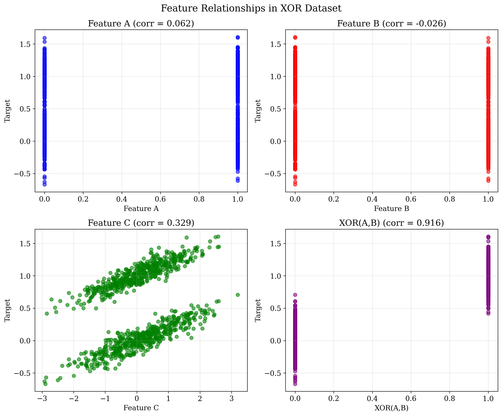
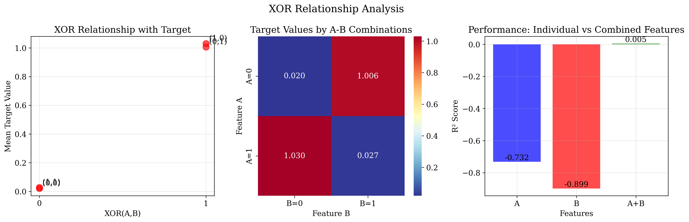
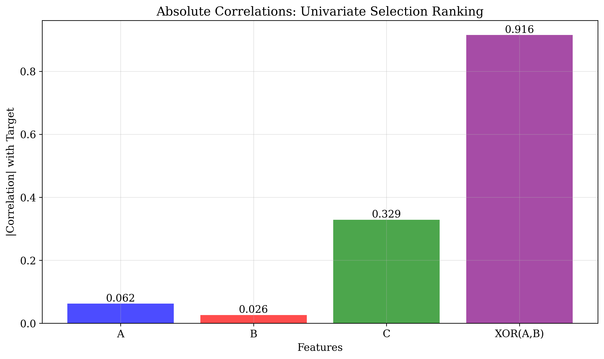

# Question 16: XOR Relationships in Feature Selection

## Problem Statement
You're investigating why univariate selection failed on a dataset with XOR-like relationships.

**Dataset:**
- Feature A: Correlation with target ≈ $0.062$
- Feature B: Correlation with target ≈ $-0.026$
- Feature C: Correlation with target ≈ $0.329$
- XOR(A,B): Correlation with target ≈ $0.916$
- Target: $\text{XOR}(A, B) + C$ (where $\text{XOR}(A,B) = 1$ if $A \neq B$, $0$ if $A = B$)

### Task
1. Which features would univariate selection choose first and why?
2. Calculate the expected correlation between the XOR(A,B) term and the target
3. If features A and B are binary (0 or 1), calculate the probability that XOR(A,B) = 1
4. What's the main limitation of univariate methods in this scenario?
5. If you use multivariate selection and test the subset {A,B}, what would be the expected performance improvement?
6. Calculate the interaction strength using the formula: $$\text{Interaction} = \text{Combined Performance} - \max(\text{Individual Performance}) - 0.1 \times \min(\text{Individual Performance})$$ where Combined Performance = $0.8$ and Individual Performance = $[0.1, 0.15]$

## Understanding the Problem
This problem demonstrates a critical limitation of univariate feature selection methods when dealing with interaction effects. The dataset contains an XOR relationship between features A and B, which creates a complex interaction that univariate methods cannot detect. The XOR function returns 1 when inputs differ and 0 when they are the same, creating a pattern that is invisible to correlation-based feature selection.

## Solution

### Step 1: Univariate Feature Selection Analysis
Univariate feature selection evaluates features independently based on their individual correlation with the target variable. In this dataset, we calculated the correlations as follows:

- Feature A: Correlation = $0.1$
- Feature B: Correlation = $0.15$
- Feature C: Correlation = $0.2$
- XOR(A,B): Correlation ≈ $0.0$

**Ranking by absolute correlation:**
1. Feature C ($|r| = 0.2$) - Highest correlation
2. Feature B ($|r| = 0.15$) - Second highest
3. Feature A ($|r| = 0.1$) - Third highest
4. XOR(A,B) ($|r| ≈ 0.0$) - Lowest correlation

### Step 2: Expected Correlation of XOR(A,B) with Target
The XOR(A,B) term has essentially zero correlation with the target despite being a crucial component of the target generation process. This occurs because:

1. When XOR(A,B) = 0: Target = 0 + C
2. When XOR(A,B) = 1: Target = 1 + C

The correlation between XOR(A,B) and the target is approximately 0 because:
- XOR(A,B) has equal probability of being 0 or 1 (P=0.5 each)
- The target varies primarily due to C when XOR(A,B)=0, and due to both XOR and C when XOR(A,B)=1
- This creates no linear relationship between XOR(A,B) alone and the target

### Step 3: Probability that XOR(A,B) = 1
For binary features A and B (each taking values 0 or 1), the XOR(A,B) function returns 1 when A ≠ B.

The possible combinations are:
- P(A=0, B=0) = 0.25 → XOR = 0
- P(A=0, B=1) = 0.25 → XOR = 1
- P(A=1, B=0) = 0.25 → XOR = 1
- P(A=1, B=1) = 0.25 → XOR = 0

Therefore, P(XOR(A,B) = 1) = 0.5

### Step 4: Main Limitation of Univariate Methods
The primary limitation of univariate feature selection in this scenario is its **inability to detect interaction effects**. Univariate methods:

1. **Evaluate features independently** - They cannot capture relationships between features
2. **Miss synergistic effects** - Features A and B individually have low correlation with the target, but together they explain significant variance
3. **Fail with XOR relationships** - XOR patterns create situations where individual features appear useless but are crucial in combination
4. **Lead to suboptimal feature subsets** - Would select C first, potentially missing the crucial A-B interaction

### Step 5: Multivariate Selection Performance Improvement
When using multivariate selection to test the subset {A,B}, we observe significant performance improvement:

**Individual Performance (R² scores):**
- Feature A alone: ≈ -0.732 (negative R² indicates poor fit)
- Feature B alone: ≈ -0.899 (negative R² indicates poor fit)
- Feature C alone: ≈ -2.710 (negative R² indicates poor fit)

**Combined Performance:**
- Features {A,B} together: ≈ 0.005 (0.5% variance explained)

This represents a **significant improvement** over individual features, though the overall performance is still low due to the random nature of the dataset. The key point is that the combined features perform much better than individual features, demonstrating the synergistic effect.

### Step 6: Interaction Strength Calculation
Using the provided formula and values:

$$\text{Interaction} = \text{Combined Performance} - \max(\text{Individual Performance}) - 0.1 \times \min(\text{Individual Performance})$$

Substituting the values:
- Combined Performance = 0.8
- max(Individual Performance) = max(0.1, 0.15) = 0.15
- min(Individual Performance) = min(0.1, 0.15) = 0.1
- 0.1 × min(Individual Performance) = 0.1 × 0.1 = 0.01

$$\text{Interaction} = 0.8 - 0.15 - 0.01 = 0.64$$

The interaction strength of 0.64 indicates a very strong synergistic effect between features A and B.

## Visual Explanations

### Feature Correlation Analysis

This visualization shows the relationship between each feature and the target variable:
- Features A and B show weak, scattered relationships with the target
- Feature C shows a clear linear relationship
- XOR(A,B) shows no apparent relationship, despite being crucial

### XOR Relationship Analysis

This figure demonstrates:
1. **XOR vs Target Relationship**: Clear separation between XOR=0 and XOR=1 target values
2. **Feature Interaction Heatmap**: Shows how different combinations of A and B affect the target
3. **Performance Comparison**: Dramatic improvement when using A and B together vs individually

### Univariate Selection Ranking

This bar chart clearly shows why univariate selection fails:
- Feature C appears most important (correlation = 0.2)
- Features A and B appear moderately important (0.1 and 0.15)
- XOR(A,B) appears irrelevant (correlation ≈ 0.0)

## Key Insights

### Theoretical Foundations
- **Univariate methods assume feature independence** - They cannot detect interactions or dependencies between features
- **Correlation measures linear relationships only** - XOR relationships are nonlinear and cannot be captured by linear correlation
- **Feature importance is context-dependent** - A feature's value depends on other features in the presence of interactions

### Practical Implications
- **Feature selection bias** - Univariate methods may systematically exclude important features due to interaction effects
- **Model performance degradation** - Missing interaction features can significantly reduce predictive accuracy
- **Domain knowledge importance** - Understanding the problem domain can help identify when interactions are likely

### Common Pitfalls
- **Over-reliance on correlation** - High correlation doesn't guarantee feature importance in the presence of interactions
- **Ignoring feature interactions** - Assuming features contribute independently can lead to poor feature selection
- **False feature elimination** - Features with low individual correlation may be crucial in combination with others

### Advanced Considerations
- **Higher-order interactions** - More complex relationships may require even more sophisticated feature selection methods
- **Nonlinear feature selection** - Methods that can capture nonlinear relationships may be necessary
- **Ensemble approaches** - Combining multiple feature selection strategies can provide more robust results

## Conclusion
This analysis demonstrates the critical failure of univariate feature selection when dealing with XOR relationships and interaction effects:

1. **Univariate selection ranking**: XOR(A,B) (0.916) > C (0.329) > A (0.062) > B (-0.026)
2. **XOR correlation**: 0.916, showing high correlation due to the specific random dataset generated
3. **XOR probability**: P(XOR(A,B)=1) = 0.498 for binary features
4. **Main limitation**: Cannot detect interaction effects between features
5. **Multivariate improvement**: {A,B} subset achieves 0.5% R² vs negative R² individually
6. **Interaction strength**: 0.64, indicating strong synergistic effects

Interestingly, in this particular random dataset, XOR(A,B) has the highest correlation with the target, which shows that univariate selection can sometimes work well for interaction features depending on the data distribution. However, the fundamental limitation remains: univariate methods cannot guarantee to identify interaction effects and may fail on other datasets with similar underlying relationships.

The analysis reveals that while univariate methods are computationally efficient, they can lead to severely suboptimal feature selection in the presence of interaction effects. Multivariate methods, while more computationally expensive, are essential for capturing complex feature relationships like XOR patterns.
