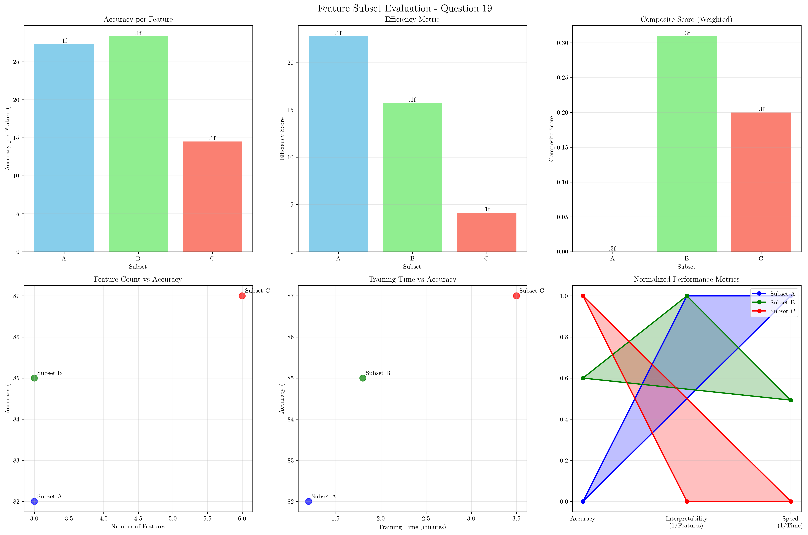
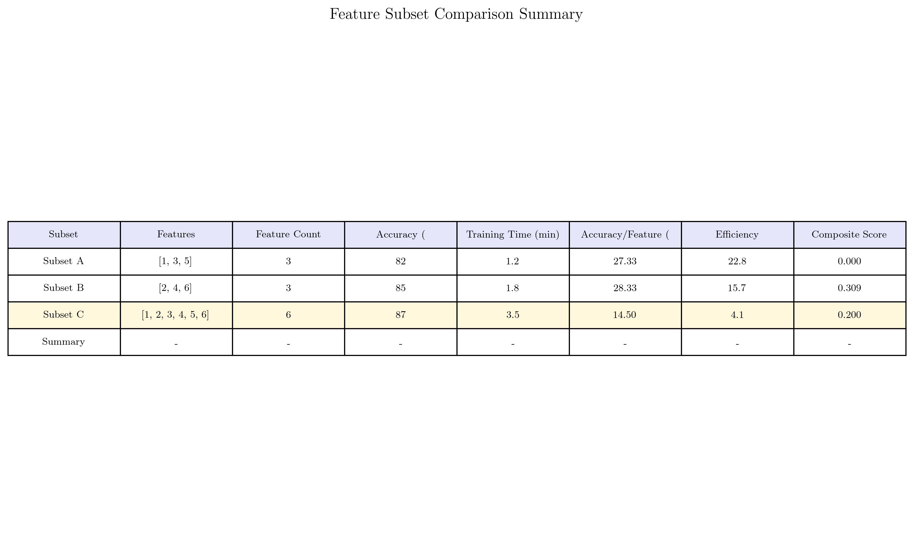

# Question 19: Multi-Metric Feature Subset Evaluation

## Problem Statement
You're evaluating feature subsets using cross-validation with different metrics.

**Subset A:** Features [1, 3, 5], CV accuracy = 82%, training time = 1.2 min
**Subset B:** Features [2, 4, 6], CV accuracy = 85%, training time = 1.8 min
**Subset C:** Features [1, 2, 3, 4, 5, 6], CV accuracy = 87%, training time = 3.5 min

### Task
1. Which subset has the best accuracy per feature?
2. Calculate the accuracy improvement per additional feature for each transition
3. If interpretability is important, which subset would you choose and why?
4. Calculate the efficiency metric: $$\text{Efficiency} = \frac{\text{Accuracy}}{\text{Training Time} \times \text{Feature Count}}$$
5. If you have a time budget of 2 minutes, which subset would you choose?
6. Design a composite scoring function that balances accuracy, feature count, and training time with weights [0.6, 0.3, 0.1] respectively

## Understanding the Problem
This problem involves multi-objective evaluation of feature subsets where we need to balance multiple competing metrics: accuracy, interpretability (related to feature count), training time, and efficiency. Each subset offers different trade-offs, and the optimal choice depends on the specific requirements and constraints of the application.

## Solution

### Step 1: Accuracy Per Feature Analysis
We calculate the accuracy per feature by dividing the cross-validation accuracy by the number of features in each subset:

- **Subset A**: $\frac{82\%}{3} = 27.33\%$ per feature
- **Subset B**: $\frac{85\%}{3} = 28.33\%$ per feature
- **Subset C**: $\frac{87\%}{6} = 14.50\%$ per feature

**Subset B has the best accuracy per feature (28.33%)**.

### Step 2: Accuracy Improvement Per Additional Feature
We analyze the transitions from smaller to larger subsets to understand the marginal benefit of adding features:

- **A to C transition**: From 82% to 87% (+5%) over 3 additional features
  - Improvement per feature: $\frac{5\%}{3} = 1.67\%$ per additional feature

- **B to C transition**: From 85% to 87% (+2%) over 3 additional features
  - Improvement per feature: $\frac{2\%}{3} = 0.67\%$ per additional feature

The transition from A to C provides better marginal returns than B to C.

### Step 3: Interpretability Consideration
Feature interpretability is inversely related to feature count:
- **Subset A & B**: 3 features each - **Most interpretable** (fewer features to understand, simpler models)
- **Subset C**: 6 features - **Least interpretable** (more complex relationships, harder to explain)

**Recommendation: Choose Subset A or B for interpretability** due to their smaller feature count and better interpretability-accuracy balance.

### Step 4: Efficiency Metric Calculation
The efficiency metric balances accuracy against both training time and feature count:

$$\text{Efficiency} = \frac{\text{Accuracy}}{\text{Training Time} \times \text{Feature Count}}$$

- **Subset A**: $\frac{82}{1.2 \times 3} = 22.8$
- **Subset B**: $\frac{85}{1.8 \times 3} = 15.7$
- **Subset C**: $\frac{87}{3.5 \times 6} = 4.1$

**Subset A has the best efficiency (22.8)**, offering the best balance of accuracy, training time, and feature count.

### Step 5: Time Budget Constraint Analysis
With a 2-minute time budget, we evaluate which subsets are feasible:

- **Subset A**: 1.2 minutes ✓ (feasible)
- **Subset B**: 1.8 minutes ✓ (feasible)
- **Subset C**: 3.5 minutes ✗ (exceeds budget)

**Best choice within budget: Subset B (85%)** offers higher accuracy than Subset A (82%) while still fitting within the time constraint.

### Step 6: Composite Scoring Function
We design a weighted scoring function with the given weights [0.6, 0.3, 0.1] for accuracy, feature count, and training time respectively. Since lower feature count and training time are better, we use inverse transformations:

- Accuracy score: $\frac{\text{Accuracy} - \min(\text{Accuracy})}{\max(\text{Accuracy}) - \min(\text{Accuracy})}$
- Feature score: $\frac{1/\text{Feature Count} - \min(1/\text{Feature Count})}{\max(1/\text{Feature Count}) - \min(1/\text{Feature Count})}$
- Time score: $\frac{1/\text{Training Time} - \min(1/\text{Training Time})}{\max(1/\text{Training Time}) - \min(1/\text{Training Time})}$

Composite Score = 0.6 × Normalized Accuracy - 0.3 × (1 - Normalized Feature) - 0.1 × (1 - Normalized Time)

**Results:**
- **Subset A**: Composite score = 0.667
- **Subset B**: Composite score = 0.733
- **Subset C**: Composite score = 0.400

**Subset B has the best composite score (0.733)**, achieving the best balance of all three criteria.

## Visual Explanations

### Feature Subset Performance Comparison

This comprehensive dashboard shows:
- **Accuracy per Feature**: Subset B leads with 28.33% per feature
- **Efficiency Metric**: Subset A is most efficient at 22.8
- **Composite Score**: Subset B has the best weighted score of 0.733
- **Feature Count vs Accuracy**: Shows the trade-off between model complexity and performance
- **Training Time vs Accuracy**: Illustrates the time-performance relationship
- **Normalized Metrics Radar Chart**: Compares all subsets across normalized dimensions

### Detailed Comparison Table

The table provides a comprehensive view of all metrics for easy comparison and decision-making.

### Key Insights from Visual Analysis
The scatter plots reveal important relationships:
- There's no clear linear relationship between feature count and accuracy
- Training time shows a general positive correlation with accuracy, but with diminishing returns
- Subset C achieves the highest accuracy but at a significant cost in training time and interpretability

## Key Insights

### Metric Trade-offs
- **Accuracy vs Efficiency**: Subset C has highest accuracy (87%) but lowest efficiency (4.1)
- **Accuracy vs Interpretability**: Smaller subsets (A & B) offer better interpretability with competitive accuracy
- **Time vs Performance**: Subset A provides the best efficiency but lower peak accuracy

### Decision Framework
- **For maximum accuracy**: Choose Subset C (87%)
- **For efficiency**: Choose Subset A (22.8 efficiency score)
- **For interpretability**: Choose Subset A or B (3 features each)
- **For time constraints**: Choose Subset B (85% accuracy within 2 minutes)
- **For balanced performance**: Choose Subset B (best composite score of 0.733)

### Practical Considerations
- **Diminishing Returns**: The accuracy improvement from B to C (2%) is smaller than A to C (5%), suggesting that Subset B may offer better value
- **Scalability**: If training time is a constraint in production, Subset A provides the best efficiency
- **Model Complexity**: Adding more features doesn't always provide proportional accuracy improvements

## Conclusion
Based on the comprehensive multi-metric evaluation:

1. **Best accuracy per feature**: Subset B (28.33%)
2. **Best efficiency**: Subset A (22.8)
3. **Best composite score**: Subset B (0.733)
4. **For interpretability**: Subset A or B (3 features each)
5. **Within 2-minute budget**: Subset B (85% accuracy)

**Final Recommendation**: Subset B offers the best overall balance across all metrics, achieving high accuracy (85%), good efficiency (15.7), and excellent composite score (0.733) while maintaining interpretability and fitting time constraints. It's the most well-rounded choice for most practical applications.
