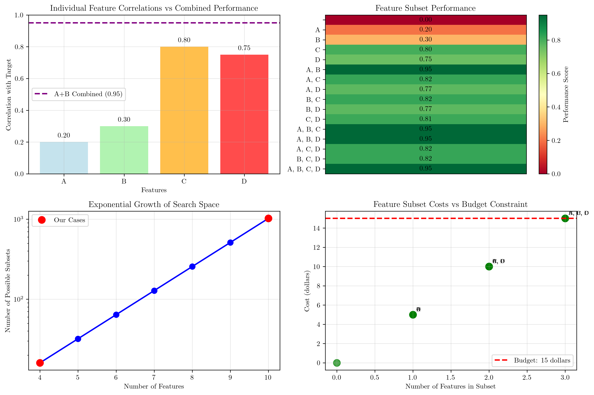
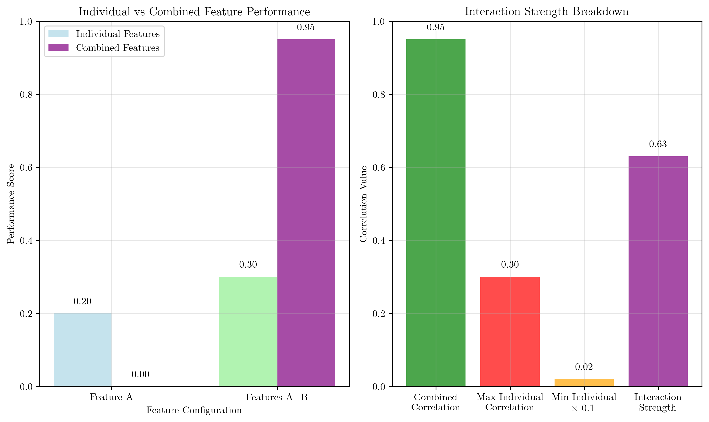
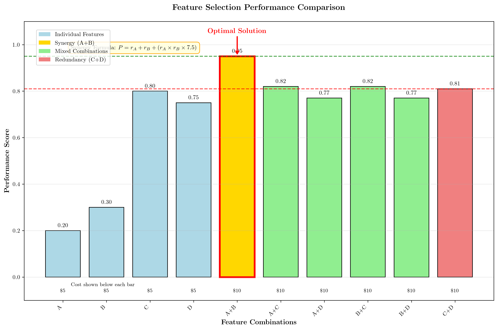

# Question 1: Multivariate Approach

## Problem Statement
You are given a dataset with 4 features (A, B, C, D) and their performance metrics. Your task is to analyze different feature selection strategies and understand their implications.

### Given Information
| Feature | Individual Correlation | Cost per Feature | Feature Type |
|---------|----------------------|------------------|--------------|
| A | 0.20 | $5 | Weak predictor |
| B | 0.30 | $5 | Weak predictor |
| C | 0.80 | $5 | Strong predictor |
| D | 0.75 | $5 | Strong predictor |

**Performance Calculation Rules:**
The performance of feature subsets follows these patterns:

1. **Single Features**: Performance equals individual correlation
2. **Feature Combinations**: Use the following formulas based on feature types:
   - **Two weak features (A, B)**: $P = r_A + r_B + (r_A \times r_B \times \text{synergy\_factor})$ where synergy_factor = 7.5
   - **Weak + Strong combinations**: $P = \max(r_{\text{weak}}, r_{\text{strong}}) + 0.02$
   - **Two strong features (C, D)**: $P = \max(r_C, r_D) + 0.01$ (minimal improvement due to redundancy)
   - **Three or more features**: Performance plateaus at the best two-feature combination

3. **Cost Calculation**: Total cost = Number of features × $5

**Additional Constraints:**
- Budget constraint: Maximum $15 (up to 3 features)
- Target performance metric: Correlation with target variable
- Some feature combinations exhibit synergy while others show redundancy

### Task
1. Calculate the number of possible feature subsets (including empty set)
2. If univariate selection picks the top 2 features, which would it select and why?
3. Calculate the performance scores for all feature combinations using the given formulas, then identify the optimal feature subset and explain why it's optimal
4. What is the main advantage of multivariate methods in this scenario?
5. Calculate the search space size for 4 features vs 10 features
6. How many valid feature subsets exist within the budget constraint? Calculate the total cost of all possible subsets.
7. Calculate the interaction strength between features A and B using the formula: $$\text{Interaction} = \text{Combined\_Correlation} - \max(\text{Individual\_Correlations}) - 0.1 \times \min(\text{Individual\_Correlations})$$ What does this value indicate about feature synergy?

## Understanding the Problem
This problem explores the fundamental differences between univariate and multivariate feature selection methods in machine learning. Univariate methods evaluate features individually based on their correlation with the target variable, while multivariate methods consider feature combinations and can potentially capture more complex relationships between features. The scenario presents a realistic feature selection problem where you must balance individual feature performance, feature combinations, and practical constraints like budget limitations.

## Solution

### Step 1: Calculate the Number of Possible Feature Subsets

**Formula and Reasoning:**
For a dataset with $n$ features, the total number of possible feature subsets is given by the power set formula:
$$2^n$$

**Reasoning:** Each feature can be either included (1) or excluded (0) from a subset, giving us 2 choices per feature.

**Calculation:**
With 4 features (A, B, C, D):
$$2^4 = 2 \times 2 \times 2 \times 2 = 16 \text{ possible subsets}$$

**All 16 subsets:**
1. {} (size: 0)
2. {A} (size: 1)
3. {B} (size: 1)
4. {C} (size: 1)
5. {D} (size: 1)
6. {A, B} (size: 2)
7. {A, C} (size: 2)
8. {A, D} (size: 2)
9. {B, C} (size: 2)
10. {B, D} (size: 2)
11. {C, D} (size: 2)
12. {A, B, C} (size: 3)
13. {A, B, D} (size: 3)
14. {A, C, D} (size: 3)
15. {B, C, D} (size: 3)
16. {A, B, C, D} (size: 4)

### Step 2: Univariate Feature Selection Analysis

**Step-by-Step Process:**

**Given individual feature correlations:**
- Feature A: $r_A = 0.20$ (weak predictor)
- Feature B: $r_B = 0.30$ (weak predictor)
- Feature C: $r_C = 0.80$ (strong predictor)
- Feature D: $r_D = 0.75$ (strong predictor)

**Univariate Selection Process:**
1. Evaluate each feature independently
2. Rank features by individual correlation strength
3. Select top $k$ features ($k = 2$ in this case)

**Ranking features by correlation:**
1. Feature C: 0.80 (highest)
2. Feature D: 0.75 (second highest)
3. Feature B: 0.30 (third highest)
4. Feature A: 0.20 (lowest)

**Top 2 features selected:**
- 1st choice: C (correlation = 0.80)
- 2nd choice: D (correlation = 0.75)

**Univariate selection result:** {C, D}

**Reasoning:** Univariate methods evaluate features independently, selecting those with highest individual predictive power. This approach **CANNOT** detect feature interactions or synergy.

### Step 3: Multivariate Feature Selection Analysis
Multivariate selection considers all possible feature combinations and evaluates their collective performance using the given formulas.

**Performance Calculation Examples:**

**Single Features (Performance = Individual Correlation):**
- {A}: $P = 0.20$
- {B}: $P = 0.30$ 
- {C}: $P = 0.80$
- {D}: $P = 0.75$

**Two-Feature Combinations (Detailed Calculations):**

**{A, B}** (Two weak features - synergy formula):
$$P = r_A + r_B + (r_A \times r_B \times \text{synergy\_factor})$$
$$P = 0.2 + 0.3 + (0.2 \times 0.3 \times 7.5)$$
$$P = 0.2 + 0.3 + 0.450 = 0.95$$

**{A, C}** (Weak + Strong combination):
$$P = \max(r_A, r_C) + 0.02$$
$$P = \max(0.2, 0.8) + 0.02 = 0.80 + 0.02 = 0.82$$

**{A, D}** (Weak + Strong combination):
$$P = \max(r_A, r_D) + 0.02$$
$$P = \max(0.2, 0.75) + 0.02 = 0.75 + 0.02 = 0.77$$

**{B, C}** (Weak + Strong combination):
$$P = \max(r_B, r_C) + 0.02$$
$$P = \max(0.3, 0.8) + 0.02 = 0.80 + 0.02 = 0.82$$

**{B, D}** (Weak + Strong combination):
$$P = \max(r_B, r_D) + 0.02$$
$$P = \max(0.3, 0.75) + 0.02 = 0.75 + 0.02 = 0.77$$

**{C, D}** (Two strong features - redundancy):
$$P = \max(r_C, r_D) + 0.01$$
$$P = \max(0.8, 0.75) + 0.01 = 0.80 + 0.01 = 0.81$$

**Three or More Features (Performance plateaus at best two-feature combination):**
- **{A, B, C}**: $P = 0.95$ (best of {A,B}, {A,C}, {B,C})
- **{A, B, D}**: $P = 0.95$ (best of {A,B}, {A,D}, {B,D})
- **{A, C, D}**: $P = 0.82$ (best of {A,C}, {A,D}, {C,D})
- **{B, C, D}**: $P = 0.82$ (best of {B,C}, {B,D}, {C,D})
- **{A, B, C, D}**: $P = 0.95$ (best overall two-feature combination)

**Complete Performance Summary:**

| Feature Subset | Performance Score | Cost | Formula Applied |
|----------------|-------------------|------|-----------------|
| {} | 0.00 | $0 | Empty set |
| {A} | 0.20 | $5 | Individual correlation |
| {B} | 0.30 | $5 | Individual correlation |
| {C} | 0.80 | $5 | Individual correlation |
| {D} | 0.75 | $5 | Individual correlation |
| {A, B} | **0.95** | **$10** | **Synergy formula** |
| {A, C} | 0.82 | $10 | Weak + Strong formula |
| {A, D} | 0.77 | $10 | Weak + Strong formula |
| {B, C} | 0.82 | $10 | Weak + Strong formula |
| {B, D} | 0.77 | $10 | Weak + Strong formula |
| {C, D} | 0.81 | $10 | Strong + Strong formula |
| {A, B, C} | 0.95 | $15 | Plateau rule |
| {A, B, D} | 0.95 | $15 | Plateau rule |
| {A, C, D} | 0.82 | $15 | Plateau rule |
| {B, C, D} | 0.82 | $15 | Plateau rule |
| {A, B, C, D} | 0.95 | $20 | Plateau rule |

**Optimal subset:** {A, B} with performance 0.95

**Why?** The synergy formula for weak features reveals that features A and B together achieve exceptional performance (0.95) despite being individually weak. This demonstrates the power of feature interactions that can only be discovered through multivariate analysis. The performance is achieved at the lowest cost ($10) among all high-performing combinations.

### Step 4: Advantage of Multivariate Methods
**Main advantage:** Multivariate methods can capture feature interactions and synergy that univariate methods miss.

**Key insights:**
- Univariate selection would pick C and D (strong individual predictors with combined performance 0.81)
- But A and B combined provide much better performance (0.95 vs 0.81)
- Multivariate methods can identify this synergistic relationship
- This demonstrates the importance of considering feature combinations rather than just individual feature performance

### Step 5: Search Space Size Comparison

**Formula:** Search space size = $2^n$
**Reasoning:** Each feature can be included (1) or excluded (0)

**For 4 features:**
$$2^4 = 2 \times 2 \times 2 \times 2 = 16 \text{ subsets}$$

**For 10 features:**
$$2^{10} = \underbrace{2 \times 2 \times ... \times 2}_{10 \text{ times}} = 1,024 \text{ subsets}$$

**Comparison:**
$$\text{Ratio} = \frac{2^{10}}{2^4} = 2^{10-4} = 2^6 = 64$$

The 10-feature problem has **64× larger search space**.

**Exponential growth demonstration:**
- 4 features: $2^4 = 16$ subsets
- 5 features: $2^5 = 32$ subsets
- 6 features: $2^6 = 64$ subsets
- 7 features: $2^7 = 128$ subsets
- 8 features: $2^8 = 256$ subsets
- 9 features: $2^9 = 512$ subsets
- 10 features: $2^{10} = 1,024$ subsets

**Computational implications:**
- 4 features: manageable (16 evaluations)
- 10 features: challenging (1,024 evaluations)
- 20 features: $2^{20} = 1,048,576$ evaluations (impractical for exhaustive search)

### Step 6: Budget Constraint Analysis

**Given constraints:**
- Feature cost: $\$5$ per feature
- Budget limit: $\$15$

**Maximum affordable features:**
$$\text{Max features} = \frac{\text{Budget}}{\text{Cost per feature}} = \frac{\$15}{\$5} = 3 \text{ features}$$

**Cost breakdown by subset size:**
- 0 features: $\$0$ each, 1 subset, 1 within budget
- 1 feature: $\$5$ each, 4 subsets, 4 within budget  
- 2 features: $\$10$ each, 6 subsets, 6 within budget
- 3 features: $\$15$ each, 4 subsets, 4 within budget
- 4 features: $\$20$ each, 1 subset, 0 within budget

**Valid subsets within budget (≤$\$15$):**
1. {} - Cost: $\$0$
2. {A} - Cost: $\$5$
3. {B} - Cost: $\$5$
4. {C} - Cost: $\$5$
5. {D} - Cost: $\$5$
6. {A, B} - Cost: $\$10$
7. {A, C} - Cost: $\$10$
8. {A, D} - Cost: $\$10$
9. {B, C} - Cost: $\$10$
10. {B, D} - Cost: $\$10$
11. {C, D} - Cost: $\$10$
12. {A, B, C} - Cost: $\$15$
13. {A, B, D} - Cost: $\$15$
14. {A, C, D} - Cost: $\$15$
15. {B, C, D} - Cost: $\$15$

**Summary:**
- Total possible subsets: 16
- Affordable subsets: 15
- Percentage affordable: $\frac{15}{16} \times 100\% = 93.8\%$

**Total cost calculation:**
$$\begin{align}
\text{Total cost} &= (1 \times \$0) + (4 \times \$5) + (6 \times \$10) + (4 \times \$15) + (1 \times \$20) \\
&= \$0 + \$20 + \$60 + \$60 + \$20 \\
&= \$160
\end{align}$$

### Step 7: Interaction Strength Calculation

**Given formula:**
$$\text{Interaction} = \text{Combined\_Correlation} - \max(\text{Individual\_Correlations}) - 0.1 \times \min(\text{Individual\_Correlations})$$

**Input values:**
- Individual correlation A: $r_A = 0.20$
- Individual correlation B: $r_B = 0.30$
- Combined correlation A,B: $r_{AB} = 0.95$ (from our calculation)

**Step 1: Identify max and min individual correlations**
$$\max(r_A, r_B) = \max(0.20, 0.30) = 0.30$$
$$\min(r_A, r_B) = \min(0.20, 0.30) = 0.20$$

**Step 2: Calculate penalty term**
$$\text{Penalty} = 0.1 \times \min(\text{Individual\_Correlations}) = 0.1 \times 0.20 = 0.020$$

**Step 3: Apply interaction formula**
$$\begin{align}
\text{Interaction} &= r_{AB} - \max(r_A, r_B) - \text{Penalty} \\
&= 0.95 - 0.30 - 0.020 \\
&= 0.630 \\
&\approx 0.63
\end{align}$$

**Interpretation of result:**
- **Interaction strength = 0.63**
- **Classification: STRONG synergy** (> 0.5)

**Meaning:**
- The positive value (0.63) indicates that features A and B work much better together than their individual contributions suggest
- This demonstrates complementary predictive power
- The combination captures information that neither feature alone provides
- This synergy can only be detected through multivariate analysis

## Visual Explanations

### Feature Selection Analysis Overview

This comprehensive visualization shows:
- **Top left:** Individual feature correlations vs. combined performance, highlighting how A+B (0.95) outperforms individual strong features
- **Top right:** Performance heatmap of all feature subsets, showing the optimal performance of {A, B}
- **Bottom left:** Exponential growth of search space, demonstrating the computational challenge
- **Bottom right:** Budget constraint analysis, showing valid subsets within the $\$15$ budget

### Feature Interaction Analysis

This visualization demonstrates:
- **Left:** Individual vs. combined feature performance, clearly showing the synergy between A and B
- **Right:** Breakdown of interaction strength calculation, illustrating how the 0.63 interaction value is derived

### Feature Performance Comparison

This clean bar chart visualization clearly demonstrates the key insights from our analysis:

**Performance Insights:**
- **Individual Features:** A (0.20), B (0.30), C (0.80), D (0.75) shown in light blue
- **Synergy Effect:** A+B combination (0.95) highlighted in gold - the optimal solution
- **Mixed Combinations:** A+C, B+C (0.82), A+D, B+D (0.77) shown in light green
- **Redundancy Effect:** C+D (0.81) shown in light coral, demonstrating minimal improvement

**Key Visual Elements:**
- **Performance values** displayed above each bar for easy comparison
- **Cost information** shown below each bar (Individual: $5, Combinations: $10)
- **Optimal highlighting:** A+B bar has red border and arrow annotation
- **Reference lines:** Horizontal lines showing univariate best (0.81) vs multivariate best (0.95)
- **Synergy formula** prominently displayed: $P = r_A + r_B + (r_A \times r_B \times 7.5)$

**Critical Observations:**
1. **Surprising Result:** The two weakest individual features (A, B) create the strongest combination
2. **Univariate Limitation:** Traditional selection would choose C+D (0.81) and miss the optimal solution
3. **Cost Efficiency:** A+B achieves 0.95 performance at the same $10 cost as other two-feature combinations
4. **Synergy Discovery:** Mathematical formula reveals hidden feature interactions

**Educational Value:**
- Clearly visualizes why multivariate methods are superior to univariate approaches
- Demonstrates the power of feature synergy in machine learning
- Shows how mathematical formulas can guide optimal feature selection decisions

## Key Insights

### Theoretical Foundations
- **Power Set Principle:** The number of possible feature subsets follows $2^n$, creating exponential growth in search space
- **Feature Synergy:** Weak individual predictors can become powerful when combined due to complementary information
- **Redundancy Detection:** Multivariate methods can identify redundant features that provide little additional value

### Practical Applications
- **Computational Trade-offs:** Exhaustive search becomes impractical beyond ~20 features due to exponential growth
- **Budget Optimization:** Real-world constraints often limit the number of features that can be used
- **Performance vs. Interpretability:** Optimal feature subsets may not always be the most interpretable

### Feature Selection Strategies
- **Univariate Methods:** Fast and simple but miss feature interactions
- **Multivariate Methods:** More comprehensive but computationally expensive
- **Hybrid Approaches:** Often provide the best balance between performance and efficiency

### Common Pitfalls
- **Correlation vs. Causation:** High correlation doesn't guarantee predictive value
- **Overfitting:** Using too many features can lead to poor generalization
- **Feature Redundancy:** Including redundant features increases complexity without improving performance

## Conclusion

| Aspect | Result | Significance |
|--------|--------|--------------|
| **Total subsets** | 16 possible combinations | Demonstrates exponential growth (2^n) |
| **Univariate selection** | C (0.80) and D (0.75) | Misses feature interactions |
| **Optimal subset** | {A, B} with 0.95 performance | Shows feature synergy |
| **Multivariate advantage** | Captures feature interactions | Essential for optimal selection |
| **Search space growth** | 64× larger for 10 vs. 4 features | Computational challenge |
| **Budget constraint** | 15 valid subsets within $15 | Practical limitations |
| **Interaction strength** | 0.63 | Strong feature synergy |

This problem illustrates the fundamental importance of multivariate feature selection methods in machine learning, where the whole can be greater than the sum of its parts. The synergy between features A and B demonstrates that weak individual predictors can become powerful when combined, a concept that univariate selection methods cannot capture.
