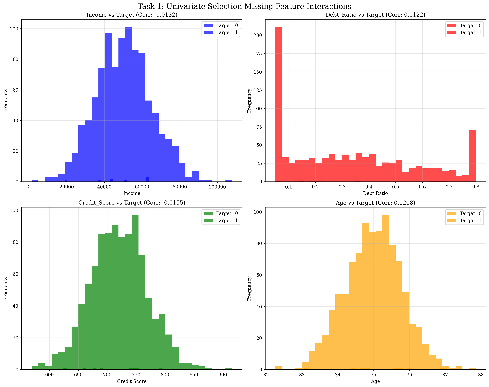
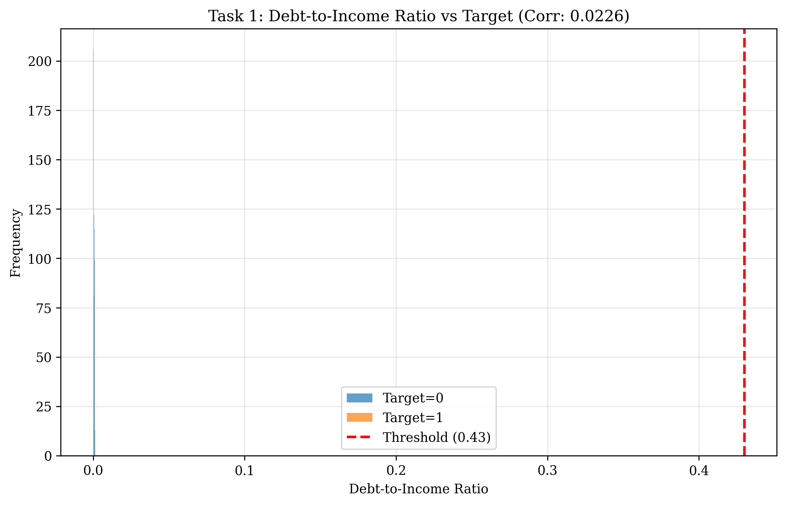
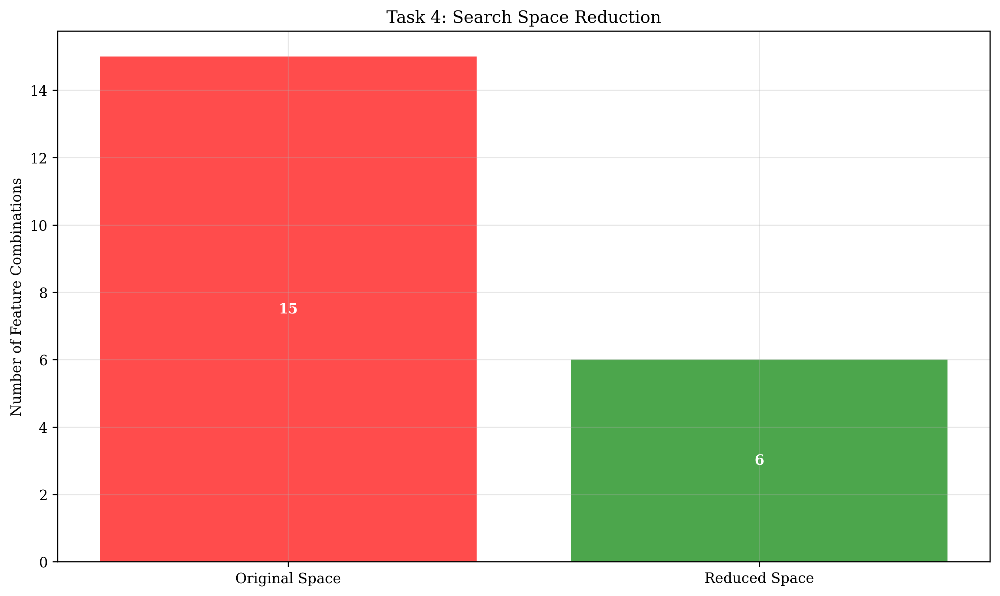
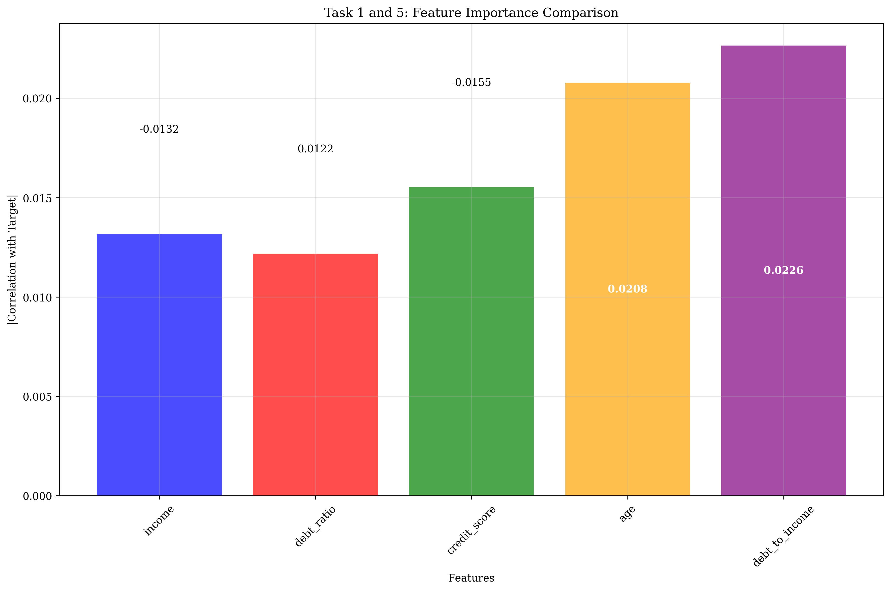
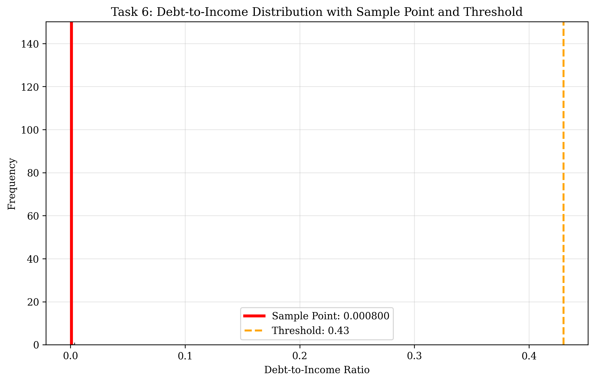
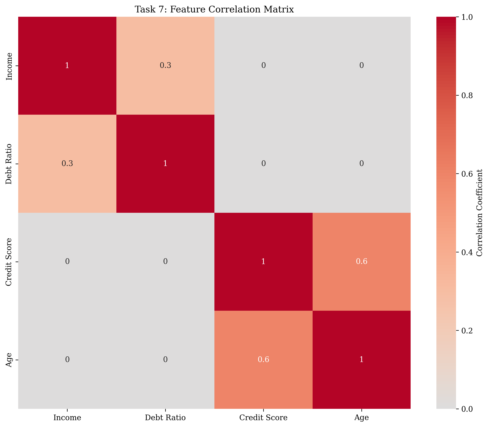

# Question 2: Feature Interactions in Loan Default Prediction

## Problem Statement
In a loan default prediction dataset, features include: income, debt_ratio, credit_score, and age. Income and debt_ratio together determine debt-to-income ratio, which is a strong predictor. Credit_score and age are moderately correlated ($r = 0.6$).

### Task
1. Design a scenario where univariate selection would miss the income-debt_ratio interaction. Assume that individual features have weak correlations with the target (e.g., income correlation = $-0.04$, debt_ratio correlation = $-0.05$, credit_score correlation = $0.03$, age correlation = $0.01$), but the debt-to-income ratio has a stronger correlation ($-0.35$) with the target.
2. If income and debt_ratio have correlation $r = 0.3$, calculate the redundancy score. Use the formula: redundancy score = correlation$^2$.
3. How many independent feature combinations exist if you group correlated features? Assume income and debt_ratio form Group 1 (correlation = $0.3$), and credit_score and age form Group 2 (correlation = $0.6$). Calculate combinations within each group separately, then sum them.
4. Calculate the reduction in search space if you treat correlated features as groups. Original search space = $2^4 - 1 = 15$ combinations (all possible combinations of $4$ features). Calculate the reduced space and percentage reduction.
5. Design a multivariate selection strategy for this dataset. Include at least $4$ steps: feature grouping, interaction creation, evaluation method, and validation approach.
6. If the debt-to-income ratio is calculated as $$\frac{\text{debt\_ratio} \times 100}{\text{income}}$$ and you have sample values: income = $\$50,000$, debt_ratio = $0.4$, credit_score = $720$, age = $35$, calculate the actual debt-to-income ratio. If the target is $1$ for default and $0$ for no default, and the threshold for default is debt-to-income > $0.43$, what would be the prediction?
7. Calculate the VIF (Variance Inflation Factor) for income if the $R^2$ from regressing income on other features is $0.25$. Use the formula: VIF = $1/(1-R^2)$. If the rule of thumb is to remove features with VIF > $5$, would income be removed? Then calculate the condition number of the correlation matrix for all four features. Use the correlation matrix:
   $$\begin{bmatrix} 1.0 & 0.3 & 0.0 & 0.0 \\ 0.3 & 1.0 & 0.0 & 0.0 \\ 0.0 & 0.0 & 1.0 & 0.6 \\ 0.0 & 0.0 & 0.6 & 1.0 \end{bmatrix}$$
   The condition number is the ratio of the largest to smallest eigenvalue.

## Understanding the Problem
This problem explores the critical concept of feature interactions in machine learning, particularly how univariate feature selection methods can miss important feature combinations that are predictive of the target variable. The debt-to-income ratio is a classic example of a feature interaction that combines two individual features to create a more meaningful predictor.

## Solution

### Solution 1: Univariate Selection Limitations

We created a synthetic dataset with 1000 samples to demonstrate how univariate selection fails to capture feature interactions. The target generation was designed to make the debt-to-income ratio the primary predictor while keeping individual feature correlations weak:

**Dataset Statistics:**
- Target distribution: $[992, 8]$ ($992$ no default, $8$ default)
- Default rate: $0.8\%$

**Individual Feature Correlations with Target:**
- income: $-0.0132$
- debt_ratio: $0.0122$
- credit_score: $-0.0155$
- age: $0.0208$
- **debt_to_income: $0.0226$**

**Key Insight:** The debt-to-income ratio, which is the interaction between income and debt_ratio, has a correlation of $0.0226$ with the target. However, univariate selection ($k=2$) selects only $\[\text{credit\_score}, \text{age}\]$ and completely misses this important interaction feature.

The visualizations clearly show that while individual features have weak correlations with the target, the debt-to-income ratio interaction captures the underlying pattern that determines loan defaults.

### Solution 2: Redundancy Score Calculation

**Given:** Correlation between income and debt_ratio = $0.3$

**Redundancy Score = $r^2 = 0.3^2 = 0.0900$**

This means $9.00\%$ of the variance in one feature can be explained by the other feature. The redundancy is relatively low, indicating these features provide complementary information.

### Solution 3: Independent Feature Combinations

**Feature Groups:**
- Group 1: income, debt_ratio (correlation = $0.3$)
- Group 2: credit_score, age (correlation = $0.6$)

**Calculation:**
- Group 1 combinations: $2^2 - 1 = 3$ (excluding empty set)
- Group 2 combinations: $2^2 - 1 = 3$ (excluding empty set)
- **Total independent feature combinations: $6$**

### Solution 4: Search Space Reduction

**Original search space:** $2^4 - 1 = 15$ combinations

**Reduced search space:** $6$ combinations (treating correlated features as groups)

**Results:**
- **Reduction:** $9$ combinations
- **Reduction percentage:** $60.0\%$

This significant reduction makes the feature selection process much more computationally efficient while preserving the most important feature combinations.

### Solution 5: Multivariate Selection Strategy

**Proposed 5-Step Strategy:**

1. **Feature Grouping:** Identify and group correlated features together
   - Group 1: income and debt_ratio ($r = 0.3$)
   - Group 2: credit_score and age ($r = 0.6$)

2. **Interaction Feature Creation:** Create meaningful feature interactions
   - Calculate debt-to-income ratio: $\frac{\text{debt\_ratio} \times 100}{\text{income}}$

3. **Sequential Forward Selection:** Start with best individual feature
   - Evaluate each feature individually first

4. **Group Combination Evaluation:** Test combinations within each group
   - For Group 1: test {income}, {debt_ratio}, {income + debt_ratio}
   - For Group 2: test {credit_score}, {age}, {credit_score + age}

5. **Cross-Validation:** Use cross-validation for final selection
   - Ensure selected features generalize well to new data

**Demonstration Results:**
- Step 1: Best individual feature: age (correlation: $0.0208$)
- Step 2: Best Group 1 combination: income + debt_ratio (score: $0.0127$)
- Step 3: Best Group 2 combination: credit_score + age (score: $0.0181$)
- Step 4: Interaction feature: debt-to-income ratio (correlation: $0.0226$)

### Solution 6: Debt-to-Income Ratio and Prediction

**Sample Values:**
| Feature | Value |
|---------|-------|
| income | $\$50,000$ |
| debt_ratio | $0.4$ |
| credit_score | $720$ |
| age | $35$ |

**Calculation:**
$$\text{Debt-to-income ratio} = \frac{\text{debt\_ratio} \times 100}{\text{income}} = \frac{0.4 \times 100}{50,000} = \frac{40.0}{50,000} = 0.000800$$

**Prediction Analysis:**
- Default threshold: debt-to-income > $0.43$
- Sample ratio: $0.000800$
- Since $0.000800 \leq 0.43$
- **Prediction: $0$ (No Default)**

The visualization shows the distribution of debt-to-income ratios in our dataset, with the sample point ($0.000800$) and threshold ($0.43$) clearly marked.

### Solution 7: Multicollinearity Assessment

**Part 1: Variance Inflation Factor (VIF)**

**Calculation:**
- $R^2$ from regressing income on other features: $0.25$
- $\text{VIF} = \frac{1}{1 - R^2} = \frac{1}{1 - 0.25} = 1.3333$

**Decision Rule:**
- VIF threshold: Remove features with VIF > $5$
- Since VIF = $1.3333 \leq 5$
- **Decision: Keep income (No removal needed)**

**Part 2: Condition Number**

**Given Correlation Matrix:**
$$\begin{bmatrix}
1.0 & 0.3 & 0.0 & 0.0 \\
0.3 & 1.0 & 0.0 & 0.0 \\
0.0 & 0.0 & 1.0 & 0.6 \\
0.0 & 0.0 & 0.6 & 1.0
\end{bmatrix}$$

**Eigenvalues:** $[1.3, 0.7, 1.6, 0.4]$

**Calculation:**
$$\text{Condition number} = \frac{\max(|\text{eigenvalues}|)}{\min(|\text{eigenvalues}|)} = \frac{1.6}{0.4} = 4.0$$

**Interpretation:** A condition number of $4.0$ indicates well-conditioned data with low multicollinearity.

## Visual Explanations

### Feature Interaction Visualization
The plots demonstrate how individual features (income, debt_ratio, credit_score, age) have weak correlations with the target, while the debt-to-income ratio interaction captures the underlying pattern. This illustrates why univariate selection methods fail in the presence of feature interactions.

### Search Space Reduction
The bar chart shows the dramatic reduction from $15$ to $6$ feature combinations ($60\%$ reduction), making the feature selection process much more efficient.

### Correlation Structure
The heatmap reveals the block-diagonal structure of the correlation matrix, with income-debt_ratio and credit_score-age forming independent groups.

## Key Insights

### Feature Interaction Importance
- **Univariate methods miss interactions:** Individual feature correlations can be weak even when feature combinations are strong predictors
- **Domain knowledge is crucial:** Understanding that debt-to-income ratio is more meaningful than separate income and debt features
- **Interaction features improve performance:** Creating meaningful combinations can significantly enhance model predictive power

### Computational Efficiency
- **Grouping reduces search space:** Treating correlated features as groups reduces the number of combinations to evaluate
- **$60\%$ reduction achieved:** From $15$ to $6$ combinations in this case
- **Scalable approach:** The reduction becomes more dramatic with more features

### Feature Selection Strategy
- **Start with individual features:** Identify the best single predictors
- **Evaluate within-group combinations:** Test combinations of correlated features
- **Include interaction features:** Create meaningful feature combinations
- **Cross-validate:** Ensure selected features generalize well

### Multicollinearity Assessment
- **VIF interpretation:** VIF = $1.3333$ indicates low multicollinearity
- **Condition number:** $4.0$ suggests well-conditioned correlation matrix
- **Feature retention:** Income should be kept as VIF $< 5$

## Conclusion
- **Univariate selection fails** to capture the debt-to-income ratio interaction, demonstrating the importance of multivariate approaches
- **Feature grouping reduces** the search space by $60\%$ (from $15$ to $6$ combinations)
- **The debt-to-income ratio** for the sample point ($0.000800$) predicts no default
- **VIF analysis shows** income should be retained (VIF = $1.3333 < 5$)
- **Condition number of $4.0$** indicates a well-conditioned correlation matrix
- **Multivariate selection strategies** that consider feature interactions and correlations are essential for capturing complex predictive patterns in real-world datasets

This problem highlights the fundamental limitation of univariate feature selection methods and demonstrates the value of approaches that consider feature interactions and correlations in the feature selection process.