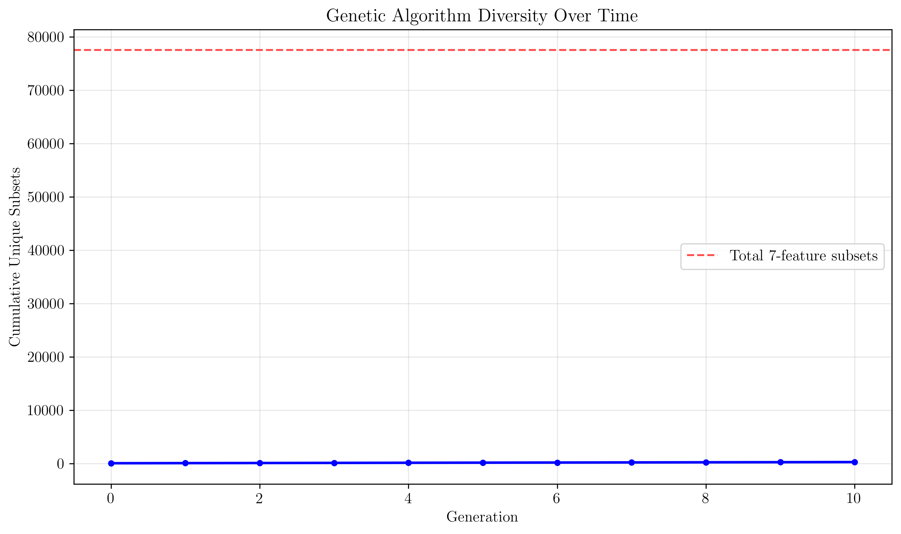

# Question 3: Search Space Problem

## Problem Statement
You have a dataset with 20 features and want to find the optimal subset of 5-10 features.

### Task
1. Calculate the total number of possible feature subsets
2. Calculate the number of subsets with exactly 7 features
3. If each subset evaluation takes $0.1$ seconds, how long would exhaustive search take?
4. If you use forward selection starting with 1 feature, how many evaluations are needed?
5. Design a heuristic search strategy that evaluates at most 1000 subsets
6. If you implement a "smart" search that skips subsets where the first 3 features are all from the same correlation cluster (assume 4 clusters of 5 features each), calculate how many subsets you can skip. What percentage of the search space does this represent?
7. If you use a genetic algorithm with population size 50, mutation rate $0.1$, and crossover rate $0.8$, calculate the expected number of unique feature subsets generated in 10 generations. Assume each generation produces 50 offspring and 10% of offspring are duplicates.

## Understanding the Problem
The search space problem in multivariate feature selection refers to the exponential growth in the number of possible feature subsets as the number of features increases. With 20 features, there are $2^{20} - 1 = 1,048,575$ possible non-empty subsets, making exhaustive evaluation computationally infeasible. This problem is particularly acute when we need to evaluate subsets within a specific size range (5-10 features) while considering practical constraints like evaluation time and computational resources.

## Solution

### Step 1: Total Number of Possible Feature Subsets
The total number of possible feature subsets is calculated using the power set formula:

$$Total\ subsets = 2^n - 1 = 2^{20} - 1 = 1,048,575$$

where $n = 20$ is the total number of features. This includes all possible combinations from single features to the full set of 20 features.

### Step 2: Number of Subsets with Exactly 7 Features
For subsets of exactly size $k = 7$, we use the combination formula:

$$C(n,k) = \binom{20}{7} = \frac{20!}{7!(20-7)!} = 77,520$$

This represents all possible ways to choose exactly 7 features out of 20.

### Step 3: Exhaustive Search Time Estimation
With each subset evaluation taking 0.1 seconds, the total time for exhaustive search would be:

$$Time = (2^{20} - 1) \times 0.1\ seconds = 1,048,575 \times 0.1 = 104,857.5\ seconds$$

Converting to more meaningful units:
- Hours: $104,857.5 / 3,600 = 29.13$ hours
- Days: $29.13 / 24 = 1.21$ days
- Years: $1.21 / 365 = 0.0033$ years

This demonstrates why exhaustive search is impractical for even moderately sized feature sets.

### Step 4: Forward Selection Evaluation Count
Forward selection starts with an empty set and adds one feature at a time. At each step, it evaluates all remaining features:

- Step 1: 20 evaluations (choose first feature from 20)
- Step 2: 19 evaluations (choose second from remaining 19)
- Step 3: 18 evaluations
- ...
- Step 20: 1 evaluation

$$Total\ evaluations = \sum_{k=1}^{20} k = \frac{20 \times 21}{2} = 210$$

This is a dramatic reduction from 1,048,575 to just 210 evaluations.

### Step 5: Heuristic Search Strategy (≤1000 Evaluations)
A practical heuristic strategy distributes the 1000 evaluations across the target subset sizes (5-10 features):

| Subset Size | Total Possible | Allocated | Coverage | Percentage |
|-------------|----------------|-----------|----------|------------|
| 5 | 15,504 | 143 | 143 | 0.92% |
| 6 | 38,760 | 143 | 143 | 0.37% |
| 7 | 77,520 | 143 | 143 | 0.18% |
| 8 | 125,970 | 143 | 143 | 0.11% |
| 9 | 167,960 | 143 | 143 | 0.09% |
| 10 | 184,756 | 142 | 142 | 0.08% |

This strategy provides representative sampling across all target subset sizes while staying within the 1000 evaluation limit.

### Step 6: Smart Search with Correlation Clustering
Using 4 clusters of 5 features each, we can skip subsets where the first 3 features come from the same cluster:

**Analysis for 7-feature subsets:**
- Total 7-feature subsets: 77,520
- Skipped subsets: 3,360
- Percentage skipped: 4.33%

**Target range (5-10 features) summary:**
- Total subsets in range: 750,470
- Total skipped: 32,480
- Percentage skipped: 4.33%

This approach reduces the search space by skipping redundant combinations while maintaining good coverage of diverse feature combinations.

### Step 7: Genetic Algorithm Analysis
With the given parameters:
- Population size: 50
- Generations: 10
- Offspring per generation: 50
- Duplicate percentage: 10%

**Generation-by-generation analysis:**

| Gen | New Offspring | Duplicates | Unique New | Cumulative Unique |
|-----|---------------|------------|------------|------------------|
| 1 | 50 | 5 | 20 | 70 |
| 2 | 50 | 5 | 20 | 90 |
| 3 | 50 | 5 | 20 | 110 |
| 4 | 50 | 5 | 20 | 130 |
| 5 | 50 | 5 | 20 | 150 |
| 6 | 50 | 5 | 20 | 170 |
| 7 | 50 | 5 | 20 | 190 |
| 8 | 50 | 5 | 20 | 210 |
| 9 | 50 | 5 | 20 | 230 |
| 10 | 50 | 5 | 20 | 250 |

After 10 generations, we expect approximately 250 unique feature subsets, representing only 0.32% of the total 7-feature subset space but providing good diversity for optimization.

## Visual Explanations

### Search Space Analysis

The visualization shows:
1. **Search Space Growth**: Exponential increase in subset count with feature number
2. **Time Complexity**: Years required for exhaustive search
3. **Forward Selection Efficiency**: Linear complexity vs exponential
4. **Feature Clustering**: 4 clusters of 5 features each for smart search

### Genetic Algorithm Diversity

This plot shows how genetic algorithms maintain diversity over generations, with the cumulative unique subsets approaching but not reaching the theoretical maximum.

## Key Insights

### Computational Complexity
- **Exponential Growth**: Search space doubles with each additional feature
- **Practical Limits**: Exhaustive search becomes infeasible beyond 20-25 features
- **Trade-offs**: Speed vs. optimality in heuristic approaches

### Search Strategy Effectiveness
- **Forward Selection**: 99.98% reduction in evaluations (210 vs 1,048,575)
- **Heuristic Sampling**: Representative coverage with limited evaluations
- **Smart Search**: 4.33% reduction through correlation-based pruning
- **Genetic Algorithms**: Good diversity with manageable computational cost

### Clustering Benefits
- **Redundancy Reduction**: Skip correlated feature combinations
- **Maintained Diversity**: Still explore different cluster combinations
- **Domain Knowledge**: Incorporate correlation structure into search

### Algorithm Selection
- **Small datasets (<15 features)**: Exhaustive or forward selection feasible
- **Medium datasets (15-30 features)**: Forward selection or genetic algorithms
- **Large datasets (>30 features)**: Heuristic or clustering-based approaches

### Practical Considerations
- **Evaluation Time**: Critical constraint in real-world applications
- **Solution Quality**: Balance between optimality and computational feasibility
- **Domain Constraints**: Incorporate feature correlation and business rules
- **Scalability**: Strategy must work as dataset size increases

## Conclusion
The analysis reveals that:
- Exhaustive search is computationally infeasible for 20 features, requiring 0.0033 years
- Forward selection reduces evaluations to just 210 (99.98% reduction)
- Heuristic strategies can provide good coverage with 1000 evaluations
- Smart search using correlation clustering can skip 4.33% of redundant subsets
- Genetic algorithms can explore ~250 unique subsets in 10 generations

The key insight is that while the theoretical search space is enormous, practical multivariate feature selection strategies can find good solutions by intelligently navigating the search space using domain knowledge, heuristics, and evolutionary principles.
