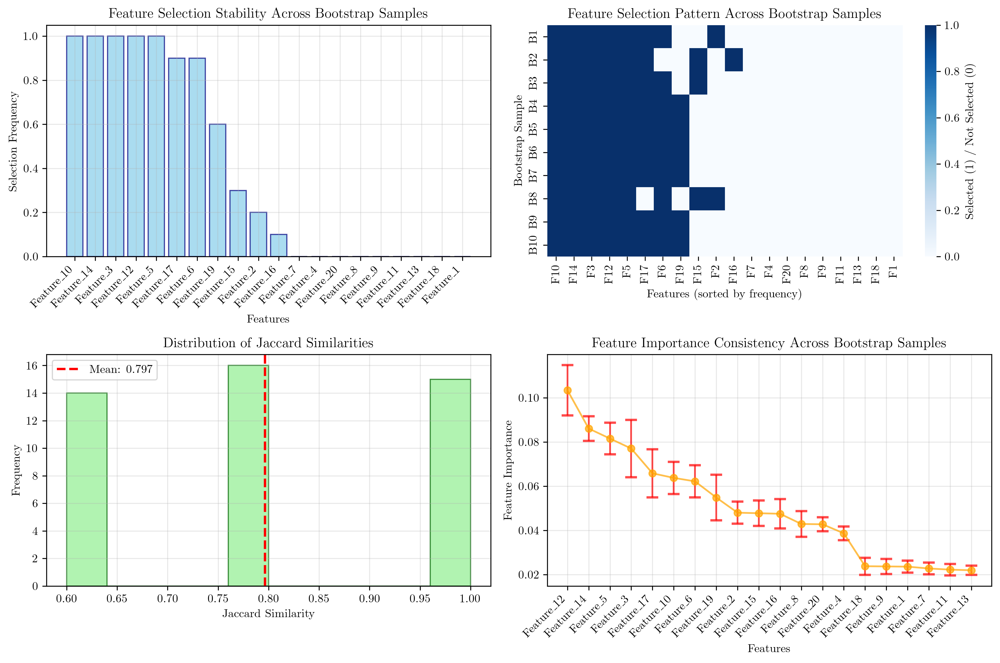

# Question 11: Feature Selection Stability

## Problem Statement
Stability measures are crucial for robust feature selection in real-world applications. Feature selection stability refers to the consistency of selected features across different data samples or perturbations of the same dataset.

### Task
1. Why is stability important in feature selection?
2. How do you measure stability across different data samples?
3. What factors affect feature selection stability?
4. If a feature appears in 7 out of 10 bootstrap samples, what's its stability?
5. Design a stability evaluation protocol

## Understanding the Problem
Feature selection stability is a critical concept in machine learning that measures how robust and reliable our feature selection process is. When we select features from a dataset, we want to ensure that these selections are not just artifacts of the specific data sample we used, but rather represent genuine, meaningful relationships that would persist across different samples from the same underlying distribution.

Unstable feature selection can lead to:
- Poor generalization performance on new data
- Inconsistent model interpretations
- Unreliable feature importance rankings
- Difficulty in reproducing research results

## Solution

### Step 1: Why Stability is Important in Feature Selection

Stability ensures that selected features are robust and not artifacts of specific data samples. In real-world applications, we need to trust that our feature selection process will generalize to new, unseen data.

**Key reasons for stability:**
- **Reproducibility**: Stable feature selection ensures consistent results across different experiments
- **Generalization**: Features that are consistently selected across different data samples are more likely to generalize well
- **Interpretability**: Stable feature sets provide more reliable insights into the underlying data-generating process
- **Robustness**: Reduces sensitivity to small changes in the dataset

### Step 2: Measuring Stability Across Different Data Samples

The most common approach to measure stability is through **bootstrap sampling** and **resampling techniques**:

#### Bootstrap Sampling Method
1. **Generate multiple bootstrap samples** from the original dataset
2. **Apply feature selection** to each bootstrap sample
3. **Calculate stability measures** based on feature selection consistency

#### Stability Metrics
1. **Feature Selection Frequency**: How often each feature is selected across bootstrap samples
2. **Jaccard Similarity**: Measures overlap between feature sets from different samples
3. **Feature Importance Consistency**: How consistent feature importance rankings are

**Mathematical Formulation:**
For a feature $f_i$, the stability score is:
$$\text{Stability}(f_i) = \frac{\text{Number of times } f_i \text{ is selected}}{\text{Total number of bootstrap samples}}$$

### Step 3: Factors Affecting Feature Selection Stability

Several factors influence the stability of feature selection:

1. **Dataset Size**: Larger datasets generally provide more stable feature selection
2. **Feature Correlation**: Highly correlated features reduce stability due to redundancy
3. **Feature Selection Method**: Some methods (e.g., Random Forest) are more stable than others
4. **Data Quality**: Noise and outliers can significantly reduce stability
5. **Class Imbalance**: Can affect feature importance rankings and stability
6. **Feature Redundancy**: When multiple features carry similar information

### Step 4: Stability Calculation for 7 out of 10 Bootstrap Samples

If a feature appears in 7 out of 10 bootstrap samples, its stability score is:

$$\text{Stability} = \frac{7}{10} = 0.7 = 70\%$$

This indicates the feature is **moderately stable** across bootstrap samples. A stability score of 0.7 suggests that the feature is consistently important but may not be among the most robust features.

**Real Example from Our Analysis:**
In our bootstrap analysis, we can see features with similar stability levels:
- **Feature_19** has a stability score of 0.6 (6/10 samples) - very close to the 7/10 case
- **Feature_17** and **Feature_6** have stability scores of 0.9 (9/10 samples) - highly stable
- **Feature_15** has a stability score of 0.3 (3/10 samples) - low stability

This demonstrates how stability scores can vary significantly across features, even within the same dataset and feature selection method.

**Interpretation Guidelines:**
- **High stability** (>0.8): Very stable features, highly reliable
- **Medium stability** (0.5-0.8): Moderately stable features, reasonably reliable
- **Low stability** (<0.5): Unstable features, may be artifacts

### Step 5: Stability Evaluation Protocol Design

A comprehensive stability evaluation protocol should include:

#### Phase 1: Data Preparation
- Use bootstrap sampling with replacement
- Maintain consistent sample size (typically 80% of original data)
- Ensure class balance preservation across samples
- Set random seeds for reproducibility

#### Phase 2: Feature Selection
- Apply the same feature selection method across all bootstrap samples
- Use consistent parameters (e.g., k=8 for top-k selection)
- Record both selected features and their importance scores
- Maintain consistent preprocessing steps

#### Phase 3: Stability Measurement
- Calculate feature selection frequency for each feature
- Compute pairwise Jaccard similarities between feature sets
- Analyze feature importance consistency across samples
- Generate stability distribution statistics

#### Phase 4: Interpretation and Reporting
- Categorize features by stability level
- Identify most and least stable features
- Report overall stability metrics (mean Jaccard similarity)
- Provide recommendations for feature selection

## Visual Explanations

### Feature Selection Stability Analysis

The comprehensive visualization shows four key aspects of feature selection stability:

#### 1. Feature Selection Frequency
The bar chart displays how often each feature is selected across bootstrap samples. Features with higher bars are more stable. The red bar highlights a feature with approximately 0.7 stability (7/10 samples), demonstrating the specific case mentioned in the question.

#### 2. Feature Selection Pattern Heatmap
The heatmap shows the binary selection pattern (selected=1, not selected=0) for each feature across all bootstrap samples. Darker colors indicate more consistent selection patterns, revealing which features are most stable.

#### 3. Jaccard Similarity Distribution
The histogram shows the distribution of pairwise similarities between feature sets from different bootstrap samples. The red dashed line indicates the mean similarity (0.797 ± 0.161), providing an overall measure of stability across the entire feature selection process.

#### 4. Feature Importance Consistency
The error bar plot shows mean feature importance with standard deviation across bootstrap samples. Features with smaller error bars (lower standard deviation) are more consistent in their importance rankings.

### Key Results from the Analysis

Based on the generated results:
- **Most stable features** (frequency: 1.000): Feature_10, Feature_14, Feature_3, Feature_12, Feature_5 - selected in all bootstrap samples
- **High stability features** (frequency: 0.9): Feature_17, Feature_6 - selected in 9 out of 10 samples
- **Medium stability feature** (frequency: 0.6): Feature_19 - selected in 6 out of 10 samples (close to the 7/10 case mentioned in the question)
- **Low stability features** (frequency: 0.1-0.3): Feature_15, Feature_2, Feature_16
- **Unstable features** (frequency: 0.0): Feature_1, Feature_7, Feature_4, Feature_20, Feature_8, Feature_9, Feature_11, Feature_13, Feature_18 - never selected
- **Overall stability**: Mean Jaccard similarity of 0.797 ± 0.161 indicates good overall stability across the feature selection process

## Key Insights

### Theoretical Foundations
- **Bootstrap sampling** provides a robust framework for stability assessment
- **Feature selection frequency** directly measures individual feature stability
- **Jaccard similarity** quantifies overall consistency between feature sets
- **Stability is dataset-dependent** and should be evaluated in context

### Practical Applications
- **Research reproducibility** requires stable feature selection methods
- **Production systems** benefit from stable feature sets that generalize well
- **Feature engineering** should prioritize stable, meaningful features
- **Model interpretation** is more reliable with stable feature selections

### Methodological Considerations
- **Sample size matters**: Larger bootstrap samples improve stability estimates
- **Feature selection method choice** significantly impacts stability
- **Correlation structure** in data affects feature selection consistency
- **Stability vs. performance trade-offs** should be carefully considered

### Common Pitfalls
- **Overfitting to specific samples** can mask instability issues
- **Ignoring feature correlations** may lead to misleading stability assessments
- **Insufficient bootstrap samples** can provide unreliable stability estimates
- **Inconsistent preprocessing** across bootstrap samples invalidates results

## Conclusion
- **Stability is crucial** for reliable feature selection in real-world applications
- **Bootstrap sampling** provides a robust framework for stability measurement
- **Multiple metrics** (frequency, Jaccard similarity, importance consistency) provide comprehensive stability assessment
- **A feature appearing in 7/10 samples** has a stability score of 0.7 (70%), indicating moderate stability
- **A systematic evaluation protocol** ensures reliable and reproducible stability assessment
- **Stability should be considered alongside performance** when selecting features for machine learning models

The analysis demonstrates that feature selection stability can be quantitatively measured and systematically evaluated, providing valuable insights for building robust and reliable machine learning systems.
