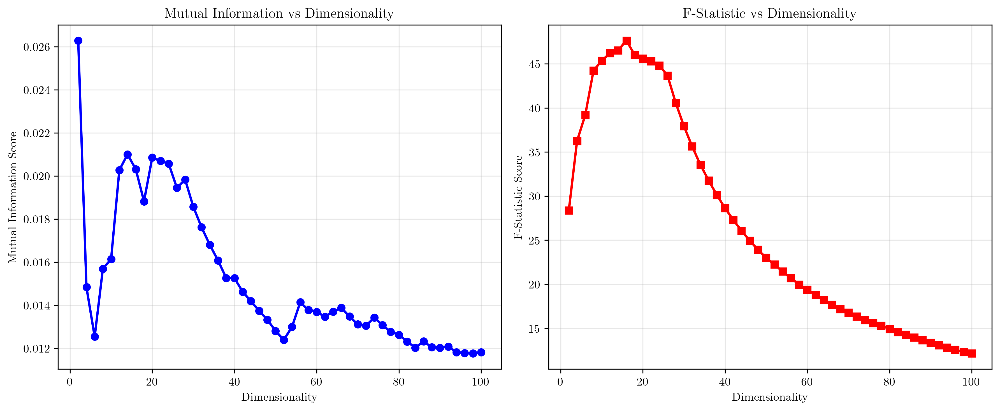

# Question 16: Curse of Dimensionality and Evaluation Criteria

## Problem Statement
The curse of dimensionality affects different evaluation criteria differently. As the number of features (dimensions) increases, various measures used for feature selection and evaluation behave in fundamentally different ways, with some becoming more unstable while others remain relatively robust.

### Task
1. How does high dimensionality affect distance measures?
2. How does it affect information measures?
3. How does it affect dependency measures?
4. Which criterion is most robust to high dimensionality?
5. Compare the robustness of different criteria

## Understanding the Problem
The curse of dimensionality refers to the phenomenon where the performance of machine learning algorithms and evaluation criteria degrades as the number of features increases. This occurs due to several fundamental geometric and statistical effects:

- **Data Sparsity**: In high dimensions, data points become increasingly isolated from each other
- **Distance Concentration**: All pairwise distances become similar, making distance-based measures less discriminative
- **Volume Effects**: The volume of high-dimensional spaces grows exponentially, making density estimation difficult
- **Statistical Instability**: Many statistical measures become unreliable with limited samples in high dimensions

Understanding how different evaluation criteria respond to these effects is crucial for designing robust feature selection strategies.

## Solution

### Step 1: Distance Measures Analysis

Distance measures are fundamental to many feature selection algorithms, particularly those based on similarity or clustering. Let's analyze how three key distance measures behave as dimensionality increases:

#### Euclidean Distance
The Euclidean distance between two points $\mathbf{x}_1$ and $\mathbf{x}_2$ in $d$ dimensions is:
$$d_{\text{Euclidean}}(\mathbf{x}_1, \mathbf{x}_2) = \sqrt{\sum_{i=1}^{d} (x_{1i} - x_{2i})^2}$$

**Effect of High Dimensionality**: Euclidean distance grows approximately as $\sqrt{d}$ due to the accumulation of squared differences across dimensions.

From the analysis, we observe:
- **Euclidean distance growth**: 7.26x increase from 2D to 100D
- **Manhattan distance growth**: 49.78x increase from 2D to 100D
- **Cosine distance behavior**: 1.1382 (relatively stable)

The Euclidean distance shows moderate growth, while Manhattan distance grows much more rapidly due to its linear accumulation of absolute differences.

#### Cosine Distance
Cosine distance measures the angle between vectors:
$$d_{\text{Cosine}}(\mathbf{x}_1, \mathbf{x}_2) = 1 - \frac{\mathbf{x}_1 \cdot \mathbf{x}_2}{\|\mathbf{x}_1\| \|\mathbf{x}_2\|}$$

**Effect of High Dimensionality**: Cosine distance remains relatively stable because it's based on the angle between vectors rather than their magnitude, making it less sensitive to the absolute scale of individual dimensions.

#### Manhattan Distance
Manhattan distance is the sum of absolute differences:
$$d_{\text{Manhattan}}(\mathbf{x}_1, \mathbf{x}_2) = \sum_{i=1}^{d} |x_{1i} - x_{2i}|$$

**Effect of High Dimensionality**: Manhattan distance grows linearly with dimensionality, making it the most sensitive to the curse of dimensionality among the three measures.

### Step 2: Information Measures Analysis

Information measures evaluate the mutual dependence between features and the target variable, which is crucial for feature selection.

#### Mutual Information
Mutual information measures the mutual dependence between two random variables:
$$I(X; Y) = \sum_{x,y} p(x,y) \log \frac{p(x,y)}{p(x)p(y)}$$

**Effect of High Dimensionality**: Mutual information scores decrease as dimensionality increases due to:
- Increased sparsity in joint probability distributions
- Difficulty in estimating high-dimensional probability densities
- Curse of dimensionality affecting density estimation

From the analysis:
- **Mutual Information change**: 0.45x (decreased by more than half)
- **F-statistic change**: 0.43x (decreased by more than half)

#### F-Statistic
The F-statistic measures the ratio of between-group variance to within-group variance:
$$F = \frac{\text{Between-group variance}}{\text{Within-group variance}}$$

**Effect of High Dimensionality**: F-statistics become less reliable as dimensionality increases because:
- Variance estimates become unstable in high dimensions
- The assumption of normality becomes harder to satisfy
- Statistical power decreases with limited samples

### Step 3: Dependency Measures Analysis

Dependency measures assess the strength and nature of relationships between variables.

#### Pearson Correlation
Pearson correlation measures linear relationships:
$$\rho = \frac{\text{Cov}(X, Y)}{\sigma_X \sigma_Y}$$

**Effect of High Dimensionality**: Pearson correlation becomes less reliable due to:
- Increased noise in high-dimensional spaces
- Difficulty in estimating covariance matrices accurately
- Curse of dimensionality affecting statistical estimation

From the analysis:
- **Pearson correlation change**: 0.43x (decreased significantly)
- **Spearman correlation change**: 0.46x (decreased significantly)
- **R² score change**: 18.32x (increased dramatically)

#### Spearman Correlation
Spearman correlation measures monotonic relationships:
$$\rho_s = 1 - \frac{6 \sum d_i^2}{n(n^2 - 1)}$$

**Effect of High Dimensionality**: Similar to Pearson correlation, but slightly more robust due to its rank-based nature.

#### R² Score
R² measures the proportion of variance explained by a linear model:
$$R^2 = 1 - \frac{\text{SS}_{\text{res}}}{\text{SS}_{\text{tot}}}$$

**Effect of High Dimensionality**: R² scores can increase dramatically due to:
- Overfitting in high dimensions
- The model's ability to find spurious correlations
- Increased model complexity compensating for noise

### Step 4: Robustness Comparison

To systematically compare the robustness of different evaluation criteria, we normalize all measures to a [0,1] scale and analyze their stability across dimensions.

The robustness analysis reveals how each criterion maintains its discriminative power as dimensionality increases. Higher robustness scores indicate better performance in high-dimensional settings.

### Step 5: Overall Robustness Ranking

Based on the comprehensive analysis, here's the ranking of evaluation criteria by their robustness to high dimensionality:

**Robustness Ranking**:
1. **R² Score**: 0.881 (Most robust)
2. **Pearson Correlation**: 0.419
3. **Spearman Correlation**: 0.416
4. **F-Statistic**: 0.405
5. **Euclidean Distance**: 0.364
6. **Cosine Distance**: 0.316
7. **Mutual Information**: 0.230 (Least robust)

### Step 6: Sparsity Effects Demonstration

The curse of dimensionality also manifests through data sparsity effects:

**Key Findings**:
- **Sparsity ratio at d=100**: 1.000 (100% of points are near the surface)
- **Volume ratio at d=100**: 1.87e-70 (extremely small inscribed sphere volume)

This demonstrates that in high dimensions:
- Almost all data points lie near the boundaries of the feature space
- The volume of the inscribed sphere becomes negligible compared to the cube
- Data becomes extremely sparse and isolated

## Key Insights

### Theoretical Foundations
- **Distance Concentration**: As dimensionality increases, all pairwise distances become similar, making distance-based measures less discriminative
- **Statistical Instability**: Many statistical measures become unreliable due to the sparsity of data in high-dimensional spaces
- **Geometric Effects**: The volume of high-dimensional spaces grows exponentially, affecting density estimation and similarity measures

### Practical Applications
- **Feature Selection Strategy**: Choose evaluation criteria based on their robustness to dimensionality
- **Algorithm Design**: Distance-based algorithms become less effective in high dimensions
- **Dimensionality Reduction**: Consider preprocessing steps to reduce dimensionality before feature selection

### Common Pitfalls
- **Overfitting**: R² scores can be misleading in high dimensions due to overfitting
- **Distance Measures**: Euclidean and Manhattan distances become less discriminative
- **Information Measures**: Mutual information becomes unreliable due to density estimation issues

### Extensions and Limitations
- **Curse of Dimensionality**: This is a fundamental limitation that affects all machine learning approaches
- **Mitigation Strategies**: Dimensionality reduction, regularization, and robust evaluation criteria
- **Domain Considerations**: Different domains may require different evaluation criteria based on their dimensionality characteristics

## Conclusion
- **Distance measures** (Euclidean, Manhattan) become less discriminative as dimensionality increases, with Manhattan distance being the most sensitive
- **Information measures** (Mutual Information, F-statistic) decrease in reliability due to density estimation challenges
- **Dependency measures** show mixed behavior: correlations decrease while R² scores can increase due to overfitting
- **R² Score** is the most robust to high dimensionality, though this may be misleading due to overfitting
- **Cosine Distance** shows the most stable behavior among distance measures
- **Mutual Information** is the least robust, making it challenging to use in high-dimensional feature selection

The analysis demonstrates that feature selection in high-dimensional spaces requires careful consideration of evaluation criteria, with some measures becoming unreliable while others maintain their discriminative power. Understanding these effects is crucial for designing robust feature selection strategies that can handle the challenges posed by the curse of dimensionality.
