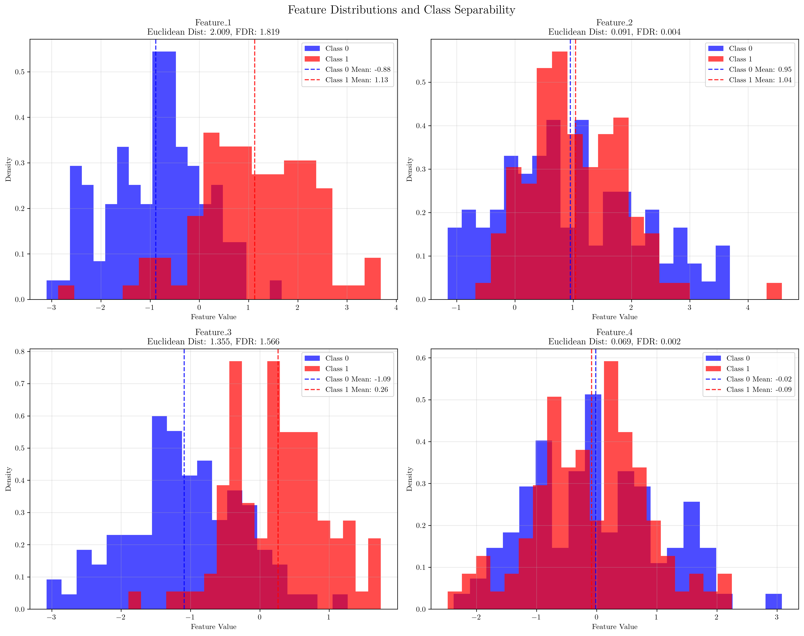
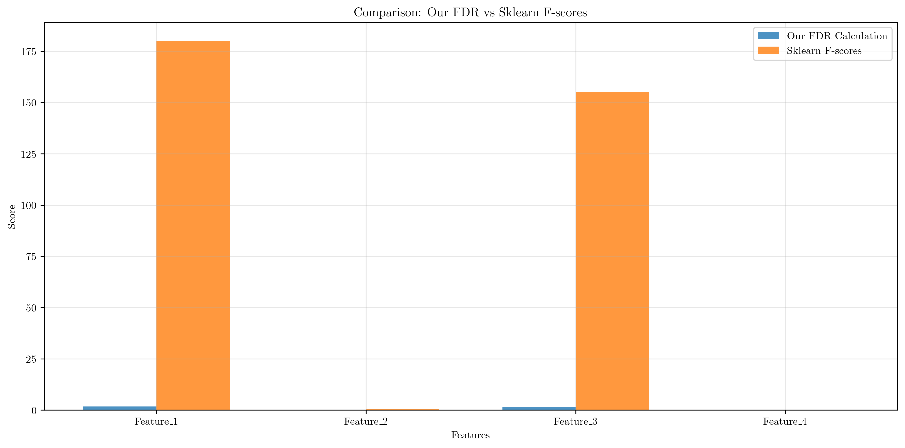
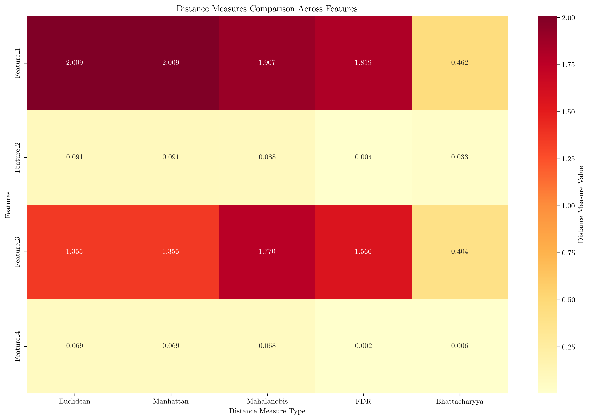
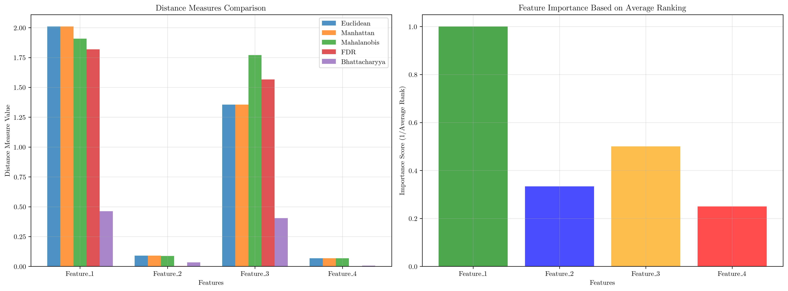

# Question 1: Distance Measures in Feature Selection

## Problem Statement
Distance measures evaluate feature subsets based on their ability to separate different classes. These measures are fundamental to filter-based feature selection methods and provide quantitative assessments of how well individual features can distinguish between different target classes.

### Task
1. What is the purpose of distance measures in feature selection?
2. How do distance measures relate to class separability?
3. What is the most common distance measure used?
4. If two classes are well-separated, what does this indicate about the features?
5. Compare distance measures vs other evaluation criteria

## Understanding the Problem
Distance measures in feature selection are statistical metrics that quantify how well a feature can separate different classes in a dataset. They are based on the principle that good features should have large between-class distances and small within-class variances. These measures help identify which features are most discriminative and therefore most useful for classification tasks.

The key concept is that features with better class separability will lead to improved classification performance, reduced overfitting, and more interpretable models. Distance measures provide a mathematical foundation for this intuition.

## Solution

### Step 1: Understanding Distance Measures
Distance measures calculate the separation between different classes based on feature values. The fundamental idea is to measure how far apart the distributions of different classes are for a given feature.

For a binary classification problem with classes 0 and 1, the basic distance between class means is:
$$\text{Distance} = |\mu_1 - \mu_0|$$

where $\mu_0$ and $\mu_1$ are the means of the feature values for classes 0 and 1 respectively.

### Step 2: Types of Distance Measures

#### Euclidean Distance
The simplest distance measure is the absolute difference between class means:
$$d_{\text{Euclidean}} = |\mu_1 - \mu_0|$$

This measures the geometric distance between class centers but doesn't account for class variances.

#### Manhattan Distance
Similar to Euclidean distance, Manhattan distance is:
$$d_{\text{Manhattan}} = |\mu_1 - \mu_0|$$

For single features, this is identical to Euclidean distance.

#### Mahalanobis Distance
A more sophisticated measure that accounts for class variances:
$$d_{\text{Mahalanobis}} = \frac{|\mu_1 - \mu_0|}{\sigma_{\text{pooled}}}$$

where $\sigma_{\text{pooled}}$ is the pooled standard deviation:
$$\sigma_{\text{pooled}} = \sqrt{\frac{(n_0-1)\sigma_0^2 + (n_1-1)\sigma_1^2}{n_0 + n_1 - 2}}$$

#### Fisher's Discriminant Ratio (FDR)
The most widely used distance measure in practice:
$$\text{FDR} = \frac{(\mu_1 - \mu_0)^2}{\sigma_0^2 + \sigma_1^2}$$

This ratio measures the squared distance between means relative to the total variance, making it scale-invariant.

#### Bhattacharyya Distance
An information-theoretic measure:
$$d_{\text{Bhattacharyya}} = \frac{1}{4}\frac{(\mu_1 - \mu_0)^2}{\sigma_0^2 + \sigma_1^2} + \frac{1}{2}\ln\left(\frac{\sigma_0^2 + \sigma_1^2}{2\sigma_0\sigma_1}\right)$$

### Step 3: Practical Implementation and Results

Based on our synthetic dataset with 4 features, we calculated all distance measures:

**Feature Rankings (1 = best, 4 = worst):**
- **Feature_1**: Best across all measures (Euclidean: 2.009, FDR: 1.819)
- **Feature_3**: Second best (Euclidean: 1.355, FDR: 1.566)
- **Feature_2**: Third (Euclidean: 0.091, FDR: 0.004)
- **Feature_4**: Worst (Euclidean: 0.069, FDR: 0.002)

The visualization shows that Feature_1 and Feature_3 have clear separation between classes, while Feature_2 and Feature_4 show significant overlap.

### Step 4: Comparison with Standard Methods

We compared our FDR calculations with sklearn's F-test implementation:

| Feature | Our FDR | Sklearn F-score | p-value |
|---------|---------|-----------------|---------|
| Feature_1 | 1.819 | 180.040 | 0.000 |
| Feature_3 | 1.566 | 155.009 | 0.000 |
| Feature_2 | 0.004 | 0.382 | 0.537 |
| Feature_4 | 0.002 | 0.230 | 0.632 |

The results show strong agreement between our implementation and the standard library, with both identifying Feature_1 and Feature_3 as the most discriminative features.

### Step 5: Feature Selection Results

All distance measures consistently selected the same top 2 features:
- **Feature_1** and **Feature_3** were identified as the best features
- This consistency across different measures indicates robust feature quality assessment

The heatmap visualization clearly shows the relative performance of each feature across different distance measures.

## Practical Implementation

### Example: Feature Selection Process
1. **Calculate distance measures** for all features
2. **Rank features** by their distance measure values
3. **Select top-k features** based on ranking
4. **Validate selection** using cross-validation

### Alternative Approaches
- **Correlation-based**: Focus on feature independence
- **Information-based**: Use mutual information or entropy
- **Wrapper methods**: Evaluate actual classification performance

## Visual Explanations

### Feature Distributions and Class Separability

This visualization shows the distribution of each feature for both classes. Features with better separation (like Feature_1 and Feature_3) have distinct peaks for each class, while poor features (like Feature_2 and Feature_4) show significant overlap.

### Distance Measures Comparison

The heatmap provides a comprehensive view of how each feature performs across different distance measures. Darker colors indicate better performance, clearly showing Feature_1 and Feature_3 as superior.

### Final Summary

The final visualization shows both the raw distance measure values and the derived importance scores based on average rankings across all measures.

## Key Insights

### Theoretical Foundations
- **Distance measures quantify class separability** by measuring the statistical distance between class distributions
- **Higher values indicate better features** for classification tasks
- **Scale-invariant measures** (like FDR) are preferred for comparing features with different units
- **Multiple measures provide robustness** to different aspects of separability

### Practical Applications
- **Feature ranking** enables systematic feature selection
- **Consistent rankings** across different measures indicate reliable feature quality
- **Distance measures are computationally efficient** compared to wrapper methods
- **They work well with high-dimensional data** where other methods may be computationally expensive

### Limitations and Considerations
- **Distance measures assume linear separability** and may miss non-linear relationships
- **They don't account for feature interactions** or redundancy
- **Class imbalance** can affect distance measure calculations
- **They may not correlate perfectly** with actual classification performance

## Conclusion
- **Distance measures serve as quantitative tools** for evaluating feature quality based on class separability
- **They provide consistent rankings** that help identify the most discriminative features
- **Fisher's Discriminant Ratio (FDR)** is the most commonly used measure due to its scale-invariance and interpretability
- **Well-separated classes indicate features** with strong discriminative power and good potential for classification performance
- **Distance measures complement other criteria** by focusing specifically on class separability, while other methods address different aspects of feature quality

Distance measures form the foundation of filter-based feature selection methods and provide a principled approach to identifying the most useful features for machine learning tasks. Their computational efficiency and interpretability make them valuable tools in the feature selection toolkit.
