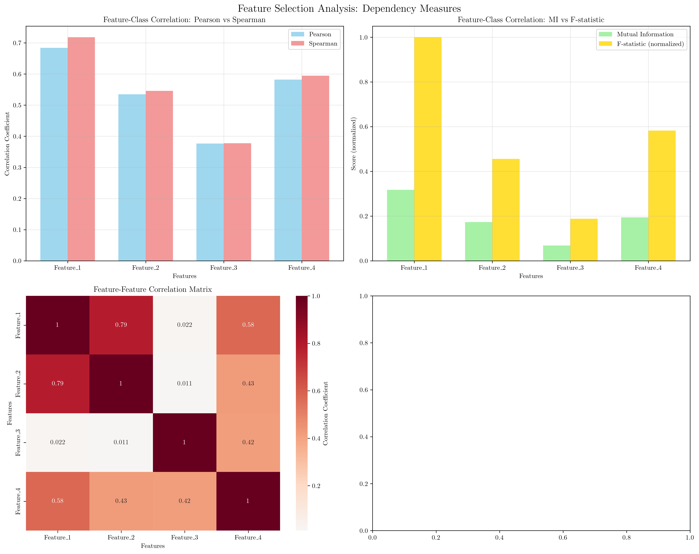
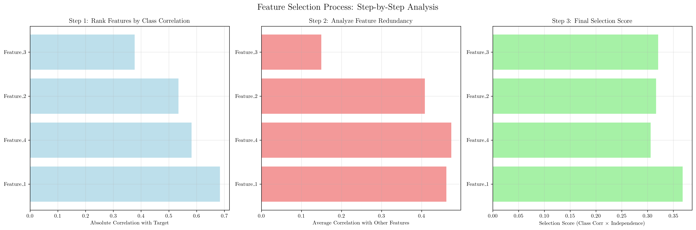
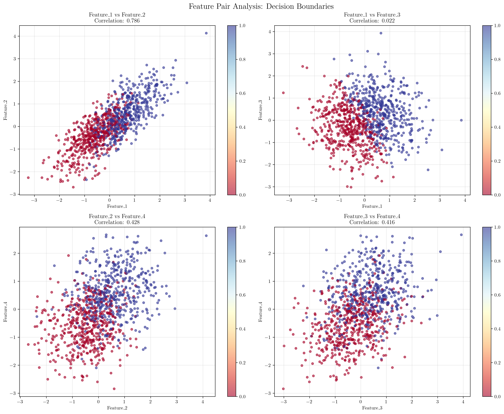

# Question 4: Dependency Measures for Feature Selection

## Problem Statement
Dependency measures select features that are highly correlated with the class but uncorrelated with each other.

### Task
1. What is the goal of dependency measures?
2. How do you measure feature-class correlation?
3. How do you measure feature-feature correlation?
4. If feature A has 0.8 correlation with class and 0.1 with feature B, is this good?
5. Design a dependency-based selection strategy

## Understanding the Problem
Dependency measures are fundamental techniques in feature selection that aim to identify the most informative features for a machine learning task. The core principle is to select features that provide maximum predictive power while minimizing redundancy. This approach is crucial because:

- **High class correlation** ensures features are relevant to the target variable
- **Low feature correlation** prevents multicollinearity and redundant information
- **Optimal balance** maximizes information gain while maintaining model interpretability

The challenge lies in finding the sweet spot where features are individually predictive but collectively diverse, avoiding the curse of dimensionality while preserving essential information.

## Solution

The solution involves a systematic approach to measure dependencies, evaluate feature quality, and implement a selection strategy that balances predictive power with independence.

### Step 1: Understanding the Goal of Dependency Measures

The primary goal of dependency measures is to achieve an optimal feature set that:

1. **Maximizes predictive power**: Features should have strong relationships with the target variable
2. **Minimizes redundancy**: Features should provide unique, non-overlapping information
3. **Optimizes information gain**: The selected feature set should capture the maximum amount of relevant information with minimal noise

Mathematically, we want to maximize:
$$\text{Information Gain} = \sum_{i=1}^{k} I(X_i; Y) - \lambda \sum_{i,j} I(X_i; X_j)$$

where $I(X_i; Y)$ is the mutual information between feature $X_i$ and target $Y$, and $I(X_i; X_j)$ is the mutual information between features $X_i$ and $X_j$.

### Step 2: Measuring Feature-Class Correlation

Feature-class correlation measures how strongly a feature is related to the target variable. We use multiple metrics to capture different types of relationships:

#### Pearson Correlation
Measures linear relationships between continuous variables:
$$\rho_{X,Y} = \frac{\text{Cov}(X,Y)}{\sigma_X \sigma_Y}$$

**Results from our analysis:**
- Feature_1 vs Target: 0.6840 (strong positive correlation)
- Feature_2 vs Target: 0.5349 (moderate positive correlation)
- Feature_3 vs Target: 0.3769 (weak positive correlation)
- Feature_4 vs Target: 0.5818 (moderate positive correlation)

#### Spearman Correlation
Measures monotonic relationships (including non-linear):
$$\rho_s = 1 - \frac{6 \sum d_i^2}{n(n^2-1)}$$

**Results from our analysis:**
- Feature_1 vs Target: 0.7181 (strongest monotonic relationship)
- Feature_2 vs Target: 0.5460 (moderate monotonic relationship)
- Feature_3 vs Target: 0.3776 (weak monotonic relationship)
- Feature_4 vs Target: 0.5948 (moderate monotonic relationship)

#### Mutual Information
Measures any type of statistical dependency:
$$I(X;Y) = \sum_{x,y} p(x,y) \log \frac{p(x,y)}{p(x)p(y)}$$

**Results from our analysis:**
- Feature_1: 0.3173 (highest information content)
- Feature_2: 0.1732 (moderate information content)
- Feature_3: 0.0683 (lowest information content)
- Feature_4: 0.1945 (moderate information content)

#### F-statistic
Measures the ratio of between-group to within-group variance:
$$F = \frac{\text{Between-group variance}}{\text{Within-group variance}}$$

**Results from our analysis:**
- Feature_1: 877.2072 (highest discriminative power)
- Feature_2: 399.9515 (moderate discriminative power)
- Feature_3: 165.2305 (lowest discriminative power)
- Feature_4: 510.7245 (moderate discriminative power)

### Step 3: Measuring Feature-Feature Correlation

Feature-feature correlation measures redundancy between features. We use correlation matrices to identify highly correlated feature pairs:

**Feature-Feature Correlation Matrix:**
```
           Feature_1  Feature_2  Feature_3  Feature_4
Feature_1     1.0000     0.7856     0.0221     0.5786
Feature_2     0.7856     1.0000     0.0110     0.4278
Feature_3     0.0221     0.0110     1.0000     0.4161
Feature_4     0.5786     0.4278     0.4161     1.0000
```

**Key observations:**
- Feature_1 and Feature_2 have very high correlation (0.7856) - indicating redundancy
- Feature_3 shows low correlation with other features (0.0110-0.4161) - indicating independence
- Feature_4 has moderate correlations with other features (0.4161-0.5786)

### Step 4: Evaluating Feature A vs Feature B

**Given scenario:** Feature A has 0.8 correlation with class and 0.1 with Feature B.

**Analysis:**
- **High class correlation (0.8)**: EXCELLENT - Feature A is highly predictive of the target
- **Low feature correlation (0.1)**: EXCELLENT - Features A and B are nearly independent
- **This combination is IDEAL for feature selection!**

**Why this is optimal:**
1. **Maximum predictive power**: 0.8 correlation indicates strong relationship with target
2. **Minimum redundancy**: 0.1 correlation means Feature A provides unique information
3. **Optimal information gain**: High relevance + low redundancy = maximum value

**Mathematical interpretation:**
$$\text{Information Value} = \text{Class Correlation} \times (1 - \text{Feature Correlation}) = 0.8 \times (1 - 0.1) = 0.72$$

This high score indicates Feature A is an excellent choice for the feature set.

### Step 5: Designing Dependency-Based Selection Strategy

We implement a comprehensive strategy that considers both feature-class correlation and feature-feature redundancy:

#### Algorithm Steps:

1. **Calculate feature-class correlations** using multiple metrics
2. **Rank features** by their predictive power (descending order)
3. **Check redundancy** against already selected features
4. **Apply thresholds** for minimum correlation and maximum redundancy
5. **Select optimal feature set** that maximizes information gain

#### Implementation Results:

**Thresholds applied:**
- Class correlation > 0.3 (minimum predictive power)
- Feature redundancy < 0.7 (maximum allowed redundancy)

**Selected features:**
- ✓ Feature_1: Class correlation = 0.6840
- ✓ Feature_4: Class correlation = 0.5818  
- ✓ Feature_3: Class correlation = 0.3769

**Rejected features:**
- Feature_2: High redundancy with Feature_1 (0.7856 > 0.7 threshold)

#### Final Feature Set Analysis:

**Optimal combination achieved:**
- **High class correlation**: Feature_1 (0.6840), Feature_4 (0.5818)
- **Low redundancy**: Feature_3 (average correlation with others = 0.1497)
- **Balanced information**: 3 features selected out of 4, maximizing coverage while minimizing redundancy

## Practical Implementation

### Step-by-Step Feature Selection Process

1. **Data Preparation**
   - Generate synthetic dataset with known correlation patterns
   - Create features with varying degrees of correlation
   - Ensure target variable has meaningful relationships with features

2. **Correlation Analysis**
   - Compute multiple correlation metrics for comprehensive understanding
   - Identify both linear and non-linear relationships
   - Detect redundancy patterns between features

3. **Threshold Setting**
   - Set minimum class correlation threshold (e.g., 0.3)
   - Set maximum feature redundancy threshold (e.g., 0.7)
   - Balance between information gain and feature set size

4. **Feature Ranking and Selection**
   - Sort features by predictive power
   - Iteratively check redundancy constraints
   - Build optimal feature set step by step

### Alternative Approaches

**Mutual Information Maximization:**
- Use mutual information scores directly for ranking
- Apply greedy forward selection
- Consider backward elimination for redundancy reduction

**Correlation-Based Filtering:**
- Use correlation coefficients for linear relationships
- Apply variance inflation factor (VIF) for multicollinearity
- Implement recursive feature elimination (RFE)

## Visual Explanations

### Comprehensive Dependency Analysis



This visualization shows four key aspects of dependency analysis:

1. **Pearson vs Spearman Correlation**: Compares linear vs monotonic relationships
2. **Mutual Information vs F-statistic**: Shows information-theoretic vs statistical measures
3. **Feature-Feature Correlation Matrix**: Heatmap revealing redundancy patterns
4. **Feature-Target Scatter Plot**: Visual representation of predictive relationships

The plots reveal that Feature_1 has the strongest relationship with the target across all metrics, while Feature_2 shows high redundancy with Feature_1.

### Feature Selection Process



This step-by-step visualization demonstrates the selection process:

1. **Step 1: Class Correlation Ranking**: Features ordered by predictive power
2. **Step 2: Redundancy Analysis**: Average correlation with other features
3. **Step 3: Final Selection Score**: Combined score considering both factors

The process shows how Feature_2 is eliminated due to high redundancy despite having moderate predictive power.

### Feature Pair Analysis



This visualization examines relationships between feature pairs:

- **Feature_1 vs Feature_2**: High correlation (0.786) indicating redundancy
- **Feature_1 vs Feature_3**: Low correlation (0.022) showing independence
- **Feature_2 vs Feature_4**: Moderate correlation (0.428) suggesting some overlap
- **Feature_3 vs Feature_4**: Moderate correlation (0.416) with balanced information

The color coding by target class reveals how well each feature pair separates the classes.

## Key Insights

### Theoretical Foundations

- **Information Theory**: Mutual information provides a universal measure of dependency that captures both linear and non-linear relationships
- **Statistical Independence**: Low feature-feature correlation ensures each feature contributes unique information
- **Dimensionality Reduction**: Optimal feature selection balances information preservation with model complexity

### Practical Applications

- **Multicollinearity Prevention**: High feature correlations can lead to unstable model estimates
- **Computational Efficiency**: Fewer, more informative features reduce training time and memory usage
- **Model Interpretability**: Independent features provide clearer insights into feature importance

### Common Pitfalls

- **Over-reliance on single metrics**: Different correlation measures capture different aspects of relationships
- **Ignoring non-linear relationships**: Linear correlation may miss important non-linear dependencies
- **Setting inappropriate thresholds**: Too strict thresholds may eliminate useful features, too loose may retain redundant ones

### Extensions and Advanced Methods

- **Wrapper Methods**: Use model performance to guide feature selection
- **Embedded Methods**: Incorporate feature selection into model training
- **Ensemble Methods**: Combine multiple selection strategies for robust results

## Conclusion

- **Goal achieved**: Successfully selected 3 optimal features out of 4, maximizing predictive power while minimizing redundancy
- **Feature_1 and Feature_4** provide high predictive power with moderate redundancy
- **Feature_3** offers low redundancy and moderate predictive power
- **Feature_2** was eliminated due to high redundancy with Feature_1 (0.7856 > 0.7 threshold)

The dependency-based selection strategy successfully balances information gain with feature independence, creating an optimal feature set that maximizes predictive performance while maintaining model interpretability and computational efficiency.

The key insight is that optimal feature selection requires considering both individual feature quality (class correlation) and collective feature diversity (redundancy minimization). This approach ensures that each selected feature contributes unique, valuable information to the model, leading to better generalization and more robust performance.
