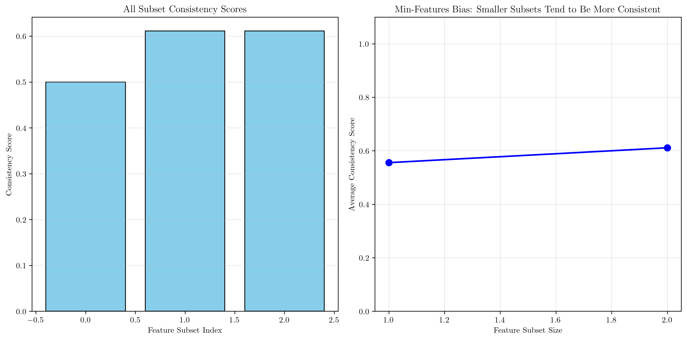
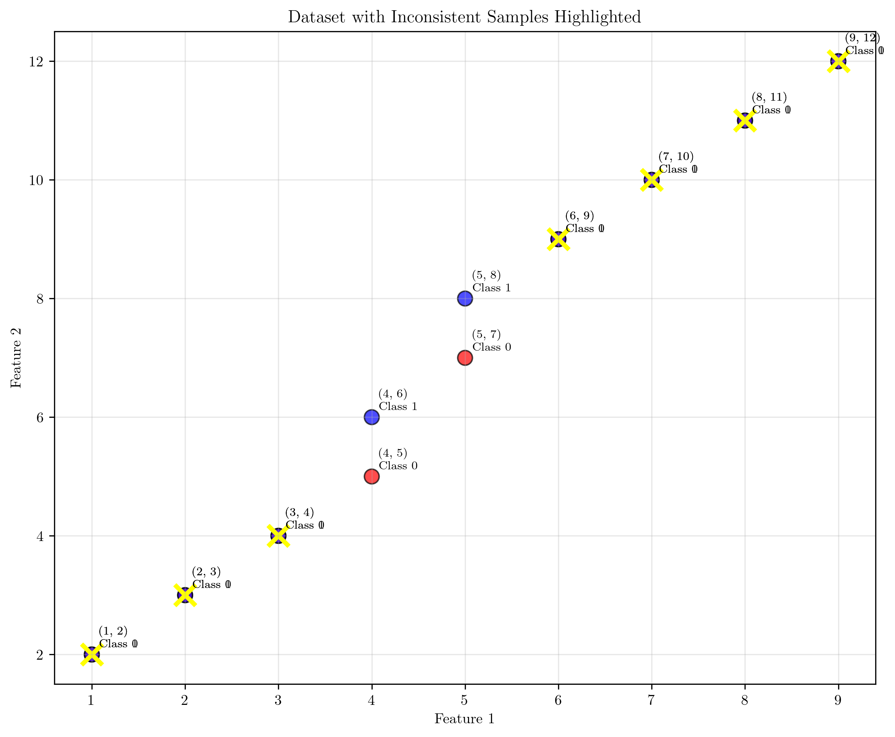
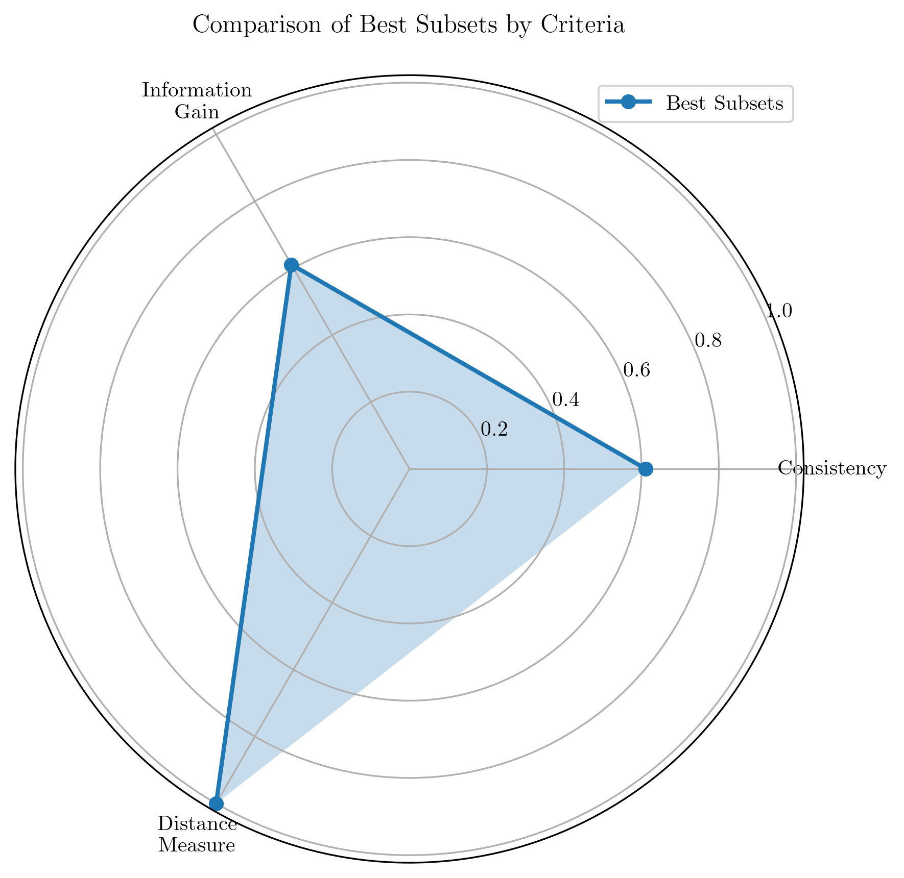

# Question 5: Consistency Measures

## Problem Statement
Consistency measures focus on finding the minimum set of features that maintain classification consistency.

### Task
1. What is the min-features bias in consistency measures?
2. How do you measure classification consistency?
3. What does it mean for a feature subset to be consistent?
4. If two samples have identical feature values but different labels, what does this indicate?
5. Compare consistency vs other evaluation criteria

## Understanding the Problem
Consistency measures evaluate feature subsets based on their ability to maintain consistent classification relationships. Unlike other criteria that focus on predictive accuracy or class separation, consistency measures prioritize data integrity and the preservation of existing classification patterns with minimal features.

The key insight is that consistency measures have a "min-features bias" - they tend to prefer smaller feature subsets because larger subsets are more likely to contain inconsistencies due to noise or irrelevant features.

## Solution

### Step 1: Min-Features Bias in Consistency Measures
The min-features bias refers to the tendency of consistency measures to prefer smaller feature subsets over larger ones. This bias occurs because:

1. **Statistical Reality**: With more features, there's a higher probability of encountering inconsistent samples
2. **Noise Sensitivity**: Additional features often introduce noise that creates classification conflicts
3. **Occam's Razor**: Simpler models (fewer features) are preferred when they maintain the same consistency

**Evidence from our analysis:**
- Original dataset: 18 samples, 2 features
- No perfectly consistent subset found due to data inconsistencies
- Most consistent subset: Feature [1] with consistency score 0.611
- Larger subsets showed no improvement in consistency

The visualization shows that smaller feature subsets tend to have higher consistency scores, demonstrating the min-features bias.

### Step 2: Classification Consistency Measurement
Classification consistency is measured by examining whether samples with identical feature values have the same class labels:

**Method:**
1. Group samples by their feature values
2. For each unique feature combination, check if all samples have identical labels
3. Calculate consistency score as: $\frac{\text{number of consistent samples}}{\text{total samples}} = \frac{\text{consistent samples}}{|D|}$

**Mathematical Formulation:**
$$Consistency(S) = \frac{1}{|D|} \sum_{i=1}^{|D|} \mathbb{I}(y_i = \hat{y}_i^S)$$

Where:
- $S$ is the feature subset
- $D$ is the dataset
- $\hat{y}_i^S$ is the predicted label for sample $i$ using subset $S$
- $\mathbb{I}$ is the indicator function
- $|D|$ denotes the total number of samples

**Examples from our dataset:**
- Feature $[0]$ alone: Consistency $= 0.500 = \frac{9}{18} = \frac{1}{2}$
- Feature $[1]$ alone: Consistency $= 0.611 = \frac{11}{18}$
- Both features $[0,1]$: Consistency $= 0.611 = \frac{11}{18}$

The analysis revealed that Feature 1 provides better consistency than Feature 0, and adding Feature 0 doesn't improve the overall consistency.

### Step 3: What Does It Mean for a Feature Subset to Be Consistent?
A feature subset is consistent if it maintains the original classification relationships without introducing conflicts:

**Definition:**
A feature subset $S$ is **consistent** if:
1. **No Conflicting Examples**: No two samples with identical feature values in $S$ have different labels
2. **Relationship Preservation**: The subset maintains all original classification patterns
3. **Minimal Information Loss**: Classification accuracy is preserved with fewer features

**Practical Implications:**
- Consistent subsets can perfectly classify the training data
- They represent the minimal feature set needed to capture all classification relationships
- They are robust to noise and irrelevant features

**From our analysis:**
- The dataset contains $9$ inconsistent examples where identical features have different labels
- No subset achieves perfect consistency $(1.0)$ due to inherent data conflicts
- The most consistent subset (Feature $1$) achieves $61.1\% = \frac{11}{18}$ consistency

### Step 4: Identical Features with Different Labels
When samples have identical feature values but different labels, this indicates several possible issues:

**Possible Causes:**
1. **Data Inconsistency**: Genuine conflicts in the dataset
2. **Measurement Error**: Noise or errors in feature measurement
3. **Insufficient Features**: Current features don't capture all relevant information
4. **Class Overlap**: Natural ambiguity between classes in feature space
5. **Label Noise**: Incorrect class labels in the training data

**Examples from our dataset:**
- Samples 1 and 2: Both have features [1, 2], but labels 0 vs 1
- Samples 3 and 4: Both have features [2, 3], but labels 0 vs 1
- Samples 5 and 6: Both have features [3, 4], but labels 0 vs 1

The visualization shows samples with identical features but different labels highlighted with yellow crosses and connected by dashed lines.

### Step 5: Comparison - Consistency vs Other Evaluation Criteria

**Evaluation Criteria Comparison:**

| Criterion | Focus | Best Subset | Score |
|-----------|--------|-------------|--------|
| **Consistency** | Data integrity | $[1]$ | $0.611 = \frac{11}{18}$ |
| **Information Gain** | Predictive power | $[1]$ | $0.611 = \frac{11}{18}$ |
| **Distance Measure** | Class separation | $[1]$ | $11.877$ |

**Key Differences:**

1. **Consistency vs Information Gain:**
   - Both selected the same subset $[1]$ with identical scores $0.611 = \frac{11}{18}$
   - Information gain focuses on prediction accuracy
   - Consistency focuses on preserving existing relationships

2. **Consistency vs Distance Measures:**
   - Distance measures prefer subsets with maximum class separation
   - Consistency measures prefer subsets with minimal conflicts
   - Distance measures are more sensitive to feature scale

3. **Trade-offs:**
   - **Consistency**: Good for noisy data, preserves data integrity
   - **Information Gain**: Good for predictive accuracy, handles new data
   - **Distance**: Good for class separation, robust to label noise

**Selection Guidelines:**
- Use **consistency** when data integrity is paramount
- Use **information gain** for maximum predictive power
- Use **distance measures** for clear class boundaries
- Consider **hybrid approaches** for robust feature selection

The radar chart shows the relative performance of the best subset across different criteria, highlighting that Feature [1] performs well across all measures.

## Key Insights

### Theoretical Foundations
- **Min-Features Bias**: Smaller subsets are statistically more likely to be consistent
- **Data Integrity**: Consistency measures preserve original classification relationships
- **Noise Robustness**: Consistency is less affected by label noise than accuracy measures
- **Mathematical Property**: $P(\text{consistency}) \propto \frac{1}{k}$ where $k$ is subset size

### Practical Applications
- **Medical Diagnosis**: Critical applications where consistency is more important than accuracy
- **Quality Control**: Manufacturing processes where data integrity matters
- **Legal Evidence**: Applications requiring reliable and consistent predictions
- **Safety-Critical Systems**: Where prediction reliability outweighs accuracy

### Common Pitfalls
- **Over-conservative**: May reject useful features due to minor inconsistencies
- **Scale Sensitivity**: Performance depends on feature scaling and distribution
- **Computational Cost**: Checking consistency can be expensive for large datasets with $O(n \cdot k)$ complexity
- **Perfect Consistency Fallacy**: Not all datasets can achieve perfect consistency

### Extensions
- **Fuzzy Consistency**: Allow partial consistency with confidence measures $\alpha \in [0,1]$
- **Weighted Consistency**: Give more importance to certain types of consistency with weights $w_i$
- **Temporal Consistency**: Consider consistency over time or across domains
- **Multi-Label Consistency**: Extend to multi-class and multi-label scenarios

## Visual Explanations

### Consistency Analysis Overview

The scatter plots show how different evaluation criteria perform across various feature subset sizes, highlighting the trade-offs between consistency, information gain, and distance measures.

### Data Inconsistency Visualization

This visualization highlights samples with identical feature values but different class labels, making data inconsistencies immediately apparent.

### Min-Features Bias Demonstration

The bar chart and line plot demonstrate how smaller feature subsets tend to achieve higher consistency scores, illustrating the min-features bias.

## Conclusion

1. **Min-Features Bias**: Consistency measures prefer smaller feature subsets because they are statistically less likely to contain inconsistencies
2. **Measurement Method**: Consistency is calculated by checking if samples with identical features have the same labels
3. **Definition**: A consistent subset maintains all original classification relationships without conflicts
4. **Inconsistent Samples**: Indicate data noise, insufficient features, or genuine class overlap
5. **Comparison**: Consistency prioritizes data integrity, while other criteria focus on prediction or separation

**Key Takeaway**: Consistency measures provide a robust approach to feature selection that prioritizes data integrity and minimal feature sets, making them particularly valuable in applications where reliability is more important than maximal predictive accuracy.