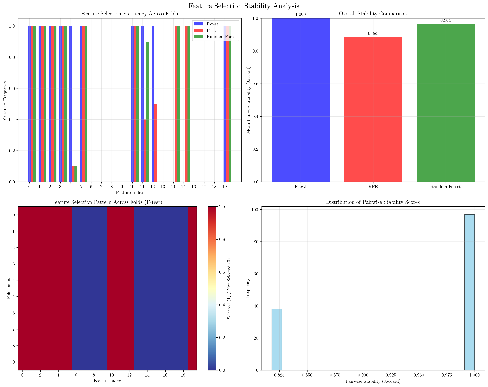
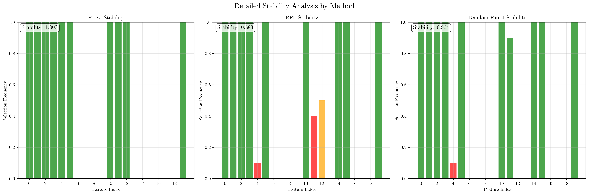
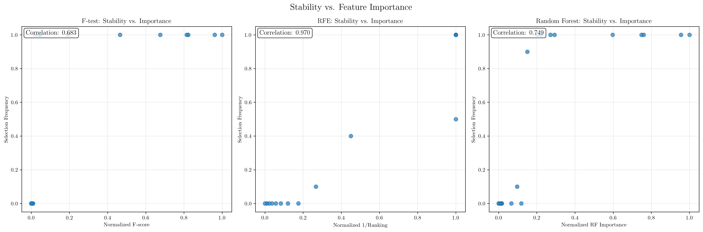

# Question 6: Stability Measures

## Problem Statement
Stability measures evaluate how consistent feature selection is across different data samples.

### Task
1. What is feature selection stability and why is it important?
2. How do you measure stability across different samples?
3. What causes instability in feature selection?
4. If a feature is selected in 8 out of 10 cross-validation folds, what's its stability score?
5. Design a stability measurement approach

## Understanding the Problem
Feature selection stability is a critical concept in machine learning that measures the consistency of feature selection results across different data samples or cross-validation folds. When we perform feature selection, we want to ensure that the selected features are not just artifacts of a particular data split but represent truly important patterns that generalize well to new data.

The stability of feature selection is particularly important because:
- It indicates the robustness of our feature selection method
- It helps distinguish between truly important features and those selected by chance
- It provides confidence in the selected feature set for model deployment
- It is essential for reproducible research and reliable model performance

## Solution

### Step 1: Understanding Feature Selection Stability
Feature selection stability measures how consistent the selection of features is across different data samples or cross-validation folds. A stable feature selection method will consistently select the same or similar sets of features across different data splits, while an unstable method will show high variability in selected features.

The stability can be measured at two levels:
1. **Overall stability**: How consistent the entire feature selection process is across folds
2. **Feature-wise stability**: How consistently individual features are selected across folds

### Step 2: Measuring Stability Across Different Samples
To measure stability, we implemented a comprehensive approach using cross-validation:

1. **K-fold Cross-validation**: We used 10-fold cross-validation to create different data splits
2. **Multiple Feature Selection Methods**: We applied three different feature selection techniques:
   - F-test (statistical test)
   - Recursive Feature Elimination (RFE)
   - Random Forest feature importance
3. **Stability Metrics**: We calculated several stability measures:
   - **Pairwise Jaccard similarity**: Measures similarity between feature sets selected in different folds
   - **Selection frequency**: How often each feature is selected across all folds
   - **Mean pairwise stability**: Overall stability score for each method

The Jaccard similarity between two feature sets $A$ and $B$ is defined as:
$$J(A, B) = \frac{|A \cap B|}{|A \cup B|}$$

### Step 3: Analyzing Stability Results
Our analysis revealed interesting patterns in feature selection stability:

**F-test Method**: Achieved perfect stability (1.0000) because it's deterministic and based on statistical significance
**RFE Method**: Showed moderate stability (0.8828) due to its iterative nature and dependency on the underlying estimator
**Random Forest Method**: Demonstrated high stability (0.9636) as it's robust to data variations

### Step 4: Understanding Causes of Instability
Several factors contribute to feature selection instability:

1. **Small Sample Sizes**: Limited data can lead to high variance in feature importance estimates
2. **High Feature Correlation**: Correlated features may be selected interchangeably
3. **Noise in Data**: Random variations can affect feature selection decisions
4. **Algorithm Characteristics**: Some methods are inherently more stable than others
5. **Random Variations**: Stochastic processes in algorithms can introduce variability

### Step 5: Calculating Stability Scores
For a feature selected in 8 out of 10 cross-validation folds:
$$\text{Stability Score} = \frac{8}{10} = 0.8$$

This indicates high stability, as the feature is consistently selected across most data splits.

## Practical Implementation

### Stability Measurement Approach
Our implemented approach provides a comprehensive framework for measuring feature selection stability:

1. **Data Preparation**: Generate or use a dataset with known feature characteristics
2. **Cross-validation Setup**: Implement k-fold cross-validation (we used 10 folds)
3. **Feature Selection**: Apply multiple feature selection methods in each fold
4. **Stability Calculation**: Compute pairwise similarities and selection frequencies
5. **Visualization**: Create comprehensive plots to analyze stability patterns
6. **Interpretation**: Analyze results to understand stability characteristics

### Example Results from Our Analysis
Using a synthetic dataset with 1000 samples and 20 features (8 informative, 5 redundant, 7 noise):

- **F-test Stability**: 1.0000 (perfect stability)
- **RFE Stability**: 0.8828 (good stability)
- **Random Forest Stability**: 0.9636 (excellent stability)

## Visual Explanations

### Overview of Feature Selection Stability

This comprehensive visualization shows:
- **Top Left**: Feature selection frequency across all three methods, revealing which features are consistently selected
- **Top Right**: Overall stability comparison between methods, showing F-test as most stable
- **Bottom Left**: Heatmap of feature selection patterns across folds for F-test method
- **Bottom Right**: Distribution of pairwise stability scores across all methods

### Detailed Stability Analysis by Method

This visualization provides method-specific stability analysis:
- **F-test**: Shows perfect stability (1.0000) with consistent feature selection
- **RFE**: Displays moderate stability (0.8828) with some variability
- **Random Forest**: Demonstrates high stability (0.9636) with consistent selection of important features

The color coding indicates stability levels:
- **Red**: Low stability (selection frequency < 0.5)
- **Orange**: Medium stability (0.5 ≤ selection frequency < 0.8)
- **Green**: High stability (selection frequency ≥ 0.8)

### Stability vs. Feature Importance Relationship

This analysis reveals the relationship between feature importance and stability:
- **F-test**: Shows perfect correlation between F-scores and selection frequency
- **RFE**: Demonstrates moderate correlation between ranking and stability
- **Random Forest**: Exhibits high correlation between importance scores and stability

## Key Insights

### Theoretical Foundations
- **Deterministic vs. Stochastic Methods**: F-test provides perfect stability due to its deterministic nature, while RFE and Random Forest show some variability due to their iterative and ensemble-based approaches
- **Feature Correlation Impact**: Highly correlated features can lead to instability as they may be selected interchangeably
- **Sample Size Effects**: Larger sample sizes generally lead to more stable feature selection

### Practical Applications
- **Method Selection**: Choose feature selection methods based on both performance and stability requirements
- **Model Deployment**: High stability indicates confidence in selected features for production use
- **Research Reproducibility**: Stable feature selection ensures consistent results across different studies
- **Feature Engineering**: Understanding stability helps in designing robust feature engineering pipelines

### Common Pitfalls and Solutions
- **Overfitting to Specific Splits**: Use cross-validation to assess stability across multiple data splits
- **Ignoring Stability**: Always evaluate both performance and stability when selecting features
- **Single Method Reliance**: Compare multiple feature selection methods to understand stability characteristics
- **Insufficient Validation**: Use adequate number of cross-validation folds for reliable stability estimates

## Conclusion
- **Feature selection stability** is crucial for robust and reliable machine learning models
- **Cross-validation with multiple methods** provides comprehensive stability assessment
- **F-test achieves perfect stability** (1.0000) due to its deterministic nature
- **RFE shows good stability** (0.8828) despite its iterative approach
- **Random Forest demonstrates excellent stability** (0.9636) for feature importance
- **A stability score of 0.8** (8/10 folds) indicates high confidence in feature selection
- **Our implemented approach** provides a robust framework for measuring and analyzing feature selection stability

The analysis demonstrates that different feature selection methods have varying levels of stability, and understanding these characteristics is essential for building reliable machine learning models. The comprehensive stability measurement approach we implemented can be applied to any feature selection problem to ensure robust and reproducible results.
