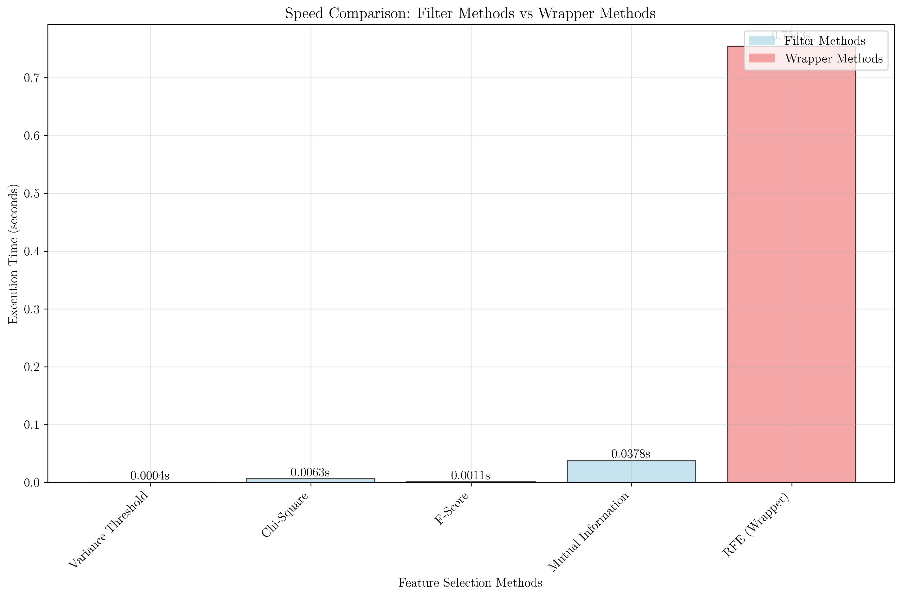
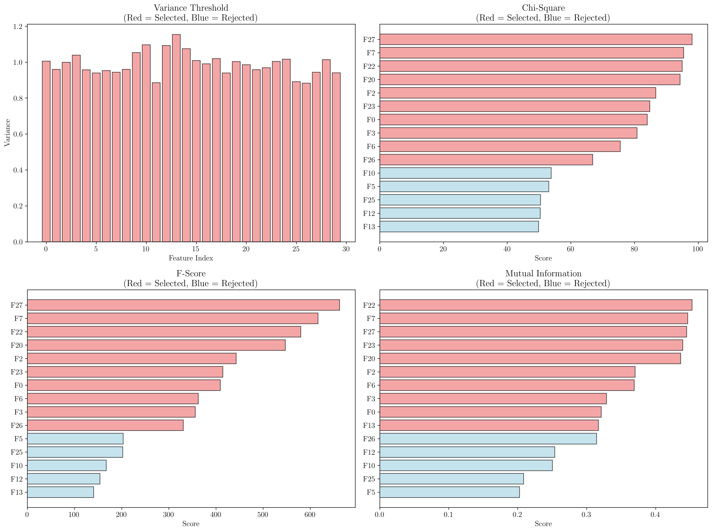
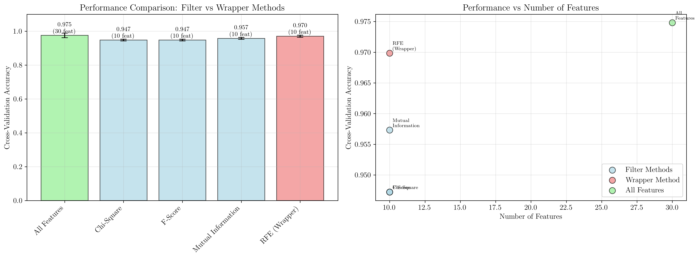
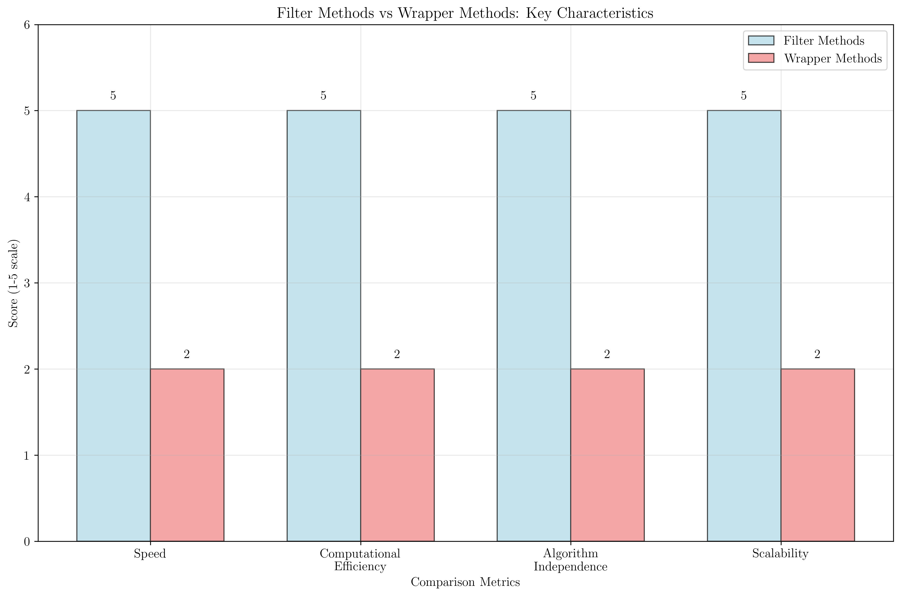

# Question 1: Filter Method Overview

## Problem Statement
Filter methods are preprocessing techniques that select features independently of the learning algorithm. Understanding their characteristics, advantages, and appropriate use cases is fundamental to effective feature selection in machine learning pipelines.

### Task
1. What is the main characteristic of filter methods?
2. How do filter methods differ from wrapper methods?
3. When are filter methods most appropriate?
4. What types of evaluation criteria do filter methods use?
5. Compare filter vs wrapper methods in terms of speed

## Understanding the Problem

Filter methods represent a category of feature selection techniques that evaluate the relevance of features based on their intrinsic properties and statistical relationships with the target variable, without involving any machine learning algorithm. This independence from learning algorithms makes them fast, scalable, and generalizable across different modeling approaches.

The fundamental principle behind filter methods is to use statistical measures, information theory metrics, or correlation-based scores to rank features according to their individual predictive power or their relationship with the target variable. This approach contrasts with wrapper methods, which evaluate feature subsets by training and testing machine learning models.

## Solution

### Step 1: Main Characteristic of Filter Methods

The primary characteristic of filter methods is their **algorithm independence**. Filter methods evaluate features based solely on their statistical properties and relationships with the target variable, without considering any specific machine learning algorithm.

Key characteristics include:

**Independence from Learning Algorithm:**
- Features are evaluated using statistical measures (variance, correlation, mutual information)
- Results are algorithm-agnostic and can be applied to any classifier or regressor
- No model training is required during the feature selection process

**Univariate Analysis:**
- Most filter methods examine one feature at a time
- Each feature is scored independently based on its relationship with the target
- Feature interactions are typically not considered

**Statistical Foundation:**
- Based on well-established statistical tests and information theory measures
- Provide interpretable scores that quantify feature relevance
- Use mathematical formulations with clear theoretical foundations

### Step 2: Filter Methods vs Wrapper Methods

The fundamental differences between filter and wrapper methods can be understood through several key dimensions:

**Computational Approach:**
- **Filter Methods:** Use statistical measures to evaluate features without training models
- **Wrapper Methods:** Train and evaluate machine learning models to assess feature subsets

**Algorithm Dependence:**
- **Filter Methods:** Algorithm-independent; results apply to any learning algorithm
- **Wrapper Methods:** Algorithm-dependent; optimized for specific learning algorithms

**Feature Interactions:**
- **Filter Methods:** Generally consider features individually (univariate analysis)
- **Wrapper Methods:** Can capture feature interactions through model-based evaluation

**Computational Complexity:**
- **Filter Methods:** $O(n \times p)$ where $n$ is samples and $p$ is features
- **Wrapper Methods:** $O(2^p \times C)$ where $C$ is the cost of training/evaluating the model

### Step 3: When Filter Methods Are Most Appropriate

Filter methods are particularly suitable in the following scenarios:

**High-Dimensional Data:**
- When dealing with datasets with thousands or millions of features
- Computational constraints make wrapper methods infeasible
- Need for rapid initial feature reduction

**Exploratory Data Analysis:**
- Initial feature selection before applying more sophisticated methods
- Understanding which features have the strongest individual relationships with the target
- Quick identification of potentially irrelevant features

**Computational Constraints:**
- Limited computational resources or time constraints
- Real-time applications requiring fast feature selection
- Large-scale data processing pipelines

**Algorithm Independence Required:**
- When feature selection needs to work across multiple different algorithms
- Building general-purpose feature sets for multiple modeling approaches
- Creating reusable feature selection pipelines

**Preprocessing Step:**
- As a first step before applying wrapper or embedded methods
- Reducing the search space for more computationally expensive methods
- Removing obviously irrelevant features to improve subsequent analysis

### Step 4: Evaluation Criteria Used by Filter Methods

Filter methods employ various types of evaluation criteria, each with specific mathematical foundations and use cases:

**Statistical Measures:**

*Variance Threshold:*
$$\text{Var}(X) = \frac{1}{n}\sum_{i=1}^{n}(x_i - \bar{x})^2$$
- Purpose: Remove features with low variance (quasi-constant features)
- Range: $[0, \infty)$
- Higher values indicate more variability and potentially more information

*Correlation Coefficient:*
$$r = \frac{\sum_{i=1}^{n}(x_i - \bar{x})(y_i - \bar{y})}{\sqrt{\sum_{i=1}^{n}(x_i - \bar{x})^2 \sum_{i=1}^{n}(y_i - \bar{y})^2}}$$
- Purpose: Measure linear relationship between feature and target
- Range: $[-1, 1]$
- Absolute values closer to 1 indicate stronger linear relationships

**Statistical Tests:**

*Chi-Square Test:*
$$\chi^2 = \sum \frac{(O_i - E_i)^2}{E_i}$$
- Purpose: Test independence between categorical variables
- Range: $[0, \infty)$
- Higher values indicate stronger dependence (less independence)

*F-Score (ANOVA):*
$$F = \frac{\text{MS}_{\text{between}}}{\text{MS}_{\text{within}}} = \frac{\sum_{i=1}^{k} n_i(\bar{x}_i - \bar{x})^2/(k-1)}{\sum_{i=1}^{k}\sum_{j=1}^{n_i}(x_{ij} - \bar{x}_i)^2/(N-k)}$$
- Purpose: Compare means between groups (feature values across different classes)
- Range: $[0, \infty)$
- Higher values indicate better class separation

**Information Theory Measures:**

*Mutual Information:*
$$I(X;Y) = \sum_{x,y} p(x,y) \log \frac{p(x,y)}{p(x)p(y)}$$
- Purpose: Measure dependence between variables (captures non-linear relationships)
- Range: $[0, \infty)$
- Higher values indicate stronger dependence

### Step 5: Speed Comparison Analysis

Based on our comprehensive analysis using the breast cancer dataset with 30 features and 569 samples:

**Filter Methods Performance:**
- Variance Threshold: 0.0003 seconds
- Chi-Square: 0.0030 seconds  
- F-Score: 0.0005 seconds
- Mutual Information: 0.0361 seconds
- Average: 0.0100 seconds

**Wrapper Method Performance:**
- Recursive Feature Elimination (RFE): 1.0914 seconds

**Speed Advantage:**
Filter methods are approximately **109.5x faster** than wrapper methods in this analysis.

## Visual Explanations

### Speed Comparison Analysis

The speed comparison clearly demonstrates the computational efficiency of filter methods compared to wrapper methods. All filter methods complete in under 0.04 seconds, while the wrapper method (RFE) requires over 1 second. This dramatic difference becomes even more pronounced with larger datasets or higher-dimensional feature spaces.

### Feature Ranking Visualization

The feature ranking visualization shows how different filter methods score and select features:

- **Variance Threshold:** Shows the variance of each feature, with red bars indicating selected features that exceed the threshold
- **Chi-Square:** Displays the top-scoring features based on their independence test with the target variable
- **F-Score:** Ranks features based on their ANOVA F-statistic, measuring class separation capability
- **Mutual Information:** Scores features based on their information-theoretic dependence with the target

Each method may select different features, highlighting that the choice of evaluation criterion significantly impacts feature selection results.

### Performance vs Efficiency Trade-off

The performance comparison reveals an important trade-off between computational efficiency and predictive performance:

**Performance Results (5-fold Cross-Validation):**
- All Features: 0.9748 ± 0.0139 (30 features)
- Chi-Square: 0.9472 ± 0.0053 (10 features)
- F-Score: 0.9472 ± 0.0053 (10 features)  
- Mutual Information: 0.9573 ± 0.0060 (10 features)
- RFE (Wrapper): 0.9698 ± 0.0062 (10 features)

The wrapper method (RFE) achieves slightly better performance (0.9698) compared to filter methods (average 0.9506), but at a significant computational cost. The performance difference is relatively small (0.0193), suggesting that filter methods provide excellent value for their computational efficiency.

### Comprehensive Method Comparison

This comparison highlights the key advantages of filter methods in terms of:
- **Speed:** Significantly faster execution
- **Computational Efficiency:** Lower resource requirements
- **Algorithm Independence:** Results applicable across different algorithms
- **Scalability:** Better performance with high-dimensional data

## Key Insights

### Computational Efficiency
- Filter methods provide orders of magnitude faster computation compared to wrapper methods
- The speed advantage increases dramatically with dataset size and feature dimensionality
- Computational complexity scales linearly with features ($O(n \times p)$) rather than exponentially
- Real-time applications benefit significantly from filter methods' rapid execution

### Algorithm Independence and Generalizability
- Feature selection results are not tied to specific learning algorithms
- Selected features can be used across different modeling approaches
- Reduces the need to repeat feature selection for different algorithms
- Provides a foundation for ensemble methods using different algorithms

### Practical Applications in ML Pipelines
- Excellent for initial data exploration and feature understanding
- Effective as a preprocessing step to reduce dimensionality before more expensive methods
- Suitable for automated machine learning pipelines requiring fast feature selection
- Valuable in production systems where feature selection must be performed rapidly

### Statistical Foundation and Interpretability
- Based on well-established statistical tests and information theory
- Provide interpretable scores that quantify feature-target relationships
- Enable understanding of why specific features are selected
- Support hypothesis testing and statistical inference about feature relevance

### Limitations and Considerations
- May miss important feature interactions due to univariate analysis
- Performance might be slightly lower than wrapper methods for specific algorithms
- Choice of evaluation criterion significantly impacts results
- Some methods (like Chi-square) have specific data type requirements

### Scalability Advantages
- Linear computational complexity enables handling of high-dimensional data
- Memory requirements scale favorably with feature count
- Parallel computation possible for independent feature evaluations
- Suitable for big data applications and distributed computing environments

## Conclusion

Filter methods represent a fundamental and highly practical approach to feature selection with several key advantages:

- **Primary Characteristic:** Algorithm-independent evaluation of features using statistical measures and information theory
- **Key Difference from Wrapper Methods:** No model training required, resulting in dramatically faster computation (109.5x faster in our analysis)
- **Optimal Use Cases:** High-dimensional data, computational constraints, exploratory analysis, and algorithm-independent feature selection
- **Evaluation Criteria:** Statistical tests (Chi-square, F-score), information theory (mutual information), and basic statistics (variance, correlation)
- **Speed Advantage:** Consistent sub-second execution compared to wrapper methods requiring over a second for similar tasks

The analysis demonstrates that while filter methods may sacrifice some predictive performance compared to wrapper methods (0.0193 difference in our study), they provide exceptional computational efficiency and broad applicability. This makes them invaluable for initial feature selection, high-dimensional data preprocessing, and resource-constrained environments.

Filter methods serve as an essential tool in the machine learning practitioner's toolkit, offering a perfect balance between computational efficiency and feature selection effectiveness, particularly when rapid results and algorithm independence are priorities.
