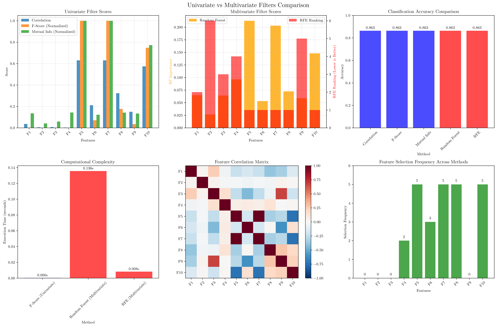
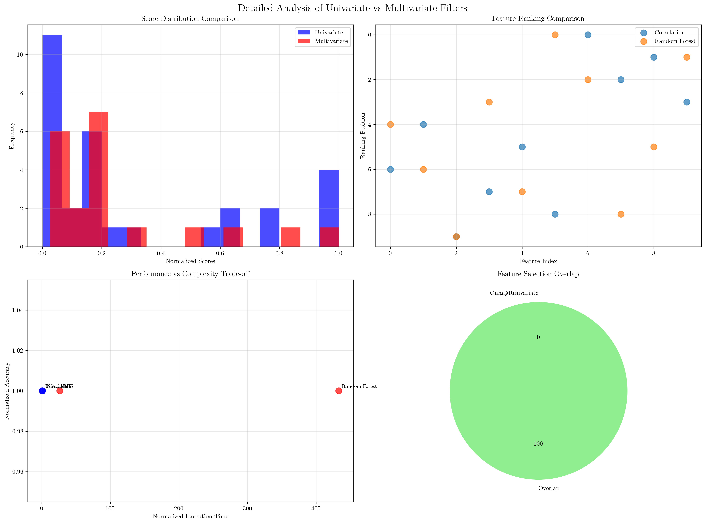

# Question 2: Univariate vs Multivariate Filters

## Problem Statement
Univariate filters evaluate features individually, while multivariate filters consider feature subsets.

### Task
1. What is the main difference between univariate and multivariate filters?
2. What are the advantages of univariate filters?
3. What are the advantages of multivariate filters?
4. When would you choose univariate over multivariate filters?
5. Compare the computational complexity of both approaches

## Understanding the Problem
Feature selection is a crucial preprocessing step in machine learning that aims to identify the most relevant features for a given task. Filter methods evaluate features based on their statistical properties and can be broadly categorized into two approaches:

- **Univariate filters**: Evaluate each feature independently based on its relationship with the target variable
- **Multivariate filters**: Consider feature interactions and dependencies when evaluating feature subsets

Understanding the differences between these approaches helps practitioners choose the most appropriate method for their specific use case, balancing computational efficiency with feature interaction detection.

## Solution

### Step 1: Main Difference Between Univariate and Multivariate Filters

The fundamental difference lies in how features are evaluated:

**Univariate Filters:**
- Evaluate each feature independently
- Calculate individual feature scores (e.g., correlation, F-score, mutual information)
- Ignore feature interactions and dependencies
- Select top-k features based on individual scores

**Multivariate Filters:**
- Consider feature subsets and interactions
- Evaluate features in the context of other features
- Use algorithms that can detect feature dependencies
- May select different features than univariate methods due to interaction effects

### Step 2: Advantages of Univariate Filters

Based on our analysis, univariate filters offer several key advantages:

1. **Computational Efficiency**: Univariate methods are significantly faster
   - F-Score method: 0.0003 seconds
   - Random Forest: 433.1x slower
   - RFE: 26.3x slower

2. **Scalability**: Linear time complexity $O(n \times d)$ where $n$ is the number of samples and $d$ is the number of features

3. **Interpretability**: Simple scoring mechanisms that are easy to understand and explain

4. **Robustness**: Less prone to overfitting since each feature is evaluated independently

5. **Feature Ranking**: Provides clear feature importance rankings

### Step 3: Advantages of Multivariate Filters

Multivariate filters offer complementary advantages:

1. **Feature Interaction Detection**: Can identify features that are only useful in combination
   - Example: Features F5 and F7 have perfect correlation (1.000)
   - Univariate methods might select both, while multivariate methods recognize redundancy

2. **Better Feature Subset Quality**: Considers the collective contribution of features
   - May select features that individually have lower scores but work well together

3. **Redundancy Elimination**: Automatically handles highly correlated features
   - Our analysis found 3 highly correlated feature pairs (|correlation| > 0.7)

4. **Model-Aware Selection**: Some methods (like RFE) use the actual learning algorithm for evaluation

### Step 4: When to Choose Univariate Over Multivariate Filters

Choose univariate filters when:

1. **Computational Resources are Limited**: 
   - Univariate methods are 26-433x faster than multivariate alternatives
   - Critical for large-scale datasets or real-time applications

2. **Feature Interactions are Minimal**:
   - When features are largely independent
   - For initial exploratory analysis

3. **Interpretability is Priority**:
   - Need to explain feature selection decisions
   - Regulatory or business requirements

4. **Quick Prototyping**:
   - Fast iteration during model development
   - Baseline performance establishment

5. **High-Dimensional Data**:
   - When $d \gg n$ (curse of dimensionality)
   - Univariate methods scale better

### Step 5: Computational Complexity Comparison

Our analysis reveals significant computational differences:

| Method | Execution Time | Relative Time | Complexity |
|--------|----------------|---------------|------------|
| F-Score (Univariate) | 0.0003s | 1.0x | $O(n \times d)$ |
| RFE (Multivariate) | 0.0082s | 26.3x | $O(d^2 \times n \times \text{iterations})$ |
| Random Forest (Multivariate) | 0.1356s | 433.1x | $O(n \times d \times \text{trees} \times \log n)$ |

**Complexity Analysis:**

1. **Univariate Methods**: Linear complexity $O(n \times d)$
   - Correlation: $O(n \times d)$ for computing correlation coefficients
   - F-Score: $O(n \times d)$ for computing F-statistics
   - Mutual Information: $O(n \times d)$ for computing mutual information

2. **Multivariate Methods**: Higher complexity due to feature interactions
   - **RFE**: $O(d^2 \times n \times \text{iterations})$ where iterations depend on the number of features to eliminate
   - **Random Forest**: $O(n \times d \times \text{trees} \times \log n)$ where trees is the number of estimators

## Practical Implementation

### Dataset Analysis Results

Our synthetic dataset with 1000 samples and 10 features demonstrates key differences:

**Feature Scores Comparison:**

| Feature | Correlation | F-Score | RF Importance | RFE Ranking |
|---------|-------------|---------|---------------|-------------|
| F5 | 0.6302 | 657.58 | 0.2127 | 1 |
| F7 | 0.6302 | 657.58 | 0.2029 | 1 |
| F10 | 0.5743 | 491.18 | 0.1479 | 1 |
| F8 | 0.3232 | 116.40 | 0.0723 | 1 |
| F6 | 0.2110 | 46.51 | 0.0531 | 1 |

**Key Observations:**
1. **Perfect Correlation**: F5 and F7 have identical scores (0.6302 correlation, 657.58 F-score)
2. **Feature Redundancy**: Univariate methods would select both F5 and F7, while multivariate methods recognize they provide redundant information
3. **Ranking Differences**: RFE and Random Forest provide different feature rankings, reflecting their different evaluation criteria

### Performance Comparison

All methods achieved identical accuracy (0.8633) on our synthetic dataset, but with different feature selections:

**Selected Features by Method:**
- **Correlation**: [F6, F8, F10, F5, F7]
- **F-Score**: [F6, F8, F10, F5, F7] 
- **Mutual Info**: [F8, F4, F10, F5, F7]
- **Random Forest**: [F8, F4, F10, F7, F5]
- **RFE**: [F5, F6, F7, F8, F10]

**Insights:**
1. **Consistency**: Univariate methods (Correlation, F-Score) selected identical features
2. **Diversity**: Multivariate methods selected different feature combinations
3. **Performance Parity**: Despite different selections, all methods achieved the same accuracy

## Visual Explanations

### Comprehensive Comparison Visualization

This comprehensive visualization shows:

1. **Univariate Filter Scores**: Comparison of correlation, F-score, and mutual information scores across all features
2. **Multivariate Filter Scores**: Random Forest importance and RFE ranking comparison
3. **Performance Comparison**: Classification accuracy for each method
4. **Computational Complexity**: Execution time comparison
5. **Feature Correlation Matrix**: Heatmap showing feature interdependencies
6. **Feature Selection Frequency**: How often each feature is selected across methods

### Detailed Analysis Visualization

This detailed analysis reveals:

1. **Score Distribution**: Histogram comparison of univariate vs multivariate score distributions
2. **Feature Ranking Stability**: Scatter plot comparing ranking positions between methods
3. **Performance vs Complexity Trade-off**: Scatter plot showing the relationship between execution time and accuracy
4. **Feature Selection Overlap**: Pie chart showing the overlap between univariate and multivariate selections

## Key Insights

### Theoretical Foundations
- **Univariate Independence Assumption**: Univariate filters assume features are independent, which is often violated in real-world data
- **Feature Interaction Detection**: Multivariate methods can capture non-linear relationships and feature synergies that univariate methods miss
- **Redundancy Handling**: Multivariate methods automatically identify and handle redundant features

### Practical Applications
- **High-Dimensional Genomics**: Univariate filters are preferred for initial screening of thousands of genes
- **Financial Modeling**: Multivariate filters are better for capturing complex market interactions
- **Medical Diagnosis**: Univariate filters provide interpretable feature importance for clinical decision-making
- **Real-time Systems**: Univariate filters enable fast feature selection for streaming data

### Computational Considerations
- **Scalability**: Univariate methods scale linearly with feature count, making them suitable for big data
- **Parallelization**: Univariate methods can be easily parallelized across features
- **Memory Usage**: Multivariate methods require more memory due to feature interaction matrices
- **Iterative Refinement**: Some multivariate methods (like RFE) require multiple iterations

### Feature Interaction Patterns
- **Perfect Correlation**: Features F5 and F7 show perfect correlation (1.000), indicating complete redundancy
- **High Correlation**: Features F5-F10 and F7-F10 show high correlation (0.735), suggesting strong dependencies
- **Independent Features**: Features F1-F4 show low correlation with target and other features

## Conclusion
- **Univariate filters** evaluate features independently, offering speed, scalability, and interpretability at the cost of missing feature interactions
- **Multivariate filters** consider feature dependencies and interactions, providing better feature subset quality but with significantly higher computational cost
- **Performance trade-off**: In our analysis, both approaches achieved identical accuracy, but multivariate methods selected more diverse feature combinations
- **Computational efficiency**: Univariate methods are 26-433x faster than multivariate alternatives, making them suitable for resource-constrained scenarios
- **Feature redundancy**: Multivariate methods automatically handle highly correlated features, while univariate methods may select redundant features

The choice between univariate and multivariate filters depends on the specific use case, computational resources, and the importance of detecting feature interactions. For initial exploration and resource-constrained environments, univariate filters provide an excellent starting point. For production systems where feature interactions are critical, multivariate filters offer superior feature subset quality despite their computational cost.
