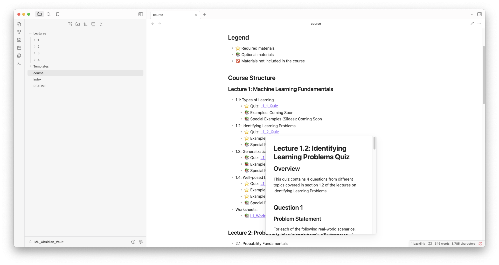

# Machine Learning Resources

A curated collection of machine learning materials, examples, and notes organized in an Obsidian vault.

## Repository Structure

- **ML_Obsidian_Vault/**: Knowledge base containing structured ML notes
  - **Lectures/**: Detailed lecture notes and materials
  - **course.md**: Comprehensive structured guide with questions, examples, and slide references
  - **README.md**: Instructions for using the Obsidian vault

- **code/**: Implementation of ML algorithms and examples
  - **Note**: This directory is ignored in .gitignore. Add your code here without tracking it in Git.

- **andrew_lectures/**: Collection of lecture materials and slides
  - **Note**: This directory is ignored in .gitignore. Add your lecture files here without tracking them in Git.

- **other_slides/**: Supplementary presentation materials
  - **Note**: This directory is ignored in .gitignore. Store your presentation slides here without tracking them in Git.

## Prerequisites

This repository requires the following Python packages:
```
matplotlib>=3.10.1
networkx>=3.4.2
numpy>=2.2.3
pandas>=2.2.3
scikit-learn>=1.6.1
scipy>=1.15.2
seaborn>=0.13.2
sympy>=1.13.3
textblob>=0.19.0
```

## Installation

1. Clone the repository:
   ```bash
   git clone https://github.com/yourusername/ML.git
   cd ML
   ```

2. Create and activate a virtual environment:
   ```bash
   python -m venv ml_env
   # On Windows
   ml_env\Scripts\activate
   # On macOS/Linux
   source ml_env/bin/activate
   ```

3. Install required dependencies:
   ```bash
   pip install -r requirements.txt
   ```

3. For the best experience with the notes, install [Obsidian](https://obsidian.md/) and open the `ML_Obsidian_Vault` as a vault.

## Usage

- Open the `ML_Obsidian_Vault` in Obsidian and start with `course.md` for a structured learning path
- Use `course.md` as your primary resource with its organized questions, examples, and slide references
- Explore the code examples in your local environment 
- Use the lecture materials as reference for deeper understanding
- Store your personal notes and code in the appropriate directories that are ignored by git



## License

This project is licensed under the MIT License - see the LICENSE file for details.

## Acknowledgments

- Materials adapted from various machine learning courses and resources
- Contributors to the examples and notes 